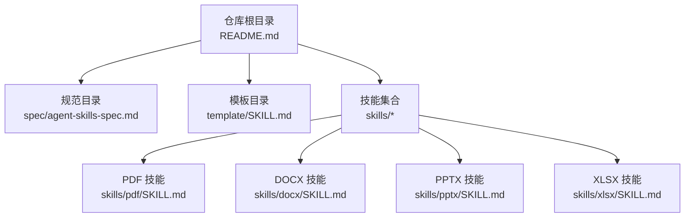
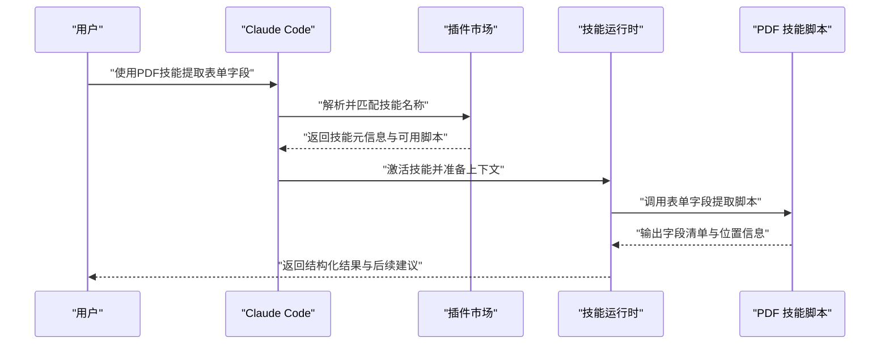
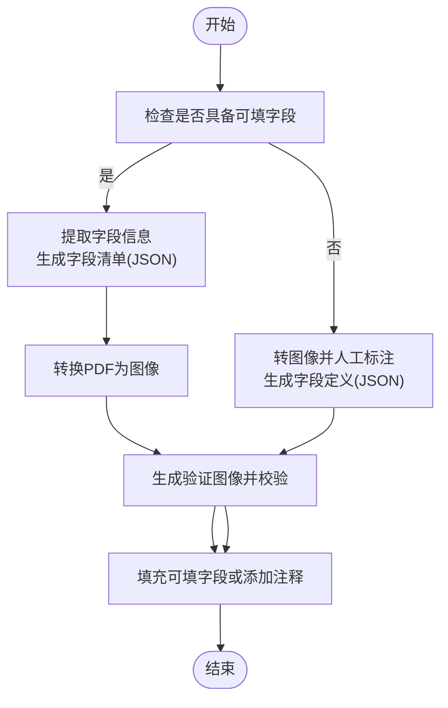
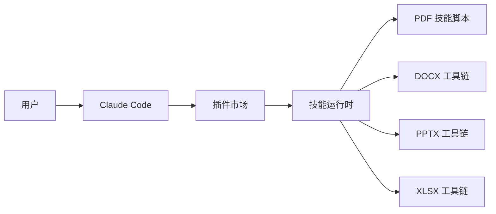

# 快速入门

<cite>
**本文引用的文件**
- [README.md](file://README.md)
- [spec/agent-skills-spec.md](file://spec/agent-skills-spec.md)
- [template/SKILL.md](file://template/SKILL.md)
- [skills/pdf/SKILL.md](file://skills/pdf/SKILL.md)
- [skills/pdf/forms.md](file://skills/pdf/forms.md)
- [skills/pdf/reference.md](file://skills/pdf/reference.md)
- [skills/pdf/scripts/extract_form_field_info.py](file://skills/pdf/scripts/extract_form_field_info.py)
- [skills/docx/SKILL.md](file://skills/docx/SKILL.md)
- [skills/pptx/SKILL.md](file://skills/pptx/SKILL.md)
- [skills/xlsx/SKILL.md](file://skills/xlsx/SKILL.md)
</cite>

## 目录
1. [简介](#简介)
2. [项目结构](#项目结构)
3. [核心组件](#核心组件)
4. [架构总览](#架构总览)
5. [详细组件分析](#详细组件分析)
6. [依赖关系分析](#依赖关系分析)
7. [性能与实践建议](#性能与实践建议)
8. [故障排查指南](#故障排查指南)
9. [结论](#结论)
10. [附录：从零开始的三平台使用指南](#附录从零开始的三平台使用指南)

## 简介
本指南面向首次接触 Anthropic Skills 的用户，帮助你在 Claude Code、Claude.ai 以及 Claude API 中快速上手。你将学会：
- 如何通过插件市场安装技能库，并使用命令进行安装与启用
- 在不同平台上如何调用技能（例如在对话中直接提及“使用PDF技能”）
- 以“PDF技能提取表单字段”为例的完整工作流
- 如何在 Claude Code 中通过提及技能名称激活特定技能
- 在 Claude.ai 和 API 中使用预置技能与自定义技能的方法

本指南所有步骤均基于仓库中的实际文件与脚本，确保可操作性与准确性。

## 项目结构
skills 仓库包含多个独立的技能包，每个技能包都以“技能目录 + SKILL.md 元信息”的形式组织，便于动态加载与使用。核心入口与说明位于根目录的 README，技能规范与模板分别位于 spec 与 template 目录。

图表来源
- [README.md](file://README.md#L1-L95)
- [spec/agent-skills-spec.md](file://spec/agent-skills-spec.md#L1-L4)
- [template/SKILL.md](file://template/SKILL.md#L1-L7)
- [skills/pdf/SKILL.md](file://skills/pdf/SKILL.md#L1-L295)
- [skills/docx/SKILL.md](file://skills/docx/SKILL.md#L1-L197)
- [skills/pptx/SKILL.md](file://skills/pptx/SKILL.md#L1-L484)
- [skills/xlsx/SKILL.md](file://skills/xlsx/SKILL.md#L1-L289)

章节来源
- [README.md](file://README.md#L1-L95)

## 核心组件
- 技能元信息与规范
  - 每个技能通过 SKILL.md 提供名称、描述、许可证等元信息，Claude 加载时会读取这些信息以决定是否激活该技能。
  - 规范文件指向官方 Agent Skills 规格地址，用于理解通用标准与扩展能力。
- 基础模板
  - template/SKILL.md 提供创建新技能的最小化模板，包含 YAML frontmatter 与说明区域。
- 文档类技能
  - DOCX、PPTX、XLSX 技能提供了文档创建、编辑、分析与格式化的完整工作流，涵盖文本提取、OOXML 操作、公式计算与可视化等。
- PDF 技能
  - PDF 技能覆盖文本/表格提取、合并拆分、水印、加密、OCR、表单处理等常见任务；forms.md 专门讲解表单字段提取与填写流程，reference.md 提供高级参考与跨语言示例。

章节来源
- [template/SKILL.md](file://template/SKILL.md#L1-L7)
- [spec/agent-skills-spec.md](file://spec/agent-skills-spec.md#L1-L4)
- [skills/pdf/SKILL.md](file://skills/pdf/SKILL.md#L1-L295)
- [skills/pdf/forms.md](file://skills/pdf/forms.md#L1-L206)
- [skills/pdf/reference.md](file://skills/pdf/reference.md#L1-L612)
- [skills/docx/SKILL.md](file://skills/docx/SKILL.md#L1-L197)
- [skills/pptx/SKILL.md](file://skills/pptx/SKILL.md#L1-L484)
- [skills/xlsx/SKILL.md](file://skills/xlsx/SKILL.md#L1-L289)

## 架构总览
下图展示了从用户输入到技能执行的关键路径，以及技能内部的典型处理流程（以 PDF 表单为例）。

图表来源
- [README.md](file://README.md#L29-L60)
- [skills/pdf/SKILL.md](file://skills/pdf/SKILL.md#L1-L295)
- [skills/pdf/forms.md](file://skills/pdf/forms.md#L1-L206)
- [skills/pdf/scripts/extract_form_field_info.py](file://skills/pdf/scripts/extract_form_field_info.py#L1-L153)

## 详细组件分析

### PDF 技能：表单字段提取与填写工作流
- 使用场景
  - 当需要从 PDF 表单中提取可填字段、标注边界框、生成字段值映射并最终填充或注释表单时，PDF 技能提供完整的脚本链路。
- 关键步骤
  1) 检查是否具备可填字段：先运行检查脚本，根据结果进入“可填字段”或“非可填字段”分支。
  2) 可填字段分支
     - 使用字段信息提取脚本生成字段清单（含类型、页面、坐标等），再将 PDF 转为图像以便人工校验。
     - 编写字段值映射文件后，调用填充脚本生成已填 PDF。
  3) 非可填字段分支
     - 将 PDF 转为图像，手动标注标签与输入框边界，生成字段定义与验证图像，经自动化与人工校验后，使用注释脚本生成带注释的 PDF。
- 代码级关系
  - 字段信息提取脚本负责解析 PDF 的字段结构与注释，输出标准化 JSON，供后续流程消费。
  - 表单指南文档提供字段类型、边界框、值映射与验证流程的权威说明。

图表来源
- [skills/pdf/forms.md](file://skills/pdf/forms.md#L1-L206)
- [skills/pdf/scripts/extract_form_field_info.py](file://skills/pdf/scripts/extract_form_field_info.py#L1-L153)

章节来源
- [skills/pdf/SKILL.md](file://skills/pdf/SKILL.md#L1-L295)
- [skills/pdf/forms.md](file://skills/pdf/forms.md#L1-L206)
- [skills/pdf/reference.md](file://skills/pdf/reference.md#L1-L612)
- [skills/pdf/scripts/extract_form_field_info.py](file://skills/pdf/scripts/extract_form_field_info.py#L1-L153)

### DOCX 技能：文档创建与编辑
- 使用场景
  - 创建新文档、编辑现有文档、保留修订与批注、导出为图片等。
- 关键点
  - 文档内容读取与分析：支持通过工具链将 .docx 转换为 Markdown 并保留修订。
  - 编辑工作流：提供基于 OOXML 的打包/解包与批量修改流程，强调“最小精确改动”原则。
  - 图像转换：通过 LibreOffice 与 Poppler 将 DOCX 转 PDF 再转 JPEG，便于视觉审阅。

章节来源
- [skills/docx/SKILL.md](file://skills/docx/SKILL.md#L1-L197)

### PPTX 技能：演示文稿创建与编辑
- 使用场景
  - 无模板创建演示文稿（HTML 转 PPTX）、基于模板重排与替换占位符、批量生成缩略图辅助设计决策。
- 关键点
  - 无模板创建：通过 HTML2PPTX 工作流，先生成 HTML 再转换为 PPTX，并使用 PptxGenJS 添加图表与表格。
  - 模板重排：使用重排脚本复制/删除/重排幻灯片，再通过库存脚本与替换脚本完成占位符内容更新。
  - 缩略图：生成网格缩略图，辅助快速定位布局与设计一致性。

章节来源
- [skills/pptx/SKILL.md](file://skills/pptx/SKILL.md#L1-L484)

### XLSX 技能：电子表格创建与公式校验
- 使用场景
  - 新建/编辑 Excel 文件，保持公式可更新，使用脚本对公式进行重新计算与错误检测。
- 关键点
  - 建议使用公式而非硬编码数值，确保模型可随数据变化自动重算。
  - 使用提供的重算脚本扫描并报告各类公式错误（如 #REF!、#DIV/0! 等），并指导修复。

章节来源
- [skills/xlsx/SKILL.md](file://skills/xlsx/SKILL.md#L1-L289)

## 依赖关系分析
- 技能加载与激活
  - 用户在 Claude Code 中通过提及技能名称触发激活；Claude Code 插件市场负责注册与安装，安装后即可在对话中直接使用。
- 技能内部依赖
  - PDF 技能依赖 Python 库（如 pypdf、pdfplumber、reportlab 等）与命令行工具（poppler-utils、qpdf 等），并通过脚本串联形成端到端工作流。
  - 文档类技能依赖第三方工具链（如 LibreOffice、Poppler、pandoc、markitdown 等）以实现跨格式转换与内容提取。
- 外部集成
  - Claude Code 插件市场与 Claude.ai/CLI/SDK 的技能接口共同构成统一的技能生态。

图表来源
- [README.md](file://README.md#L29-L60)
- [skills/pdf/SKILL.md](file://skills/pdf/SKILL.md#L1-L295)
- [skills/docx/SKILL.md](file://skills/docx/SKILL.md#L1-L197)
- [skills/pptx/SKILL.md](file://skills/pptx/SKILL.md#L1-L484)
- [skills/xlsx/SKILL.md](file://skills/xlsx/SKILL.md#L1-L289)

章节来源
- [README.md](file://README.md#L29-L60)

## 性能与实践建议
- PDF 处理
  - 对于大文档优先采用流式处理与分页策略，避免一次性加载整份 PDF。
  - 文本提取优先使用命令行工具（如 pdftotext -bbox-layout）以获得结构化坐标；复杂表格提取结合 pdfplumber 并开启调试图像。
- 文档类技能
  - 使用 LibreOffice 与 Poppler 进行跨格式转换时，注意分辨率与质量平衡；批量处理时采用分批策略减少内存占用。
- 公式与模型
  - Excel 模型尽量使用公式而非硬编码，完成后务必执行重算脚本并逐项修复错误类型。

[本节为通用建议，不直接分析具体文件]

## 故障排查指南
- PDF 表单无法识别字段
  - 检查是否为可填字段；若非可填字段，需按“视觉分析 + 边界框 + 注释填充”的流程进行处理。
- 字段边界框冲突或重叠
  - 使用验证脚本进行自动化检查，并结合人工校验修正；确保输入框仅覆盖输入区域，标签框仅覆盖标签文本。
- 公式错误
  - 使用重算脚本获取错误摘要，按错误类型逐一修复（如修正单元格引用、避免除零、确认函数名正确等）。

章节来源
- [skills/pdf/forms.md](file://skills/pdf/forms.md#L1-L206)
- [skills/pdf/reference.md](file://skills/pdf/reference.md#L567-L602)
- [skills/xlsx/SKILL.md](file://skills/xlsx/SKILL.md#L204-L261)

## 结论
通过本指南，你可以：
- 在 Claude Code 中注册并安装技能插件，随后在对话中直接提及技能名称激活对应能力
- 在 Claude.ai 与 API 中使用预置技能与自定义技能
- 以 PDF 技能为例，掌握从字段提取到最终输出的完整工作流
- 在文档类技能中，利用工具链完成跨格式转换与内容分析

建议在实际使用前先阅读相应技能的 SKILL.md 与 forms/reference 文档，确保理解最佳实践与限制条件。

[本节为总结性内容，不直接分析具体文件]

## 附录：从零开始的三平台使用指南

### 在 Claude Code 中安装与使用技能
- 安装步骤
  1) 在 Claude Code 中注册插件市场：使用命令将仓库注册为插件市场源。
  2) 浏览并安装技能包（如 document-skills 或 example-skills）。
  3) 或直接使用命令安装指定技能包。
- 使用方式
  - 安装完成后，在对话中直接提及技能名称（例如“使用PDF技能”），Claude 即可激活对应技能并执行相关脚本。

章节来源
- [README.md](file://README.md#L29-L60)

### 在 Claude.ai 中使用技能
- 使用方式
  - 已内置示例技能；可通过平台指引上传自定义技能或直接在对话中调用。
- 注意事项
  - 不同计划可能具备不同的可用技能范围，请参考平台文档确认权限。

章节来源
- [README.md](file://README.md#L51-L60)

### 在 Claude API 中使用技能
- 使用方式
  - 可通过 API 使用预置技能并上传自定义技能；请参考官方 API 快速入门文档获取详细参数与示例。

章节来源
- [README.md](file://README.md#L57-L60)

### 示例工作流：使用 PDF 技能提取表单字段
- 步骤概览
  1) 检查 PDF 是否具备可填字段。
  2) 若具备可填字段：提取字段信息并生成字段清单 JSON；将 PDF 转为图像进行人工校验；编写字段值映射并填充生成新的 PDF。
  3) 若不具备可填字段：转图像并人工标注标签与输入框边界，生成字段定义与验证图像，经自动化与人工校验后，使用注释脚本生成带注释的 PDF。
- 实际调用
  - 在 Claude Code 中直接说：“使用PDF技能提取表单字段”，随后按提示提供 PDF 文件路径与后续操作。

章节来源
- [skills/pdf/forms.md](file://skills/pdf/forms.md#L1-L206)
- [skills/pdf/scripts/extract_form_field_info.py](file://skills/pdf/scripts/extract_form_field_info.py#L1-L153)
- [README.md](file://README.md#L49-L50)