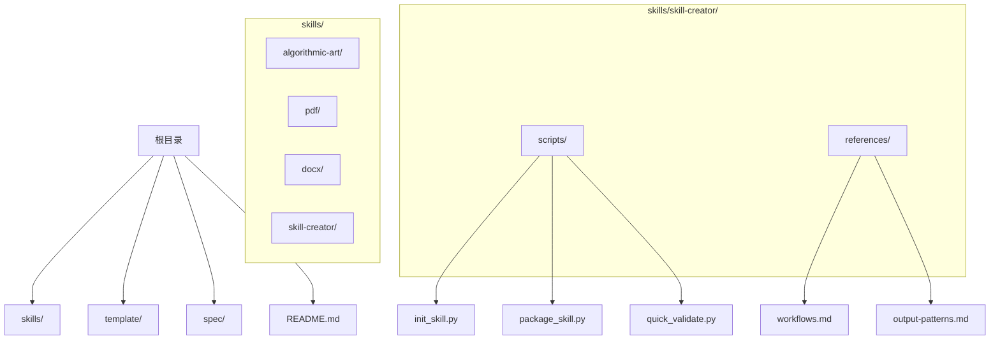
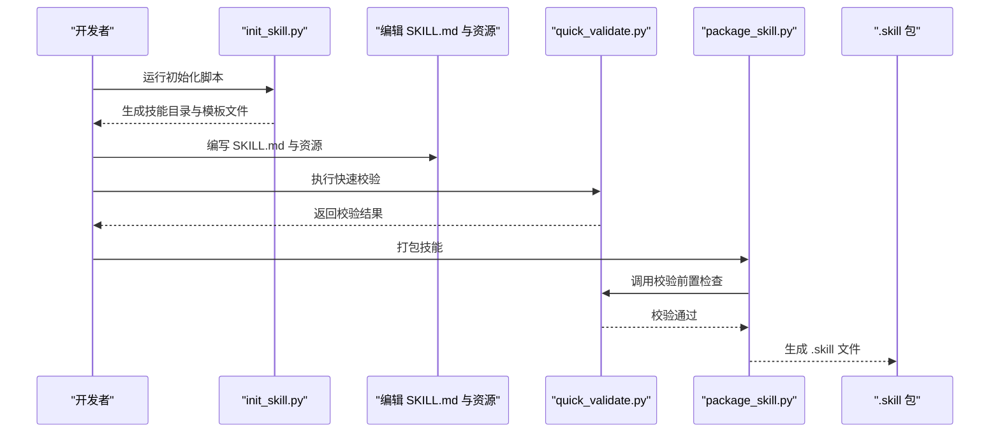
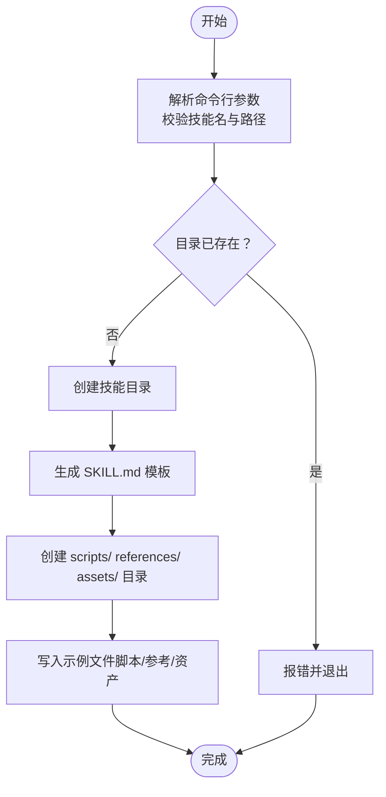
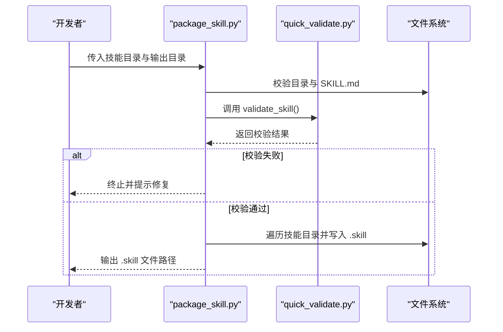
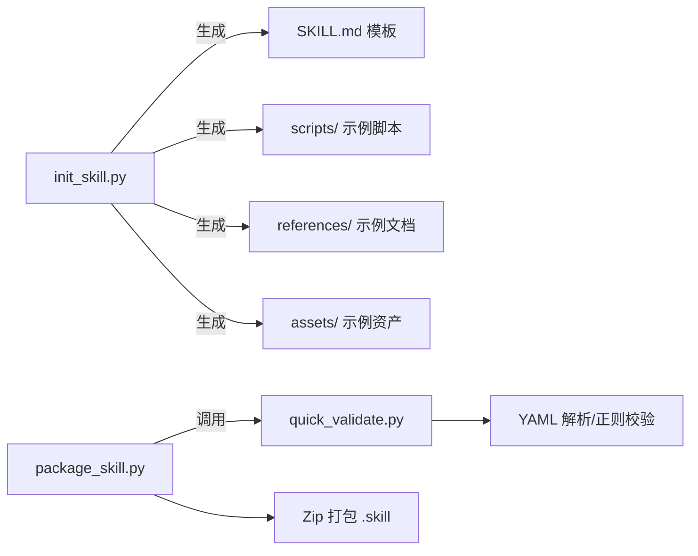

# 分步创建流程

<cite>
**本文引用的文件**
- [README.md](file://README.md)
- [template/SKILL.md](file://template/SKILL.md)
- [skills/skill-creator/SKILL.md](file://skills/skill-creator/SKILL.md)
- [skills/skill-creator/scripts/init_skill.py](file://skills/skill-creator/scripts/init_skill.py)
- [skills/skill-creator/scripts/package_skill.py](file://skills/skill-creator/scripts/package_skill.py)
- [skills/skill-creator/scripts/quick_validate.py](file://skills/skill-creator/scripts/quick_validate.py)
- [skills/skill-creator/references/workflows.md](file://skills/skill-creator/references/workflows.md)
- [skills/skill-creator/references/output-patterns.md](file://skills/skill-creator/references/output-patterns.md)
- [skills/algorithmic-art/SKILL.md](file://skills/algorithmic-art/SKILL.md)
- [skills/pdf/SKILL.md](file://skills/pdf/SKILL.md)
- [skills/docx/SKILL.md](file://skills/docx/SKILL.md)
- [spec/agent-skills-spec.md](file://spec/agent-skills-spec.md)
</cite>

## 目录
1. [引言](#引言)
2. [项目结构](#项目结构)
3. [核心组件](#核心组件)
4. [架构总览](#架构总览)
5. [详细组件分析](#详细组件分析)
6. [依赖关系分析](#依赖关系分析)
7. [性能考量](#性能考量)
8. [故障排查指南](#故障排查指南)
9. [结论](#结论)
10. [附录](#附录)

## 引言
本文件围绕“技能创建六步法”展开，系统化梳理从理解需求到迭代优化的完整流程，帮助开发者高效产出高质量、可复用、可分发的技能。该仓库提供了完整的工具链与示例技能，便于在真实场景中落地执行。

## 项目结构
仓库采用按技能分目录的组织方式，每个技能自包含 SKILL.md（含 YAML 前言元数据）以及可选的 scripts/、references/、assets/ 等资源目录。技能创建工具位于 skills/skill-creator/scripts 下，配套参考文档位于 skills/skill-creator/references。

图表来源
- [README.md](file://README.md#L1-L95)
- [skills/skill-creator/scripts/init_skill.py](file://skills/skill-creator/scripts/init_skill.py#L1-L304)
- [skills/skill-creator/scripts/package_skill.py](file://skills/skill-creator/scripts/package_skill.py#L1-L111)
- [skills/skill-creator/scripts/quick_validate.py](file://skills/skill-creator/scripts/quick_validate.py#L1-L95)
- [skills/skill-creator/references/workflows.md](file://skills/skill-creator/references/workflows.md#L1-L28)
- [skills/skill-creator/references/output-patterns.md](file://skills/skill-creator/references/output-patterns.md#L1-L83)

章节来源
- [README.md](file://README.md#L1-L95)

## 核心组件
- 技能模板与规范
  - template/SKILL.md 提供最小可用的 YAML 前言与说明占位，作为新技能的起点。
  - skills/skill-creator/SKILL.md 明确了“六步法”的步骤与最佳实践，是流程的权威参考。
  - spec/agent-skills-spec.md 指向官方规范地址，便于对齐标准。
- 创建工具链
  - init_skill.py：一键初始化技能目录与模板文件，自动创建 scripts/、references/、assets/ 示例。
  - package_skill.py：在打包前调用 quick_validate.py 进行基础校验，随后将技能目录压缩为 .skill 文件。
  - quick_validate.py：对 SKILL.md 的 YAML 前言进行严格校验，确保 name、description 等字段符合规范。
- 参考与模式
  - workflows.md：提供顺序与条件分支两类工作流模式，便于在 SKILL.md 中清晰表达复杂流程。
  - output-patterns.md：给出输出模板与示例模式，帮助统一输出风格与质量。

章节来源
- [template/SKILL.md](file://template/SKILL.md#L1-L7)
- [skills/skill-creator/SKILL.md](file://skills/skill-creator/SKILL.md#L197-L357)
- [spec/agent-skills-spec.md](file://spec/agent-skills-spec.md#L1-L4)
- [skills/skill-creator/scripts/init_skill.py](file://skills/skill-creator/scripts/init_skill.py#L1-L304)
- [skills/skill-creator/scripts/package_skill.py](file://skills/skill-creator/scripts/package_skill.py#L1-L111)
- [skills/skill-creator/scripts/quick_validate.py](file://skills/skill-creator/scripts/quick_validate.py#L1-L95)
- [skills/skill-creator/references/workflows.md](file://skills/skill-creator/references/workflows.md#L1-L28)
- [skills/skill-creator/references/output-patterns.md](file://skills/skill-creator/references/output-patterns.md#L1-L83)

## 架构总览
下图展示了“六步法”的整体流程与工具交互关系，以及关键输入输出。

图表来源
- [skills/skill-creator/scripts/init_skill.py](file://skills/skill-creator/scripts/init_skill.py#L273-L304)
- [skills/skill-creator/scripts/quick_validate.py](file://skills/skill-creator/scripts/quick_validate.py#L12-L95)
- [skills/skill-creator/scripts/package_skill.py](file://skills/skill-creator/scripts/package_skill.py#L19-L83)

## 详细组件分析

### 第一步：通过具体示例理解技能
- 目标：与用户沟通，明确技能的触发场景与功能边界，避免过度设计或遗漏关键路径。
- 实践要点：
  - 从典型用户请求出发，提炼“何时触发”“解决什么问题”“期望输出形态”等关键信息。
  - 将抽象能力转化为具体示例，逐步收敛到稳定的使用模式。
- 参考模式：
  - 多步工作流与条件分支：见 workflows.md 中的顺序与条件分支范式，有助于在 SKILL.md 中构建清晰的决策树。
  - 输出风格与示例：见 output-patterns.md，通过输入/输出样例提升一致性与可预期性。

章节来源
- [skills/skill-creator/SKILL.md](file://skills/skill-creator/SKILL.md#L215-L231)
- [skills/skill-creator/references/workflows.md](file://skills/skill-creator/references/workflows.md#L1-L28)
- [skills/skill-creator/references/output-patterns.md](file://skills/skill-creator/references/output-patterns.md#L1-L83)

### 第二步：规划可重用内容
- 目标：识别并分类脚本、参考文档与资源文件，形成可复用的知识资产。
- 实施建议：
  - 从具体示例中抽象出重复性操作，沉淀为 scripts/ 中的可执行脚本。
  - 将领域知识、API 文档、模板等整理为 references/ 中的参考材料。
  - 将模板、字体、图标、数据样例等归档至 assets/，便于直接使用。
- 结构建议：
  - scripts/：可直接运行的自动化脚本，支持 Python/Bash 等。
  - references/：深度文档、API 参考、流程指南等，适合加载入上下文辅助思考。
  - assets/：不需加载入上下文但用于最终输出的文件，如模板、字体、图片等。

章节来源
- [skills/skill-creator/SKILL.md](file://skills/skill-creator/SKILL.md#L232-L256)
- [skills/skill-creator/scripts/init_skill.py](file://skills/skill-creator/scripts/init_skill.py#L189-L262)

### 第三步：初始化技能
- 工具：init_skill.py
- 功能概览：
  - 校验并创建技能目录，避免覆盖已有内容。
  - 生成 SKILL.md 模板，包含 YAML 前言与 TODO 占位。
  - 自动创建 scripts/、references/、assets/ 三个资源目录，并填充示例文件。
  - 输出下一步操作指引，包括编辑 SKILL.md、定制示例文件、运行校验器。
- 使用方法与参数：
  - 命令格式：脚本名 <技能名> --path <输出目录>
  - 技能名命名规范：短横线连接、小写英文字母/数字、长度限制、不可以短横线开头或结尾、不允许连续短横线。
- 内部工作原理（简述）：
  - 解析命令行参数，解析目标路径，创建目录。
  - 读取模板字符串，替换变量后写入 SKILL.md。
  - 依次创建 scripts/、references/、assets/，并写入示例文件（脚本赋予可执行权限）。
  - 打印成功信息与后续步骤提示。

图表来源
- [skills/skill-creator/scripts/init_skill.py](file://skills/skill-creator/scripts/init_skill.py#L194-L271)

章节来源
- [skills/skill-creator/scripts/init_skill.py](file://skills/skill-creator/scripts/init_skill.py#L273-L304)
- [skills/skill-creator/scripts/init_skill.py](file://skills/skill-creator/scripts/init_skill.py#L194-L271)

### 第四步：编辑技能
- SKILL.md 元数据与正文：
  - YAML 前言必须包含 name 与 description；其他字段可选。
  - 正文应包含概述、结构化章节、示例与参考链接，必要时提供决策树或流程图。
- 资源组织：
  - scripts/：实现具体任务的脚本，需具备可执行性与可测试性。
  - references/：提供深度参考材料，建议包含目录索引以便预览。
  - assets/：存放模板、字体、图标、数据样例等。
- 设计模式参考：
  - 工作流模式：顺序与条件分支，见 workflows.md。
  - 输出模式：模板与示例，见 output-patterns.md。
- 示例参考：
  - algorithmic-art：两阶段创作流程（哲学 -> 实现），强调参数化与交互式产物。
  - pdf：面向任务的参考式指南，涵盖常见操作与命令行工具。
  - docx：以工作流决策树为核心，提供多条路径与批量处理策略。

章节来源
- [skills/skill-creator/SKILL.md](file://skills/skill-creator/SKILL.md#L279-L351)
- [skills/skill-creator/references/workflows.md](file://skills/skill-creator/references/workflows.md#L1-L28)
- [skills/skill-creator/references/output-patterns.md](file://skills/skill-creator/references/output-patterns.md#L1-L83)
- [skills/algorithmic-art/SKILL.md](file://skills/algorithmic-art/SKILL.md#L1-L405)
- [skills/pdf/SKILL.md](file://skills/pdf/SKILL.md#L1-L295)
- [skills/docx/SKILL.md](file://skills/docx/SKILL.md#L1-L197)

### 第五步：打包技能
- 工具：package_skill.py
- 验证与打包流程：
  - 校验技能目录存在且为目录，确认 SKILL.md 存在。
  - 调用 quick_validate.py 执行基础校验，若失败则终止并提示修复。
  - 将技能目录内所有文件打包为 .skill 文件（Zip 格式），输出路径可指定。
- 关键点：
  - 打包前的校验是强制性的，确保 SKILL.md 的 YAML 前言合法、name/description 合规。
  - 打包过程会遍历技能根目录下的全部文件，保持目录结构原样。

图表来源
- [skills/skill-creator/scripts/package_skill.py](file://skills/skill-creator/scripts/package_skill.py#L19-L83)
- [skills/skill-creator/scripts/quick_validate.py](file://skills/skill-creator/scripts/quick_validate.py#L12-L95)

章节来源
- [skills/skill-creator/scripts/package_skill.py](file://skills/skill-creator/scripts/package_skill.py#L1-L111)

### 第六步：迭代优化
- 流程闭环：
  - 在真实任务中使用技能，记录痛点与低效环节。
  - 基于反馈更新 SKILL.md 或资源文件，补充示例、修正流程或增强脚本。
  - 重新打包并回归测试，持续改进。
- 参考模式：
  - 工作流模式与输出模式可作为迭代优化的抓手，确保每次改动都有据可依。

章节来源
- [skills/skill-creator/SKILL.md](file://skills/skill-creator/SKILL.md#L351-L357)
- [skills/skill-creator/references/workflows.md](file://skills/skill-creator/references/workflows.md#L1-L28)
- [skills/skill-creator/references/output-patterns.md](file://skills/skill-creator/references/output-patterns.md#L1-L83)

## 依赖关系分析
- 工具链耦合度
  - package_skill.py 依赖 quick_validate.py 的校验逻辑，二者通过模块导入建立直接依赖。
  - init_skill.py 仅负责生成模板与示例文件，不依赖其他工具，内聚性高。
- 外部依赖
  - 快速校验依赖 YAML 解析与正则匹配，无第三方外部库依赖。
  - 打包工具依赖标准库 zip 支持，便于跨平台部署。
- 规范与参考
  - skills/skill-creator/SKILL.md 作为流程规范，指导 init_skill.py、package_skill.py、quick_validate.py 的使用与行为。
  - workflows.md 与 output-patterns.md 为 SKILL.md 编写提供模式参考，间接影响工具链的使用效果。

图表来源
- [skills/skill-creator/scripts/init_skill.py](file://skills/skill-creator/scripts/init_skill.py#L189-L271)
- [skills/skill-creator/scripts/package_skill.py](file://skills/skill-creator/scripts/package_skill.py#L19-L83)
- [skills/skill-creator/scripts/quick_validate.py](file://skills/skill-creator/scripts/quick_validate.py#L12-L95)

章节来源
- [skills/skill-creator/scripts/package_skill.py](file://skills/skill-creator/scripts/package_skill.py#L1-L111)
- [skills/skill-creator/scripts/quick_validate.py](file://skills/skill-creator/scripts/quick_validate.py#L1-L95)
- [skills/skill-creator/scripts/init_skill.py](file://skills/skill-creator/scripts/init_skill.py#L1-L304)

## 性能考量
- 初始化阶段
  - 一次性创建目录与示例文件，开销极低；注意避免在大型仓库中频繁重复初始化。
- 校验阶段
  - quick_validate.py 仅读取 SKILL.md 并进行轻量级解析与正则匹配，耗时可忽略。
- 打包阶段
  - package_skill.py 会遍历技能目录中的全部文件，文件数量与体积越大，打包时间越长；建议在 CI 中缓存依赖与中间产物。
- 资源组织
  - 将大文件放入 assets/ 并在需要时按需复制，避免将大量二进制文件纳入上下文加载。

## 故障排查指南
- 初始化失败
  - 报错“技能目录已存在”：请更换技能名或删除旧目录后重试。
  - 报错“无法创建目录”：检查目标路径权限与磁盘空间。
  - 报错“无法创建 SKILL.md/资源目录”：检查写权限与磁盘配额。
- 打包失败
  - 报错“未找到 SKILL.md”：确认技能目录结构正确。
  - 报错“校验失败”：根据返回消息修正 YAML 前言，确保 name 与 description 合规。
- 校验失败
  - 常见原因：frontmatter 不是字典、包含未知键、name/description 类型不符或超出长度限制、包含非法字符等。
- 建议
  - 在编辑 SKILL.md 后先运行 quick_validate.py 自检，再执行打包。
  - 对于大型技能，建议拆分为多个子技能或减少 assets/ 中的冗余文件。

章节来源
- [skills/skill-creator/scripts/init_skill.py](file://skills/skill-creator/scripts/init_skill.py#L206-L261)
- [skills/skill-creator/scripts/package_skill.py](file://skills/skill-creator/scripts/package_skill.py#L32-L54)
- [skills/skill-creator/scripts/quick_validate.py](file://skills/skill-creator/scripts/quick_validate.py#L12-L95)

## 结论
通过“六步法”，开发者可以系统化地完成从需求理解、内容规划、初始化、编辑、打包到迭代优化的全流程。借助 init_skill.py、package_skill.py 与 quick_validate.py，技能的创建与交付变得标准化、可复用且易于维护。配合 workflows.md 与 output-patterns.md 的模式参考，能够显著提升技能的质量与一致性。

## 附录
- 快速参考清单
  - 初始化：使用 init_skill.py 生成模板与示例资源。
  - 编辑：完善 SKILL.md 与资源，遵循工作流与输出模式。
  - 校验：运行 quick_validate.py 确保 YAML 前言合规。
  - 打包：使用 package_skill.py 生成 .skill 文件。
  - 迭代：基于真实使用反馈持续优化。