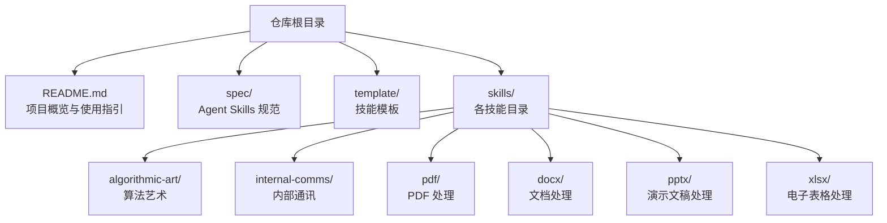
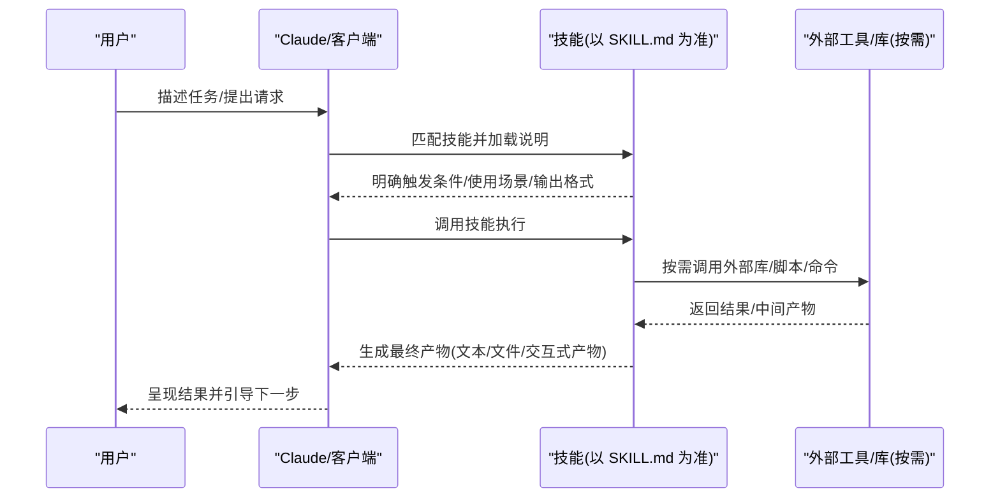
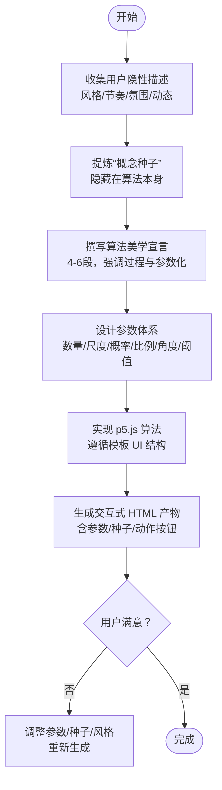
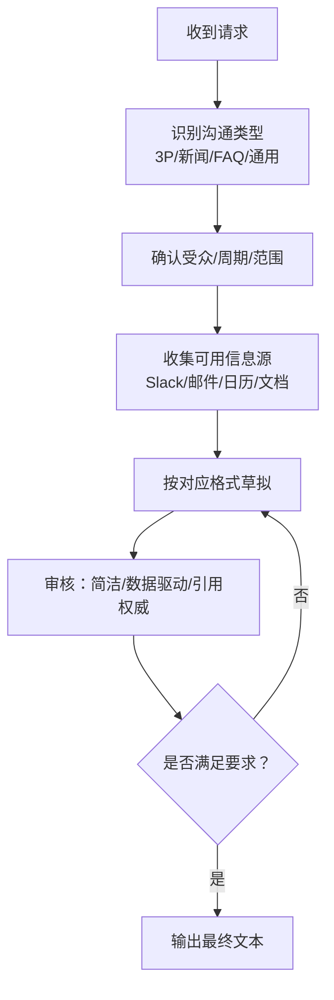
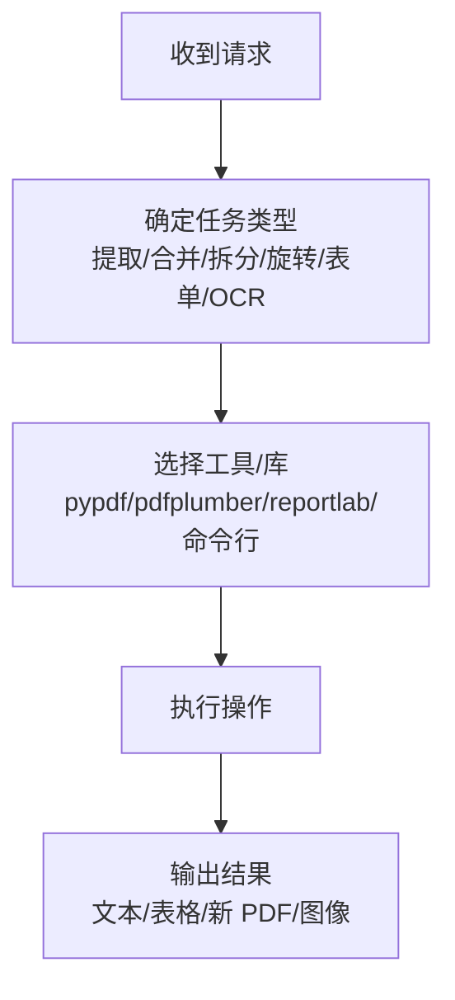
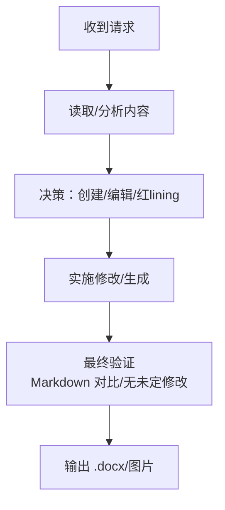
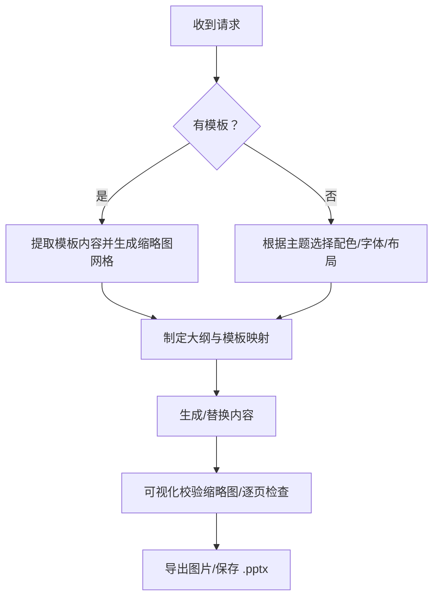
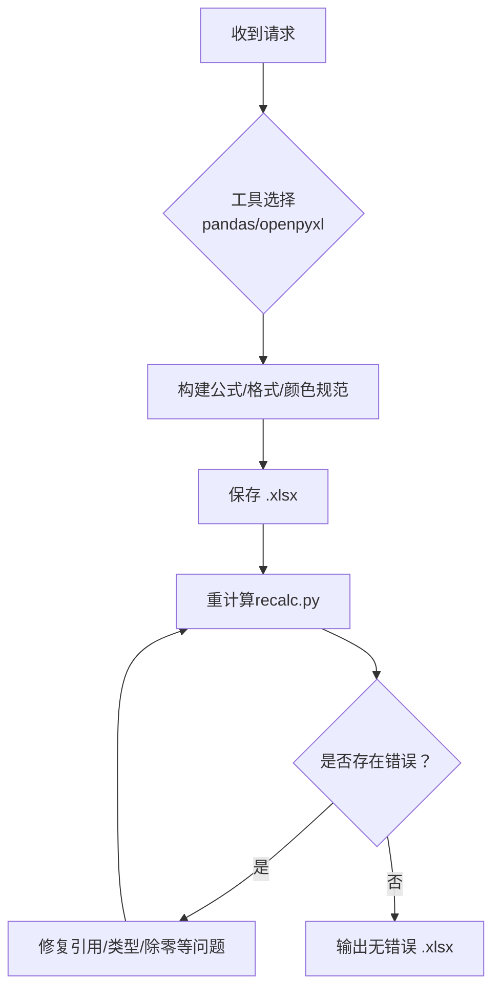
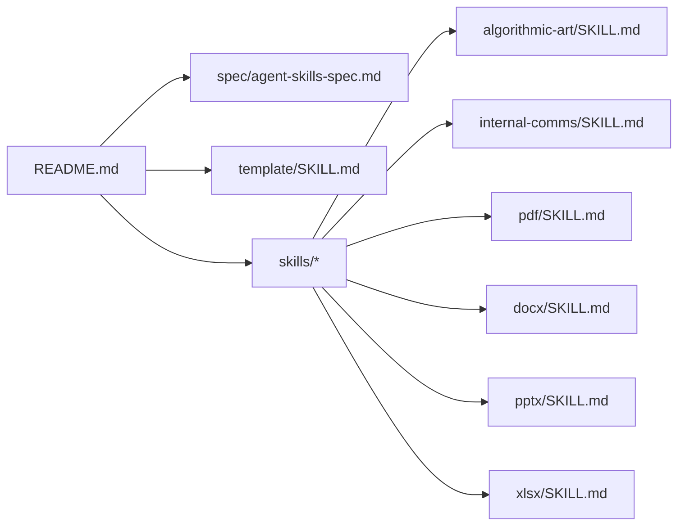

# 第一步：理解技能

<cite>
**本文引用的文件**
- [README.md](file://README.md)
- [template/SKILL.md](file://template/SKILL.md)
- [spec/agent-skills-spec.md](file://spec/agent-skills-spec.md)
- [skills/algorithmic-art/SKILL.md](file://skills/algorithmic-art/SKILL.md)
- [skills/internal-comms/SKILL.md](file://skills/internal-comms/SKILL.md)
- [skills/internal-comms/examples/3p-updates.md](file://skills/internal-comms/examples/3p-updates.md)
- [skills/internal-comms/examples/company-newsletter.md](file://skills/internal-comms/examples/company-newsletter.md)
- [skills/internal-comms/examples/faq-answers.md](file://skills/internal-comms/examples/faq-answers.md)
- [skills/internal-comms/examples/general-comms.md](file://skills/internal-comms/examples/general-comms.md)
- [skills/pdf/SKILL.md](file://skills/pdf/SKILL.md)
- [skills/docx/SKILL.md](file://skills/docx/SKILL.md)
- [skills/pptx/SKILL.md](file://skills/pptx/SKILL.md)
- [skills/xlsx/SKILL.md](file://skills/xlsx/SKILL.md)
</cite>

## 目录
1. [引言](#引言)
2. [项目结构](#项目结构)
3. [核心组件](#核心组件)
4. [架构总览](#架构总览)
5. [详细组件分析](#详细组件分析)
6. [依赖关系分析](#依赖关系分析)
7. [性能考量](#性能考量)
8. [故障排查指南](#故障排查指南)
9. [结论](#结论)
10. [附录](#附录)

## 引言
本章节聚焦“如何通过具体示例理解技能”，目标是帮助开发者与用户进行有效沟通，明确技能的功能边界与触发场景。我们将围绕以下关键点展开：
- 设计有效问题的方法：例如“用户会如何描述使用该技能的任务？”“哪些具体请求应触发此技能？”
- 从模糊需求中提炼清晰技能用途的实际对话示例
- 为什么跳过此步骤可能导致技能设计偏离实际需求
- 即使在迭代现有技能时也应重新验证使用场景

为达成上述目标，本文将结合仓库中的真实技能示例（如算法艺术、内部通讯、PDF/DOCX/PPTX/XLSX处理等），系统梳理其“使用场景”“触发条件”“输出形态”“交互流程”等关键要素，并给出可复用的提问清单与验证方法。

## 项目结构
该仓库是一个技能集合，每个技能以独立目录下的 SKILL.md 为核心说明文件，辅以模板、参考文档与脚本。整体组织方式为“按功能域分组 + 每个技能自说明”的结构，便于开发者快速定位与复用。

图表来源
- [README.md](file://README.md#L1-L95)
- [spec/agent-skills-spec.md](file://spec/agent-skills-spec.md#L1-L4)

章节来源
- [README.md](file://README.md#L1-L95)
- [spec/agent-skills-spec.md](file://spec/agent-skills-spec.md#L1-L4)

## 核心组件
- 技能说明文件（SKILL.md）：每个技能的核心说明，包含名称、描述、使用场景、工作流、示例与注意事项等。
- 技能模板（template/SKILL.md）：标准化的技能骨架，帮助开发者快速搭建新技能。
- 示例技能：涵盖创意类（算法艺术）、企业类（内部通讯）、技术类（PDF/DOCX/PPTX/XLSX）等，便于对照学习。

章节来源
- [template/SKILL.md](file://template/SKILL.md#L1-L7)

## 架构总览
从“用户意图”到“技能执行”的典型路径如下：

说明
- 触发条件由 SKILL.md 中的“何时使用/关键词/示例”决定
- 输出形态由 SKILL.md 中的“输出格式/产物类型/交互要求”决定
- 外部工具/库由 SKILL.md 中的“工作流/脚本/依赖”决定

## 详细组件分析

### 组件A：算法艺术（algorithmic-art）
该技能展示了“从哲学到代码”的完整创作流程，强调“概念种子”“参数化表达”“交互式产物”等关键环节，非常适合演示“如何从模糊需求中提炼清晰用途”。

- 关键要点
  - 使用场景：当用户请求“用代码生成算法艺术/生成式艺术/粒子系统/流场”等
  - 触发条件：用户给出“风格/主题/参数倾向”的隐性线索（“概念种子”）
  - 工作流：先写“算法美学宣言”，再用 p5.js 实现，最后生成单页交互式 HTML
  - 输出形态：Markdown 美学宣言 + 自包含 HTML 交互产物（含参数控制、种子导航）

- 从对话中提炼使用场景的实践
  - 问法示例
    - “你希望这幅算法艺术传达什么情感或理念？”
    - “能否描述一下你期望的视觉节奏/色彩氛围/动态特征？”
    - “有哪些参数是你可以接受调整的？哪些必须保持不变？”
  - 验证方法
    - 将用户的隐性描述映射到“算法哲学”的段落结构
    - 用“参数化表达”将抽象理念转化为可调参数
    - 用“种子导航”让用户探索不同变体，确认是否符合预期

- 为什么不能跳过
  - 若直接进入编码，可能落入“模板化”陷阱，失去“算法美学”的独特性
  - 缺少“概念种子”会导致参数与风格脱节，产出与用户期待不一致

图表来源
- [skills/algorithmic-art/SKILL.md](file://skills/algorithmic-art/SKILL.md#L1-L405)

章节来源
- [skills/algorithmic-art/SKILL.md](file://skills/algorithmic-art/SKILL.md#L1-L405)

### 组件B：内部通讯（internal-comms）
该技能提供了多种标准通讯格式（3P 更新、公司通讯、FAQ、通用）及对应的“使用场景”“触发条件”“工作流”“格式要求”。非常适合演示“如何通过分类与流程化设计，将模糊需求转化为可执行的技能”。

- 关键要点
  - 使用场景：当用户请求撰写“进度/计划/问题”“公司通讯”“常见问题解答”“通用内部通知”等
  - 触发条件：明确沟通类型（3P/新闻/FAQ/通用）与受众范围
  - 工作流：确认团队/时间范围 → 收集信息 → 按格式草拟 → 审核校对
  - 输出形态：严格格式的文本，强调简洁、数据驱动、链接引用权威来源

- 从对话中提炼使用场景的实践
  - 问法示例
    - “本次通讯面向谁？高层/全公司/某个团队？”
    - “是周报/月报还是即时通知？覆盖多长时间？”
    - “需要包含哪些板块？（进展/计划/问题/公告/优先事项）”
    - “是否有官方来源（邮件/日历/文档）可以引用？”
  - 验证方法
    - 对照示例文件（3p-updates、company-newsletter、faq-answers、general-comms）逐项核对
    - 以“可读性”“数据驱动”“链接权威来源”作为质量标准

图表来源
- [skills/internal-comms/SKILL.md](file://skills/internal-comms/SKILL.md#L1-L33)
- [skills/internal-comms/examples/3p-updates.md](file://skills/internal-comms/examples/3p-updates.md#L1-L47)
- [skills/internal-comms/examples/company-newsletter.md](file://skills/internal-comms/examples/company-newsletter.md#L1-L66)
- [skills/internal-comms/examples/faq-answers.md](file://skills/internal-comms/examples/faq-answers.md#L1-L30)
- [skills/internal-comms/examples/general-comms.md](file://skills/internal-comms/examples/general-comms.md#L1-L16)

章节来源
- [skills/internal-comms/SKILL.md](file://skills/internal-comms/SKILL.md#L1-L33)
- [skills/internal-comms/examples/3p-updates.md](file://skills/internal-comms/examples/3p-updates.md#L1-L47)
- [skills/internal-comms/examples/company-newsletter.md](file://skills/internal-comms/examples/company-newsletter.md#L1-L66)
- [skills/internal-comms/examples/faq-answers.md](file://skills/internal-comms/examples/faq-answers.md#L1-L30)
- [skills/internal-comms/examples/general-comms.md](file://skills/internal-comms/examples/general-comms.md#L1-L16)

### 组件C：PDF 处理（pdf）
该技能覆盖了 PDF 的提取、合并、拆分、旋转、元数据读取、表单处理等常见任务，适合演示“如何将用户零散的诉求聚合成明确的处理流程”。

- 关键要点
  - 使用场景：当用户请求“提取文本/表格”“合并/拆分/旋转页面”“添加水印/密码保护/图片提取”等
  - 触发条件：明确操作类型（提取/编辑/生成）与输入输出格式
  - 工作流：选择合适库/工具 → 执行相应操作 → 输出结果
  - 输出形态：文本/表格/新 PDF/图像等

- 从对话中提炼使用场景的实践
  - 问法示例
    - “你需要从 PDF 中提取什么内容？纯文本/表格/图片？”
    - “是否需要保留版式/行列结构？”
    - “是否涉及扫描件 OCR？”
    - “是否需要批量处理？（多页/多文件）”
  - 验证方法
    - 对照技能中的“快速参考/命令/代码片段”，确认操作链路可行
    - 以“最小可行流程”验证：先做单步测试，再扩展到批量

图表来源
- [skills/pdf/SKILL.md](file://skills/pdf/SKILL.md#L1-L295)

章节来源
- [skills/pdf/SKILL.md](file://skills/pdf/SKILL.md#L1-L295)

### 组件D：DOCX 处理（docx）
该技能提供了“读取/分析/创建/编辑/红lining（审阅批注）”的完整决策树与工作流，适合演示“如何将复杂文档任务分解为可执行步骤”。

- 关键要点
  - 使用场景：创建新文档、编辑既有文档、处理跟踪修订、导出为图片等
  - 触发条件：区分“自己的文档/他人文档”“简单修改/法律/学术/政府文档”等
  - 工作流：读取/分析 → 决策（创建/编辑/红lining）→ 实施 → 验证
  - 输出形态：新 .docx 文件、带修订的 .docx、图片等

- 从对话中提炼使用场景的实践
  - 问法示例
    - “这是你自己的文档吗？是否需要保留原作者的修订痕迹？”
    - “需要做哪些类型的修改？（替换/插入/删除/格式）”
    - “是否需要导出为图片用于审阅？”
  - 验证方法
    - 采用“批次化修订”策略，逐步验证每一批修改是否正确
    - 最终转换为 Markdown 进行比对，确保未遗漏或误改

图表来源
- [skills/docx/SKILL.md](file://skills/docx/SKILL.md#L1-L197)

章节来源
- [skills/docx/SKILL.md](file://skills/docx/SKILL.md#L1-L197)

### 组件E：PPTX 处理（pptx）
该技能覆盖了“无模板创建/基于模板创建/编辑现有演示文稿/导出为图片/生成缩略图网格”等完整流程，适合演示“如何在设计与技术之间建立清晰的桥梁”。

- 关键要点
  - 使用场景：创建新演示文稿、基于模板定制、编辑既有演示文稿、导出可视化
  - 触发条件：是否已有模板、是否需要无模板创建、是否需要批量处理
  - 工作流：分析内容 → 选择设计/布局 → 生成/替换内容 → 可视化校验 → 导出
  - 输出形态：.pptx 文件、缩略图网格、图片等

- 从对话中提炼使用场景的实践
  - 问法示例
    - “是否有现成模板？需要复用哪些布局/主题/颜色？”
    - “内容结构是怎样的？标题/正文/图表/图片分别占多少？”
    - “是否需要导出为图片用于审阅/分享？”
  - 验证方法
    - 先生成缩略图网格进行整体审视，再逐页检查文字/排版/对比度
    - 使用“两列布局/全屏布局”等原则保证可读性

图表来源
- [skills/pptx/SKILL.md](file://skills/pptx/SKILL.md#L1-L484)

章节来源
- [skills/pptx/SKILL.md](file://skills/pptx/SKILL.md#L1-L484)

### 组件F：XLSX 处理（xlsx）
该技能强调“公式优先、零错误、颜色规范、格式规范、文档化来源”等关键要求，适合演示“如何将财务/数据分析需求转化为严谨的电子表格模型”。

- 关键要点
  - 使用场景：创建/编辑/分析/可视化/重计算 Excel
  - 触发条件：是否已有模板、是否需要财务建模、是否需要跨表链接
  - 工作流：选择工具（pandas/openpyxl）→ 构建公式/格式 → 保存 → 重计算 → 验证
  - 输出形态：.xlsx 文件（零公式错误）

- 从对话中提炼使用场景的实践
  - 问法示例
    - “是否已有模板？需要严格遵循其格式/颜色规范？”
    - “是否需要财务建模？假设项放在哪里？单位如何标注？”
    - “是否需要跨表链接？链接是否稳定？”
  - 验证方法
    - 使用 recalc.py 进行重计算与错误扫描
    - 以“零错误”为目标，逐项修复引用/除零/类型错误

图表来源
- [skills/xlsx/SKILL.md](file://skills/xlsx/SKILL.md#L1-L289)

章节来源
- [skills/xlsx/SKILL.md](file://skills/xlsx/SKILL.md#L1-L289)

## 依赖关系分析
- 技能与规范
  - README 提供总体说明与使用指引；spec 指向官方规范地址
- 技能与模板
  - template 提供标准化骨架，便于快速搭建新技能
- 技能与示例
  - 各技能示例（algorithmic-art/internal-comms/pdf/docx/pptx/xlsx）构成“从模糊到清晰”的最佳实践库

图表来源
- [README.md](file://README.md#L1-L95)
- [spec/agent-skills-spec.md](file://spec/agent-skills-spec.md#L1-L4)
- [template/SKILL.md](file://template/SKILL.md#L1-L7)

章节来源
- [README.md](file://README.md#L1-L95)
- [spec/agent-skills-spec.md](file://spec/agent-skills-spec.md#L1-L4)
- [template/SKILL.md](file://template/SKILL.md#L1-L7)

## 性能考量
- 交互式产物（HTML/演示文稿/电子表格）应尽量“单文件自包含”，减少外部依赖，提升运行效率与可移植性
- 批量处理（PDF 合并/拆分、PPTX 缩略图网格、XLSX 重计算）建议采用“小步快跑”的批次策略，边做边验，避免一次性大作业导致失败成本高
- 文档处理（DOCX/PPTX）建议先生成图片/缩略图进行整体审阅，再进行细节修正，降低返工成本

## 故障排查指南
- 常见问题与对策
  - 触发条件不明确：回到 SKILL.md 的“使用场景/关键词/示例”，补充提问清单
  - 输出形态不符：对照“输出格式/交互要求/验收标准”，逐项核对
  - 外部依赖缺失：检查 SKILL.md 的“依赖/命令/库”，补齐环境
  - 错误频发：采用“最小可行流程”与“批次化验证”，逐步定位并修复

章节来源
- [skills/pdf/SKILL.md](file://skills/pdf/SKILL.md#L1-L295)
- [skills/docx/SKILL.md](file://skills/docx/SKILL.md#L1-L197)
- [skills/pptx/SKILL.md](file://skills/pptx/SKILL.md#L1-L484)
- [skills/xlsx/SKILL.md](file://skills/xlsx/SKILL.md#L1-L289)

## 结论
- 明确技能边界与触发场景是“理解技能”的第一步，也是避免设计偏差的关键
- 通过“有效提问 + 场景分类 + 流程化设计 + 验证闭环”，可将模糊需求转化为可执行的技能
- 即使在迭代现有技能时，也应重新审视使用场景，确保与用户的真实需求保持一致

## 附录
- 快速提问清单（可直接用于与用户沟通）
  - 用户会如何描述使用该技能的任务？
  - 哪些具体请求应触发此技能？
  - 期望的输出形态是什么？（文本/文件/交互式产物）
  - 是否已有模板/格式规范需要遵循？
  - 是否需要导出为图片/缩略图/重计算？
  - 是否涉及第三方来源（邮件/日历/文档）需要引用？
  - 是否需要支持批量处理/参数化探索/种子导航？