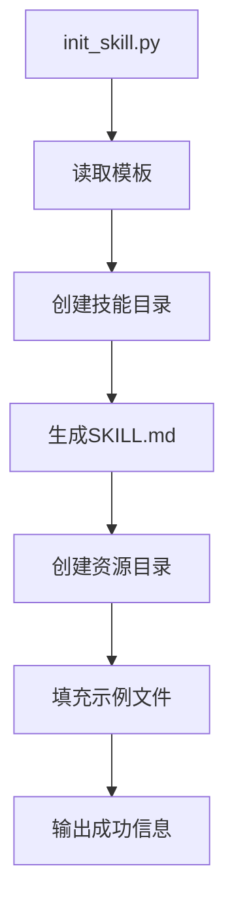
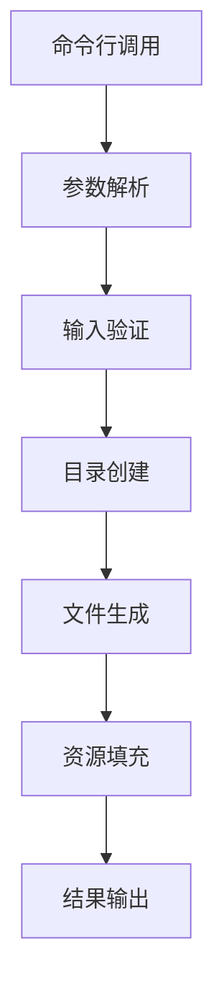
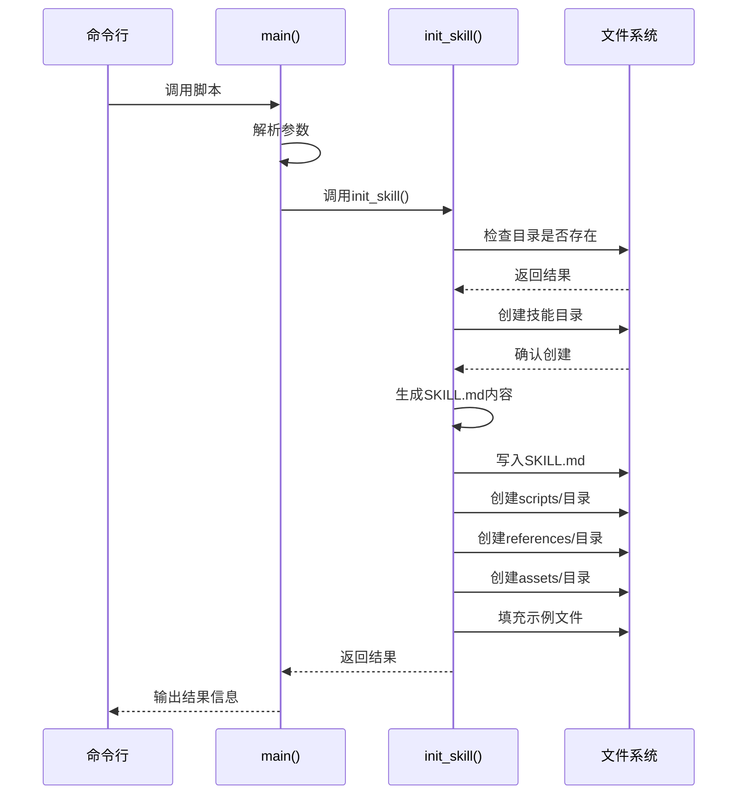
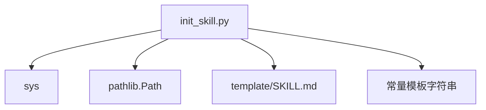

# 第三步：初始化技能

<cite>
**本文档中引用的文件**   
- [init_skill.py](file://skills/skill-creator/scripts/init_skill.py)
- [quick_validate.py](file://skills/skill-creator/scripts/quick_validate.py)
- [SKILL.md](file://template/SKILL.md)
- [README.md](file://README.md)
</cite>

## 目录
1. [介绍](#介绍)
2. [项目结构](#项目结构)
3. [核心组件](#核心组件)
4. [架构概述](#架构概述)
5. [详细组件分析](#详细组件分析)
6. [依赖分析](#依赖分析)
7. [性能考虑](#性能考虑)
8. [故障排除指南](#故障排除指南)
9. [结论](#结论)
10. [附录](#附录)（如有必要）

## 介绍
`init_skill.py` 脚本是技能创建工具集中的核心组件，用于初始化新的技能项目。该脚本通过命令行调用，根据指定的技能名称和输出路径，自动创建符合规范的技能目录结构。它不仅生成基础的 SKILL.md 模板文件，还创建 scripts/、references/ 和 assets/ 三个标准资源目录，并填充示例文件，为开发者提供一个完整的起点。本文档将详细说明该脚本的使用方法、参数要求、内部工作原理以及常见错误处理。

## 项目结构
`init_skill.py` 脚本位于 `skills/skill-creator/scripts/` 目录下，是技能创建工具集的一部分。该脚本依赖于项目根目录下的 `template/SKILL.md` 文件作为模板，并遵循项目整体的技能规范。当脚本执行时，它会在指定的输出路径下创建一个以技能名称命名的新目录，并在其中构建标准的技能项目结构。



**图示来源**
- [init_skill.py](file://skills/skill-creator/scripts/init_skill.py#L189-L304)
- [SKILL.md](file://template/SKILL.md#L1-L7)

**章节来源**
- [init_skill.py](file://skills/skill-creator/scripts/init_skill.py#L1-L304)
- [README.md](file://README.md#L1-L95)

## 核心组件
`init_skill.py` 脚本的核心功能由两个主要函数构成：`init_skill()` 和 `title_case_skill_name()`。`init_skill()` 函数负责整个初始化流程，包括目录创建、文件生成和错误处理。`title_case_skill_name()` 函数则是一个辅助函数，用于将连字符分隔的技能名称转换为标题格式，以便在文档中显示。

**章节来源**
- [init_skill.py](file://skills/skill-creator/scripts/init_skill.py#L189-L304)

## 架构概述
`init_skill.py` 脚本的架构遵循一个清晰的命令行工具模式。它首先解析命令行参数，然后执行一系列有序的操作来初始化技能项目。这些操作包括验证输入、创建目录结构、生成模板文件和填充示例资源。整个过程被设计为原子操作，任何步骤的失败都会导致脚本终止并返回错误信息。



**图示来源**
- [init_skill.py](file://skills/skill-creator/scripts/init_skill.py#L273-L304)

## 详细组件分析

### init_skill 函数分析
`init_skill()` 函数是脚本的核心，它接收技能名称和路径作为参数，并执行初始化过程。该函数首先检查目标目录是否已存在，以避免覆盖现有项目。然后，它创建技能目录，并生成 SKILL.md 文件，该文件基于模板并使用 `title_case_skill_name()` 函数处理技能名称。最后，它创建三个资源目录（scripts/、references/、assets/）并填充相应的示例文件。

#### 函数调用流程


**图示来源**
- [init_skill.py](file://skills/skill-creator/scripts/init_skill.py#L194-L271)

**章节来源**
- [init_skill.py](file://skills/skill-creator/scripts/init_skill.py#L194-L271)

### title_case_skill_name 函数分析
`title_case_skill_name()` 函数是一个简单的字符串处理函数，它将连字符分隔的小写字符串转换为标题格式。例如，输入 "my-new-skill" 将返回 "My New Skill"。这个函数在生成 SKILL.md 文件时被调用，以确保技能名称在文档中正确显示。

#### 字符串转换流程
```mermaid
flowchart TD
A[输入: my-new-skill] --> B[按连字符分割]
B --> C[["my", "new", "skill"]]
C --> D[每个单词首字母大写]
D --> E[["My", "New", "Skill"]]
E --> F[用空格连接]
F --> G[输出: My New Skill]
```

**图示来源**
- [init_skill.py](file://skills/skill-creator/scripts/init_skill.py#L189-L192)

**章节来源**
- [init_skill.py](file://skills/skill-creator/scripts/init_skill.py#L189-L192)

### 命令行接口分析
`init_skill.py` 脚本通过 `main()` 函数提供命令行接口。它要求用户以 `init_skill.py <skill-name> --path <output-directory>` 的格式调用脚本。脚本会验证参数数量和格式，并在参数错误时输出使用说明和示例。

#### 命令行调用流程
```mermaid
flowchart TD
A[用户输入命令] --> B{参数数量 >= 4?}
B --> |否| C[输出使用说明]
B --> |是| D{第二个参数是--path?}
D --> |否| C
D --> |是| E[提取skill-name和path]
E --> F[调用init_skill()]
F --> G[输出结果]
```

**图示来源**
- [init_skill.py](file://skills/skill-creator/scripts/init_skill.py#L273-L298)

**章节来源**
- [init_skill.py](file://skills/skill-creator/scripts/init_skill.py#L273-L298)

## 依赖分析
`init_skill.py` 脚本依赖于 Python 标准库中的 `sys` 和 `pathlib` 模块来处理命令行参数和文件系统操作。它还依赖于项目根目录下的 `template/SKILL.md` 文件作为模板。脚本内部定义了多个常量字符串（如 `SKILL_TEMPLATE`、`EXAMPLE_SCRIPT` 等），这些字符串包含了生成文件的模板内容。



**图示来源**
- [init_skill.py](file://skills/skill-creator/scripts/init_skill.py#L14-L188)
- [SKILL.md](file://template/SKILL.md#L1-L7)

**章节来源**
- [init_skill.py](file://skills/skill-creator/scripts/init_skill.py#L1-L304)

## 性能考虑
`init_skill.py` 脚本的性能主要取决于文件系统操作的速度。由于它只执行少量的目录创建和文件写入操作，因此在大多数系统上执行都非常快速。脚本使用了 `pathlib.Path` 模块，该模块提供了高效的跨平台文件系统操作。对于大型项目，脚本的性能不会成为瓶颈。

## 故障排除指南
在使用 `init_skill.py` 脚本时，可能会遇到一些常见错误。最常见的错误是目标目录已存在，这会导致脚本终止并输出错误信息。另一个常见问题是权限不足，导致无法创建目录或文件。此外，如果技能名称不符合命名规范（如包含大写字母或特殊字符），虽然脚本本身不会验证，但后续的验证工具（如 `quick_validate.py`）会报错。

**章节来源**
- [init_skill.py](file://skills/skill-creator/scripts/init_skill.py#L209-L211)
- [quick_validate.py](file://skills/skill-creator/scripts/quick_validate.py#L65-L68)

## 结论
`init_skill.py` 脚本是一个高效且易于使用的工具，它简化了新技能项目的创建过程。通过自动化目录结构和文件的生成，它确保了所有技能项目都遵循统一的规范。脚本的设计清晰，代码结构良好，易于理解和维护。对于希望创建自定义技能的开发者来说，这是一个不可或缺的工具。

## 附录

### 技能名称命名规范
根据 `quick_validate.py` 脚本中的验证规则，技能名称必须遵循以下规范：
- 只能包含小写字母、数字和连字符
- 不能以连字符开头或结尾
- 不能包含连续的连字符
- 最大长度为64个字符

**章节来源**
- [quick_validate.py](file://skills/skill-creator/scripts/quick_validate.py#L65-L71)

### 完整的命令行示例
```bash
# 在skills/public目录下创建名为my-new-skill的技能
init_skill.py my-new-skill --path skills/public

# 在自定义位置创建名为my-api-helper的技能
init_skill.py my-api-helper --path /custom/location
```

**章节来源**
- [init_skill.py](file://skills/skill-creator/scripts/init_skill.py#L9-L11)