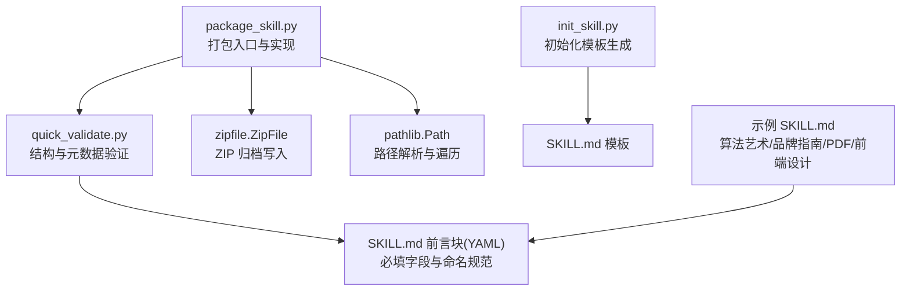
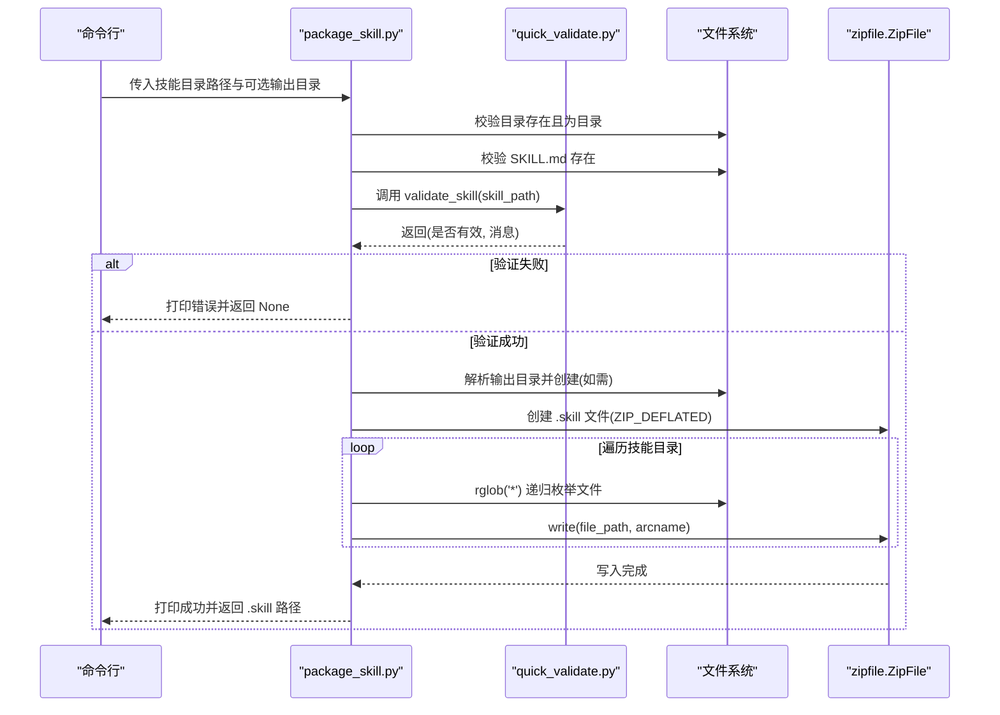
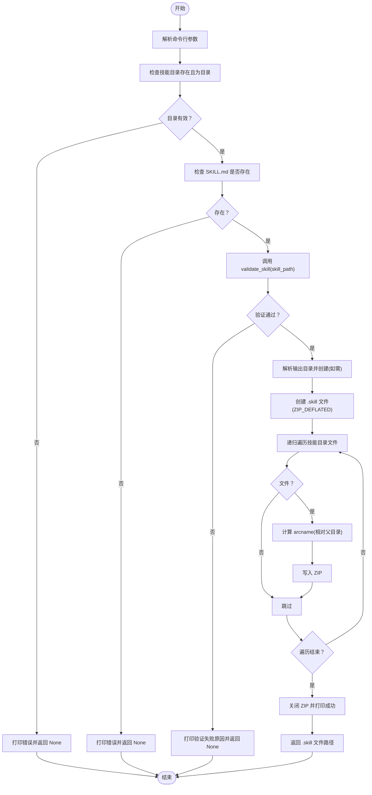
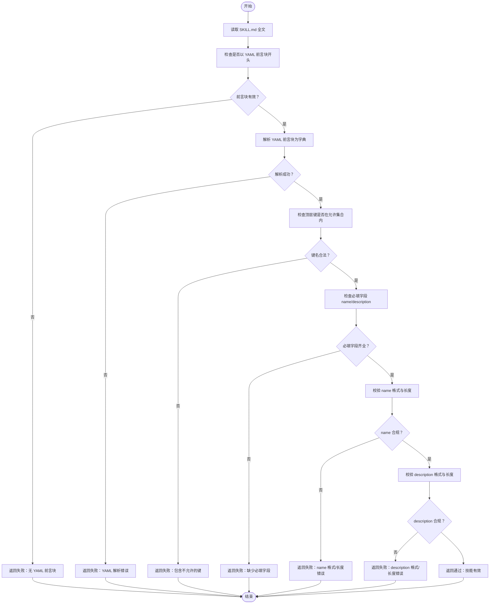
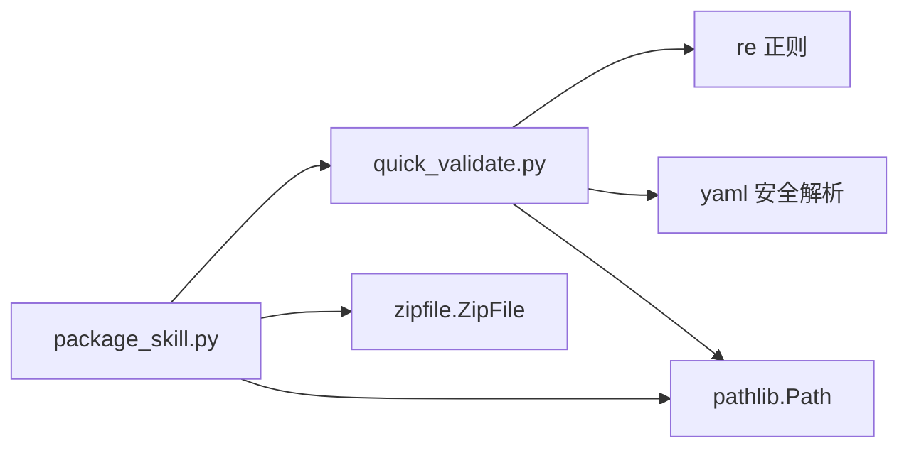

# 第五步：打包技能

<cite>
**本文引用的文件**
- [package_skill.py](file://skills/skill-creator/scripts/package_skill.py)
- [quick_validate.py](file://skills/skill-creator/scripts/quick_validate.py)
- [init_skill.py](file://skills/skill-creator/scripts/init_skill.py)
- [SKILL.md 模板](file://template/SKILL.md)
- [算法艺术 SKILL.md 示例](file://skills/algorithmic-art/SKILL.md)
- [品牌指南 SKILL.md 示例](file://skills/brand-guidelines/SKILL.md)
- [PDF SKILL.md 示例](file://skills/pdf/SKILL.md)
- [前端设计 SKILL.md 示例](file://skills/frontend-design/SKILL.md)
</cite>

## 目录
1. [简介](#简介)
2. [项目结构](#项目结构)
3. [核心组件](#核心组件)
4. [架构总览](#架构总览)
5. [详细组件分析](#详细组件分析)
6. [依赖关系分析](#依赖关系分析)
7. [性能考量](#性能考量)
8. [故障排查指南](#故障排查指南)
9. [结论](#结论)

## 简介
本节面向“第五步：打包技能”的目标，系统性解释 package_skill.py 的验证与打包机制。其核心流程为：
- 首先调用 quick_validate.py 对技能目录进行结构与元数据校验（包括 YAML 前言块、必填字段、命名规范、长度限制等）。
- 仅当验证通过后，才将技能目录递归打包为 ZIP 格式的 .skill 文件。
- 支持命令行用法：package_skill.py <技能目录路径> [输出目录]，并在打包时正确处理相对路径，确保解包后能恢复原始目录结构。

该文档将从系统架构、组件关系、数据流、处理逻辑、集成点、错误处理与性能特征等方面进行深入剖析，并提供常见问题与解决方案。

## 项目结构
围绕“打包技能”功能的相关文件组织如下：
- 打包入口与实现：skills/skill-creator/scripts/package_skill.py
- 结构与元数据验证：skills/skill-creator/scripts/quick_validate.py
- 初始化模板与示例：skills/skill-creator/scripts/init_skill.py、template/SKILL.md
- 技能示例文档：多个 SKILL.md 示例用于理解验证规则与目录结构

图表来源
- [package_skill.py](file://skills/skill-creator/scripts/package_skill.py#L1-L111)
- [quick_validate.py](file://skills/skill-creator/scripts/quick_validate.py#L1-L95)
- [init_skill.py](file://skills/skill-creator/scripts/init_skill.py#L1-L304)
- [SKILL.md 模板](file://template/SKILL.md#L1-L7)
- [算法艺术 SKILL.md 示例](file://skills/algorithmic-art/SKILL.md#L1-L120)
- [品牌指南 SKILL.md 示例](file://skills/brand-guidelines/SKILL.md#L1-L74)
- [PDF SKILL.md 示例](file://skills/pdf/SKILL.md#L1-L120)
- [前端设计 SKILL.md 示例](file://skills/frontend-design/SKILL.md#L1-L43)

章节来源
- [package_skill.py](file://skills/skill-creator/scripts/package_skill.py#L1-L111)
- [quick_validate.py](file://skills/skill-creator/scripts/quick_validate.py#L1-L95)
- [init_skill.py](file://skills/skill-creator/scripts/init_skill.py#L1-L304)
- [SKILL.md 模板](file://template/SKILL.md#L1-L7)

## 核心组件
- package_skill.py
  - 负责：参数解析、存在性与目录合法性检查、调用验证器、创建 ZIP 归档、递归添加文件、相对路径处理、输出结果。
  - 关键行为：在写入 ZIP 前必须通过 validate_skill 返回的验证结果；对输出目录不存在的情况自动创建；对异常进行捕获并返回 None。
- quick_validate.py
  - 负责：读取并解析 SKILL.md 的 YAML 前言块，校验必填字段、命名与描述的格式与长度、不允许的键名、以及是否包含非法字符等。
  - 返回值：布尔值表示是否通过，字符串消息描述具体原因或通过信息。
- init_skill.py 与 SKILL.md 模板
  - 提供标准的 SKILL.md 前言块结构与示例内容，便于理解验证器期望的数据形态。

章节来源
- [package_skill.py](file://skills/skill-creator/scripts/package_skill.py#L19-L83)
- [quick_validate.py](file://skills/skill-creator/scripts/quick_validate.py#L12-L87)
- [init_skill.py](file://skills/skill-creator/scripts/init_skill.py#L18-L104)
- [SKILL.md 模板](file://template/SKILL.md#L1-L7)

## 架构总览
下图展示“打包技能”的端到端流程：从命令行输入到 ZIP 输出，以及验证前置条件与路径处理的关键步骤。

图表来源
- [package_skill.py](file://skills/skill-creator/scripts/package_skill.py#L30-L83)
- [quick_validate.py](file://skills/skill-creator/scripts/quick_validate.py#L12-L87)

## 详细组件分析

### 组件一：package_skill.py 的执行流程与实现要点
- 参数与入口
  - 接收两个位置参数：技能目录路径与可选输出目录；若未提供输出目录，默认使用当前工作目录。
  - 使用 sys.argv 进行解析，并在参数不足时打印用法与示例后退出。
- 目录与文件校验
  - 将技能目录解析为绝对路径，检查是否存在且为目录；否则返回 None 并提示错误。
  - 明确要求 SKILL.md 必须存在，否则直接返回 None。
- 调用验证器
  - 在打包前调用 validate_skill(skill_path)，仅当返回有效时继续；失败则打印原因并返回 None。
- 输出目录与文件名
  - 若提供输出目录，则解析为绝对路径并自动创建；否则使用当前目录。
  - .skill 文件名为“技能目录名.skill”，位于输出目录中。
- ZIP 归档与路径处理
  - 使用 ZIP_DEFLATED 压缩方式创建 .skill 文件。
  - 递归遍历技能目录中的所有文件（rglob('*')），仅对文件进行写入。
  - 关键路径处理：将每个文件的 arcname 设为相对于“技能父目录”的相对路径，以确保解包后能恢复正确的目录层级。
- 异常处理
  - 包装 ZIP 写入过程于 try-except 中，捕获异常并返回 None，同时打印错误信息。
- 退出码
  - 成功返回非 None 时，主程序返回 0；失败返回 None 时，返回 1。

图表来源
- [package_skill.py](file://skills/skill-creator/scripts/package_skill.py#L30-L83)

章节来源
- [package_skill.py](file://skills/skill-creator/scripts/package_skill.py#L30-L83)

### 组件二：quick_validate.py 的验证规则与实现要点
- 输入与前置条件
  - 读取 SKILL.md 的全文，要求以 YAML 前言块开头（三短横线起止）。
- YAML 前言块解析
  - 使用正则提取三短横线之间的文本，再用安全解析器解析为字典；若解析失败，返回错误信息。
- 键名与必填字段
  - 允许的顶层键集合为：name、description、license、allowed-tools、metadata。
  - 不允许出现除上述键之外的其他顶层键；若存在，返回错误信息。
  - 必填字段：name、description。
- 字段值校验
  - name：必须为字符串，去除首尾空白后进行格式与长度校验：
    - 只允许小写字母、数字与连字符；
    - 不能以连字符开头或结尾，也不能包含连续的连字符；
    - 最大长度不超过 64。
  - description：必须为字符串，去除首尾空白后进行格式与长度校验：
    - 不能包含小于号或大于号；
    - 最大长度不超过 1024。
- 返回值
  - 通过：返回 True 与通过信息；
  - 失败：返回 False 与具体错误原因。

图表来源
- [quick_validate.py](file://skills/skill-creator/scripts/quick_validate.py#L12-L87)

章节来源
- [quick_validate.py](file://skills/skill-creator/scripts/quick_validate.py#L12-L87)

### 组件三：初始化模板与示例对验证规则的支撑
- init_skill.py 提供了标准的 SKILL.md 前言块模板，其中包含 name 与 description 的占位符，帮助开发者快速生成符合 YAML 前言块格式的文档。
- template/SKILL.md 展示了最小化的前言块结构，便于理解验证器对 YAML 前言块的期望。
- 多个 SKILL.md 示例展示了不同领域的技能文档风格，但都遵循相同的前言块与字段要求，有助于理解验证器对字段值的约束。

章节来源
- [init_skill.py](file://skills/skill-creator/scripts/init_skill.py#L18-L104)
- [SKILL.md 模板](file://template/SKILL.md#L1-L7)
- [算法艺术 SKILL.md 示例](file://skills/algorithmic-art/SKILL.md#L1-L120)
- [品牌指南 SKILL.md 示例](file://skills/brand-guidelines/SKILL.md#L1-L74)
- [PDF SKILL.md 示例](file://skills/pdf/SKILL.md#L1-L120)
- [前端设计 SKILL.md 示例](file://skills/frontend-design/SKILL.md#L1-L43)

## 依赖关系分析
- package_skill.py 依赖 quick_validate.py 的 validate_skill 接口，作为打包前置条件。
- package_skill.py 使用标准库 zipfile、pathlib 实现 ZIP 归档与路径操作。
- quick_validate.py 依赖标准库 re、yaml、pathlib 实现 YAML 前言块解析与规则校验。

图表来源
- [package_skill.py](file://skills/skill-creator/scripts/package_skill.py#L1-L111)
- [quick_validate.py](file://skills/skill-creator/scripts/quick_validate.py#L1-L95)

章节来源
- [package_skill.py](file://skills/skill-creator/scripts/package_skill.py#L1-L111)
- [quick_validate.py](file://skills/skill-creator/scripts/quick_validate.py#L1-L95)

## 性能考量
- 递归遍历策略：使用 rglob('*') 遍历所有文件，时间复杂度近似 O(N)，N 为技能目录中文件总数；空间复杂度主要受 ZIP 写入缓冲影响。
- 压缩方式：采用 ZIP_DEFLATED，压缩比适中、通用性强，适合分发场景。
- 目录创建：输出目录不存在时自动创建，避免重复 IO 操作。
- 路径处理：arcname 基于“技能父目录”的相对路径，避免冗余层级，减少归档体积与解包后目录深度。
- 异常捕获：对 ZIP 写入过程进行异常捕获，防止因单个文件导致整个打包失败。

[本节为一般性指导，不直接分析具体文件]

## 故障排查指南
- 缺失 SKILL.md
  - 现象：打包立即失败并提示找不到 SKILL.md。
  - 原因：技能目录缺少必需的文档。
  - 解决：使用初始化脚本生成标准 SKILL.md，或手动创建并确保 YAML 前言块格式正确。
  - 参考
    - [package_skill.py](file://skills/skill-creator/scripts/package_skill.py#L41-L46)
    - [init_skill.py](file://skills/skill-creator/scripts/init_skill.py#L221-L235)
- 验证失败
  - 现象：打印验证失败原因并终止打包。
  - 常见原因：
    - YAML 前言块格式不正确（未以三短横线包裹或格式不规范）。
    - 包含不允许的顶层键。
    - 缺少 name 或 description。
    - name 格式不符合 hyphen-case 规范（小写、数字、连字符，不含连续连字符，不以连字符开头或结尾，长度不超过 64）。
    - description 包含非法字符（< 或 >），或长度超过 1024。
  - 解决：根据验证器返回的消息逐项修正 SKILL.md 的前言块与内容。
  - 参考
    - [quick_validate.py](file://skills/skill-creator/scripts/quick_validate.py#L12-L87)
- 输出目录不可写或不存在
  - 现象：创建输出目录失败或写入 ZIP 失败。
  - 原因：权限不足、磁盘空间不足、路径无效。
  - 解决：确认输出目录存在且具备写权限；必要时使用绝对路径；确保磁盘空间充足。
  - 参考
    - [package_skill.py](file://skills/skill-creator/scripts/package_skill.py#L56-L65)
- ZIP 写入异常
  - 现象：抛出异常并返回 None。
  - 原因：文件被占用、磁盘空间不足、权限不足、文件名冲突。
  - 解决：关闭占用文件、清理磁盘空间、提升权限、更换输出文件名或目录。
  - 参考
    - [package_skill.py](file://skills/skill-creator/scripts/package_skill.py#L66-L83)
- 相对路径与目录结构
  - 现象：解包后目录层级异常。
  - 原因：arcname 计算基于“技能父目录”的相对路径，若期望不同的根目录，请调整技能目录结构或输出目录。
  - 解决：保持技能目录为独立根目录，确保打包后能正确还原。
  - 参考
    - [package_skill.py](file://skills/skill-creator/scripts/package_skill.py#L70-L76)

章节来源
- [package_skill.py](file://skills/skill-creator/scripts/package_skill.py#L41-L83)
- [quick_validate.py](file://skills/skill-creator/scripts/quick_validate.py#L12-L87)
- [init_skill.py](file://skills/skill-creator/scripts/init_skill.py#L221-L235)

## 结论
package_skill.py 通过“先验证、后打包”的设计，确保生成的 .skill 文件具备一致的结构与元数据质量。其核心实现简洁可靠：严格的前置验证、稳健的 ZIP 写入、合理的相对路径处理。结合 quick_validate.py 的规则与 init_skill.py 的模板，开发者可以高效地构建、验证并打包高质量的技能资源。遇到问题时，优先检查 SKILL.md 的 YAML 前言块与字段值，其次关注输出目录权限与磁盘空间，最后核对相对路径与目录结构。