# 第六步：迭代优化

<cite>
**本文档中引用的文件**
- [skill-creator/SKILL.md](file://skills/skill-creator/SKILL.md)
- [skill-creator/scripts/init_skill.py](file://skills/skill-creator/scripts/init_skill.py)
- [skill-creator/scripts/package_skill.py](file://skills/skill-creator/scripts/package_skill.py)
- [skill-creator/scripts/quick_validate.py](file://skills/skill-creator/scripts/quick_validate.py)
- [mcp-builder/SKILL.md](file://skills/mcp-builder/SKILL.md)
- [mcp-builder/scripts/evaluation.py](file://skills/mcp-builder/scripts/evaluation.py)
- [mcp-builder/reference/evaluation.md](file://skills/mcp-builder/reference/evaluation.md)
- [doc-coauthoring/SKILL.md](file://skills/doc-coauthoring/SKILL.md)
</cite>

## 目录
1. [引言](#引言)
2. [迭代工作流](#迭代工作流)
3. [识别优化需求](#识别优化需求)
4. [实施优化策略](#实施优化策略)
5. [质量保证与验证](#质量保证与验证)
6. [持续优化的重要性](#持续优化的重要性)

## 引言
技能的创建并非一次性任务，而是一个持续演进的过程。基于实际使用反馈进行迭代优化是确保技能保持高效、准确和用户友好的关键。本指南将详细阐述如何通过观察、分析和改进来不断完善技能，使其更好地服务于用户需求。

## 迭代工作流
技能的迭代优化遵循一个清晰的循环工作流，该流程在`skill-creator`技能中被明确指出，旨在通过实践反馈来驱动改进。

```mermaid
flowchart TD
A[在真实任务中使用技能] --> B[观察执行过程中的困难或低效环节]
B --> C[分析是否需要更新SKILL.md或调整脚本/资源]
C --> D[实施修改并重新测试]
D --> A
```

**Diagram sources**
- [skill-creator/SKILL.md](file://skills/skill-creator/SKILL.md#L351-L357)

**Section sources**
- [skill-creator/SKILL.md](file://skills/skill-creator/SKILL.md#L347-L357)

## 识别优化需求
优化的第一步是敏锐地识别出技能在实际应用中的不足之处。这通常发生在用户使用技能后，对执行过程和结果进行反思时。

### 观察执行困难
当用户在使用技能时遇到困难，如任务执行失败、输出不符合预期或操作流程过于复杂，这些都是需要优化的明确信号。例如，在`doc-coauthoring`技能中，通过“读者测试”阶段，可以发现文档的某些部分对新用户来说可能不够清晰或存在歧义，从而识别出需要改进的地方。

### 分析反馈与评估
系统化的评估是识别优化需求的有力工具。`mcp-builder`技能提供了一个完整的评估框架，通过运行一系列预设的复杂问题来测试MCP服务器的有效性。评估脚本会生成详细的报告，包括准确率、任务耗时和工具调用次数等指标。这些数据能够客观地揭示技能的性能瓶颈和潜在问题。

**Diagram sources**
- [mcp-builder/scripts/evaluation.py](file://skills/mcp-builder/scripts/evaluation.py#L86-L146)
- [mcp-builder/reference/evaluation.md](file://skills/mcp-builder/reference/evaluation.md#L288-L334)

**Section sources**
- [mcp-builder/SKILL.md](file://skills/mcp-builder/SKILL.md#L151-L180)
- [mcp-builder/scripts/evaluation.py](file://skills/mcp-builder/scripts/evaluation.py#L1-L374)

## 实施优化策略
一旦识别出优化需求，下一步就是实施具体的修改。优化可以针对技能的各个组成部分。

### 更新SKILL.md
`SKILL.md`文件是技能的核心，其内容需要根据反馈不断精炼。
- **简化复杂指令**：如果用户反馈某些步骤过于繁琐，应将其简化或提供更清晰的指导。
- **增加典型用例示例**：当发现用户频繁请求某项未覆盖的功能时，应在`SKILL.md`中增加相应的示例，以指导用户如何使用。
- **提升指令清晰度**：根据评估报告中的反馈，改进工具描述、参数说明和使用场景，使其更加准确和易于理解。

### 调整脚本与资源
- **提升脚本健壮性**：根据测试中发现的错误，修复脚本中的bug，增加错误处理逻辑，使其在异常情况下也能优雅地失败。
- **补充缺失的参考文档**：如果用户在执行任务时需要额外的知识，而这些知识未包含在技能中，应考虑创建`references/`目录下的参考文件，并在`SKILL.md`中链接。

## 质量保证与验证
在实施修改后，必须进行严格的测试以确保优化有效且没有引入新的问题。

### 自动化验证
`skill-creator`技能包提供了`quick_validate.py`脚本，用于对技能进行基本的结构和格式验证。在打包技能前运行此脚本，可以确保`SKILL.md`的YAML前言符合规范，避免因格式错误导致技能无法加载。

**Section sources**
- [skill-creator/scripts/quick_validate.py](file://skills/skill-creator/scripts/quick_validate.py#L1-L95)

### 重新评估
对于经过修改的技能，特别是像MCP服务器这样的复杂技能，应重新运行评估脚本。通过对比新旧评估报告，可以量化优化带来的性能提升，如准确率的提高或任务耗时的减少。

## 持续优化的重要性
持续优化是技能生命周期中不可或缺的一环。`doc-coauthoring`技能强调“质量优于速度”，每一次迭代都应旨在做出有意义的改进，最终目标是创建一个真正能为用户工作的、可靠的文档。通过遵循“使用-观察-分析-改进”的循环，技能可以不断适应新的需求和挑战，保持其相关性和有效性。

**Section sources**
- [doc-coauthoring/SKILL.md](file://skills/doc-coauthoring/SKILL.md#L372-L376)