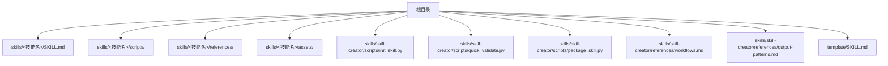
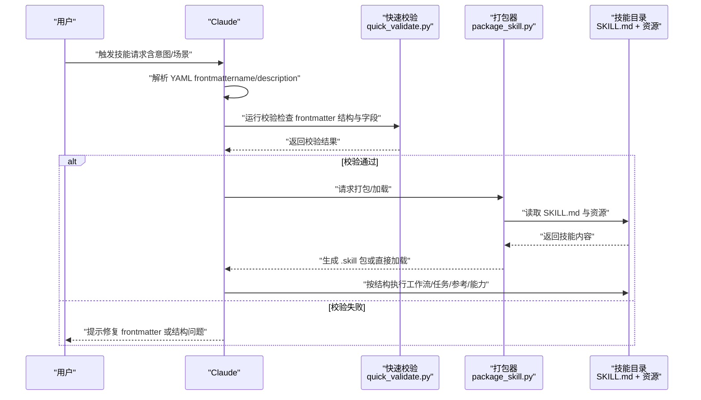
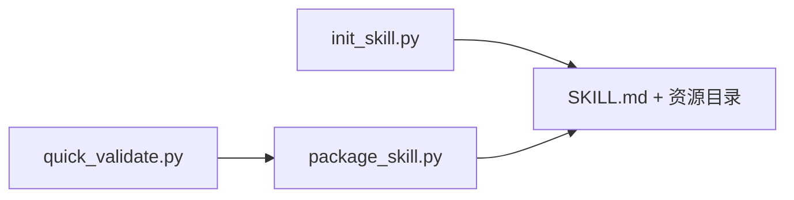

# 第四步：编辑技能

<cite>
**本文引用的文件**
- [README.md](file://README.md)
- [template/SKILL.md](file://template/SKILL.md)
- [skills/skill-creator/references/workflows.md](file://skills/skill-creator/references/workflows.md)
- [skills/skill-creator/references/output-patterns.md](file://skills/skill-creator/references/output-patterns.md)
- [skills/skill-creator/scripts/init_skill.py](file://skills/skill-creator/scripts/init_skill.py)
- [skills/skill-creator/scripts/quick_validate.py](file://skills/skill-creator/scripts/quick_validate.py)
- [skills/skill-creator/scripts/package_skill.py](file://skills/skill-creator/scripts/package_skill.py)
- [skills/pdf/SKILL.md](file://skills/pdf/SKILL.md)
- [skills/docx/SKILL.md](file://skills/docx/SKILL.md)
- [skills/pptx/SKILL.md](file://skills/pptx/SKILL.md)
- [skills/frontend-design/SKILL.md](file://skills/frontend-design/SKILL.md)
- [skills/internal-comms/SKILL.md](file://skills/internal-comms/SKILL.md)
- [skills/mcp-builder/SKILL.md](file://skills/mcp-builder/SKILL.md)
</cite>

## 目录
1. [引言](#引言)
2. [项目结构](#项目结构)
3. [核心组件](#核心组件)
4. [架构总览](#架构总览)
5. [详细组件分析](#详细组件分析)
6. [依赖关系分析](#依赖关系分析)
7. [性能与可维护性建议](#性能与可维护性建议)
8. [故障排查指南](#故障排查指南)
9. [结论](#结论)
10. [附录](#附录)

## 引言
本节面向“第四步：编辑技能”的目标，系统化指导如何：
- 实现脚本与资源组织（scripts、references、assets）
- 编写 SKILL.md 的 YAML 元数据（frontmatter）与正文
- 强调 YAML frontmatter 中 `name` 和 `description` 的关键作用（触发依据）
- 明确 `description` 应包含具体使用场景与触发条件，而非放在正文
- 根据技能类型选择合适结构模式（工作流型、任务型、参考型、能力型）
- 引用最佳实践文档（workflows.md、output-patterns.md）
- 提供编写高质量指令的技巧（祈使语气、避免重复、合理引用外部文件）

## 项目结构
该仓库以“技能”为单位进行组织，每个技能位于独立目录下，包含一个 SKILL.md 文件以及可选的 scripts、references、assets 等资源目录。模板与工具脚本集中在 skill-creator 下，用于初始化、校验与打包技能。

图表来源
- [README.md](file://README.md#L1-L95)
- [template/SKILL.md](file://template/SKILL.md#L1-L7)
- [skills/skill-creator/scripts/init_skill.py](file://skills/skill-creator/scripts/init_skill.py#L1-L304)
- [skills/skill-creator/scripts/quick_validate.py](file://skills/skill-creator/scripts/quick_validate.py#L1-L95)
- [skills/skill-creator/scripts/package_skill.py](file://skills/skill-creator/scripts/package_skill.py#L1-L111)
- [skills/skill-creator/references/workflows.md](file://skills/skill-creator/references/workflows.md#L1-L28)
- [skills/skill-creator/references/output-patterns.md](file://skills/skill-creator/references/output-patterns.md#L1-L83)

章节来源
- [README.md](file://README.md#L1-L95)
- [template/SKILL.md](file://template/SKILL.md#L1-L7)

## 核心组件
- YAML frontmatter（SKILL.md 前置元数据）
  - 必填字段：name、description
  - 作用：作为技能触发的核心依据；name 用于唯一标识，description 描述使用场景与触发条件
- 正文结构与内容
  - 指令、示例、指南、资源引用等
- 脚本与资源
  - scripts：可执行代码（Python/Bash 等）
  - references：加载到上下文的参考文档
  - assets：不加载到上下文但用于最终输出的模板/素材
- 工具链
  - 初始化：init_skill.py
  - 校验：quick_validate.py
  - 打包：package_skill.py

章节来源
- [README.md](file://README.md#L61-L90)
- [template/SKILL.md](file://template/SKILL.md#L1-L7)
- [skills/skill-creator/scripts/init_skill.py](file://skills/skill-creator/scripts/init_skill.py#L1-L120)
- [skills/skill-creator/scripts/quick_validate.py](file://skills/skill-creator/scripts/quick_validate.py#L12-L87)
- [skills/skill-creator/scripts/package_skill.py](file://skills/skill-creator/scripts/package_skill.py#L19-L83)

## 架构总览
从“触发条件”到“执行流程”的整体路径如下：

图表来源
- [skills/skill-creator/scripts/quick_validate.py](file://skills/skill-creator/scripts/quick_validate.py#L12-L87)
- [skills/skill-creator/scripts/package_skill.py](file://skills/skill-creator/scripts/package_skill.py#L19-L83)
- [skills/skill-creator/scripts/init_skill.py](file://skills/skill-creator/scripts/init_skill.py#L1-L120)

## 详细组件分析

### YAML 元数据（frontmatter）设计
- 字段要求
  - name：唯一标识符，小写、连字符命名，长度限制，不得包含非法字符
  - description：完整描述技能做什么及何时使用，包含具体使用场景与触发条件
- 触发机制
  - name 与 description 是 Claude 判断是否激活该技能的关键依据
  - description 中的触发条件越具体，越有利于 Claude 准确匹配用户意图
- 最佳实践
  - 将“触发条件”写在 description 中，正文聚焦于操作步骤与注意事项
  - 使用祈使语气，明确边界与约束，避免歧义

章节来源
- [README.md](file://README.md#L84-L90)
- [template/SKILL.md](file://template/SKILL.md#L1-L7)
- [skills/skill-creator/scripts/quick_validate.py](file://skills/skill-creator/scripts/quick_validate.py#L41-L87)

### 正文结构与内容组织
- 结构模式选择
  - 工作流型：适合顺序步骤清晰的任务（如 PDF 表单处理、PPTX 模板替换）
  - 任务型：适合工具集合/功能分类（如 DOCX 的“阅读/创建/编辑/审阅”）
  - 参考型：适合标准/规范/API 文档（如品牌指南、技术规范）
  - 能力型：适合集成系统/多模块协同（如 MCP 服务器开发）
- 参考最佳实践
  - 工作流模式：参考 workflows.md 的“顺序工作流/条件工作流”
  - 输出模式：参考 output-patterns.md 的“模板模式/示例模式”

章节来源
- [skills/skill-creator/references/workflows.md](file://skills/skill-creator/references/workflows.md#L1-L28)
- [skills/skill-creator/references/output-patterns.md](file://skills/skill-creator/references/output-patterns.md#L1-L83)
- [skills/pdf/SKILL.md](file://skills/pdf/SKILL.md#L1-L120)
- [skills/docx/SKILL.md](file://skills/docx/SKILL.md#L13-L120)
- [skills/pptx/SKILL.md](file://skills/pptx/SKILL.md#L1-L120)
- [skills/frontend-design/SKILL.md](file://skills/frontend-design/SKILL.md#L1-L43)
- [skills/internal-comms/SKILL.md](file://skills/internal-comms/SKILL.md#L1-L33)
- [skills/mcp-builder/SKILL.md](file://skills/mcp-builder/SKILL.md#L1-L120)

### 脚本与资源组织
- scripts
  - 可执行代码，支持直接运行完成特定自动化/数据处理/操作
  - 示例：PDF 的表单填充、DOCX 的解包/打包、PPTX 的重排/替换
- references
  - 加载到上下文的参考材料，便于 Claude 在执行过程中查阅
  - 示例：API 参考、工作流指南、复杂流程说明
- assets
  - 不加载到上下文，仅用于最终输出（模板、字体、图标、数据文件等）

章节来源
- [skills/skill-creator/scripts/init_skill.py](file://skills/skill-creator/scripts/init_skill.py#L66-L120)
- [skills/pdf/SKILL.md](file://skills/pdf/SKILL.md#L1-L120)
- [skills/docx/SKILL.md](file://skills/docx/SKILL.md#L13-L120)
- [skills/pptx/SKILL.md](file://skills/pptx/SKILL.md#L1-L120)

### 高质量指令编写技巧
- 语气与表达
  - 使用祈使语气，明确动作与边界
  - 避免重复信息，先总后分，突出关键步骤
- 引用与复用
  - 合理引用外部文件（scripts、references），减少正文冗余
  - 对复杂流程采用“决策树/流程图”形式，提升可读性
- 输出一致性
  - 使用模板模式/示例模式，确保输出风格统一、可验证

章节来源
- [skills/skill-creator/references/output-patterns.md](file://skills/skill-creator/references/output-patterns.md#L1-L83)
- [skills/frontend-design/SKILL.md](file://skills/frontend-design/SKILL.md#L1-L43)
- [skills/internal-comms/SKILL.md](file://skills/internal-comms/SKILL.md#L1-L33)

### 典型技能结构参考
- PDF 技能：工作流型（顺序步骤 + 工具选择 + 常见任务）
- DOCX 技能：任务型（阅读/分析、创建、编辑、审阅的决策树）
- PPTX 技能：任务型 + 工作流型（模板复制/重排 + 文本替换 + 验证）
- 前端设计：参考型（品牌风格/设计指南）
- 内部沟通：参考型（多种格式的模板与指引）
- MCP 构建：能力型（协议研究 → 设计规划 → 实现 → 测试 → 评估）

章节来源
- [skills/pdf/SKILL.md](file://skills/pdf/SKILL.md#L1-L295)
- [skills/docx/SKILL.md](file://skills/docx/SKILL.md#L1-L197)
- [skills/pptx/SKILL.md](file://skills/pptx/SKILL.md#L1-L484)
- [skills/frontend-design/SKILL.md](file://skills/frontend-design/SKILL.md#L1-L43)
- [skills/internal-comms/SKILL.md](file://skills/internal-comms/SKILL.md#L1-L33)
- [skills/mcp-builder/SKILL.md](file://skills/mcp-builder/SKILL.md#L1-L237)

## 依赖关系分析
- frontmatter 校验依赖
  - quick_validate.py 依赖 YAML 解析与正则校验，确保 name/description 符合规范
- 打包流程依赖
  - package_skill.py 在打包前调用 quick_validate.py 进行前置校验
- 初始化模板依赖
  - init_skill.py 提供结构化模板与资源目录骨架，引导开发者按模式组织内容

图表来源
- [skills/skill-creator/scripts/quick_validate.py](file://skills/skill-creator/scripts/quick_validate.py#L12-L87)
- [skills/skill-creator/scripts/package_skill.py](file://skills/skill-creator/scripts/package_skill.py#L19-L83)
- [skills/skill-creator/scripts/init_skill.py](file://skills/skill-creator/scripts/init_skill.py#L1-L120)

章节来源
- [skills/skill-creator/scripts/quick_validate.py](file://skills/skill-creator/scripts/quick_validate.py#L12-L87)
- [skills/skill-creator/scripts/package_skill.py](file://skills/skill-creator/scripts/package_skill.py#L19-L83)
- [skills/skill-creator/scripts/init_skill.py](file://skills/skill-creator/scripts/init_skill.py#L1-L120)

## 性能与可维护性建议
- 结构清晰：优先采用“工作流型/任务型/参考型/能力型”之一或组合，避免混杂导致阅读困难
- 资源分离：将复杂逻辑放入 scripts，将规范/参考放入 references，保持 SKILL.md 主体简洁
- 输出稳定：使用模板模式/示例模式，降低输出波动，便于后续验证与复用
- 自动化保障：在 CI/本地流水线中集成 quick_validate.py，确保每次变更符合 frontmatter 规范

[本节为通用建议，无需列出具体文件来源]

## 故障排查指南
- frontmatter 校验失败
  - 缺少 name/description
  - name 不符合 hyphen-case 或超长
  - description 包含非法字符或过长
- 打包失败
  - SKILL.md 不存在或未通过校验
  - 目录结构异常或权限不足
- 建议排查步骤
  - 使用 quick_validate.py 检查 frontmatter
  - 使用 init_skill.py 重新生成模板骨架
  - 使用 package_skill.py 打包前先本地验证

章节来源
- [skills/skill-creator/scripts/quick_validate.py](file://skills/skill-creator/scripts/quick_validate.py#L12-L87)
- [skills/skill-creator/scripts/package_skill.py](file://skills/skill-creator/scripts/package_skill.py#L19-L83)
- [skills/skill-creator/scripts/init_skill.py](file://skills/skill-creator/scripts/init_skill.py#L273-L304)

## 结论
- YAML frontmatter 的 name 与 description 是技能触发的核心依据
- description 应包含具体使用场景与触发条件，正文聚焦步骤与规范
- 根据技能类型选择合适结构模式，并参考 workflows.md 与 output-patterns.md
- 使用脚本与资源目录分离复杂逻辑，保持 SKILL.md 清晰可读
- 通过工具链（init/validate/package）保障质量与一致性

[本节为总结，无需列出具体文件来源]

## 附录
- 模板与参考
  - SKILL.md 模板：template/SKILL.md
  - 工作流模式参考：skills/skill-creator/references/workflows.md
  - 输出模式参考：skills/skill-creator/references/output-patterns.md
- 工具脚本
  - 初始化：skills/skill-creator/scripts/init_skill.py
  - 校验：skills/skill-creator/scripts/quick_validate.py
  - 打包：skills/skill-creator/scripts/package_skill.py

章节来源
- [template/SKILL.md](file://template/SKILL.md#L1-L7)
- [skills/skill-creator/references/workflows.md](file://skills/skill-creator/references/workflows.md#L1-L28)
- [skills/skill-creator/references/output-patterns.md](file://skills/skill-creator/references/output-patterns.md#L1-L83)
- [skills/skill-creator/scripts/init_skill.py](file://skills/skill-creator/scripts/init_skill.py#L1-L120)
- [skills/skill-creator/scripts/quick_validate.py](file://skills/skill-creator/scripts/quick_validate.py#L12-L87)
- [skills/skill-creator/scripts/package_skill.py](file://skills/skill-creator/scripts/package_skill.py#L19-L83)