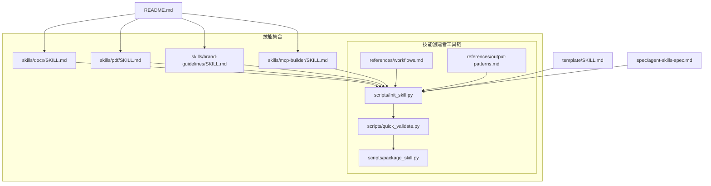
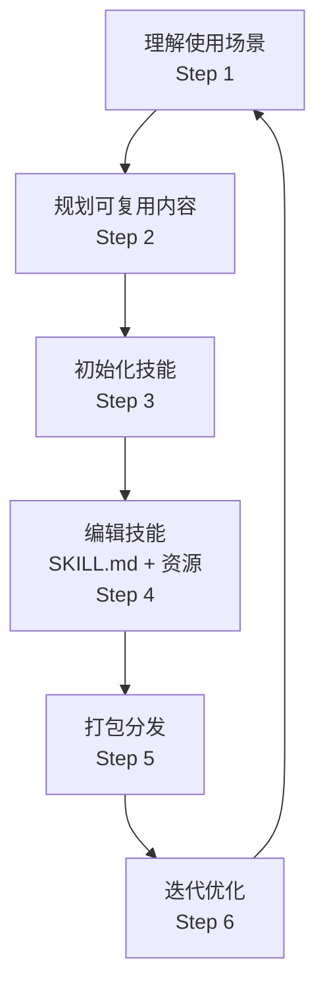
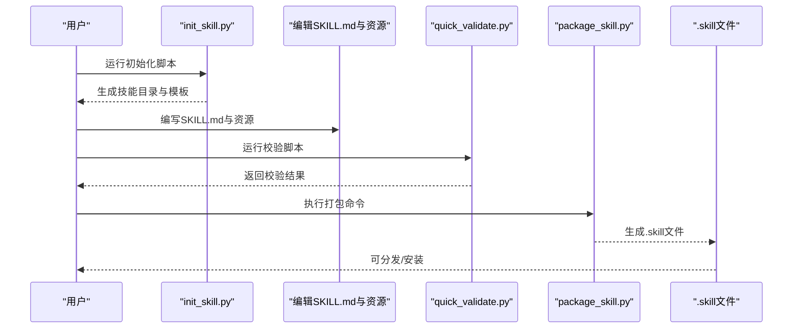
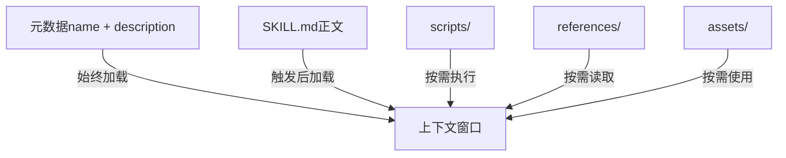
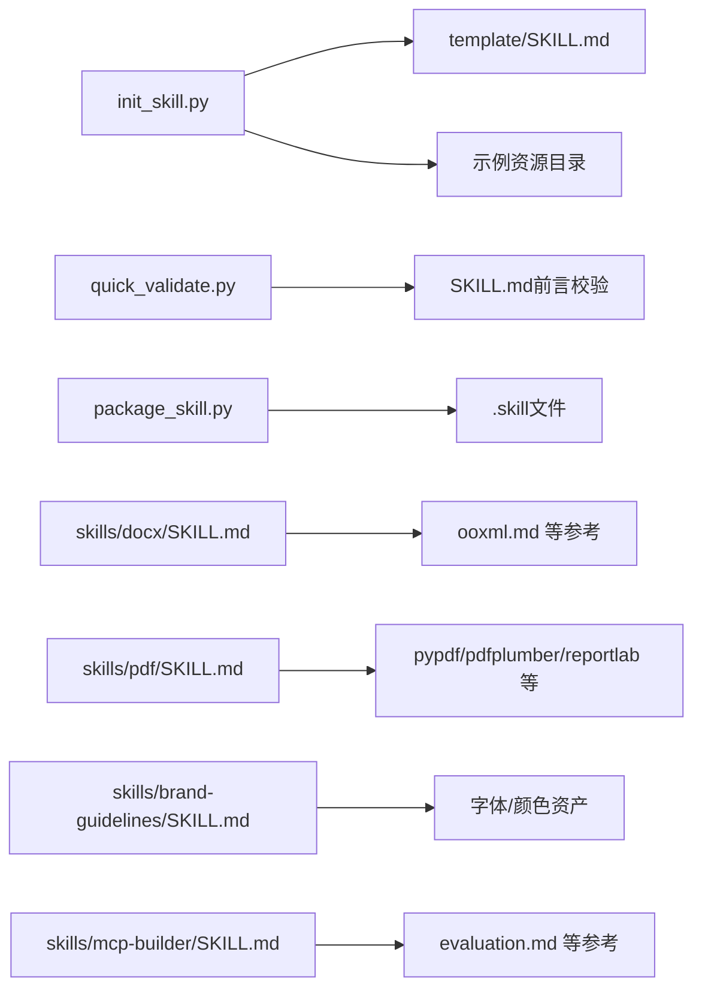

# 技能创建概述

<cite>
**本文引用的文件**
- [README.md](file://README.md)
- [template/SKILL.md](file://template/SKILL.md)
- [spec/agent-skills-spec.md](file://spec/agent-skills-spec.md)
- [skills/skill-creator/SKILL.md](file://skills/skill-creator/SKILL.md)
- [skills/skill-creator/scripts/init_skill.py](file://skills/skill-creator/scripts/init_skill.py)
- [skills/skill-creator/scripts/package_skill.py](file://skills/skill-creator/scripts/package_skill.py)
- [skills/skill-creator/scripts/quick_validate.py](file://skills/skill-creator/scripts/quick_validate.py)
- [skills/skill-creator/references/workflows.md](file://skills/skill-creator/references/workflows.md)
- [skills/skill-creator/references/output-patterns.md](file://skills/skill-creator/references/output-patterns.md)
- [skills/docx/SKILL.md](file://skills/docx/SKILL.md)
- [skills/pdf/SKILL.md](file://skills/pdf/SKILL.md)
- [skills/brand-guidelines/SKILL.md](file://skills/brand-guidelines/SKILL.md)
- [skills/mcp-builder/SKILL.md](file://skills/mcp-builder/SKILL.md)
</cite>

## 目录
1. [引言](#引言)
2. [项目结构](#项目结构)
3. [核心组件](#核心组件)
4. [架构总览](#架构总览)
5. [详细组件分析](#详细组件分析)
6. [依赖关系分析](#依赖关系分析)
7. [性能考量](#性能考量)
8. [故障排查指南](#故障排查指南)
9. [结论](#结论)
10. [附录](#附录)

## 引言
本文件围绕“技能（Skill）”在Claude系统中的角色与生命周期展开，系统性梳理从理解使用场景到迭代优化的六步法流程，并结合仓库中“技能创建者”指南与模板，阐释“渐进式披露”“上下文效率”“元数据简洁”“自由度适配”“解耦可扩展”的设计哲学。技能是Claude能力扩展的模块化单元，通过自包含的元数据与说明文档，指导模型在特定任务域内以可复用的方式完成复杂工作流或工具集成。

## 项目结构
该仓库以“技能集合”为核心组织方式，每个技能为独立目录，包含：
- 必需文件：SKILL.md（含YAML前言元数据与正文说明）
- 可选资源：scripts/（可执行脚本）、references/（参考文档）、assets/（输出资产）

此外，仓库提供“技能创建者”技能与配套脚本，形成从初始化、编辑、打包到验证的完整工具链；同时包含若干示例技能（如docx、pdf、brand-guidelines、mcp-builder），用于演示不同领域的最佳实践。

图表来源
- [README.md](file://README.md#L1-L95)
- [skills/skill-creator/SKILL.md](file://skills/skill-creator/SKILL.md#L202-L357)
- [skills/skill-creator/scripts/init_skill.py](file://skills/skill-creator/scripts/init_skill.py#L1-L304)
- [skills/skill-creator/scripts/quick_validate.py](file://skills/skill-creator/scripts/quick_validate.py#L1-L95)
- [skills/skill-creator/scripts/package_skill.py](file://skills/skill-creator/scripts/package_skill.py#L1-L111)
- [skills/skill-creator/references/workflows.md](file://skills/skill-creator/references/workflows.md#L1-L28)
- [skills/skill-creator/references/output-patterns.md](file://skills/skill-creator/references/output-patterns.md#L1-L83)
- [template/SKILL.md](file://template/SKILL.md#L1-L7)
- [spec/agent-skills-spec.md](file://spec/agent-skills-spec.md#L1-L4)

章节来源
- [README.md](file://README.md#L1-L95)
- [template/SKILL.md](file://template/SKILL.md#L1-L7)
- [spec/agent-skills-spec.md](file://spec/agent-skills-spec.md#L1-L4)

## 核心组件
- 元数据与触发机制：SKILL.md的YAML前言包含name与description，前者用于命名规范与目录一致性，后者是Claude判断何时调用技能的关键依据。
- 渐进式披露：元数据始终加载（约百词），SKILL.md正文按需加载（建议小于5k字），资源按需加载（脚本可直接执行无需读入上下文）。
- 资源组织：scripts/存放可执行脚本，references/存放参考文档，assets/存放输出资产，三者分离以降低上下文占用并提升可维护性。
- 设计原则：保持元数据简洁、设置适当自由度、避免冗余文档、遵循解耦与可扩展性。

章节来源
- [skills/skill-creator/SKILL.md](file://skills/skill-creator/SKILL.md#L27-L120)
- [skills/skill-creator/SKILL.md](file://skills/skill-creator/SKILL.md#L114-L201)
- [skills/skill-creator/SKILL.md](file://skills/skill-creator/SKILL.md#L47-L113)
- [skills/skill-creator/SKILL.md](file://skills/skill-creator/SKILL.md#L300-L346)

## 架构总览
下图展示了技能从构思到部署的高层流程，体现六步法与渐进式披露的协同：

图表来源
- [skills/skill-creator/SKILL.md](file://skills/skill-creator/SKILL.md#L202-L357)

## 详细组件分析

### 六步法流程详解
- Step 1：理解使用场景
  - 目标：明确用户会如何提问、触发条件、典型输入输出。
  - 产出：清晰的功能边界与触发关键词/上下文。
- Step 2：规划可复用内容
  - 目标：识别重复性操作、领域知识、模板资产。
  - 产出：scripts/、references/、assets/的初步清单与结构。
- Step 3：初始化技能
  - 使用脚本生成标准目录结构与模板SKILL.md，自动创建示例资源目录，便于快速起步。
- Step 4：编辑技能
  - 更新SKILL.md的YAML前言（name、description），正文包含工作流、示例与指南。
  - 在resources中补充脚本、参考文档与资产，确保只保留必要信息，避免上下文膨胀。
- Step 5：打包分发
  - 自动校验：检查前言字段、命名规范、描述长度等。
  - 打包：将技能目录压缩为.zip格式的.skill文件，便于分发与安装。
- Step 6：迭代优化
  - 基于真实使用反馈，持续改进SKILL.md与资源，形成闭环。

图表来源
- [skills/skill-creator/scripts/init_skill.py](file://skills/skill-creator/scripts/init_skill.py#L1-L304)
- [skills/skill-creator/scripts/quick_validate.py](file://skills/skill-creator/scripts/quick_validate.py#L1-L95)
- [skills/skill-creator/scripts/package_skill.py](file://skills/skill-creator/scripts/package_skill.py#L1-L111)
- [skills/skill-creator/SKILL.md](file://skills/skill-creator/SKILL.md#L202-L357)

章节来源
- [skills/skill-creator/SKILL.md](file://skills/skill-creator/SKILL.md#L202-L357)
- [skills/skill-creator/scripts/init_skill.py](file://skills/skill-creator/scripts/init_skill.py#L256-L304)
- [skills/skill-creator/scripts/quick_validate.py](file://skills/skill-creator/scripts/quick_validate.py#L12-L86)
- [skills/skill-creator/scripts/package_skill.py](file://skills/skill-creator/scripts/package_skill.py#L19-L83)

### 渐进式披露与上下文效率
- 元数据（name + description）：始终在上下文中，帮助Claude快速决定是否加载。
- SKILL.md正文：仅在触发后加载，建议控制在较小规模，避免上下文窗口被占满。
- 资源按需加载：脚本可直接执行而无需读入上下文；参考文档与资产仅在需要时被Claude读取，从而最大化上下文利用率。

图表来源
- [skills/skill-creator/SKILL.md](file://skills/skill-creator/SKILL.md#L114-L121)

章节来源
- [skills/skill-creator/SKILL.md](file://skills/skill-creator/SKILL.md#L114-L121)

### 元数据简洁与触发语义
- 元数据应简洁且完整，明确技能做什么、何时使用、触发条件与典型场景。
- 触发语义由description承载，应包含“何时使用此技能”的具体信息，避免在正文重复。

章节来源
- [skills/skill-creator/SKILL.md](file://skills/skill-creator/SKILL.md#L300-L315)

### 自由度适配与工作流设计
- 高自由度：适用于多路径、上下文敏感、需要启发式处理的任务。
- 中自由度：适用于偏好流程、参数配置影响行为的场景。
- 低自由度：适用于脆弱、易错、需要严格顺序与一致性的任务。
- 工作流模式：顺序流程与条件分支，配合决策树与批量处理策略，提升可维护性与可测试性。

章节来源
- [skills/skill-creator/SKILL.md](file://skills/skill-creator/SKILL.md#L35-L46)
- [skills/skill-creator/references/workflows.md](file://skills/skill-creator/references/workflows.md#L1-L28)

### 解耦与可扩展性
- 资源解耦：scripts/、references/、assets/分离职责，便于独立演进与替换。
- 模块化组织：示例技能（docx、pdf、brand-guidelines、mcp-builder）展示了不同领域的组织方式与最佳实践，体现可扩展性。

章节来源
- [skills/docx/SKILL.md](file://skills/docx/SKILL.md#L1-L197)
- [skills/pdf/SKILL.md](file://skills/pdf/SKILL.md#L1-L295)
- [skills/brand-guidelines/SKILL.md](file://skills/brand-guidelines/SKILL.md#L1-L74)
- [skills/mcp-builder/SKILL.md](file://skills/mcp-builder/SKILL.md#L1-L237)

### 示例技能：文档处理与品牌风格
- DOCX技能：提供阅读/分析、创建新文档、编辑现有文档、红线条（tracked changes）工作流等完整路径，并强调参考文档的“必须通读全文”的要求，体现渐进式披露与上下文效率。
- PDF技能：覆盖基础库与命令行工具，提供常见任务的代码片段与快速参考，便于按需检索。
- 品牌指南技能：集中展示品牌色彩与字体规范，便于在各类产物中统一风格。

章节来源
- [skills/docx/SKILL.md](file://skills/docx/SKILL.md#L1-L197)
- [skills/pdf/SKILL.md](file://skills/pdf/SKILL.md#L1-L295)
- [skills/brand-guidelines/SKILL.md](file://skills/brand-guidelines/SKILL.md#L1-L74)

### MCP服务器构建：协议与评估
- MCP构建指南涵盖研究规划、实现、评审测试与评估四个阶段，强调工具命名、上下文管理、错误消息可操作性、SDK选择与语言栈等要点。
- 评估部分要求生成10个独立、只读、复杂且可验证的问题集，形成稳定的XML评测格式。

章节来源
- [skills/mcp-builder/SKILL.md](file://skills/mcp-builder/SKILL.md#L1-L237)

## 依赖关系分析
- 工具链依赖：init_skill.py依赖模板与示例资源生成器；quick_validate.py负责前言字段与命名规范校验；package_skill.py在验证通过后进行打包。
- 示例技能依赖：docx、pdf、brand-guidelines、mcp-builder等技能分别依赖各自领域的库与参考文档，体现资源按需加载与解耦。

图表来源
- [skills/skill-creator/scripts/init_skill.py](file://skills/skill-creator/scripts/init_skill.py#L1-L304)
- [skills/skill-creator/scripts/quick_validate.py](file://skills/skill-creator/scripts/quick_validate.py#L12-L86)
- [skills/skill-creator/scripts/package_skill.py](file://skills/skill-creator/scripts/package_skill.py#L19-L83)
- [skills/docx/SKILL.md](file://skills/docx/SKILL.md#L1-L197)
- [skills/pdf/SKILL.md](file://skills/pdf/SKILL.md#L1-L295)
- [skills/brand-guidelines/SKILL.md](file://skills/brand-guidelines/SKILL.md#L1-L74)
- [skills/mcp-builder/SKILL.md](file://skills/mcp-builder/SKILL.md#L1-L237)

章节来源
- [skills/skill-creator/scripts/init_skill.py](file://skills/skill-creator/scripts/init_skill.py#L1-L304)
- [skills/skill-creator/scripts/quick_validate.py](file://skills/skill-creator/scripts/quick_validate.py#L12-L86)
- [skills/skill-creator/scripts/package_skill.py](file://skills/skill-creator/scripts/package_skill.py#L19-L83)
- [skills/docx/SKILL.md](file://skills/docx/SKILL.md#L1-L197)
- [skills/pdf/SKILL.md](file://skills/pdf/SKILL.md#L1-L295)
- [skills/brand-guidelines/SKILL.md](file://skills/brand-guidelines/SKILL.md#L1-L74)
- [skills/mcp-builder/SKILL.md](file://skills/mcp-builder/SKILL.md#L1-L237)

## 性能考量
- 上下文窗口有限：元数据默认加载，正文与资源按需加载，减少不必要的token消耗。
- 脚本优先：可执行脚本可在不读入上下文的前提下运行，适合重复性与确定性任务。
- 结构化组织：将长篇参考文档拆分为多个文件并通过链接引导，避免一次性加载过多内容。
- 输出质量：通过模板与示例模式稳定输出风格与结构，减少反复修正带来的上下文浪费。

## 故障排查指南
- 前言字段缺失或格式错误：确认SKILL.md以YAML前言开头，包含name与description，且命名符合hyphen-case规范。
- 描述过长或包含非法字符：description长度限制与禁止角括号等规则需满足。
- 目录结构问题：确保存在SKILL.md，且目录名与name一致。
- 打包失败：先运行校验脚本定位问题，修复后再尝试打包。

章节来源
- [skills/skill-creator/scripts/quick_validate.py](file://skills/skill-creator/scripts/quick_validate.py#L12-L86)
- [skills/skill-creator/scripts/package_skill.py](file://skills/skill-creator/scripts/package_skill.py#L41-L54)

## 结论
技能创建的六步法与渐进式披露设计共同服务于“在有限上下文内高效扩展Claude能力”的目标。通过保持元数据简洁、设置适当的自由度、采用解耦的资源组织与严格的校验与打包流程，技能能够在不同领域与复杂度的任务中稳定交付价值，并支持持续迭代与规模化扩展。

## 附录
- Agent Skills规范位置：见spec/agent-skills-spec.md中的指引。
- 模板SKILL.md：作为新建技能的起点，包含必要的前言与结构提示。

章节来源
- [spec/agent-skills-spec.md](file://spec/agent-skills-spec.md#L1-L4)
- [template/SKILL.md](file://template/SKILL.md#L1-L7)