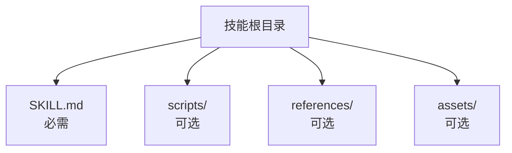
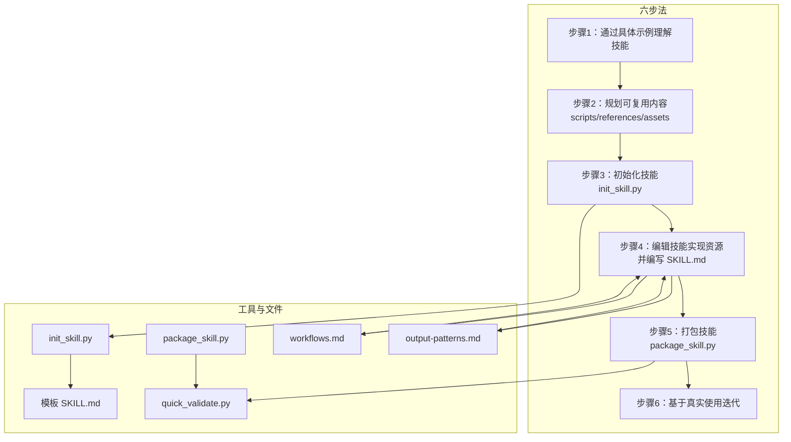
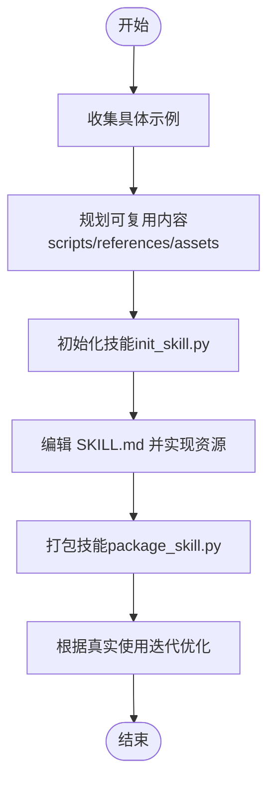
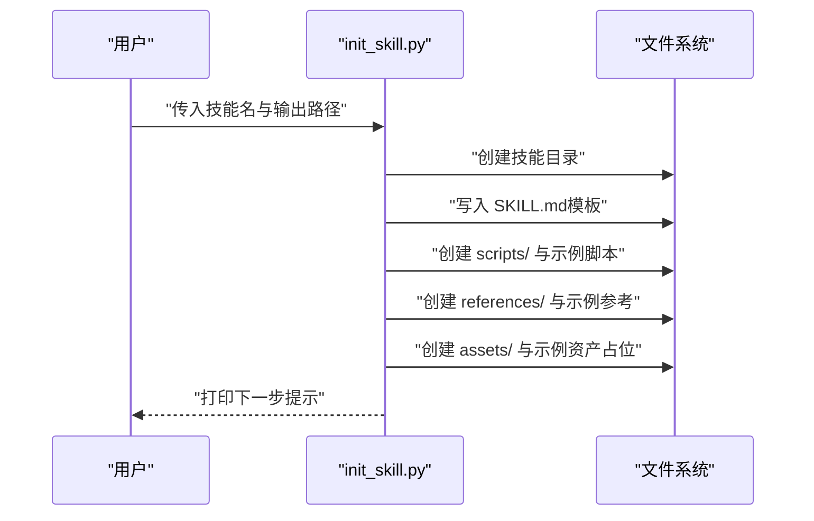
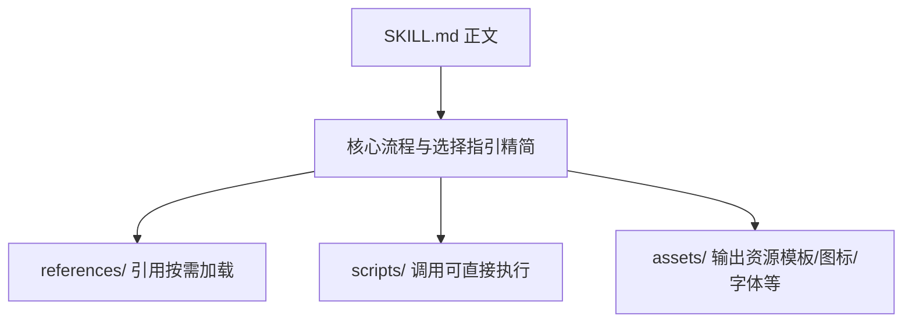
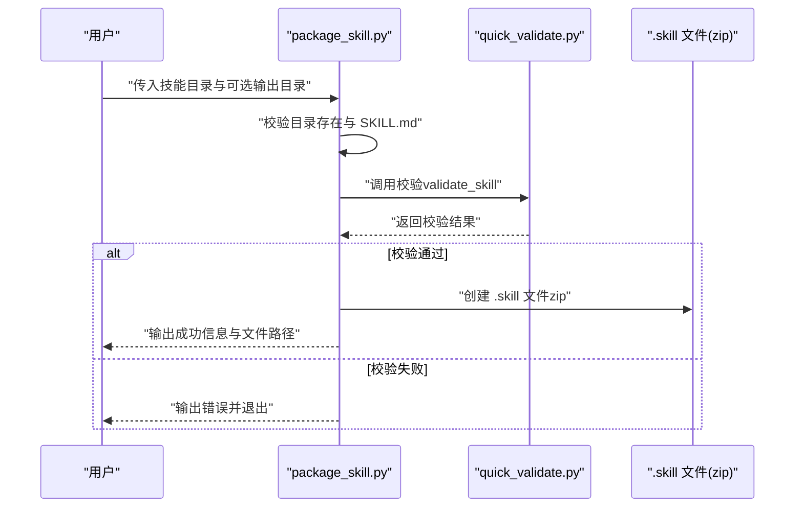
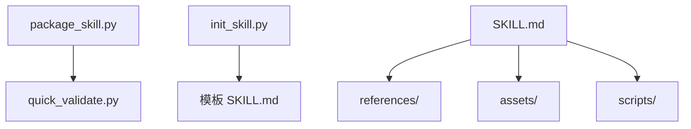

# 技能开发指南

<cite>
**本文引用的文件**
- [README.md](file://README.md)
- [template/SKILL.md](file://template/SKILL.md)
- [skills/skill-creator/SKILL.md](file://skills/skill-creator/SKILL.md)
- [skills/skill-creator/scripts/init_skill.py](file://skills/skill-creator/scripts/init_skill.py)
- [skills/skill-creator/scripts/package_skill.py](file://skills/skill-creator/scripts/package_skill.py)
- [skills/skill-creator/scripts/quick_validate.py](file://skills/skill-creator/scripts/quick_validate.py)
- [skills/skill-creator/references/workflows.md](file://skills/skill-creator/references/workflows.md)
- [skills/skill-creator/references/output-patterns.md](file://skills/skill-creator/references/output-patterns.md)
- [skills/pdf/SKILL.md](file://skills/pdf/SKILL.md)
- [skills/pdf/scripts/fill_fillable_fields.py](file://skills/pdf/scripts/fill_fillable_fields.py)
- [skills/docx/SKILL.md](file://skills/docx/SKILL.md)
- [skills/brand-guidelines/SKILL.md](file://skills/brand-guidelines/SKILL.md)
- [skills/theme-factory/SKILL.md](file://skills/theme-factory/SKILL.md)
</cite>

## 目录
1. [引言](#引言)
2. [项目结构](#项目结构)
3. [核心组件](#核心组件)
4. [架构总览](#架构总览)
5. [详细组件分析](#详细组件分析)
6. [依赖关系分析](#依赖关系分析)
7. [性能考量](#性能考量)
8. [故障排查指南](#故障排查指南)
9. [结论](#结论)
10. [附录](#附录)

## 引言
本指南围绕“skill-creator”技能所定义的六步法，系统讲解如何从零开始创建一个高质量的技能（Skill）。该过程包括：1) 通过具体示例理解技能；2) 规划可复用的技能内容（脚本、参考、资源）；3) 使用 init_skill.py 初始化技能；4) 编辑技能，实现资源并编写 SKILL.md；5) 使用 package_skill.py 打包技能；6) 基于真实使用场景进行迭代优化。文档特别强调如何编写高效的 SKILL.md，并采用渐进式披露模式将详细信息移至参考文件，以控制上下文窗口占用。

## 项目结构
仓库采用“按技能分目录”的组织方式，每个技能是一个独立的文件夹，包含：
- 必需文件：SKILL.md（包含 YAML 头部元数据与正文说明）
- 可选资源：
  - scripts/：可执行代码（Python/Bash 等），用于重复性或确定性任务
  - references/：按需加载的参考文档，如 API 文档、领域知识、工作流指南等
  - assets/：输出使用的模板、图标、字体等资源文件

下图展示了技能目录的典型结构与资源分布：

图表来源
- [skills/skill-creator/SKILL.md](file://skills/skill-creator/SKILL.md#L47-L62)

章节来源
- [README.md](file://README.md#L1-L30)
- [skills/skill-creator/SKILL.md](file://skills/skill-creator/SKILL.md#L47-L62)

## 核心组件
- 元数据与触发机制：SKILL.md 的 YAML 头部包含 name 与 description，是 Claude 判断何时调用该技能的关键依据。description 应明确“何时使用此技能”，避免在正文重复说明。
- 渐进式披露设计：SKILL.md 正文仅保留核心流程与选择指引，将详细参考材料放入 references/，并在 SKILL.md 中按需链接，确保 Claude 按需加载。
- 资源组织原则：
  - scripts/：存放可执行脚本，便于重复使用与确定性执行
  - references/：存放长篇参考文档，建议单层目录，提供目录索引以便预览
  - assets/：存放模板、图标、字体等输出资源，不直接加载到上下文

章节来源
- [skills/skill-creator/SKILL.md](file://skills/skill-creator/SKILL.md#L114-L201)
- [skills/skill-creator/SKILL.md](file://skills/skill-creator/SKILL.md#L300-L346)

## 架构总览
下图展示了从“理解技能—规划—初始化—编辑—打包—迭代”的完整流程，以及各阶段与工具/文件的关系：

图表来源
- [skills/skill-creator/SKILL.md](file://skills/skill-creator/SKILL.md#L202-L212)
- [skills/skill-creator/scripts/init_skill.py](file://skills/skill-creator/scripts/init_skill.py#L262-L271)
- [skills/skill-creator/scripts/package_skill.py](file://skills/skill-creator/scripts/package_skill.py#L19-L83)
- [skills/skill-creator/scripts/quick_validate.py](file://skills/skill-creator/scripts/quick_validate.py#L12-L87)
- [skills/skill-creator/references/workflows.md](file://skills/skill-creator/references/workflows.md#L1-L28)
- [skills/skill-creator/references/output-patterns.md](file://skills/skill-creator/references/output-patterns.md#L1-L83)

## 详细组件分析

### 组件A：六步法流程详解
- 步骤1：通过具体示例理解技能
  - 明确用户可能的提问与使用场景，收集真实或生成的示例，验证后形成清晰的功能边界
- 步骤2：规划可复用内容
  - 分析每个示例，识别可复用的脚本、参考与资产，决定是否放入 scripts/、references/ 或 assets/
- 步骤3：初始化技能
  - 使用 init_skill.py 创建技能目录与模板 SKILL.md，并生成示例 scripts/、references/、assets/ 结构
- 步骤4：编辑技能
  - 实现资源（脚本/参考/资产），完善 SKILL.md 的 YAML 头部与正文，遵循渐进式披露与简洁原则
- 步骤5：打包技能
  - 使用 package_skill.py 自动校验并通过后生成 .skill 文件（zip 格式），便于分发
- 步骤6：迭代
  - 基于实际使用反馈，持续优化 SKILL.md 与资源

图表来源
- [skills/skill-creator/SKILL.md](file://skills/skill-creator/SKILL.md#L202-L212)
- [skills/skill-creator/scripts/init_skill.py](file://skills/skill-creator/scripts/init_skill.py#L262-L271)
- [skills/skill-creator/scripts/package_skill.py](file://skills/skill-creator/scripts/package_skill.py#L19-L83)

章节来源
- [skills/skill-creator/SKILL.md](file://skills/skill-creator/SKILL.md#L202-L212)

### 组件B：init_skill.py 初始化流程
- 功能概述
  - 创建技能目录，生成模板 SKILL.md（含 TODO 占位与结构建议）
  - 自动生成 scripts/、references/、assets/ 示例文件，便于快速定制
- 关键行为
  - 校验目标路径是否存在，避免覆盖
  - 写入 SKILL.md、示例脚本、示例参考与示例资产
  - 输出下一步操作提示（编辑 SKILL.md、定制示例文件、运行校验）

图表来源
- [skills/skill-creator/scripts/init_skill.py](file://skills/skill-creator/scripts/init_skill.py#L194-L271)

章节来源
- [skills/skill-creator/scripts/init_skill.py](file://skills/skill-creator/scripts/init_skill.py#L1-L120)
- [skills/skill-creator/scripts/init_skill.py](file://skills/skill-creator/scripts/init_skill.py#L236-L271)

### 组件C：SKILL.md 编写与渐进式披露
- YAML 头部
  - name：技能唯一标识（小写短横线命名，长度限制）
  - description：技能做什么、何时使用，应包含触发条件与适用场景
- 正文结构建议
  - 概述：简要说明技能能力与适用范围
  - 工作流/任务/能力：按“工作流型/任务型/规范型/能力型”组织
  - 资源：说明 scripts/、references/、assets/ 的用途与示例
- 渐进式披露模式
  - 将详细参考材料放入 references/，在 SKILL.md 中按需链接
  - 对长文档提供目录索引，便于 Claude 预览与选择性加载
  - 避免在 SKILL.md 正文中重复参考内容

图表来源
- [skills/skill-creator/SKILL.md](file://skills/skill-creator/SKILL.md#L300-L346)
- [skills/skill-creator/SKILL.md](file://skills/skill-creator/SKILL.md#L82-L101)

章节来源
- [skills/skill-creator/SKILL.md](file://skills/skill-creator/SKILL.md#L300-L346)
- [skills/skill-creator/references/workflows.md](file://skills/skill-creator/references/workflows.md#L1-L28)
- [skills/skill-creator/references/output-patterns.md](file://skills/skill-creator/references/output-patterns.md#L1-L83)

### 组件D：package_skill.py 打包流程
- 功能概述
  - 在打包前自动运行 quick_validate.py 进行基础校验
  - 将技能目录整体压缩为 .skill 文件（zip），保持目录结构
- 校验要点
  - 存在 SKILL.md
  - YAML 头部格式正确且字段合法
  - name/description 合规（命名规则、字符限制等）
- 打包流程
  - 解析输入路径与输出目录
  - 递归遍历技能目录，写入 zip
  - 输出成功信息与 .skill 文件路径

图表来源
- [skills/skill-creator/scripts/package_skill.py](file://skills/skill-creator/scripts/package_skill.py#L19-L83)
- [skills/skill-creator/scripts/quick_validate.py](file://skills/skill-creator/scripts/quick_validate.py#L12-L87)

章节来源
- [skills/skill-creator/scripts/package_skill.py](file://skills/skill-creator/scripts/package_skill.py#L1-L111)

### 组件E：实际技能示例与最佳实践
- PDF 技能
  - SKILL.md 提供概览、快速上手、库与命令行工具示例，并通过 forms.md 与 reference.md 提供高级细节
  - scripts/ 中包含可执行脚本（如表单填充），体现“可重复、确定性”的价值
- DOCX 技能
  - 采用“工作流决策树”组织复杂流程，强调“先读完整参考再执行”的原则
  - 通过 references/ 的长文档（如 ooxml.md、docx-js.md）承载深度知识
- 品牌与主题工厂
  - 以“规范型/指南型”为主，强调颜色、字体与视觉一致性
  - assets/ 中包含品牌模板与字体资源，便于直接使用

章节来源
- [skills/pdf/SKILL.md](file://skills/pdf/SKILL.md#L1-L120)
- [skills/pdf/scripts/fill_fillable_fields.py](file://skills/pdf/scripts/fill_fillable_fields.py#L1-L115)
- [skills/docx/SKILL.md](file://skills/docx/SKILL.md#L1-L197)
- [skills/brand-guidelines/SKILL.md](file://skills/brand-guidelines/SKILL.md#L1-L74)
- [skills/theme-factory/SKILL.md](file://skills/theme-factory/SKILL.md#L1-L60)

## 依赖关系分析
- 工具链依赖
  - package_skill.py 依赖 quick_validate.py 完成前置校验
  - init_skill.py 生成模板 SKILL.md 与示例资源，作为后续编辑的基础
- 资源依赖
  - SKILL.md 通过 references/ 与 assets/ 间接依赖具体脚本与模板
  - 脚本在执行时可能依赖外部库（如 pypdf、docx 等），应在 SKILL.md 中给出安装与使用说明

图表来源
- [skills/skill-creator/scripts/package_skill.py](file://skills/skill-creator/scripts/package_skill.py#L16-L17)
- [skills/skill-creator/scripts/init_skill.py](file://skills/skill-creator/scripts/init_skill.py#L221-L271)
- [skills/skill-creator/SKILL.md](file://skills/skill-creator/SKILL.md#L300-L346)

章节来源
- [skills/skill-creator/scripts/package_skill.py](file://skills/skill-creator/scripts/package_skill.py#L16-L17)
- [skills/skill-creator/scripts/init_skill.py](file://skills/skill-creator/scripts/init_skill.py#L221-L271)
- [skills/skill-creator/SKILL.md](file://skills/skill-creator/SKILL.md#L300-L346)

## 性能考量
- 上下文窗口管理
  - SKILL.md 正文尽量精简，将详细内容放入 references/，按需加载，避免不必要的 token 消耗
- 脚本执行效率
  - 将重复性、确定性任务封装为脚本，减少 Claude 直接处理的负担
- 资源分离
  - assets/ 中的模板与资源不加载到上下文，仅在输出中使用，降低上下文压力

章节来源
- [skills/skill-creator/SKILL.md](file://skills/skill-creator/SKILL.md#L114-L201)

## 故障排查指南
- 常见问题与修复
  - SKILL.md 缺失：确认技能目录包含 SKILL.md
  - YAML 头部格式错误：检查三段式分隔符与字段类型
  - name/description 不合规：检查命名规则与长度限制，避免使用尖括号
  - 打包失败：先运行 quick_validate.py 排查错误，修正后再打包
- 建议流程
  - 初始化后先运行 quick_validate.py，确保基本结构与元数据正确
  - 编辑 SKILL.md 时遵循渐进式披露，避免正文冗长
  - 打包前再次校验，确保所有资源引用路径正确

章节来源
- [skills/skill-creator/scripts/quick_validate.py](file://skills/skill-creator/scripts/quick_validate.py#L12-L87)
- [skills/skill-creator/scripts/package_skill.py](file://skills/skill-creator/scripts/package_skill.py#L41-L54)

## 结论
通过“skill-creator”提供的六步法与工具链，可以高效地创建高质量的技能。关键在于：以具体示例驱动设计，合理规划可复用资源，严格遵循 SKILL.md 的渐进式披露原则，借助 init_skill.py 与 package_skill.py 提升开发与交付效率，并在真实使用中持续迭代优化。

## 附录
- 模板 SKILL.md
  - 可作为最小化起点，补充 YAML 头部与正文内容
- 参考与输出模式
  - workflows.md：顺序与条件工作流范式
  - output-patterns.md：模板与示例输出模式

章节来源
- [template/SKILL.md](file://template/SKILL.md#L1-L7)
- [skills/skill-creator/references/workflows.md](file://skills/skill-creator/references/workflows.md#L1-L28)
- [skills/skill-creator/references/output-patterns.md](file://skills/skill-creator/references/output-patterns.md#L1-L83)