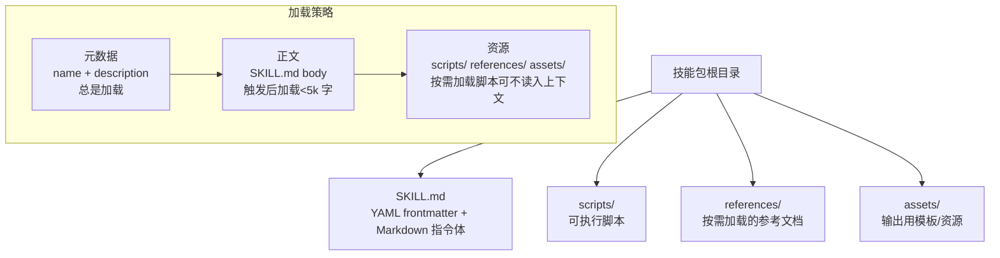
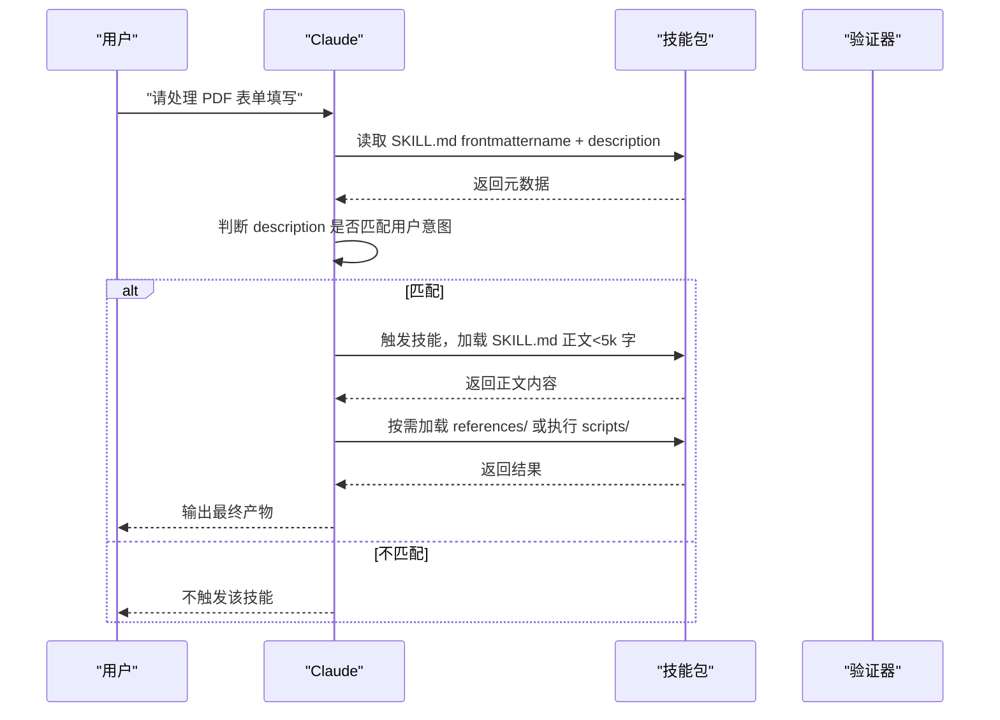
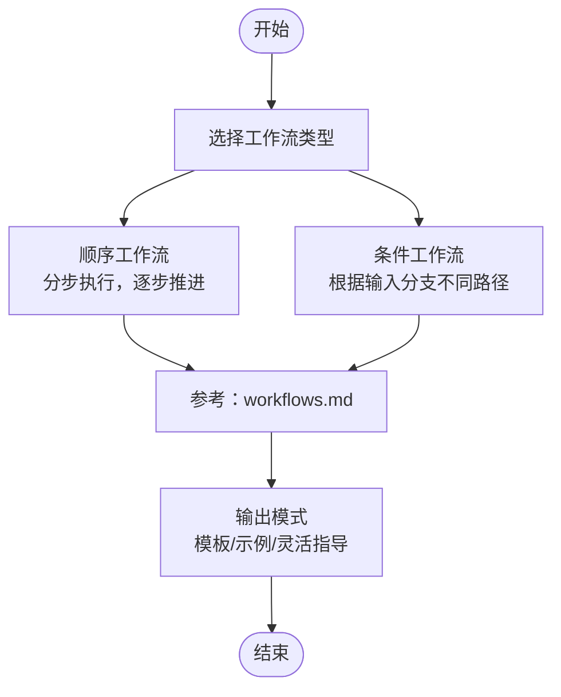
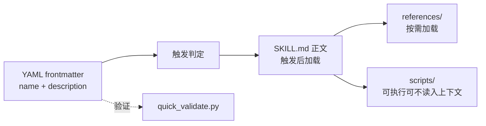

# SKILL.md 文件结构

<cite>
**本文引用的文件**
- [skills/skill-creator/SKILL.md](file://skills/skill-creator/SKILL.md)
- [template/SKILL.md](file://template/SKILL.md)
- [skills/pdf/SKILL.md](file://skills/pdf/SKILL.md)
- [skills/docx/SKILL.md](file://skills/docx/SKILL.md)
- [skills/brand-guidelines/SKILL.md](file://skills/brand-guidelines/SKILL.md)
- [skills/internal-comms/SKILL.md](file://skills/internal-comms/SKILL.md)
- [skills/algorithmic-art/SKILL.md](file://skills/algorithmic-art/SKILL.md)
- [skills/skill-creator/scripts/quick_validate.py](file://skills/skill-creator/scripts/quick_validate.py)
- [skills/skill-creator/references/workflows.md](file://skills/skill-creator/references/workflows.md)
- [skills/skill-creator/references/output-patterns.md](file://skills/skill-creator/references/output-patterns.md)
</cite>

## 目录
1. [引言](#引言)
2. [项目结构](#项目结构)
3. [核心组件](#核心组件)
4. [架构总览](#架构总览)
5. [详细组件分析](#详细组件分析)
6. [依赖关系分析](#依赖关系分析)
7. [性能考量](#性能考量)
8. [故障排查指南](#故障排查指南)
9. [结论](#结论)
10. [附录](#附录)

## 引言
本文件系统化剖析 SKILL.md 的“解剖结构”与“核心作用”，聚焦两大部分：
- YAML frontmatter（元数据）：由 name 和 description 构成，是 Claude 决定是否触发该技能的唯一依据。其中 description 必须清晰描述技能的功能、目标用户意图与典型使用场景，确保触发准确且高效。
- Markdown 正文（指令体）：提供核心工作流与操作指导，保持简洁（建议少于 500 行），并将详细信息下沉至 references/ 等资源目录，遵循“渐进披露”原则，避免在技能内重复冗余文档。

通过对 skill-creator/SKILL.md 的实际内容进行对照分析，总结出高效编写元数据与指令体的最佳实践，并强调避免在技能中包含 README.md、INSTALLATION_GUIDE.md、CHANGELOG.md 等与当前任务无关的辅助文件。

## 项目结构
SKILL.md 是技能包的“入口说明书”。每个技能通常包含：
- 必选：SKILL.md（含 YAML frontmatter + Markdown 指令体）
- 可选：scripts/（可执行脚本）、references/（按需加载的参考文档）、assets/（输出用模板或资源）

下图展示了技能包的典型组织方式与加载顺序（元数据始终在上下文中，正文按需加载，资源按需按需读取）：

图表来源
- [skills/skill-creator/SKILL.md](file://skills/skill-creator/SKILL.md#L116-L121)
- [skills/skill-creator/SKILL.md](file://skills/skill-creator/SKILL.md#L47-L62)

章节来源
- [skills/skill-creator/SKILL.md](file://skills/skill-creator/SKILL.md#L47-L62)
- [skills/skill-creator/SKILL.md](file://skills/skill-creator/SKILL.md#L116-L121)

## 核心组件
SKILL.md 的核心由两部分组成：
- YAML frontmatter（元数据）
  - name：技能名称，用于标识与分发
  - description：触发条件与使用场景的完整描述，Claude 基于此判断何时调用该技能
  - license：可选，指向许可证文件
  - 其他字段：仅允许有限白名单（如 allowed-tools、metadata），其余字段将导致验证失败
- Markdown 正文（指令体）
  - 提供核心工作流、步骤指引与注意事项
  - 严格控制长度（建议少于 500 行），复杂细节下沉到 references/ 或 scripts/
  - 避免重复冗余文档（如 README.md、INSTALLATION_GUIDE.md、CHANGELOG.md 等）

章节来源
- [skills/skill-creator/SKILL.md](file://skills/skill-creator/SKILL.md#L304-L319)
- [skills/skill-creator/scripts/quick_validate.py](file://skills/skill-creator/scripts/quick_validate.py#L41-L56)
- [template/SKILL.md](file://template/SKILL.md#L1-L7)

## 架构总览
下图展示了 Claude 在对话中如何基于 SKILL.md 的元数据与正文进行决策与执行：

图表来源
- [skills/skill-creator/SKILL.md](file://skills/skill-creator/SKILL.md#L304-L319)
- [skills/skill-creator/scripts/quick_validate.py](file://skills/skill-creator/scripts/quick_validate.py#L12-L56)

## 详细组件分析

### YAML Frontmatter（元数据）
- 关键字段
  - name：技能名称，用于识别与分发
  - description：触发机制的核心，必须明确技能做什么、何时使用、典型场景有哪些
  - license：可选，指向许可证文件
  - 其他字段：仅允许白名单（如 allowed-tools、metadata），超出将被拒绝
- 设计要点
  - description 应覆盖“功能范围 + 使用场景 + 触发关键词”，使 Claude 能准确匹配用户请求
  - frontmatter 中不要包含“何时使用”这类正文类信息；正文只在触发后加载
- 验证规则
  - 必须存在 name 与 description
  - 仅允许白名单字段；其他字段将导致验证失败

章节来源
- [skills/skill-creator/SKILL.md](file://skills/skill-creator/SKILL.md#L304-L319)
- [skills/skill-creator/scripts/quick_validate.py](file://skills/skill-creator/scripts/quick_validate.py#L41-L56)
- [template/SKILL.md](file://template/SKILL.md#L1-L7)

### Markdown 正文（指令体）
- 结构与职责
  - 提供核心工作流、步骤指引与注意事项
  - 控制长度（建议少于 500 行），复杂细节下沉到 references/ 或 scripts/
  - 避免重复冗余文档（如 README.md、INSTALLATION_GUIDE.md、CHANGELOG.md 等）
- 渐进披露设计
  - 元数据（name + description）：总是加载（约 100 字）
  - SKILL.md 正文：触发后加载（<5k 字）
  - 资源：按需加载（脚本可不读入上下文窗口）
- 示例与最佳实践
  - 使用 references/ 组织长文档，正文仅做导航与选择性链接
  - 对多变体/多框架场景，按域或变体拆分 references 子目录，按需加载
  - 将“何时使用”的说明放在 frontmatter 的 description 中，正文聚焦“怎么做”

章节来源
- [skills/skill-creator/SKILL.md](file://skills/skill-creator/SKILL.md#L116-L121)
- [skills/skill-creator/SKILL.md](file://skills/skill-creator/SKILL.md#L122-L201)
- [skills/skill-creator/SKILL.md](file://skills/skill-creator/SKILL.md#L102-L113)

### 实战案例对比

#### 案例一：PDF 技能（功能全面，正文简洁）
- 元数据：name 与 description 明确覆盖“PDF 处理工具集 + 使用场景”
- 正文：提供快速开始与常用库/命令行工具的简要示例，复杂细节通过“见 reference.md/forms.md”引导到 references/
- 优点：触发精准、正文短小、细节可按需加载

章节来源
- [skills/pdf/SKILL.md](file://skills/pdf/SKILL.md#L1-L12)

#### 案例二：DOCX 技能（工作流决策树 + 渐进披露）
- 元数据：清晰描述“创建/编辑/分析 .docx 文档”的多种场景
- 正文：提供“工作流决策树”，将复杂流程拆分为“读取/分析”“创建新文档”“编辑现有文档”“红lining 审阅”等模块，并在各模块中链接到 references/ 详文
- 优点：结构化强、可读性强、细节按需加载

章节来源
- [skills/docx/SKILL.md](file://skills/docx/SKILL.md#L1-L31)
- [skills/docx/SKILL.md](file://skills/docx/SKILL.md#L54-L74)
- [skills/docx/SKILL.md](file://skills/docx/SKILL.md#L75-L155)

#### 案例三：品牌规范技能（品牌色彩与排版）
- 元数据：明确“Anthropic 品牌风格应用”的使用场景
- 正文：提供颜色、字体、文本样式、形状与强调色的应用要点，技术细节在“Technical Details”中给出
- 优点：触发条件明确、正文聚焦要点、技术细节可选读

章节来源
- [skills/brand-guidelines/SKILL.md](file://skills/brand-guidelines/SKILL.md#L1-L15)
- [skills/brand-guidelines/SKILL.md](file://skills/brand-guidelines/SKILL.md#L16-L74)

#### 案例四：算法艺术技能（哲学先行 + 交互实现）
- 元数据：描述“使用 p5.js 创作算法艺术”的能力与适用场景
- 正文：先“算法哲学创作”，再“p5.js 实现”，并通过模板与参数控制实现交互式产物
- 优点：强调创意过程与实现分离，正文逻辑清晰，细节在模板与 references/ 中展开

章节来源
- [skills/algorithmic-art/SKILL.md](file://skills/algorithmic-art/SKILL.md#L1-L12)
- [skills/algorithmic-art/SKILL.md](file://skills/algorithmic-art/SKILL.md#L101-L120)
- [skills/algorithmic-art/SKILL.md](file://skills/algorithmic-art/SKILL.md#L221-L305)

#### 案例五：内部沟通技能（多类型模板）
- 元数据：覆盖“内部通信写作”的多种类型与使用场景
- 正文：提供“何时使用 + 如何使用”的清单，并从 examples/ 加载具体格式模板
- 优点：触发条件明确、正文简洁、模板化细节集中管理

章节来源
- [skills/internal-comms/SKILL.md](file://skills/internal-comms/SKILL.md#L1-L16)
- [skills/internal-comms/SKILL.md](file://skills/internal-comms/SKILL.md#L17-L33)

### 工作流与输出模式参考
为技能作者提供可复用的“工作流”和“输出模式”参考，帮助在 SKILL.md 正文中建立一致的结构与范式。

图表来源
- [skills/skill-creator/references/workflows.md](file://skills/skill-creator/references/workflows.md#L1-L28)
- [skills/skill-creator/references/output-patterns.md](file://skills/skill-creator/references/output-patterns.md#L1-L83)

章节来源
- [skills/skill-creator/references/workflows.md](file://skills/skill-creator/references/workflows.md#L1-L28)
- [skills/skill-creator/references/output-patterns.md](file://skills/skill-creator/references/output-patterns.md#L1-L83)

## 依赖关系分析
- 元数据依赖：frontmatter 的 name 与 description 是 Claude 触发技能的关键；description 必须足够具体，涵盖“做什么 + 何时用 + 场景举例”
- 正文依赖：正文仅在触发后加载，长度受上下文窗口限制；复杂细节下沉到 references/，减少正文负担
- 资源依赖：scripts/ 可在不读入上下文的前提下执行；references/ 仅在 Claude 认为需要时加载
- 验证依赖：quick_validate.py 会校验 frontmatter 格式、必需字段与白名单字段，确保元数据质量

图表来源
- [skills/skill-creator/scripts/quick_validate.py](file://skills/skill-creator/scripts/quick_validate.py#L12-L56)
- [skills/skill-creator/SKILL.md](file://skills/skill-creator/SKILL.md#L304-L319)
- [skills/skill-creator/SKILL.md](file://skills/skill-creator/SKILL.md#L116-L121)

章节来源
- [skills/skill-creator/scripts/quick_validate.py](file://skills/skill-creator/scripts/quick_validate.py#L12-L56)
- [skills/skill-creator/SKILL.md](file://skills/skill-creator/SKILL.md#L304-L319)

## 性能考量
- 上下文窗口管理
  - 元数据（name + description）：始终加载，保持精炼（约 100 字）
  - 正文（SKILL.md body）：触发后加载，建议控制在 500 行以内，避免过度膨胀
  - 资源（references/）：按需加载，脚本可不读入上下文，提高确定性与效率
- 触发准确性
  - description 必须覆盖“功能范围 + 使用场景 + 触发关键词”，降低误触发与漏触发
- 细节下沉
  - 将长文档、示例、配置与变体细节放入 references/，正文仅保留核心流程与导航

章节来源
- [skills/skill-creator/SKILL.md](file://skills/skill-creator/SKILL.md#L116-L121)
- [skills/skill-creator/SKILL.md](file://skills/skill-creator/SKILL.md#L122-L201)

## 故障排查指南
- 常见问题
  - 缺少 frontmatter 或字段格式错误：frontmatter 必须以 YAML 形式出现，且包含 name 与 description
  - 出现未允许字段：仅允许白名单字段；其他字段将导致验证失败
  - 正文过长：正文建议少于 500 行；超过阈值时应拆分到 references/
  - 包含冗余文档：避免 README.md、INSTALLATION_GUIDE.md、CHANGELOG.md 等与当前任务无关的文件
- 排查步骤
  - 使用 quick_validate.py 进行最小化验证，检查 frontmatter 格式与必需字段
  - 检查 references/ 是否合理组织，正文是否仅做导航与选择性链接
  - 确认 description 是否覆盖“做什么 + 何时用 + 场景举例”，提升触发准确率

章节来源
- [skills/skill-creator/scripts/quick_validate.py](file://skills/skill-creator/scripts/quick_validate.py#L12-L56)
- [skills/skill-creator/SKILL.md](file://skills/skill-creator/SKILL.md#L102-L113)
- [skills/skill-creator/SKILL.md](file://skills/skill-creator/SKILL.md#L122-L201)

## 结论
SKILL.md 的价值在于“以极简元数据驱动精准触发，以结构化正文承载核心流程，以 references/ 下沉细节”。遵循以下原则可显著提升技能质量与 Claude 的使用体验：
- 元数据：name 与 description 必须清晰、完整、可触发
- 正文：简洁、结构化、可读性强，复杂细节下沉
- 资源：scripts/ 优先可执行、references/ 仅按需加载、assets/ 仅用于输出
- 避免冗余：不包含 README.md、INSTALLATION_GUIDE.md、CHANGELOG.md 等无关文件

## 附录
- 模板参考：template/SKILL.md 展示了最小化的 frontmatter 与正文占位
- 最佳实践参考：workflows.md 与 output-patterns.md 提供工作流与输出格式的通用范式

章节来源
- [template/SKILL.md](file://template/SKILL.md#L1-L7)
- [skills/skill-creator/references/workflows.md](file://skills/skill-creator/references/workflows.md#L1-L28)
- [skills/skill-creator/references/output-patterns.md](file://skills/skill-creator/references/output-patterns.md#L1-L83)