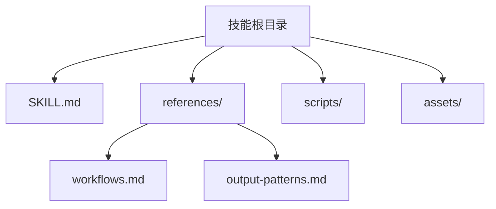
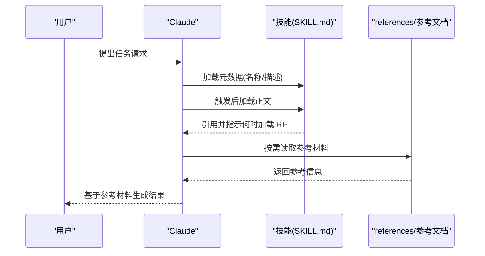
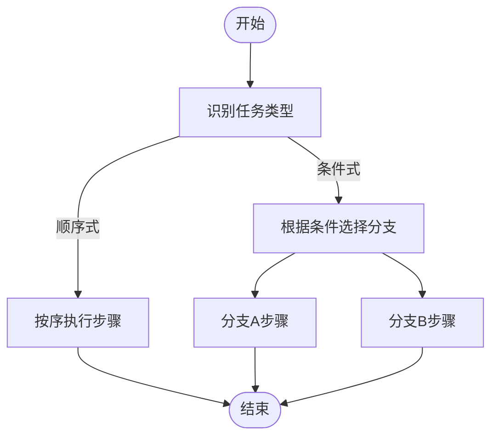
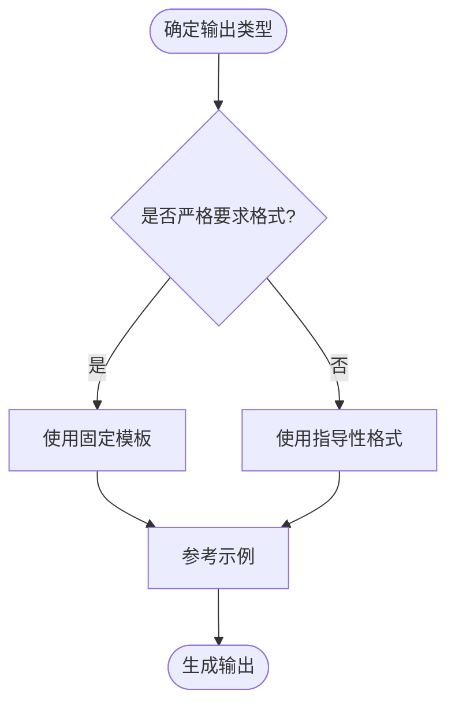
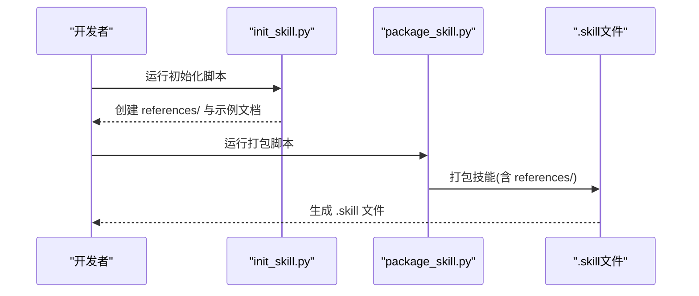
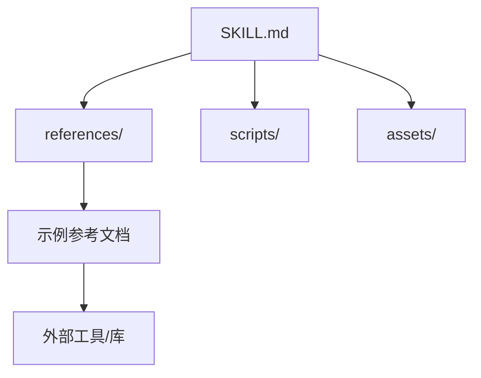

# 参考文档 (references/)

<cite>
**本文引用的文件**
- [SKILL.md](file://skills/skill-creator/SKILL.md)
- [workflows.md](file://skills/skill-creator/references/workflows.md)
- [output-patterns.md](file://skills/skill-creator/references/output-patterns.md)
- [init_skill.py](file://skills/skill-creator/scripts/init_skill.py)
- [package_skill.py](file://skills/skill-creator/scripts/package_skill.py)
- [evaluation.md](file://skills/mcp-builder/reference/evaluation.md)
- [mcp_best_practices.md](file://skills/mcp-builder/reference/mcp_best_practices.md)
- [reference.md](file://skills/pdf/reference.md)
- [forms.md](file://skills/pdf/forms.md)
- [template/SKILL.md](file://template/SKILL.md)
</cite>

## 目录
1. [简介](#简介)
2. [项目结构](#项目结构)
3. [核心组件](#核心组件)
4. [架构总览](#架构总览)
5. [详细组件分析](#详细组件分析)
6. [依赖关系分析](#依赖关系分析)
7. [性能考量](#性能考量)
8. [故障排查指南](#故障排查指南)
9. [结论](#结论)
10. [附录](#附录)

## 简介
本章节系统性阐述技能仓库中“references/”目录的设计与使用方式，重点围绕 skill-creator 技能中的参考文档，说明其职责、组织原则与最佳实践。references/ 的核心目标是按需加载参考材料，从而在不牺牲上下文效率的前提下，提供详尽的业务逻辑、API 规范、数据模式或工作流指南；同时确保 SKILL.md 保持精炼，仅在 Claude 判定需要时才加载相关内容，以节省上下文窗口。

## 项目结构
- references/ 是技能的可选资源之一，用于存放“按需加载”的参考材料，如工作流、输出模板、API 文档、Schema 等。
- skill-creator 技能通过 SKILL.md 明确了 references/ 的定位与使用建议，并在内部包含两个示例参考文件：
  - workflows.md：多步骤流程与条件分支的工作流模式
  - output-patterns.md：输出格式与质量标准的模板与示例模式
- 其他技能也广泛采用 references/ 来承载长文档与细则，例如：
  - mcp-builder：evaluation.md（评估指南）、mcp_best_practices.md（最佳实践）
  - pdf：reference.md（高级处理参考）、forms.md（表单填充流程）

图表来源
- [SKILL.md](file://skills/skill-creator/SKILL.md#L82-L101)
- [workflows.md](file://skills/skill-creator/references/workflows.md#L1-L28)
- [output-patterns.md](file://skills/skill-creator/references/output-patterns.md#L1-L83)

章节来源
- [SKILL.md](file://skills/skill-creator/SKILL.md#L82-L101)

## 核心组件
- references/workflows.md
  - 提供顺序式与条件式工作流的模式与示例，帮助 Claude 在复杂任务中进行步骤拆解与决策分支处理。
- references/output-patterns.md
  - 提供严格与灵活两类输出模板与示例模式，确保输出一致性与可验证性。
- init_skill.py
  - 初始化新技能时自动生成 references/ 目录及示例参考文档，便于后续补充领域知识。
- package_skill.py
  - 打包技能时对 references/ 内容进行打包分发，保证参考材料随技能一起交付。

章节来源
- [workflows.md](file://skills/skill-creator/references/workflows.md#L1-L28)
- [output-patterns.md](file://skills/skill-creator/references/output-patterns.md#L1-L83)
- [init_skill.py](file://skills/skill-creator/scripts/init_skill.py#L236-L262)
- [package_skill.py](file://skills/skill-creator/scripts/package_skill.py#L66-L83)

## 架构总览
references/ 的使用遵循“三段式加载”与“渐进披露”原则：
- 元数据（名称与描述）始终在上下文中
- SKILL.md 正文按触发加载，限制在较小规模
- references/ 按需加载，无限扩展但不占用 SKILL.md 上下文

图表来源
- [SKILL.md](file://skills/skill-creator/SKILL.md#L114-L121)
- [SKILL.md](file://skills/skill-creator/SKILL.md#L122-L201)

章节来源
- [SKILL.md](file://skills/skill-creator/SKILL.md#L114-L121)
- [SKILL.md](file://skills/skill-creator/SKILL.md#L122-L201)

## 详细组件分析

### 组件一：工作流参考 (workflows.md)
- 设计目的
  - 将复杂的多步骤任务拆分为清晰的顺序式与条件式流程，降低 Claude 的认知负担，提升执行稳定性。
- 使用场景
  - 需要明确步骤顺序、分支判断与错误恢复的流程化任务。
- 最佳实践
  - 在 SKILL.md 中仅给出高层概览与链接，具体步骤细节放入 workflows.md。
  - 对于条件分支，先给出决策点，再分别列出各分支的步骤清单。
- 复杂度与性能
  - 通过“按需加载”，避免在 SKILL.md 中堆叠大量流程细节，减少上下文占用。

图表来源
- [workflows.md](file://skills/skill-creator/references/workflows.md#L1-L28)

章节来源
- [workflows.md](file://skills/skill-creator/references/workflows.md#L1-L28)

### 组件二：输出模式参考 (output-patterns.md)
- 设计目的
  - 提供统一的输出模板与示例，确保输出结构一致、风格统一、易于验证。
- 使用场景
  - 报告、摘要、提交信息、API 响应等对格式与质量有较高要求的输出。
- 最佳实践
  - 对于严格要求的场景，使用固定模板；对于灵活性需求高的场景，提供指导性格式与示例。
  - 通过输入/输出示例帮助 Claude 更直观地理解期望风格与细节。
- 复杂度与性能
  - 输出模板与示例作为参考材料按需加载，不会挤占 SKILL.md 的核心上下文。

图表来源
- [output-patterns.md](file://skills/skill-creator/references/output-patterns.md#L1-L83)

章节来源
- [output-patterns.md](file://skills/skill-creator/references/output-patterns.md#L1-L83)

### 组件三：初始化与打包流程（init_skill.py / package_skill.py）
- 初始化 references/
  - init_skill.py 在创建新技能时自动创建 references/ 目录，并生成示例参考文档，便于后续补充领域知识。
- 打包分发
  - package_skill.py 在打包技能时会将 references/ 内容一并打包为 .skill 文件，确保参考材料随技能一起交付。

图表来源
- [init_skill.py](file://skills/skill-creator/scripts/init_skill.py#L236-L262)
- [package_skill.py](file://skills/skill-creator/scripts/package_skill.py#L66-L83)

章节来源
- [init_skill.py](file://skills/skill-creator/scripts/init_skill.py#L236-L262)
- [package_skill.py](file://skills/skill-creator/scripts/package_skill.py#L66-L83)

### 组件四：其他技能中的 references/ 示例
- mcp-builder
  - evaluation.md：提供 MCP 服务器评估的完整指南，包括问题设计、稳定性要求、输出格式与运行流程。
  - mcp_best_practices.md：涵盖命名约定、响应格式、分页策略、传输方式与安全最佳实践。
- pdf
  - reference.md：高级 PDF 处理参考，覆盖库使用、命令行操作、复杂工作流与性能优化。
  - forms.md：表单填充的详细流程，从可填字段到非可填字段的完整步骤链路。

这些示例展示了 references/ 如何承载长文档与细则，避免 SKILL.md 过度膨胀，同时通过清晰的导航与结构帮助 Claude 在需要时快速定位所需信息。

章节来源
- [evaluation.md](file://skills/mcp-builder/reference/evaluation.md#L1-L602)
- [mcp_best_practices.md](file://skills/mcp-builder/reference/mcp_best_practices.md#L1-L250)
- [reference.md](file://skills/pdf/reference.md#L1-L612)
- [forms.md](file://skills/pdf/forms.md#L1-L206)

## 依赖关系分析
- references/ 与 SKILL.md 的耦合
  - references/ 的存在是为了减轻 SKILL.md 的上下文压力，两者通过“引用链接”建立松耦合关系。
- references/ 与其他资源的关系
  - scripts/ 负责可执行脚本，assets/ 存放输出资源；references/ 专注于“按需加载”的参考材料。
- 外部依赖与集成
  - references/ 内容可能引用外部工具或库（如 PDF 处理库、MCP 工具），但这些依赖通过脚本或文档说明的方式间接体现，不直接写入 SKILL.md。

图表来源
- [SKILL.md](file://skills/skill-creator/SKILL.md#L47-L63)
- [SKILL.md](file://skills/skill-creator/SKILL.md#L82-L101)

章节来源
- [SKILL.md](file://skills/skill-creator/SKILL.md#L47-L63)
- [SKILL.md](file://skills/skill-creator/SKILL.md#L82-L101)

## 性能考量
- 上下文窗口管理
  - references/ 仅在 Claude 判定需要时加载，避免 SKILL.md 被冗长参考挤占。
- 分层加载策略
  - 元数据、SKILL.md 正文、references/ 三层加载，配合“渐进披露”原则，控制每层的上下文占用。
- 大型参考文件的组织
  - 对于超过百行的参考文件，建议在顶部提供目录以便预览全貌，减少 Claude 的扫描成本。

章节来源
- [SKILL.md](file://skills/skill-creator/SKILL.md#L114-L121)
- [SKILL.md](file://skills/skill-creator/SKILL.md#L197-L201)

## 故障排查指南
- 常见问题
  - 参考文件过大导致 Claude 难以消化：建议拆分为多个子文件并在 SKILL.md 中按需引用。
  - 重复信息出现在 SKILL.md 与 references/：应遵循“二选一”原则，避免重复。
  - 引用层级过深：保持 references/ 为单层引用，所有参考文件直接由 SKILL.md 引用。
- 排查步骤
  - 在 SKILL.md 中核对引用链接是否准确、路径是否正确。
  - 对大型参考文件检查是否存在目录与分节，便于 Claude 快速定位。
  - 使用 package_skill.py 打包并验证技能结构，确保 references/ 内容被正确打包。

章节来源
- [SKILL.md](file://skills/skill-creator/SKILL.md#L197-L201)
- [package_skill.py](file://skills/skill-creator/scripts/package_skill.py#L66-L83)

## 结论
references/ 是 skill-creator 技能中实现“按需加载”的关键机制，通过将复杂工作流与输出模式等参考材料置于独立文件中，既能满足 Claude 的深入推理需求，又能保持 SKILL.md 的简洁与高效。结合 init_skill.py 与 package_skill.py，references/ 的组织与分发形成闭环，确保参考材料与技能主体协同演进、稳定交付。

## 附录
- 参考文件命名与组织建议
  - 使用语义化标题与清晰的层级，避免深层嵌套。
  - 对长文档提供目录，便于 Claude 预览与选择。
- 与模板 SKILL.md 的对照
  - 可参考 template/SKILL.md 的最小结构，结合 references/ 实现“核心说明 + 详细参考”的分离。

章节来源
- [template/SKILL.md](file://template/SKILL.md#L1-L7)