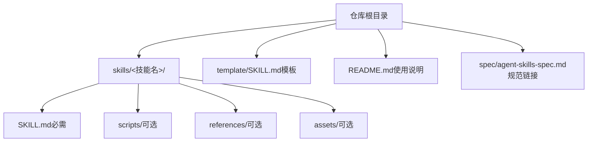
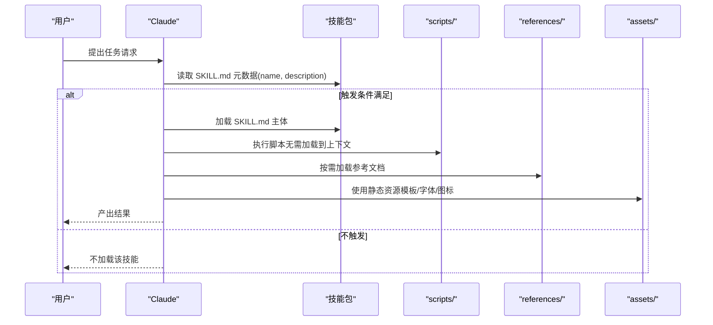
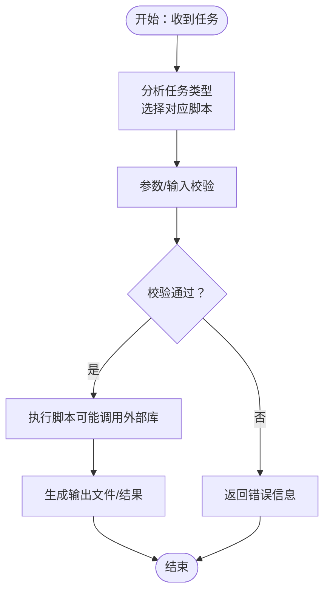
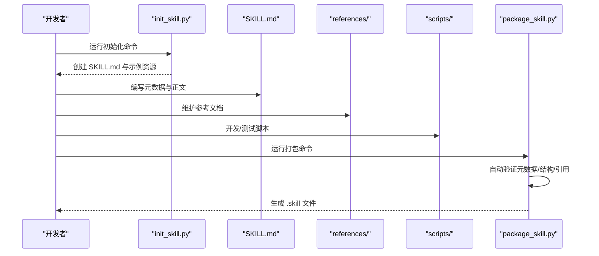
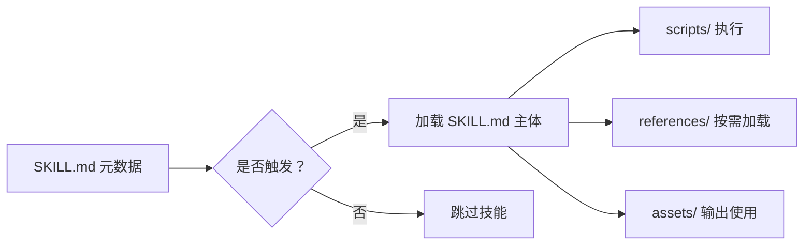

# 技能架构与组件

<cite>
**本文引用的文件**
- [template/SKILL.md](file://template/SKILL.md)
- [README.md](file://README.md)
- [spec/agent-skills-spec.md](file://spec/agent-skills-spec.md)
- [skills/skill-creator/SKILL.md](file://skills/skill-creator/SKILL.md)
- [skills/skill-creator/scripts/init_skill.py](file://skills/skill-creator/scripts/init_skill.py)
- [skills/skill-creator/scripts/package_skill.py](file://skills/skill-creator/scripts/package_skill.py)
- [skills/skill-creator/references/workflows.md](file://skills/skill-creator/references/workflows.md)
- [skills/skill-creator/references/output-patterns.md](file://skills/skill-creator/references/output-patterns.md)
- [skills/pdf/SKILL.md](file://skills/pdf/SKILL.md)
- [skills/pdf/scripts/fill_fillable_fields.py](file://skills/pdf/scripts/fill_fillable_fields.py)
- [skills/docx/SKILL.md](file://skills/docx/SKILL.md)
- [skills/docx/scripts/document.py](file://skills/docx/scripts/document.py)
- [skills/pptx/SKILL.md](file://skills/pptx/SKILL.md)
- [skills/pptx/scripts/thumbnail.py](file://skills/pptx/scripts/thumbnail.py)
</cite>

## 目录
1. [引言](#引言)
2. [项目结构](#项目结构)
3. [核心组件](#核心组件)
4. [架构总览](#架构总览)
5. [详细组件分析](#详细组件分析)
6. [依赖关系分析](#依赖关系分析)
7. [性能考量](#性能考量)
8. [故障排查指南](#故障排查指南)
9. [结论](#结论)
10. [附录](#附录)

## 引言
本文件面向“技能”（Skill）系统的设计与实现，聚焦于 SKILL.md 的解剖结构、三类资源目录（scripts/、references/、assets/）的职责边界与协作方式，并以 skill-creator 自身为实例，说明如何通过模板化初始化、打包流程与渐进式披露原则，构建高质量、可复用且易于维护的技能包。同时，结合多个具体技能（PDF、DOCX、PPTX）中的脚本与参考文档，展示“元数据触发 + 指令正文 + 可执行脚本 + 上下文参考”的完整工作流。

## 项目结构
仓库采用“技能即包”的组织方式：每个技能是一个独立目录，包含一个必需的 SKILL.md 文件与可选的 bundled 资源（scripts/、references/、assets/）。根目录提供模板、说明与规范链接，便于开发者快速上手与遵循标准。

图表来源
- [README.md](file://README.md#L1-L95)
- [template/SKILL.md](file://template/SKILL.md#L1-L7)

章节来源
- [README.md](file://README.md#L1-L95)
- [template/SKILL.md](file://template/SKILL.md#L1-L7)

## 核心组件
- SKILL.md 元数据与正文
  - YAML frontmatter 元数据：name、description 是 Claude 判定是否触发该技能的关键字段；body 仅在触发后按需加载。
  - 正文内容作为“指令集”，定义工作流、最佳实践与引用路径，确保上下文窗口高效利用。
- scripts/ 可执行代码
  - 面向确定性任务与重复性逻辑，支持 Python/Bash 等，强调可执行、可验证、可迭代。
- references/ 参考文档
  - 仅在需要时按需加载，用于提供 API 规范、领域知识、复杂流程等长文本信息，避免 SKILL.md 过载。
- assets/ 静态资源
  - 输出阶段使用的模板、字体、图标等文件，不直接加载到上下文中，降低 token 消耗。

章节来源
- [skills/skill-creator/SKILL.md](file://skills/skill-creator/SKILL.md#L47-L115)
- [skills/skill-creator/SKILL.md](file://skills/skill-creator/SKILL.md#L116-L127)

## 架构总览
技能系统遵循“渐进式披露”设计：先以元数据（~100 字）进入上下文，再根据触发条件加载 SKILL.md 主体（<5k 字），最后按需读取 bundled 资源。scripts/ 可在无需加载到上下文的前提下执行，references/ 与 assets/ 则在 Claude 需要时才被读入。

图表来源
- [skills/skill-creator/SKILL.md](file://skills/skill-creator/SKILL.md#L116-L127)
- [skills/skill-creator/SKILL.md](file://skills/skill-creator/SKILL.md#L320-L357)

## 详细组件分析

### SKILL.md 解剖与渐进式披露
- YAML frontmatter
  - name：唯一标识，用于识别技能。
  - description：触发机制的核心，应明确“做什么”和“何时使用”。正文仅在触发后加载，因此“何时使用”的信息必须放在 frontmatter 中。
- Markdown 正文
  - 指令集：工作流、决策树、示例与最佳实践。
  - 渐进式披露：正文建议控制在 500 行以内；长篇内容拆分至 references/ 并在 SKILL.md 中清晰标注引用路径。
- 避免冗余文件
  - 不包含 README.md、INSTALLATION_GUIDE.md、QUICK_REFERENCE.md、CHANGELOG.md 等辅助文档，保持技能包精简。

章节来源
- [skills/skill-creator/SKILL.md](file://skills/skill-creator/SKILL.md#L300-L315)
- [skills/skill-creator/SKILL.md](file://skills/skill-creator/SKILL.md#L116-L127)
- [skills/skill-creator/SKILL.md](file://skills/skill-creator/SKILL.md#L102-L115)

### scripts/：可执行脚本与自动化
- 设计目标
  - 对重复性、确定性任务进行封装，减少上下文占用，提高可靠性。
- 实践示例
  - PDF 填单：脚本负责表单字段校验与写入，避免每次重复实现。
  - DOCX 编辑：提供 OOXML 文档编辑器与跟踪修订工具，支持评论、删除/插入标记等。
  - PPTX 缩略图：将幻灯片转换为图像网格，便于可视化审查与布局分析。

图表来源
- [skills/pdf/scripts/fill_fillable_fields.py](file://skills/pdf/scripts/fill_fillable_fields.py#L1-L115)
- [skills/docx/scripts/document.py](file://skills/docx/scripts/document.py#L1-L200)
- [skills/pptx/scripts/thumbnail.py](file://skills/pptx/scripts/thumbnail.py#L1-L120)

章节来源
- [skills/pdf/scripts/fill_fillable_fields.py](file://skills/pdf/scripts/fill_fillable_fields.py#L1-L115)
- [skills/docx/scripts/document.py](file://skills/docx/scripts/document.py#L1-L200)
- [skills/pptx/scripts/thumbnail.py](file://skills/pptx/scripts/thumbnail.py#L1-L120)

### references/：按需加载的参考材料
- 适用场景
  - API 规范、数据库模式、公司政策、复杂流程指南等长文本。
- 最佳实践
  - 大文件建议提供 grep 搜索模式；保持只读引用，避免与 SKILL.md 重复。
  - 将多域或多变体内容按子目录组织，减少无关上下文加载。

章节来源
- [skills/skill-creator/SKILL.md](file://skills/skill-creator/SKILL.md#L82-L101)
- [skills/skill-creator/references/workflows.md](file://skills/skill-creator/references/workflows.md#L1-L28)
- [skills/skill-creator/references/output-patterns.md](file://skills/skill-creator/references/output-patterns.md#L1-L83)

### assets/：输出阶段的静态资源
- 用途
  - 模板、字体、图标、样板工程等，不直接加载到上下文，避免 token 消耗。
- 示例
  - DOCX/PPTX 技能中包含模板与字体资源，供最终输出使用。

章节来源
- [skills/skill-creator/SKILL.md](file://skills/skill-creator/SKILL.md#L93-L101)

### skill-creator 自身：模板化初始化与打包
- 初始化
  - 通过 init_skill.py 生成标准化的 SKILL.md 与示例资源目录（scripts/、references/、assets/），并提供占位符与下一步指引。
- 打包
  - package_skill.py 在打包前自动运行验证，检查元数据格式、命名规范、描述质量与资源引用完整性，成功后生成 .skill 文件（zip）以便分发。

图表来源
- [skills/skill-creator/scripts/init_skill.py](file://skills/skill-creator/scripts/init_skill.py#L1-L120)
- [skills/skill-creator/scripts/package_skill.py](file://skills/skill-creator/scripts/package_skill.py#L1-L111)

章节来源
- [skills/skill-creator/scripts/init_skill.py](file://skills/skill-creator/scripts/init_skill.py#L1-L120)
- [skills/skill-creator/scripts/package_skill.py](file://skills/skill-creator/scripts/package_skill.py#L1-L111)

### 具体技能实例：PDF、DOCX、PPTX
- PDF 技能
  - 元数据与正文：定义 PDF 处理能力与常用操作（合并、拆分、提取文本/表格、创建、加水印、加密等）。
  - 脚本：表单字段填充与校验、边界框检查、图片提取等。
- DOCX 技能
  - 元数据与正文：提供读取/分析、创建新文档、编辑现有文档与跟踪修订的工作流决策树。
  - 脚本：OOXML 文档编辑器、验证器、打包器与实用工具。
- PPTX 技能
  - 元数据与正文：涵盖读取/分析、无模板创建、基于模板创建、缩略图生成与图像转换等。
  - 脚本：HTML 转 PPTX、缩略图生成、占位符库存取与替换等。

章节来源
- [skills/pdf/SKILL.md](file://skills/pdf/SKILL.md#L1-L120)
- [skills/pdf/scripts/fill_fillable_fields.py](file://skills/pdf/scripts/fill_fillable_fields.py#L1-L115)
- [skills/docx/SKILL.md](file://skills/docx/SKILL.md#L1-L120)
- [skills/docx/scripts/document.py](file://skills/docx/scripts/document.py#L1-L200)
- [skills/pptx/SKILL.md](file://skills/pptx/SKILL.md#L1-L120)
- [skills/pptx/scripts/thumbnail.py](file://skills/pptx/scripts/thumbnail.py#L1-L120)

## 依赖关系分析
- 元数据驱动触发
  - SKILL.md 的 YAML frontmatter 决定 Claude 是否加载该技能的正文与资源。
- 资源加载策略
  - scripts/ 可直接执行，无需加载到上下文；references/ 与 assets/ 仅在需要时按需加载。
- 工具链与验证
  - skill-creator 提供初始化与打包工具，保证技能结构与元数据符合规范。

图表来源
- [skills/skill-creator/SKILL.md](file://skills/skill-creator/SKILL.md#L116-L127)
- [skills/skill-creator/scripts/package_skill.py](file://skills/skill-creator/scripts/package_skill.py#L1-L111)

章节来源
- [skills/skill-creator/SKILL.md](file://skills/skill-creator/SKILL.md#L116-L127)
- [skills/skill-creator/scripts/package_skill.py](file://skills/skill-creator/scripts/package_skill.py#L1-L111)

## 性能考量
- 控制上下文窗口占用
  - 将长篇细节移至 references/，正文保持简洁；正文建议不超过 500 行。
- 脚本优先
  - 对可确定性的任务优先使用 scripts/，减少上下文读取与 token 消耗。
- 渐进式披露
  - 先元数据，再正文，最后资源，严格遵守“按需加载”。

章节来源
- [skills/skill-creator/SKILL.md](file://skills/skill-creator/SKILL.md#L116-L127)
- [skills/skill-creator/SKILL.md](file://skills/skill-creator/SKILL.md#L122-L146)

## 故障排查指南
- 打包失败
  - 检查 SKILL.md 元数据格式与必填项；确认目录结构与命名规范；核对 references/ 与 scripts/ 的引用路径。
- 脚本运行异常
  - 确认输入参数与依赖库版本；对表单字段值进行类型与范围校验；必要时修复第三方库的兼容性问题。
- 参考文档过大
  - 将长文档拆分为子文件并在 SKILL.md 中提供清晰的导航；为大文件提供 grep 搜索模式以便快速定位。

章节来源
- [skills/skill-creator/scripts/package_skill.py](file://skills/skill-creator/scripts/package_skill.py#L1-L111)
- [skills/pdf/scripts/fill_fillable_fields.py](file://skills/pdf/scripts/fill_fillable_fields.py#L1-L115)
- [skills/skill-creator/SKILL.md](file://skills/skill-creator/SKILL.md#L82-L101)

## 结论
技能系统通过“元数据触发 + 指令正文 + 可执行脚本 + 按需参考”的组合，实现了高内聚、低耦合、可扩展的智能体增强方案。skill-creator 以模板化初始化与自动化打包，确保技能的质量与一致性；而 PDF、DOCX、PPTX 等具体技能则展示了如何在真实场景中组织资源、编写脚本与维护参考文档，从而在有限的上下文窗口内完成复杂的任务编排与输出管理。

## 附录
- 规范链接
  - 仓库提供规范链接，建议在开发过程中参考官方标准以保持一致性。
- 快速入门
  - 使用 template/SKILL.md 作为起点，结合 skill-creator 的初始化与打包流程，快速搭建并交付技能包。

章节来源
- [spec/agent-skills-spec.md](file://spec/agent-skills-spec.md#L1-L4)
- [template/SKILL.md](file://template/SKILL.md#L1-L7)
- [README.md](file://README.md#L60-L95)