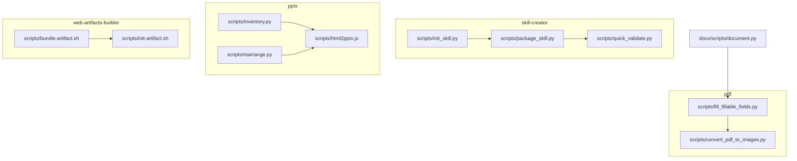
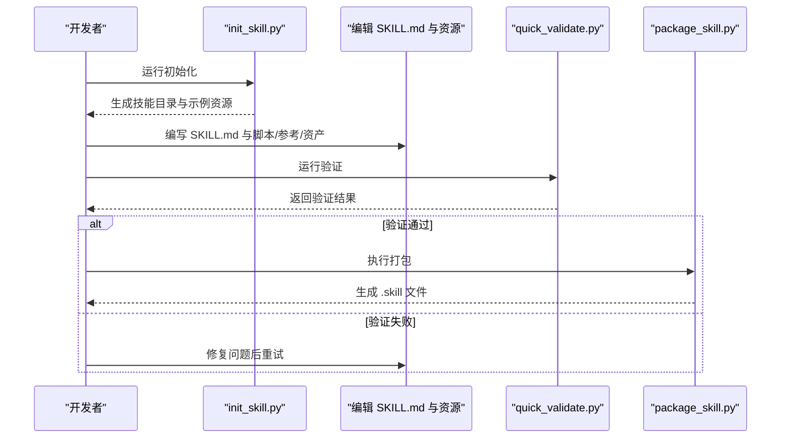
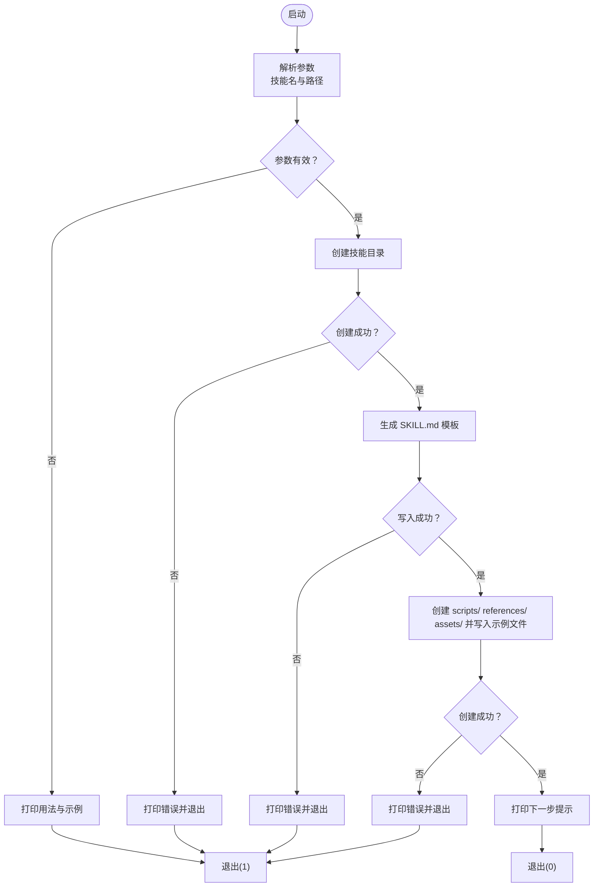
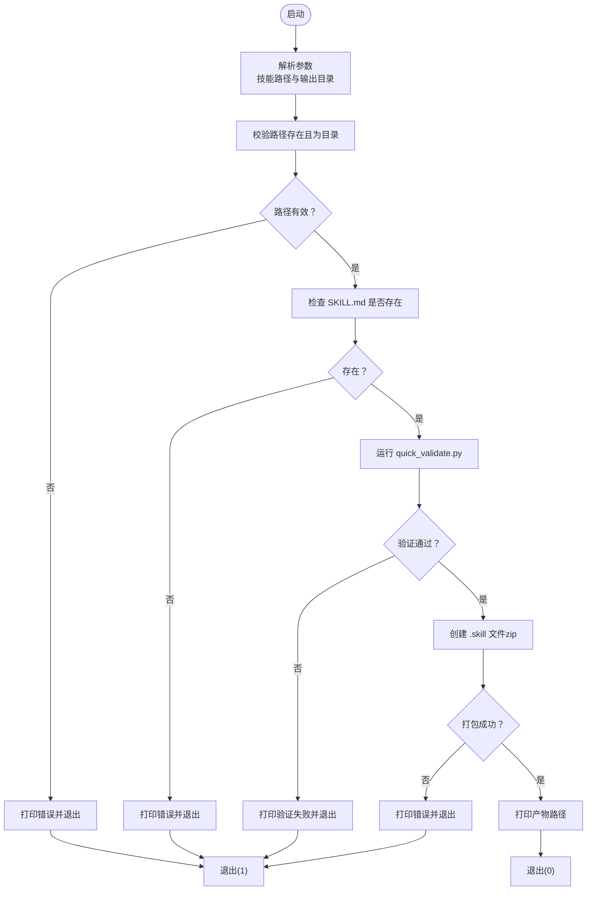
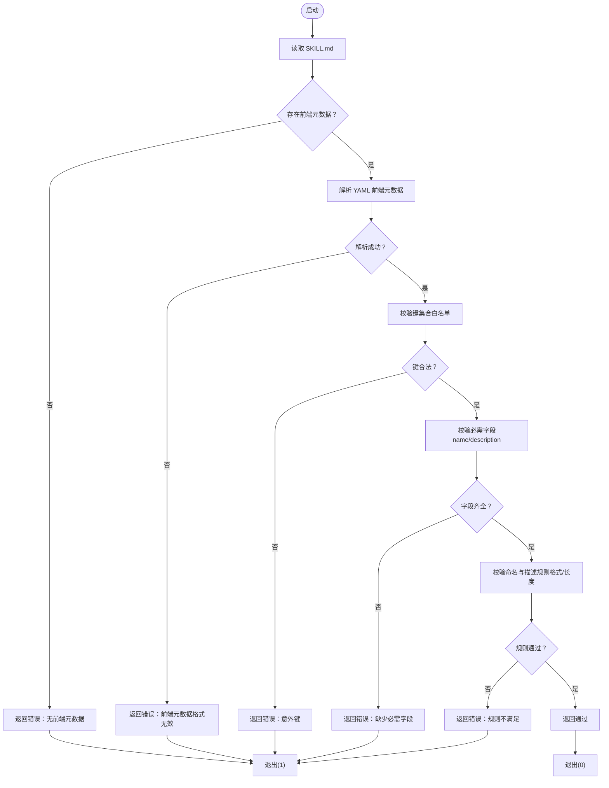
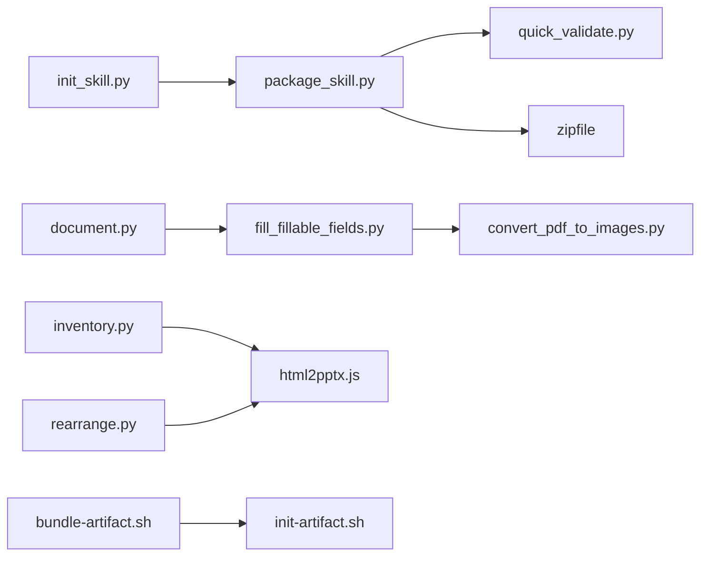

# 脚本组件 (scripts/)

<cite>
**本文引用的文件**
- [skills/skill-creator/scripts/init_skill.py](file://skills/skill-creator/scripts/init_skill.py)
- [skills/skill-creator/scripts/package_skill.py](file://skills/skill-creator/scripts/package_skill.py)
- [skills/skill-creator/scripts/quick_validate.py](file://skills/skill-creator/scripts/quick_validate.py)
- [skills/skill-creator/SKILL.md](file://skills/skill-creator/SKILL.md)
- [skills/pdf/scripts/fill_fillable_fields.py](file://skills/pdf/scripts/fill_fillable_fields.py)
- [skills/pdf/scripts/convert_pdf_to_images.py](file://skills/pdf/scripts/convert_pdf_to_images.py)
- [skills/web-artifacts-builder/scripts/bundle-artifact.sh](file://skills/web-artifacts-builder/scripts/bundle-artifact.sh)
- [skills/web-artifacts-builder/scripts/init-artifact.sh](file://skills/web-artifacts-builder/scripts/init-artifact.sh)
- [skills/docx/scripts/document.py](file://skills/docx/scripts/document.py)
- [skills/pptx/scripts/inventory.py](file://skills/pptx/scripts/inventory.py)
- [skills/pptx/scripts/html2pptx.js](file://skills/pptx/scripts/html2pptx.js)
- [skills/pptx/scripts/rearrange.py](file://skills/pptx/scripts/rearrange.py)
</cite>

## 目录
1. [引言](#引言)
2. [项目结构](#项目结构)
3. [核心组件](#核心组件)
4. [架构总览](#架构总览)
5. [详细组件分析](#详细组件分析)
6. [依赖关系分析](#依赖关系分析)
7. [性能考量](#性能考量)
8. [故障排查指南](#故障排查指南)
9. [结论](#结论)
10. [附录](#附录)

## 引言
本文件聚焦于技能仓库中“scripts/”目录的设计与实践，尤其是“skill-creator/scripts/”中的三款关键脚本：初始化脚本、打包脚本与快速验证脚本。它们共同构成技能开发流水线的“基础设施层”，目标是：
- 将“确定性强、重复性高、易出错”的任务自动化，降低人为失误与重复劳动
- 通过可执行脚本在不加载到上下文窗口的前提下完成操作，从而节省上下文开销
- 为Claude提供稳定、可复用的工具入口，使其在需要时直接执行脚本，或在必要时读取脚本以进行环境适配与补丁修改

## 项目结构
“scripts/”目录广泛存在于各技能中，用于承载可执行脚本（Python/Bash/JavaScript等），覆盖PDF、DOCX、PPTX、Web构建等多种领域。以“skill-creator”为例，其scripts目录提供标准化的技能创建流程；其他技能如“pdf”、“pptx”、“web-artifacts-builder”等也提供了大量实用脚本，用于表单填充、图像转换、幻灯片内容提取、打包与初始化等任务。

图示来源
- [skills/skill-creator/scripts/init_skill.py](file://skills/skill-creator/scripts/init_skill.py#L1-L304)
- [skills/skill-creator/scripts/package_skill.py](file://skills/skill-creator/scripts/package_skill.py#L1-L111)
- [skills/skill-creator/scripts/quick_validate.py](file://skills/skill-creator/scripts/quick_validate.py#L1-L95)
- [skills/pdf/scripts/fill_fillable_fields.py](file://skills/pdf/scripts/fill_fillable_fields.py#L1-L115)
- [skills/pdf/scripts/convert_pdf_to_images.py](file://skills/pdf/scripts/convert_pdf_to_images.py#L1-L36)
- [skills/pptx/scripts/inventory.py](file://skills/pptx/scripts/inventory.py#L1-L200)
- [skills/pptx/scripts/html2pptx.js](file://skills/pptx/scripts/html2pptx.js#L1-L200)
- [skills/pptx/scripts/rearrange.py](file://skills/pptx/scripts/rearrange.py#L1-L120)
- [skills/web-artifacts-builder/scripts/bundle-artifact.sh](file://skills/web-artifacts-builder/scripts/bundle-artifact.sh#L1-L54)
- [skills/web-artifacts-builder/scripts/init-artifact.sh](file://skills/web-artifacts-builder/scripts/init-artifact.sh#L1-L120)
- [skills/docx/scripts/document.py](file://skills/docx/scripts/document.py#L1-L120)

章节来源
- [skills/skill-creator/SKILL.md](file://skills/skill-creator/SKILL.md#L1-L120)

## 核心组件
- 初始化脚本（init_skill.py）：一键生成新的技能目录结构，包含模板化的SKILL.md与示例资源（scripts/、references/、assets/），并打印后续步骤提示，确保开发者从零开始即可获得一致的起点。
- 打包脚本（package_skill.py）：在打包前自动运行验证逻辑，确保技能符合命名、结构与描述规范；随后将技能目录打包为“.skill”文件（实质为zip），便于分发与复用。
- 快速验证脚本（quick_validate.py）：对SKILL.md进行最小但关键的格式与字段校验，涵盖YAML前端元数据、必需字段、命名约定与长度限制等，保证技能元信息质量。

这些脚本共同实现了“先初始化、再编辑、后打包”的闭环，既提升了效率，又降低了上下文占用（脚本可直接执行而无需加载到Claude上下文）。

章节来源
- [skills/skill-creator/scripts/init_skill.py](file://skills/skill-creator/scripts/init_skill.py#L1-L120)
- [skills/skill-creator/scripts/package_skill.py](file://skills/skill-creator/scripts/package_skill.py#L1-L80)
- [skills/skill-creator/scripts/quick_validate.py](file://skills/skill-creator/scripts/quick_validate.py#L1-L60)
- [skills/skill-creator/SKILL.md](file://skills/skill-creator/SKILL.md#L200-L357)

## 架构总览
下图展示了“skill-creator”脚本之间的协作关系与数据流：初始化脚本负责生成骨架；验证脚本在打包前执行，确保质量；打包脚本将合格的技能归档为“.skill”。

图示来源
- [skills/skill-creator/scripts/init_skill.py](file://skills/skill-creator/scripts/init_skill.py#L189-L304)
- [skills/skill-creator/scripts/quick_validate.py](file://skills/skill-creator/scripts/quick_validate.py#L12-L87)
- [skills/skill-creator/scripts/package_skill.py](file://skills/skill-creator/scripts/package_skill.py#L19-L83)

章节来源
- [skills/skill-creator/SKILL.md](file://skills/skill-creator/SKILL.md#L200-L357)

## 详细组件分析

### 初始化脚本（init_skill.py）
- 功能要点
  - 接收技能名称与输出路径参数，校验参数格式
  - 创建技能目录与示例资源：scripts/（含示例脚本）、references/（示例参考文档）、assets/（示例资产占位）
  - 生成模板化的SKILL.md，包含结构化引导与下一步提示
  - 对示例脚本赋予可执行权限，便于直接运行
- 参数与错误处理
  - 使用sys.argv解析命令行参数，若格式不正确则打印用法与示例并退出
  - 对目录已存在、创建失败、写入失败等情况进行异常捕获与错误提示
- 输出规范
  - 成功时打印创建成功的路径与后续步骤清单；失败时返回None并退出非零状态码

图示来源
- [skills/skill-creator/scripts/init_skill.py](file://skills/skill-creator/scripts/init_skill.py#L273-L304)

章节来源
- [skills/skill-creator/scripts/init_skill.py](file://skills/skill-creator/scripts/init_skill.py#L1-L304)

### 打包脚本（package_skill.py）
- 功能要点
  - 校验输入路径存在且为目录，检查SKILL.md是否存在
  - 在打包前调用quick_validate.py进行验证，失败则终止并提示修复
  - 使用zipfile将技能目录打包为“.skill”文件，保持相对路径结构
- 参数与错误处理
  - 解析命令行参数，支持指定输出目录；对不存在的路径、非目录、缺少SKILL.md等情况给出明确错误
- 输出规范
  - 成功时打印添加的文件列表与最终产物路径；失败时返回None并退出非零状态码

图示来源
- [skills/skill-creator/scripts/package_skill.py](file://skills/skill-creator/scripts/package_skill.py#L19-L83)

章节来源
- [skills/skill-creator/scripts/package_skill.py](file://skills/skill-creator/scripts/package_skill.py#L1-L111)

### 快速验证脚本（quick_validate.py）
- 功能要点
  - 读取SKILL.md，检查是否以YAML前端元数据开头
  - 解析YAML并校验键集合，仅允许白名单字段
  - 校验必需字段（name、description），并对name与description进行格式与长度约束
- 错误处理
  - 对缺失文件、无效前端元数据、非法键、字段类型不符、字符串长度超限等情况返回明确错误信息
- 输出规范
  - 命令行打印验证结果文本，并根据结果退出0或非零

图示来源
- [skills/skill-creator/scripts/quick_validate.py](file://skills/skill-creator/scripts/quick_validate.py#L12-L87)

章节来源
- [skills/skill-creator/scripts/quick_validate.py](file://skills/skill-creator/scripts/quick_validate.py#L1-L95)

### 其他脚本示例与最佳实践

- PDF相关脚本
  - 表单填充与校验：通过参数解析、字段信息校验与错误报告，确保表单值与类型匹配；对第三方库的兼容性问题采用“猴子补丁”方式规避，体现健壮性与可维护性。
  - 图像转换：按页导出PNG，支持最大尺寸缩放，输出进度与统计信息，便于调试与审计。
  
  章节来源
  - [skills/pdf/scripts/fill_fillable_fields.py](file://skills/pdf/scripts/fill_fillable_fields.py#L1-L115)
  - [skills/pdf/scripts/convert_pdf_to_images.py](file://skills/pdf/scripts/convert_pdf_to_images.py#L1-L36)

- Web构建脚本
  - 初始化脚手架：检测Node版本、选择合适Vite版本、安装依赖、生成配置与主题，覆盖macOS/Linux差异，确保跨平台一致性。
  - 打包产物：使用Parcel与html-inline将多文件应用内联为单一HTML，便于在对话中直接使用。
  
  章节来源
  - [skills/web-artifacts-builder/scripts/init-artifact.sh](file://skills/web-artifacts-builder/scripts/init-artifact.sh#L1-L120)
  - [skills/web-artifacts-builder/scripts/bundle-artifact.sh](file://skills/web-artifacts-builder/scripts/bundle-artifact.sh#L1-L54)

- 文档处理脚本
  - DOCX编辑器：封装XML编辑器，自动注入RSID、作者与时间戳，支持插入、删除与回复等修订操作，具备严格的DOM属性注入与一致性校验。
  
  章节来源
  - [skills/docx/scripts/document.py](file://skills/docx/scripts/document.py#L1-L120)

- 幻灯片处理脚本
  - 内容提取：递归遍历形状树，计算绝对位置，保留段落格式与缩进，检测溢出与重叠问题，输出结构化JSON。
  - HTML转PPTX：通过Playwright抓取页面布局与样式，转换为PptxGenJS元素，支持占位符定位与图表挂载。
  - 幻灯片重排：支持重复索引、删除未使用幻灯片与最终重排，保持主题与媒体关系完整。
  
  章节来源
  - [skills/pptx/scripts/inventory.py](file://skills/pptx/scripts/inventory.py#L1-L200)
  - [skills/pptx/scripts/html2pptx.js](file://skills/pptx/scripts/html2pptx.js#L1-L200)
  - [skills/pptx/scripts/rearrange.py](file://skills/pptx/scripts/rearrange.py#L1-L120)

## 依赖关系分析
- 组件耦合
  - package_skill.py依赖quick_validate.py进行前置校验，二者形成“验证-打包”的强依赖链
  - init_skill.py与package_skill.py之间通过“技能目录结构”间接耦合（均由SKILL.md与资源目录组成）
- 外部依赖
  - PDF相关脚本依赖第三方库（如pypdf、pdf2image），注意版本兼容与错误处理
  - Web构建脚本依赖Node生态（pnpm、Parcel、html-inline等），需在不同系统上做差异化处理
  - 文档与演示脚本依赖Office OpenXML与PPTX库，涉及复杂的对象模型与关系管理
- 循环依赖
  - 当前脚本间无循环导入；若未来扩展，应避免在脚本内部相互导入，改用模块化组织与显式调用

图示来源
- [skills/skill-creator/scripts/package_skill.py](file://skills/skill-creator/scripts/package_skill.py#L1-L40)
- [skills/skill-creator/scripts/quick_validate.py](file://skills/skill-creator/scripts/quick_validate.py#L1-L30)
- [skills/pdf/scripts/fill_fillable_fields.py](file://skills/pdf/scripts/fill_fillable_fields.py#L1-L40)
- [skills/pdf/scripts/convert_pdf_to_images.py](file://skills/pdf/scripts/convert_pdf_to_images.py#L1-L20)
- [skills/pptx/scripts/inventory.py](file://skills/pptx/scripts/inventory.py#L1-L60)
- [skills/pptx/scripts/html2pptx.js](file://skills/pptx/scripts/html2pptx.js#L1-L60)
- [skills/pptx/scripts/rearrange.py](file://skills/pptx/scripts/rearrange.py#L1-L60)
- [skills/web-artifacts-builder/scripts/bundle-artifact.sh](file://skills/web-artifacts-builder/scripts/bundle-artifact.sh#L1-L30)
- [skills/web-artifacts-builder/scripts/init-artifact.sh](file://skills/web-artifacts-builder/scripts/init-artifact.sh#L1-L60)
- [skills/docx/scripts/document.py](file://skills/docx/scripts/document.py#L1-L60)

## 性能考量
- 上下文开销控制
  - 脚本可在不加载到Claude上下文的情况下直接执行，显著降低token消耗；仅在需要环境适配或补丁修改时才读取脚本
- I/O与压缩
  - 打包阶段使用zip压缩，建议在大型资源较多时启用压缩级别；对临时文件与中间产物及时清理，避免磁盘膨胀
- 第三方库与外部进程
  - PDF与图像处理、Web打包等操作耗时较长，建议在后台执行或分批处理；对网络依赖（如包管理器）增加超时与重试策略
- 数据结构与算法
  - 文档/XML编辑与PPTX对象模型操作复杂度较高，应尽量批量处理节点与关系，减少重复查找与DOM遍历

## 故障排查指南
- 初始化失败
  - 症状：技能目录已存在或创建失败
  - 处理：确认路径权限与磁盘空间；检查参数格式；重新运行
- 打包失败
  - 症状：找不到SKILL.md或验证失败
  - 处理：先运行quick_validate.py定位问题；修复后重试打包
- PDF脚本报错
  - 症状：表单字段值类型不匹配或第三方库版本问题
  - 处理：核对字段定义与值范围；按脚本注释中的兼容性说明调整依赖版本
- Web构建失败
  - 症状：Node版本过低或依赖安装失败
  - 处理：升级Node至要求版本；更换包管理器镜像或离线安装依赖
- PPTX处理异常
  - 症状：内容溢出、占位符尺寸为0或重排后媒体丢失
  - 处理：检查布局与尺寸；确保占位符可见；重排顺序与索引范围正确

章节来源
- [skills/skill-creator/scripts/init_skill.py](file://skills/skill-creator/scripts/init_skill.py#L205-L262)
- [skills/skill-creator/scripts/package_skill.py](file://skills/skill-creator/scripts/package_skill.py#L30-L83)
- [skills/skill-creator/scripts/quick_validate.py](file://skills/skill-creator/scripts/quick_validate.py#L12-L87)
- [skills/pdf/scripts/fill_fillable_fields.py](file://skills/pdf/scripts/fill_fillable_fields.py#L1-L115)
- [skills/web-artifacts-builder/scripts/init-artifact.sh](file://skills/web-artifacts-builder/scripts/init-artifact.sh#L1-L60)
- [skills/pptx/scripts/rearrange.py](file://skills/pptx/scripts/rearrange.py#L150-L232)

## 结论
“scripts/”目录通过标准化的初始化、验证与打包流程，将重复性高、易出错的任务转化为可复用的自动化脚本，显著提升技能开发效率与质量。Claude可通过直接执行脚本完成确定性操作，同时在需要时读取脚本以进行环境适配与补丁修改，实现“高效、稳健、可演进”的技能工程体系。

## 附录
- 最佳实践清单
  - 参数处理：严格解析命令行参数，提供清晰的用法与示例；对非法输入立即失败并提示
  - 错误校验：在关键环节（路径、文件、格式、长度、类型）逐一校验，返回具体错误信息
  - 输出规范：统一打印结构化日志，区分成功/失败分支；在失败时返回非零退出码
  - 可移植性：对平台差异（操作系统、Node版本）进行检测与降级处理
  - 安全性：对外部依赖与临时文件进行最小权限访问与清理，避免敏感信息泄露
  - 文档化：在脚本头部提供用途、用法与示例，便于他人复用与维护