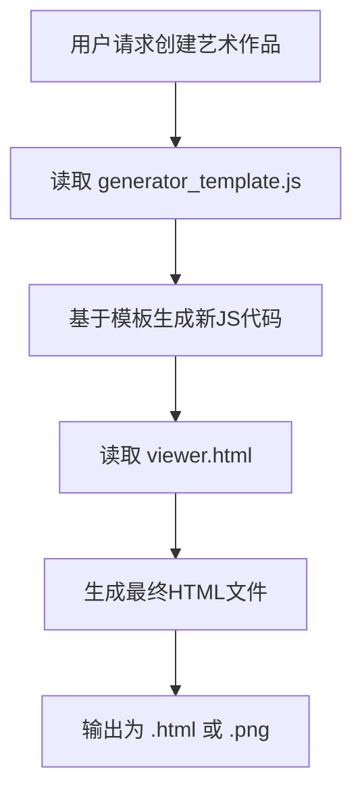

# 资源资产 (assets/)

<cite>
**本文档中引用的文件**  
- [SKILL.md](file://skills/skill-creator/SKILL.md)
- [init_skill.py](file://skills/skill-creator/scripts/init_skill.py)
- [theme-factory/SKILL.md](file://skills/theme-factory/SKILL.md)
- [canvas-design/SKILL.md](file://skills/canvas-design/SKILL.md)
- [docx/SKILL.md](file://skills/docx/SKILL.md)
- [algorithmic-art/templates/generator_template.js](file://skills/algorithmic-art/templates/generator_template.js)
- [algorithmic-art/templates/viewer.html](file://skills/algorithmic-art/templates/viewer.html)
</cite>

## 目录
1. [引言](#引言)
2. [assets/ 目录职责](#assets-目录职责)
3. [与 scripts/ 和 references/ 的区别](#与-scripts-和-references-的区别)
4. [典型用例分析](#典型用例分析)
5. [资源分离的重要性](#资源分离的重要性)
6. [结论](#结论)

## 引言
在技能开发框架中，`assets/` 目录扮演着关键角色，专门用于存放那些不被加载到上下文，但作为最终输出产物直接使用的静态资源文件。这些资源包括模板、字体、图标、示例文档等，是生成高质量、格式化输出的核心组成部分。本文档将详细阐述 `assets/` 目录的设计理念、使用规范及其在整体技能架构中的重要性。

**Section sources**
- [SKILL.md](file://skills/skill-creator/SKILL.md#L59-L101)

## assets/ 目录职责
`assets/` 目录的核心职责是存储那些**不被加载到上下文**，但会**直接作为产出物的一部分被使用或修改**的静态资源文件。这些文件是最终输出的原材料，而非执行逻辑或参考知识。

与 `scripts/`（可执行代码）和 `references/`（参考文档）不同，`assets/` 中的文件具有以下特征：
- **非上下文加载**：这些文件不会被 Claude 的上下文窗口读取或分析，以避免不必要的 token 开销。
- **直接产出使用**：它们会被直接复制、修改或嵌入到最终生成的文件中，如将模板文件作为新文档的基础，或将字体文件应用到设计作品中。
- **静态资源**：主要包括模板、字体、图标、图像、示例文档等不可执行的静态文件。

这种设计确保了上下文的高效利用，同时为生成符合特定格式和风格要求的输出提供了必要的资源支持。

**Section sources**
- [SKILL.md](file://skills/skill-creator/SKILL.md#L92-L101)

## 与 scripts/ 和 references/ 的区别
`assets/`、`scripts/` 和 `references/` 是技能包中的三个核心资源目录，它们在用途和处理方式上有着本质的区别：

| 目录 | 用途 | 是否加载到上下文 | 典型内容 | 访问方式 |
| :--- | :--- | :--- | :--- | :--- |
| **assets/** | 存放最终输出中直接使用的静态资源 | 否 | 模板、字体、图标、图像、示例文档 | 作为文件直接使用或修改 |
| **scripts/** | 存放可执行的代码逻辑 | 通常否（可直接执行） | Python/Bash 脚本、自动化工具 | 作为可执行程序运行 |
| **references/** | 存放需要被阅读和理解的参考知识 | 是（按需加载） | API 文档、品牌规范、数据库 Schema | 作为文本内容读取和分析 |

简而言之：
- `scripts/` 提供**执行逻辑**（How to do it）。
- `references/` 提供**参考知识**（What to know）。
- `assets/` 提供**产出资源**（What to use）。

这种清晰的分离确保了每种资源都能以最高效的方式被处理，避免了混淆和性能损耗。

**Section sources**
- [SKILL.md](file://skills/skill-creator/SKILL.md#L73-L101)

## 典型用例分析
### theme-factory 技能中的主题模板
在 `theme-factory` 技能中，虽然没有显式的 `assets/` 目录，但其 `themes/` 目录下的 `.md` 文件（如 `ocean-depths.md`）本质上扮演了 `assets/` 的角色。这些文件定义了颜色、字体等主题规范，当用户选择一个主题后，Claude 会读取该文件的内容，并将其应用到用户的文档或幻灯片中。这些主题文件是作为**产出物的样式模板**被直接使用的，符合 `assets/` 的核心理念。

**Section sources**
- [theme-factory/SKILL.md](file://skills/theme-factory/SKILL.md#L45-L57)

### docx 技能中的文档模板
在 `docx` 技能中，`ooxml/` 目录包含了 OOXML 标准的 XSD 模式文件。虽然这些文件主要用于验证，但它们也可以被视为一种高级的“模板”资源。更典型的例子是 `algorithmic-art` 技能中的 `templates/` 目录，其中的 `generator_template.js` 和 `viewer.html` 文件是生成算法艺术作品的**代码和视图模板**。当创建新的艺术作品时，这些模板文件会被直接使用或作为基础进行修改，是最终产出物的直接组成部分。

**Diagram sources**
- [algorithmic-art/templates/generator_template.js](file://skills/algorithmic-art/templates/generator_template.js)
- [algorithmic-art/templates/viewer.html](file://skills/algorithmic-art/templates/viewer.html)

### canvas-design 技能中的字体资源
`canvas-design` 技能中的 `canvas-fonts/` 目录是 `assets/` 概念的完美体现。该目录包含了多种开源字体的许可证文件（如 `ArsenalSC-OFL.txt`）。当生成设计作品时，根据设计哲学的要求，Claude 会从这个目录中选择合适的字体文件，并将其应用到生成的 `.pdf` 或 `.png` 图像中。这些字体文件本身不会被“阅读”其内容，而是作为**视觉资源**被直接调用和嵌入，这正是 `assets/` 目录的典型用法。

**Section sources**
- [canvas-design/SKILL.md](file://skills/canvas-design/SKILL.md#L108-L110)

## 资源分离的重要性
将 `assets/` 资源与 `scripts/` 和 `references/` 明确分离具有至关重要的意义：

1.  **避免上下文开销**：`assets/` 中的文件（如字体、图像、大型模板）通常体积较大。如果将它们加载到上下文，会迅速耗尽宝贵的 token 配额，导致性能下降。通过分离，Claude 可以直接使用这些文件，而无需将其内容读入内存。

2.  **确保高效输出**：Claude 能够直接引用和操作 `assets/` 中的文件，从而高效地生成符合要求的输出。例如，直接将一个 PowerPoint 模板文件作为基础来创建新演示文稿，比在上下文中描述整个模板结构要快得多。

3.  **维护架构清晰性**：清晰的目录结构（`scripts/`, `references/`, `assets/`）使得技能的组织更加模块化和易于理解。开发者和 AI 都能快速定位所需资源，降低了维护和使用的复杂性。

4.  **提升可重用性**：将模板和资源集中管理，便于在不同技能或任务中复用。例如，一个通用的 HTML 模板可以被多个前端相关的技能共享。

这种分离是实现“渐进式披露”设计原则的关键一环，确保了系统在处理复杂任务时的效率和可扩展性。

**Section sources**
- [SKILL.md](file://skills/skill-creator/SKILL.md#L114-L120)

## 结论
`assets/` 目录是技能架构中不可或缺的一部分，专门用于存放那些作为最终产出物直接使用的静态资源。通过与 `scripts/`（执行逻辑）和 `references/`（参考知识）的明确区分，`assets/` 确保了上下文的高效利用和输出的高质量生成。无论是 `theme-factory` 中的主题、`canvas-design` 中的字体，还是 `algorithmic-art` 中的代码模板，这些资源的分离都体现了对性能和架构的深刻考量。遵循这一模式，可以创建出更加高效、专业和可维护的技能。