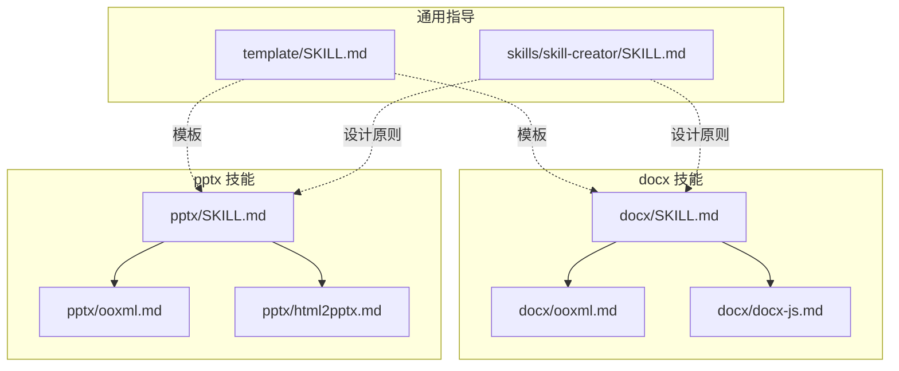
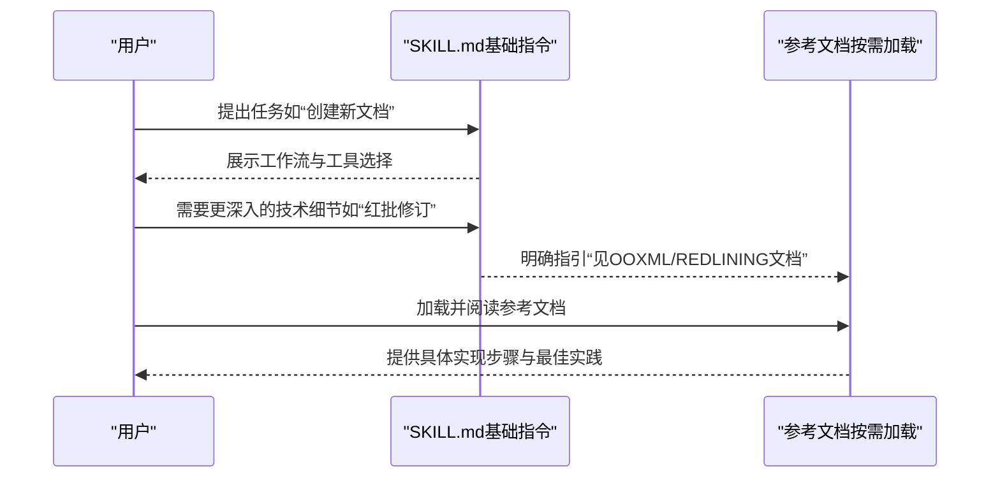
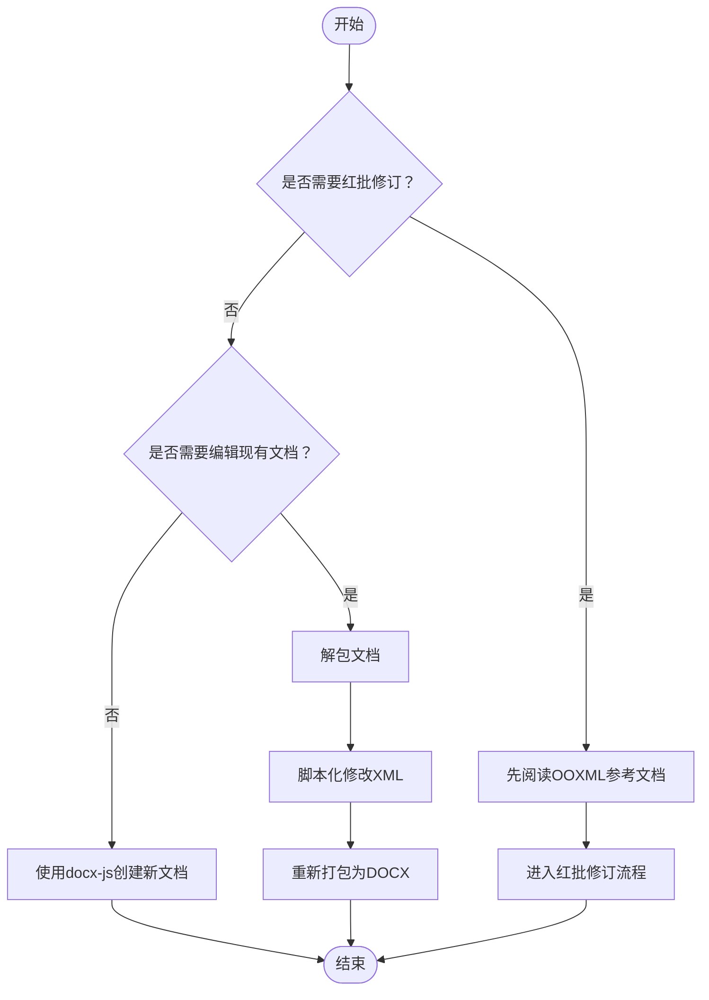
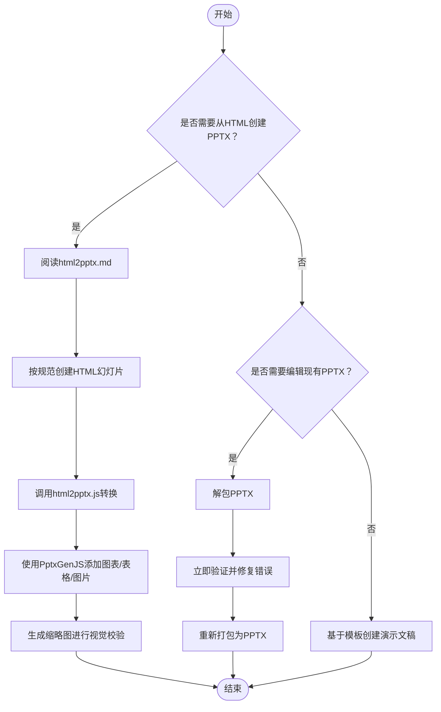
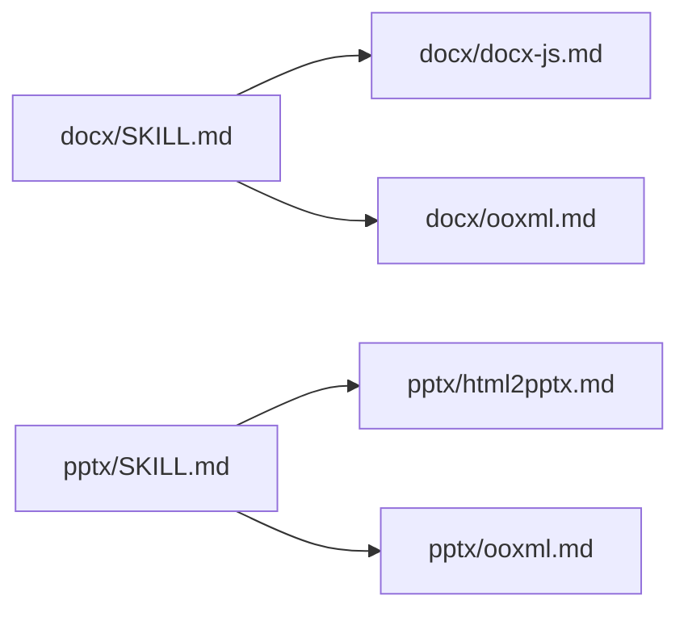

# 条件细节披露模式

<cite>
**本文引用的文件**
- [docx/SKILL.md](file://skills/docx/SKILL.md)
- [pptx/SKILL.md](file://skills/pptx/SKILL.md)
- [docx/ooxml.md](file://skills/docx/ooxml.md)
- [pptx/ooxml.md](file://skills/pptx/ooxml.md)
- [docx/docx-js.md](file://skills/docx/docx-js.md)
- [pptx/html2pptx.md](file://skills/pptx/html2pptx.md)
- [skill-creator/SKILL.md](file://skills/skill-creator/SKILL.md)
- [template/SKILL.md](file://template/SKILL.md)
</cite>

## 目录
1. [引言](#引言)
2. [项目结构](#项目结构)
3. [核心组件](#核心组件)
4. [架构总览](#架构总览)
5. [详细组件分析](#详细组件分析)
6. [依赖关系分析](#依赖关系分析)
7. [性能考量](#性能考量)
8. [故障排查指南](#故障排查指南)
9. [结论](#结论)
10. [附录](#附录)

## 引言
本文件系统化阐述“条件细节披露”模式的设计与实现：在基础指令中保持简洁，同时为高级功能（如DOCX的红批修订、OOXML底层操作、PPTX的HTML转换）提供显式链接，实现按需加载。通过对docx与pptx技能的SKILL.md进行深入分析，展示如何通过“仅在需要时才加载复杂技术文档”的方式，在不牺牲可读性的前提下，最大化降低上下文开销，提升可用性与技术深度之间的平衡。

## 项目结构
docx与pptx技能均采用“主入口SKILL.md + 可选参考文档”的组织方式：
- 主入口SKILL.md：提供任务目标、工作流决策树、常用工具与依赖、以及按需加载的参考文档链接。
- 参考文档：OOXML技术参考、库使用教程、HTML到PPTX转换指南等，仅在用户明确需要时才被加载。

图表来源
- [docx/SKILL.md](file://skills/docx/SKILL.md#L1-L197)
- [pptx/SKILL.md](file://skills/pptx/SKILL.md#L1-L484)
- [docx/ooxml.md](file://skills/docx/ooxml.md#L1-L610)
- [pptx/ooxml.md](file://skills/pptx/ooxml.md#L1-L500)
- [docx/docx-js.md](file://skills/docx/docx-js.md#L1-L350)
- [pptx/html2pptx.md](file://skills/pptx/html2pptx.md#L1-L625)
- [template/SKILL.md](file://template/SKILL.md#L1-L7)
- [skill-creator/SKILL.md](file://skills/skill-creator/SKILL.md#L114-L226)

章节来源
- [docx/SKILL.md](file://skills/docx/SKILL.md#L1-L197)
- [pptx/SKILL.md](file://skills/pptx/SKILL.md#L1-L484)
- [skill-creator/SKILL.md](file://skills/skill-creator/SKILL.md#L114-L226)
- [template/SKILL.md](file://template/SKILL.md#L1-L7)

## 核心组件
- 基础指令（SKILL.md）：面向初学者与日常任务，提供清晰的工作流与工具选择建议，避免一次性堆砌大量技术细节。
- 条件参考文档：当用户提出特定需求（如需要红批修订、直接编辑OOXML、或从HTML生成PPTX），才引导加载对应参考文档，确保上下文最小化。
- 三段式加载策略：元数据（名称+描述）始终在上下文中；SKILL.md主体在触发时加载；资源文件按需执行或按需阅读。

章节来源
- [skill-creator/SKILL.md](file://skills/skill-creator/SKILL.md#L114-L226)
- [docx/SKILL.md](file://skills/docx/SKILL.md#L1-L197)
- [pptx/SKILL.md](file://skills/pptx/SKILL.md#L1-L484)

## 架构总览
条件细节披露模式的核心在于“先粗后细、按需加载”。SKILL.md作为“导航器”，在不增加上下文负担的前提下，将用户引导至合适的参考文档；参考文档则提供深度技术细节，仅在需要时被加载。

图表来源
- [docx/SKILL.md](file://skills/docx/SKILL.md#L1-L197)
- [pptx/SKILL.md](file://skills/pptx/SKILL.md#L1-L484)
- [docx/ooxml.md](file://skills/docx/ooxml.md#L1-L610)
- [pptx/ooxml.md](file://skills/pptx/ooxml.md#L1-L500)
- [docx/docx-js.md](file://skills/docx/docx-js.md#L1-L350)
- [pptx/html2pptx.md](file://skills/pptx/html2pptx.md#L1-L625)

## 详细组件分析

### DOCX 技能中的条件细节披露
- 基础工作流：SKILL.md提供“读取/分析内容”“创建新文档”“编辑现有文档”“红批修订流程”等分层工作流，帮助用户快速定位所需路径。
- 条件参考：
  - 红批修订：当用户需要跟踪修订时，SKILL.md明确指引“For tracked changes: See [REDLINING.md]”，并在后续流程中要求先阅读OOXML参考文档以掌握底层结构与规则。
  - OOXML细节：编辑现有文档时，SKILL.md要求先完整阅读OOXML参考文档，再进行解包、脚本化修改与打包。
- 按需加载：docx-js用于全新文档创建，OOXML参考文档用于已有文档的底层编辑，两者仅在相应场景被加载。

图表来源
- [docx/SKILL.md](file://skills/docx/SKILL.md#L1-L197)
- [docx/ooxml.md](file://skills/docx/ooxml.md#L1-L610)
- [docx/docx-js.md](file://skills/docx/docx-js.md#L1-L350)

章节来源
- [docx/SKILL.md](file://skills/docx/SKILL.md#L1-L197)
- [docx/ooxml.md](file://skills/docx/ooxml.md#L1-L610)
- [docx/docx-js.md](file://skills/docx/docx-js.md#L1-L350)

### PPTX 技能中的条件细节披露
- 基础工作流：SKILL.md覆盖“读取/分析内容”“从HTML创建PPTX”“编辑现有PPTX”“基于模板创建演示文稿”等多条路径。
- 条件参考：
  - HTML到PPTX：当用户需要从HTML生成PPTX时，SKILL.md明确指引“Read [html2pptx.md]”，并在流程中要求先阅读该文档以掌握HTML规范、占位符与PptxGenJS用法。
  - OOXML细节：编辑现有PPTX时，SKILL.md要求先完整阅读OOXML参考文档，再进行解包、验证与打包。
- 按需加载：html2pptx文档仅在需要从HTML生成PPTX时被加载；OOXML参考文档仅在需要直接编辑XML时被加载。

图表来源
- [pptx/SKILL.md](file://skills/pptx/SKILL.md#L1-L484)
- [pptx/html2pptx.md](file://skills/pptx/html2pptx.md#L1-L625)
- [pptx/ooxml.md](file://skills/pptx/ooxml.md#L1-L500)

章节来源
- [pptx/SKILL.md](file://skills/pptx/SKILL.md#L1-L484)
- [pptx/html2pptx.md](file://skills/pptx/html2pptx.md#L1-L625)
- [pptx/ooxml.md](file://skills/pptx/ooxml.md#L1-L500)

### 设计原则与最佳实践
- 三段式加载：元数据（名称+描述）始终在上下文中；SKILL.md主体在触发时加载；资源文件按需执行或按需阅读。
- 分层导航：SKILL.md提供高层工作流与工具选择，复杂细节下沉到参考文档，避免一次性堆砌。
- 明确的“何时加载”指引：通过“见OOXML/REDLINING/html2pptx文档”等语句，让用户在需要时才加载对应参考文档。
- 结构化参考文档：参考文档包含目录与要点，便于快速定位；SKILL.md仅做导航，不重复细节。

章节来源
- [skill-creator/SKILL.md](file://skills/skill-creator/SKILL.md#L114-L226)
- [template/SKILL.md](file://template/SKILL.md#L1-L7)

## 依赖关系分析
- docx技能
  - SKILL.md依赖docx-js与OOXML参考文档；红批修订流程进一步依赖OOXML参考文档中的规则与模式。
- pptx技能
  - SKILL.md依赖html2pptx与OOXML参考文档；基于模板创建演示文稿流程依赖inventory与replace脚本，但这些脚本的使用说明在SKILL.md中已明确指引。
- 共同点
  - 两技能均通过“先导航到参考文档，再执行具体操作”的方式，实现按需加载与上下文最小化。

图表来源
- [docx/SKILL.md](file://skills/docx/SKILL.md#L1-L197)
- [pptx/SKILL.md](file://skills/pptx/SKILL.md#L1-L484)
- [docx/docx-js.md](file://skills/docx/docx-js.md#L1-L350)
- [pptx/html2pptx.md](file://skills/pptx/html2pptx.md#L1-L625)
- [docx/ooxml.md](file://skills/docx/ooxml.md#L1-L610)
- [pptx/ooxml.md](file://skills/pptx/ooxml.md#L1-L500)

章节来源
- [docx/SKILL.md](file://skills/docx/SKILL.md#L1-L197)
- [pptx/SKILL.md](file://skills/pptx/SKILL.md#L1-L484)

## 性能考量
- 上下文窗口优化：通过将复杂细节移出SKILL.md主体，显著降低一次性加载的上下文体积，提高响应速度与稳定性。
- 执行效率：参考文档仅在需要时被加载，避免不必要的IO与解析成本。
- 可维护性：清晰的导航与模块化结构，便于后续扩展与迭代。

## 故障排查指南
- 红批修订未生效或验证失败
  - 症状：验证阶段报错或最终文档不符合预期。
  - 排查要点：确认已完整阅读OOXML参考文档中的“验证规则”与“红批修订模式”，检查插入/删除标签的层级与属性是否正确。
  - 参考路径：[docx/ooxml.md](file://skills/docx/ooxml.md#L554-L610)
- HTML到PPTX布局溢出或样式异常
  - 症状：生成的PPTX出现文本裁剪、重叠或背景/边框未生效。
  - 排查要点：确认HTML尺寸与PPTX布局一致；所有文本必须位于p/h/ul/ol标签内；不得使用手动符号作为列表项；预渲染渐变与图标为PNG后再引用。
  - 参考路径：[pptx/html2pptx.md](file://skills/pptx/html2pptx.md#L1-L300)
- 编辑现有PPTX后无法打开或报错
  - 症状：PPTX无法打开或提示XML无效。
  - 排查要点：每次修改后立即运行验证脚本；确保只在允许的位置插入/修改元素；遵循OOXML结构与命名空间约束。
  - 参考路径：[pptx/SKILL.md](file://skills/pptx/SKILL.md#L171-L181)

章节来源
- [docx/ooxml.md](file://skills/docx/ooxml.md#L554-L610)
- [pptx/html2pptx.md](file://skills/pptx/html2pptx.md#L1-L300)
- [pptx/SKILL.md](file://skills/pptx/SKILL.md#L171-L181)

## 结论
“条件细节披露”模式通过“先导航、后深挖”的方式，在保持基础指令简洁的同时，为高级功能提供明确的进阶路径。docx与pptx技能通过在SKILL.md中设置“何时加载”的明确指引，结合各自参考文档的结构化内容，实现了上下文最小化与技术深度的平衡。该模式适用于多领域、多框架、多变体的技能设计，有助于提升整体可用性与可维护性。

## 附录
- 写作技巧
  - 在SKILL.md中仅保留核心工作流与选择建议，将具体实现细节下沉到参考文档。
  - 使用“见XX文档”等明确指引，避免模糊表述。
  - 对长篇参考文档提供目录与摘要，便于快速定位。
- 常见反模式警示
  - 在SKILL.md中堆砌大量技术细节，导致上下文膨胀与可读性下降。
  - 过度嵌套引用，使用户难以判断何时需要加载哪些文档。
  - 忽视“何时加载”的时机，导致不必要的上下文占用或用户困惑。

章节来源
- [skill-creator/SKILL.md](file://skills/skill-creator/SKILL.md#L114-L226)
- [template/SKILL.md](file://template/SKILL.md#L1-L7)