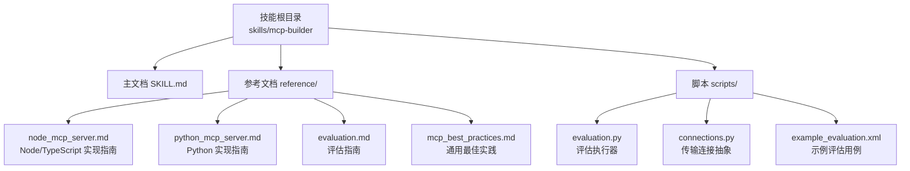
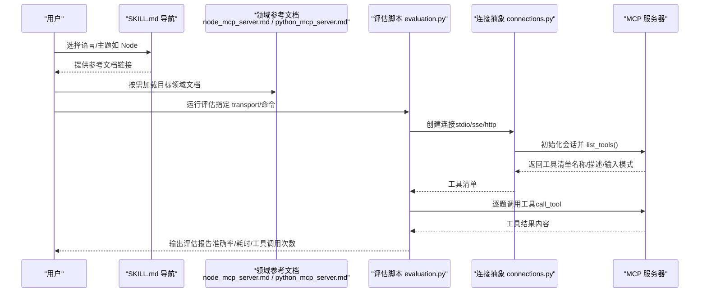
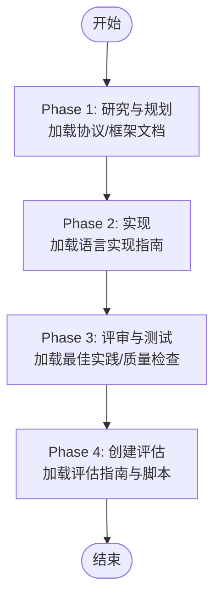
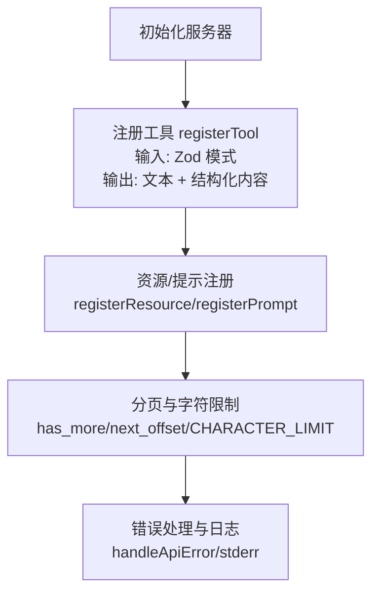
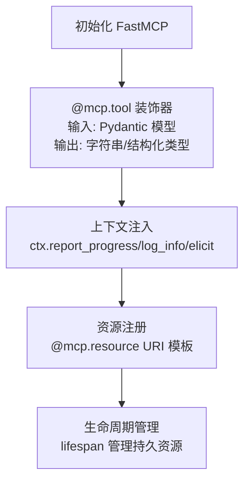
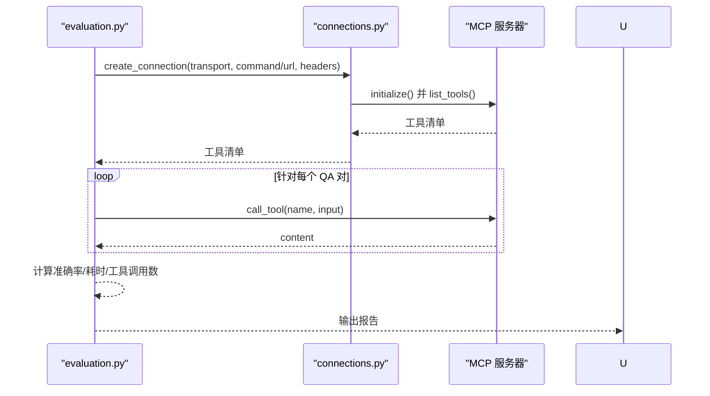
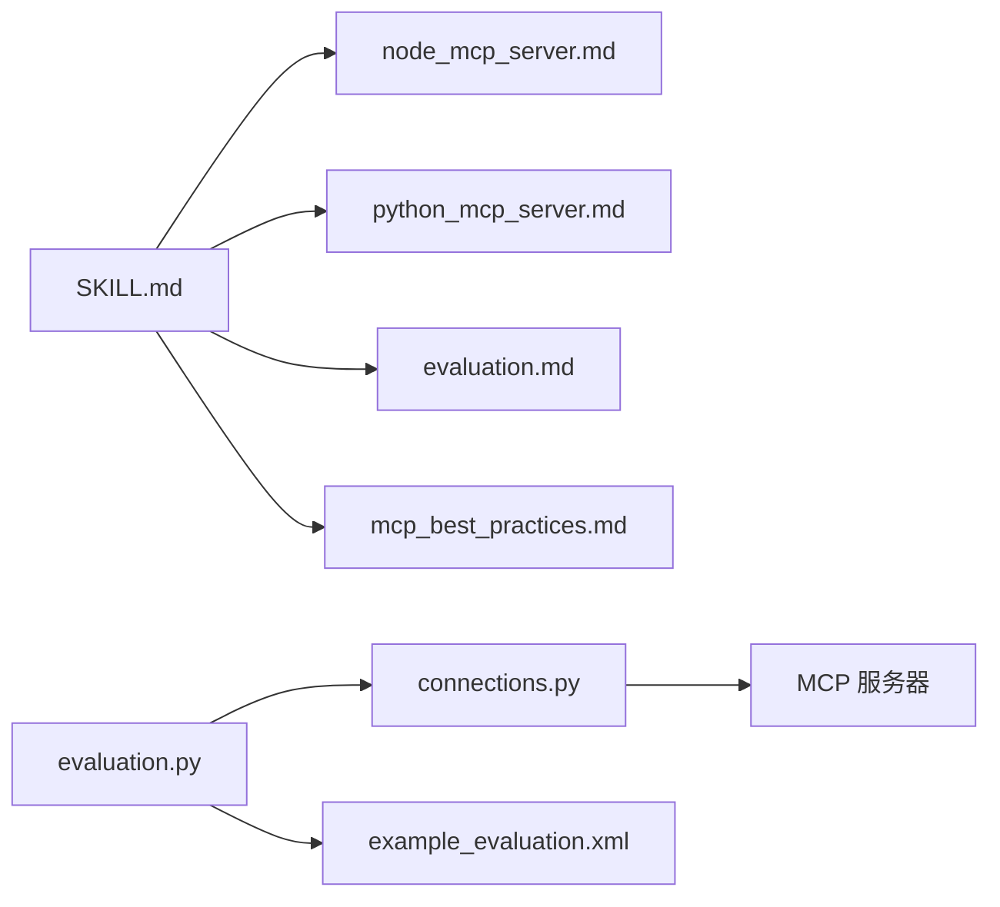

# 领域特定组织模式

<cite>
**本文引用的文件**
- [skills/mcp-builder/SKILL.md](file://skills/mcp-builder/SKILL.md)
- [skills/mcp-builder/reference/node_mcp_server.md](file://skills/mcp-builder/reference/node_mcp_server.md)
- [skills/mcp-builder/reference/python_mcp_server.md](file://skills/mcp-builder/reference/python_mcp_server.md)
- [skills/mcp-builder/reference/evaluation.md](file://skills/mcp-builder/reference/evaluation.md)
- [skills/mcp-builder/reference/mcp_best_practices.md](file://skills/mcp-builder/reference/mcp_best_practices.md)
- [skills/mcp-builder/scripts/evaluation.py](file://skills/mcp-builder/scripts/evaluation.py)
- [skills/mcp-builder/scripts/connections.py](file://skills/mcp-builder/scripts/connections.py)
- [skills/mcp-builder/scripts/example_evaluation.xml](file://skills/mcp-builder/scripts/example_evaluation.xml)
- [skills/pdf/SKILL.md](file://skills/pdf/SKILL.md)
- [skills/docx/SKILL.md](file://skills/docx/SKILL.md)
- [template/SKILL.md](file://template/SKILL.md)
</cite>

## 目录
1. [引言](#引言)
2. [项目结构](#项目结构)
3. [核心组件](#核心组件)
4. [架构总览](#架构总览)
5. [详细组件分析](#详细组件分析)
6. [依赖关系分析](#依赖关系分析)
7. [性能考量](#性能考量)
8. [故障排查指南](#故障排查指南)
9. [结论](#结论)
10. [附录](#附录)

## 引言
本文件系统化阐述“领域特定组织”设计模式在技能仓库中的应用，重点围绕 mcp-builder 技能如何通过在 references/ 目录下按领域划分文件（如 node_mcp_server.md、python_mcp_server.md），使 Claude 能够仅加载与当前任务相关的上下文。我们将结合 SKILL.md 的导航指引、语言实现文档的职责边界、以及评估脚本对工具集的动态发现机制，给出可复用的最佳实践建议：如何命名领域文件、构建清晰的目录结构、以及为长篇参考文档添加目录以提升可读性。

## 项目结构
mcp-builder 技能采用“主技能文档 + 多语言/多主题参考文档”的组织方式：
- 主文档 SKILL.md 提供流程、导航和参考入口
- 参考文档位于 reference/ 下，按语言/主题拆分，便于按需加载
- scripts/ 包含评估与连接逻辑，支撑端到端验证

图表来源
- [skills/mcp-builder/SKILL.md](file://skills/mcp-builder/SKILL.md#L1-L237)
- [skills/mcp-builder/reference/node_mcp_server.md](file://skills/mcp-builder/reference/node_mcp_server.md#L1-L120)
- [skills/mcp-builder/reference/python_mcp_server.md](file://skills/mcp-builder/reference/python_mcp_server.md#L1-L120)
- [skills/mcp-builder/reference/evaluation.md](file://skills/mcp-builder/reference/evaluation.md#L1-L60)
- [skills/mcp-builder/reference/mcp_best_practices.md](file://skills/mcp-builder/reference/mcp_best_practices.md#L1-L40)
- [skills/mcp-builder/scripts/evaluation.py](file://skills/mcp-builder/scripts/evaluation.py#L1-L60)
- [skills/mcp-builder/scripts/connections.py](file://skills/mcp-builder/scripts/connections.py#L1-L40)
- [skills/mcp-builder/scripts/example_evaluation.xml](file://skills/mcp-builder/scripts/example_evaluation.xml#L1-L23)

章节来源
- [skills/mcp-builder/SKILL.md](file://skills/mcp-builder/SKILL.md#L1-L237)

## 核心组件
- 主文档 SKILL.md：定义 MCP 服务器开发的四阶段流程，提供参考文档的导航链接与加载建议；明确在不同阶段加载相应参考材料。
- 语言实现参考：Node/TypeScript 与 Python 的实现指南分别聚焦各自生态的最佳实践、项目结构、工具注册、输入校验、响应格式与错误处理等。
- 评估参考：提供创建高质量评估问题的规范、输出格式与运行脚本使用方法。
- 通用最佳实践：统一命名约定、响应格式、分页策略、传输选择与安全实践。
- 评估执行脚本：自动发现 MCP 工具、调用工具、统计指标并生成报告。

章节来源
- [skills/mcp-builder/SKILL.md](file://skills/mcp-builder/SKILL.md#L1-L237)
- [skills/mcp-builder/reference/node_mcp_server.md](file://skills/mcp-builder/reference/node_mcp_server.md#L1-L120)
- [skills/mcp-builder/reference/python_mcp_server.md](file://skills/mcp-builder/reference/python_mcp_server.md#L1-L120)
- [skills/mcp-builder/reference/evaluation.md](file://skills/mcp-builder/reference/evaluation.md#L1-L60)
- [skills/mcp-builder/reference/mcp_best_practices.md](file://skills/mcp-builder/reference/mcp_best_practices.md#L1-L120)
- [skills/mcp-builder/scripts/evaluation.py](file://skills/mcp-builder/scripts/evaluation.py#L1-L120)
- [skills/mcp-builder/scripts/connections.py](file://skills/mcp-builder/scripts/connections.py#L1-L120)

## 架构总览
从“用户选择领域 → 加载对应参考 → 动态发现工具 → 执行评估”的视角，展示领域特定组织如何降低上下文负担并提升可用性。

图表来源
- [skills/mcp-builder/SKILL.md](file://skills/mcp-builder/SKILL.md#L180-L237)
- [skills/mcp-builder/reference/node_mcp_server.md](file://skills/mcp-builder/reference/node_mcp_server.md#L1-L120)
- [skills/mcp-builder/reference/python_mcp_server.md](file://skills/mcp-builder/reference/python_mcp_server.md#L1-L120)
- [skills/mcp-builder/scripts/evaluation.py](file://skills/mcp-builder/scripts/evaluation.py#L1-L120)
- [skills/mcp-builder/scripts/connections.py](file://skills/mcp-builder/scripts/connections.py#L1-L120)

## 详细组件分析

### 组件A：SKILL.md 的导航与加载策略
- 流程阶段化：将 MCP 开发分为“研究规划、实现、评审测试、创建评估”四个阶段，每个阶段推荐加载的参考文档不同。
- 参考入口集中：在 SKILL.md 中以“加载指南”形式列出参考文档的链接与用途，避免一次性加载全部内容。
- 语言实现指引：明确在实现阶段加载 Node/TypeScript 或 Python 的实现指南，减少无关信息干扰。

图表来源
- [skills/mcp-builder/SKILL.md](file://skills/mcp-builder/SKILL.md#L15-L179)

章节来源
- [skills/mcp-builder/SKILL.md](file://skills/mcp-builder/SKILL.md#L15-L179)

### 组件B：Node/TypeScript 实现指南（领域参考）
- 语言特性：强调使用现代 SDK API、Zod 输入校验、类型安全、资源/提示注册等。
- 结构与命名：提供标准项目结构、工具命名规范、响应格式与分页策略。
- 错误处理与字符限制：建议统一错误消息格式与响应大小控制，避免超大输出。

图表来源
- [skills/mcp-builder/reference/node_mcp_server.md](file://skills/mcp-builder/reference/node_mcp_server.md#L50-L120)
- [skills/mcp-builder/reference/node_mcp_server.md](file://skills/mcp-builder/reference/node_mcp_server.md#L120-L275)
- [skills/mcp-builder/reference/node_mcp_server.md](file://skills/mcp-builder/reference/node_mcp_server.md#L380-L435)
- [skills/mcp-builder/reference/node_mcp_server.md](file://skills/mcp-builder/reference/node_mcp_server.md#L580-L756)

章节来源
- [skills/mcp-builder/reference/node_mcp_server.md](file://skills/mcp-builder/reference/node_mcp_server.md#L1-L120)
- [skills/mcp-builder/reference/node_mcp_server.md](file://skills/mcp-builder/reference/node_mcp_server.md#L120-L275)
- [skills/mcp-builder/reference/node_mcp_server.md](file://skills/mcp-builder/reference/node_mcp_server.md#L380-L435)
- [skills/mcp-builder/reference/node_mcp_server.md](file://skills/mcp-builder/reference/node_mcp_server.md#L580-L756)

### 组件C：Python 实现指南（领域参考）
- 生态特性：基于 FastMCP 的装饰器工具注册、Pydantic 输入校验、上下文注入与资源注册。
- 结构与命名：统一命名约定、响应格式、分页与错误处理。
- 高级能力：上下文进度上报、用户交互、资源访问、生命周期管理与结构化返回类型。

图表来源
- [skills/mcp-builder/reference/python_mcp_server.md](file://skills/mcp-builder/reference/python_mcp_server.md#L1-L120)
- [skills/mcp-builder/reference/python_mcp_server.md](file://skills/mcp-builder/reference/python_mcp_server.md#L120-L220)
- [skills/mcp-builder/reference/python_mcp_server.md](file://skills/mcp-builder/reference/python_mcp_server.md#L470-L550)
- [skills/mcp-builder/reference/python_mcp_server.md](file://skills/mcp-builder/reference/python_mcp_server.md#L550-L630)

章节来源
- [skills/mcp-builder/reference/python_mcp_server.md](file://skills/mcp-builder/reference/python_mcp_server.md#L1-L120)
- [skills/mcp-builder/reference/python_mcp_server.md](file://skills/mcp-builder/reference/python_mcp_server.md#L120-L220)
- [skills/mcp-builder/reference/python_mcp_server.md](file://skills/mcp-builder/reference/python_mcp_server.md#L470-L550)
- [skills/mcp-builder/reference/python_mcp_server.md](file://skills/mcp-builder/reference/python_mcp_server.md#L550-L630)

### 组件D：评估指南与评估脚本（工具发现与执行）
- 评估指南：定义评估问题的复杂度、稳定性与可验证性要求，提供 XML 输出格式与示例。
- 评估脚本：通过连接抽象统一支持 stdio/sse/http 三种传输；自动 list_tools 并循环调用工具，统计指标并生成报告。
- 示例评估：提供最小可用的 XML 示例，便于快速上手。

图表来源
- [skills/mcp-builder/scripts/evaluation.py](file://skills/mcp-builder/scripts/evaluation.py#L1-L120)
- [skills/mcp-builder/scripts/evaluation.py](file://skills/mcp-builder/scripts/evaluation.py#L200-L273)
- [skills/mcp-builder/scripts/connections.py](file://skills/mcp-builder/scripts/connections.py#L1-L120)
- [skills/mcp-builder/scripts/example_evaluation.xml](file://skills/mcp-builder/scripts/example_evaluation.xml#L1-L23)

章节来源
- [skills/mcp-builder/reference/evaluation.md](file://skills/mcp-builder/reference/evaluation.md#L1-L120)
- [skills/mcp-builder/scripts/evaluation.py](file://skills/mcp-builder/scripts/evaluation.py#L1-L120)
- [skills/mcp-builder/scripts/connections.py](file://skills/mcp-builder/scripts/connections.py#L1-L120)
- [skills/mcp-builder/scripts/example_evaluation.xml](file://skills/mcp-builder/scripts/example_evaluation.xml#L1-L23)

### 组件E：通用最佳实践（命名、格式、分页与传输）
- 命名约定：服务名 + 工具名 + 资源名的统一前缀与格式，避免冲突。
- 响应格式：同时支持 JSON 与 Markdown，兼顾机器可读与人类可读。
- 分页策略：严格遵守 limit/offset，返回 has_more/next_offset/total_count。
- 传输选择：根据部署场景选择 stdio 或 streamable HTTP；避免 SSE（已弃用）。
- 安全与错误处理：认证与授权、输入校验、错误消息与 DNS 重绑定防护。

章节来源
- [skills/mcp-builder/reference/mcp_best_practices.md](file://skills/mcp-builder/reference/mcp_best_practices.md#L1-L120)
- [skills/mcp-builder/reference/mcp_best_practices.md](file://skills/mcp-builder/reference/mcp_best_practices.md#L120-L200)
- [skills/mcp-builder/reference/mcp_best_practices.md](file://skills/mcp-builder/reference/mcp_best_practices.md#L200-L250)

## 依赖关系分析
- 主文档 SKILL.md 作为“导航中枢”，在不同阶段引导用户加载对应的参考文档。
- 语言实现参考文档彼此独立，互不耦合，便于按需加载。
- 评估脚本依赖连接抽象，后者根据传输类型选择不同的客户端实现。
- 评估脚本通过 MCP 协议动态发现工具，避免硬编码工具清单。

图表来源
- [skills/mcp-builder/SKILL.md](file://skills/mcp-builder/SKILL.md#L180-L237)
- [skills/mcp-builder/reference/node_mcp_server.md](file://skills/mcp-builder/reference/node_mcp_server.md#L1-L120)
- [skills/mcp-builder/reference/python_mcp_server.md](file://skills/mcp-builder/reference/python_mcp_server.md#L1-L120)
- [skills/mcp-builder/reference/evaluation.md](file://skills/mcp-builder/reference/evaluation.md#L1-L60)
- [skills/mcp-builder/reference/mcp_best_practices.md](file://skills/mcp-builder/reference/mcp_best_practices.md#L1-L120)
- [skills/mcp-builder/scripts/evaluation.py](file://skills/mcp-builder/scripts/evaluation.py#L1-L120)
- [skills/mcp-builder/scripts/connections.py](file://skills/mcp-builder/scripts/connections.py#L1-L120)
- [skills/mcp-builder/scripts/example_evaluation.xml](file://skills/mcp-builder/scripts/example_evaluation.xml#L1-L23)

章节来源
- [skills/mcp-builder/SKILL.md](file://skills/mcp-builder/SKILL.md#L180-L237)
- [skills/mcp-builder/scripts/evaluation.py](file://skills/mcp-builder/scripts/evaluation.py#L1-L120)
- [skills/mcp-builder/scripts/connections.py](file://skills/mcp-builder/scripts/connections.py#L1-L120)

## 性能考量
- 减少上下文负载：通过 SKILL.md 的阶段化导航与参考文档的领域拆分，避免一次性加载全部内容。
- 工具发现与调用：评估脚本仅在运行时动态 list_tools，按需调用工具，降低预热成本。
- 分页与字符限制：在语言实现指南中建议严格分页与字符限制，防止超大响应影响性能与稳定性。
- 传输选择：远程部署优先考虑 streamable HTTP，支持多客户端并发与通知；本地集成可选 stdio，简化配置。

章节来源
- [skills/mcp-builder/reference/node_mcp_server.md](file://skills/mcp-builder/reference/node_mcp_server.md#L380-L435)
- [skills/mcp-builder/reference/python_mcp_server.md](file://skills/mcp-builder/reference/python_mcp_server.md#L550-L630)
- [skills/mcp-builder/reference/mcp_best_practices.md](file://skills/mcp-builder/reference/mcp_best_practices.md#L100-L160)

## 故障排查指南
- 连接问题：确认传输类型与参数正确（stdio 命令、sse/http URL 与头信息）；检查环境变量与鉴权头。
- 工具不可用：使用评估脚本的 list_tools 功能核对工具是否注册成功；检查工具名称与输入模式。
- 低准确率：查看评估报告中的摘要与反馈，优化工具描述、输入参数与错误消息；必要时调整问题复杂度与稳定性。
- 超时与数据量过大：启用分页、限制单次查询数量与字符长度；适当提高模型能力或简化问题。

章节来源
- [skills/mcp-builder/scripts/evaluation.py](file://skills/mcp-builder/scripts/evaluation.py#L270-L374)
- [skills/mcp-builder/reference/evaluation.md](file://skills/mcp-builder/reference/evaluation.md#L560-L602)

## 结论
通过在 references/ 目录下按领域拆分文档，并在 SKILL.md 中提供阶段化的导航指引，mcp-builder 技能实现了“按需加载”的领域特定组织模式。评估脚本进一步以动态工具发现的方式，确保 Claude 在实际任务中仅加载与当前上下文相关的工具集。该模式可推广至其他多语言/多主题技能，显著降低上下文负担并提升可维护性与可扩展性。

## 附录
- 其他技能的参考文档组织示例（对比学习）
  - PDF 技能：在 SKILL.md 中提供快速开始、常用库与命令行工具的概览，适合快速查阅。
  - DOCX 技能：在 SKILL.md 中给出工作流决策树与分步骤操作指引，强调“先读完整文档再动手”的原则。
  - 模板 SKILL.md：提供标准化的技能文档骨架，便于新技能快速落地。

章节来源
- [skills/pdf/SKILL.md](file://skills/pdf/SKILL.md#L1-L120)
- [skills/docx/SKILL.md](file://skills/docx/SKILL.md#L1-L120)
- [template/SKILL.md](file://template/SKILL.md#L1-L7)