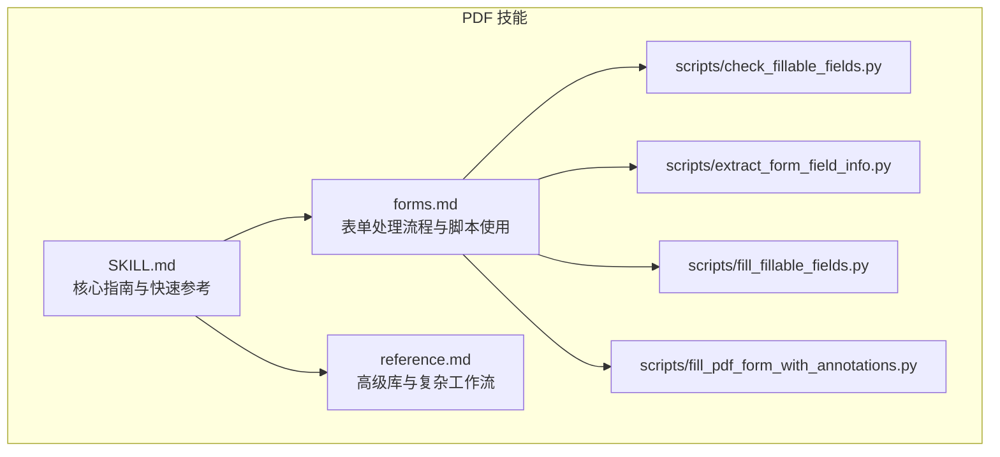
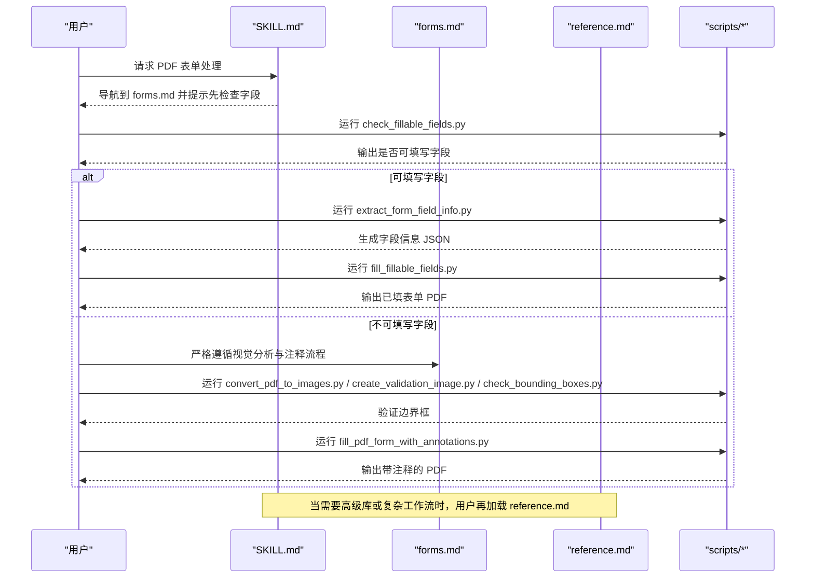
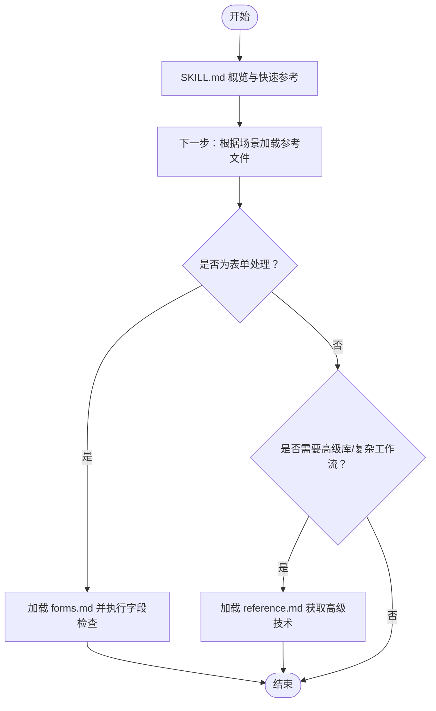
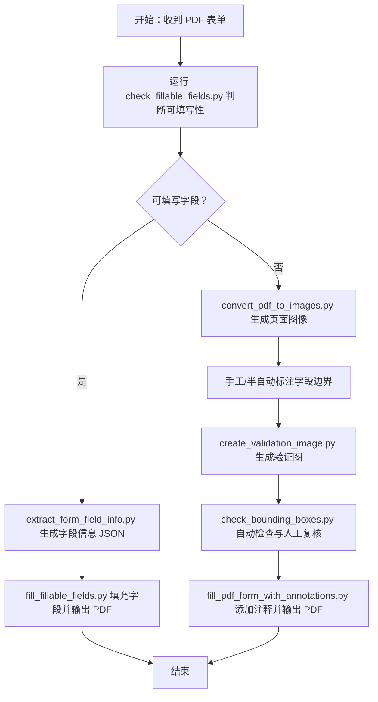
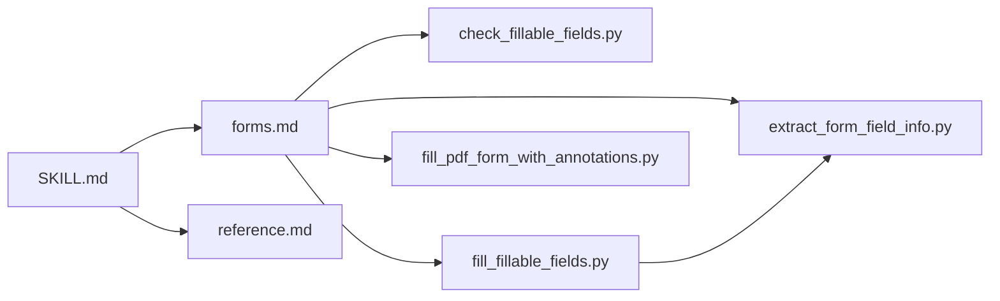

# 高层级指南与参考文件模式

<cite>
**本文引用的文件**
- [skills/pdf/SKILL.md](file://skills/pdf/SKILL.md)
- [skills/pdf/forms.md](file://skills/pdf/forms.md)
- [skills/pdf/reference.md](file://skills/pdf/reference.md)
- [skills/pdf/scripts/check_fillable_fields.py](file://skills/pdf/scripts/check_fillable_fields.py)
- [skills/pdf/scripts/extract_form_field_info.py](file://skills/pdf/scripts/extract_form_field_info.py)
- [skills/pdf/scripts/fill_fillable_fields.py](file://skills/pdf/scripts/fill_fillable_fields.py)
- [skills/pdf/scripts/fill_pdf_form_with_annotations.py](file://skills/pdf/scripts/fill_pdf_form_with_annotations.py)
- [skills/docx/SKILL.md](file://skills/docx/SKILL.md)
- [skills/mcp-builder/SKILL.md](file://skills/mcp-builder/SKILL.md)
- [template/SKILL.md](file://template/SKILL.md)
</cite>

## 目录
1. [引言](#引言)
2. [项目结构](#项目结构)
3. [核心组件](#核心组件)
4. [架构总览](#架构总览)
5. [详细组件分析](#详细组件分析)
6. [依赖关系分析](#依赖关系分析)
7. [性能考量](#性能考量)
8. [故障排查指南](#故障排查指南)
9. [结论](#结论)
10. [附录](#附录)

## 引言
本指南围绕“高层级指南与参考文件”设计模式展开，系统阐述如何通过将核心流程保留在 SKILL.md 中，并将详细技术文档（如表单处理、API 参考、示例代码）拆分到独立的 FORMS.md、REFERENCE.md 等文件中，实现上下文的高效管理。结合 skills/pdf/ 目录的实际文件结构，说明当用户请求涉及特定高级功能时，Claude 如何按需加载对应参考文件，避免一次性加载全部内容；并通过具体代码片段路径示例，展示 SKILL.md 中如何正确引用外部文档，阐明该模式在减少上下文占用、提升响应速度方面的优势，并总结维护引用一致性、避免深层嵌套的最佳实践。

## 项目结构
该模式在多个技能中得到一致应用：
- 核心指南：SKILL.md 提供总体概述、快速入门、常见任务和下一步指引，保持上下文精简。
- 专项参考：FORMS.md 聚焦表单处理流程与脚本使用；REFERENCE.md 聚焦高级库、命令行工具与复杂工作流。
- 实现脚本：scripts/ 下的 Python 脚本负责具体操作，SKILL.md 仅给出调用方式与注意事项。

图表来源
- [skills/pdf/SKILL.md](file://skills/pdf/SKILL.md#L1-L295)
- [skills/pdf/forms.md](file://skills/pdf/forms.md#L1-L206)
- [skills/pdf/reference.md](file://skills/pdf/reference.md#L1-L612)
- [skills/pdf/scripts/check_fillable_fields.py](file://skills/pdf/scripts/check_fillable_fields.py#L1-L13)
- [skills/pdf/scripts/extract_form_field_info.py](file://skills/pdf/scripts/extract_form_field_info.py#L1-L153)
- [skills/pdf/scripts/fill_fillable_fields.py](file://skills/pdf/scripts/fill_fillable_fields.py#L1-L115)
- [skills/pdf/scripts/fill_pdf_form_with_annotations.py](file://skills/pdf/scripts/fill_pdf_form_with_annotations.py#L1-L108)

章节来源
- [skills/pdf/SKILL.md](file://skills/pdf/SKILL.md#L1-L295)
- [skills/pdf/forms.md](file://skills/pdf/forms.md#L1-L206)
- [skills/pdf/reference.md](file://skills/pdf/reference.md#L1-L612)

## 核心组件
- SKILL.md：提供技能概览、常用任务、快速参考与下一步指引，作为“入口层”，引导用户到更详细的参考文件。
- FORMS.md：聚焦 PDF 表单填写的两套路径（可填写字段 vs 不可填写字段），明确步骤、输入输出与脚本调用。
- REFERENCE.md：覆盖高级库（如 pypdfium2、pdf-lib）、复杂命令行操作、高级 Python 技术与性能优化建议。
- scripts/：提供可执行脚本，支持字段检测、信息提取、填充与注释添加，SKILL.md 仅给出调用方式与注意事项。

章节来源
- [skills/pdf/SKILL.md](file://skills/pdf/SKILL.md#L1-L295)
- [skills/pdf/forms.md](file://skills/pdf/forms.md#L1-L206)
- [skills/pdf/reference.md](file://skills/pdf/reference.md#L1-L612)
- [skills/pdf/scripts/check_fillable_fields.py](file://skills/pdf/scripts/check_fillable_fields.py#L1-L13)
- [skills/pdf/scripts/extract_form_field_info.py](file://skills/pdf/scripts/extract_form_field_info.py#L1-L153)
- [skills/pdf/scripts/fill_fillable_fields.py](file://skills/pdf/scripts/fill_fillable_fields.py#L1-L115)
- [skills/pdf/scripts/fill_pdf_form_with_annotations.py](file://skills/pdf/scripts/fill_pdf_form_with_annotations.py#L1-L108)

## 架构总览
该模式通过“入口指南 + 分层参考 + 可执行脚本”的组合，实现按需加载与上下文最小化：
- 入口层（SKILL.md）：提供任务导向的导航与快速参考，避免一次性加载全部细节。
- 深入层（FORMS.md/REFERENCE.md）：针对特定场景提供完整流程与示例，用户仅在需要时加载对应文件。
- 执行层（scripts/）：提供可直接运行的工具，SKILL.md 仅说明调用方式与前置条件。

图表来源
- [skills/pdf/SKILL.md](file://skills/pdf/SKILL.md#L1-L295)
- [skills/pdf/forms.md](file://skills/pdf/forms.md#L1-L206)
- [skills/pdf/reference.md](file://skills/pdf/reference.md#L1-L612)
- [skills/pdf/scripts/check_fillable_fields.py](file://skills/pdf/scripts/check_fillable_fields.py#L1-L13)
- [skills/pdf/scripts/extract_form_field_info.py](file://skills/pdf/scripts/extract_form_field_info.py#L1-L153)
- [skills/pdf/scripts/fill_fillable_fields.py](file://skills/pdf/scripts/fill_fillable_fields.py#L1-L115)
- [skills/pdf/scripts/fill_pdf_form_with_annotations.py](file://skills/pdf/scripts/fill_pdf_form_with_annotations.py#L1-L108)

## 详细组件分析

### 组件A：SKILL.md 的高层导航与引用策略
- SKILL.md 作为“入口层”，提供概览、快速入门、常见任务与下一步指引，避免一次性加载全部细节。
- 对于高级特性（如 pypdfium2、pdf-lib、复杂命令行操作），SKILL.md 在“快速参考”和“下一步”中直接指向 REFERENCE.md，确保上下文最小化。
- 对于表单处理，SKILL.md 明确区分“可填写字段”和“不可填写字段”的两条路径，并在“下一步”中直接链接到 FORMS.md。

图表来源
- [skills/pdf/SKILL.md](file://skills/pdf/SKILL.md#L1-L295)
- [skills/pdf/forms.md](file://skills/pdf/forms.md#L1-L206)
- [skills/pdf/reference.md](file://skills/pdf/reference.md#L1-L612)

章节来源
- [skills/pdf/SKILL.md](file://skills/pdf/SKILL.md#L1-L295)

### 组件B：FORMS.md 的两阶段表单处理流程
- 第一阶段：字段可填写
  - 使用脚本检测字段可填写性，再提取字段信息，最后填充字段并输出 PDF。
- 第二阶段：字段不可填写
  - 通过图像分析确定字段边界，生成验证图与字段定义 JSON，校验无误后以文本注释方式填充 PDF。

图表来源
- [skills/pdf/forms.md](file://skills/pdf/forms.md#L1-L206)
- [skills/pdf/scripts/check_fillable_fields.py](file://skills/pdf/scripts/check_fillable_fields.py#L1-L13)
- [skills/pdf/scripts/extract_form_field_info.py](file://skills/pdf/scripts/extract_form_field_info.py#L1-L153)
- [skills/pdf/scripts/fill_fillable_fields.py](file://skills/pdf/scripts/fill_fillable_fields.py#L1-L115)
- [skills/pdf/scripts/fill_pdf_form_with_annotations.py](file://skills/pdf/scripts/fill_pdf_form_with_annotations.py#L1-L108)

章节来源
- [skills/pdf/forms.md](file://skills/pdf/forms.md#L1-L206)
- [skills/pdf/scripts/check_fillable_fields.py](file://skills/pdf/scripts/check_fillable_fields.py#L1-L13)
- [skills/pdf/scripts/extract_form_field_info.py](file://skills/pdf/scripts/extract_form_field_info.py#L1-L153)
- [skills/pdf/scripts/fill_fillable_fields.py](file://skills/pdf/scripts/fill_fillable_fields.py#L1-L115)
- [skills/pdf/scripts/fill_pdf_form_with_annotations.py](file://skills/pdf/scripts/fill_pdf_form_with_annotations.py#L1-L108)

### 组件C：REFERENCE.md 的高级能力与最佳实践
- 高级库与命令行：提供 pypdfium2、pdf-lib、pdfjs-dist 等库的示例与命令行工具的高级用法。
- 复杂工作流：包含批量处理、裁剪、OCR、加密修复等复杂场景的实现思路与性能优化建议。
- SKILL.md 在“快速参考”和“下一步”中直接指向 REFERENCE.md，确保用户在需要时才加载这些高密度内容。

章节来源
- [skills/pdf/reference.md](file://skills/pdf/reference.md#L1-L612)
- [skills/pdf/SKILL.md](file://skills/pdf/SKILL.md#L1-L295)

### 组件D：跨技能的模式对比（DOCX 与 MCP Builder）
- DOCX 技能同样采用“入口层 + 专项参考 + 脚本”的模式，SKILL.md 强调“必须读完整个参考文件”以保证正确性，体现“按需加载 + 完整阅读”的平衡。
- MCP Builder 技能在 SKILL.md 中明确列出参考文件清单与加载顺序，强调“先协议规范，再框架文档，后语言指南”，形成清晰的“学习路径”。

章节来源
- [skills/docx/SKILL.md](file://skills/docx/SKILL.md#L1-L197)
- [skills/mcp-builder/SKILL.md](file://skills/mcp-builder/SKILL.md#L1-L237)

## 依赖关系分析
- 文档间依赖：SKILL.md 依赖 FORMS.md 与 REFERENCE.md；FORMS.md 依赖 scripts/ 下的脚本；REFERENCE.md 为独立参考，不依赖其他文档。
- 脚本间依赖：fill_fillable_fields.py 依赖 extract_form_field_info.py 的字段解析逻辑；fill_pdf_form_with_annotations.py 依赖字段定义 JSON 与坐标转换逻辑。
- 外部依赖：脚本依赖 pypdf、pdfplumber、reportlab 等库，命令行依赖 poppler-utils、qpdf 等工具。

图表来源
- [skills/pdf/SKILL.md](file://skills/pdf/SKILL.md#L1-L295)
- [skills/pdf/forms.md](file://skills/pdf/forms.md#L1-L206)
- [skills/pdf/reference.md](file://skills/pdf/reference.md#L1-L612)
- [skills/pdf/scripts/check_fillable_fields.py](file://skills/pdf/scripts/check_fillable_fields.py#L1-L13)
- [skills/pdf/scripts/extract_form_field_info.py](file://skills/pdf/scripts/extract_form_field_info.py#L1-L153)
- [skills/pdf/scripts/fill_fillable_fields.py](file://skills/pdf/scripts/fill_fillable_fields.py#L1-L115)
- [skills/pdf/scripts/fill_pdf_form_with_annotations.py](file://skills/pdf/scripts/fill_pdf_form_with_annotations.py#L1-L108)

章节来源
- [skills/pdf/SKILL.md](file://skills/pdf/SKILL.md#L1-L295)
- [skills/pdf/forms.md](file://skills/pdf/forms.md#L1-L206)
- [skills/pdf/reference.md](file://skills/pdf/reference.md#L1-L612)
- [skills/pdf/scripts/check_fillable_fields.py](file://skills/pdf/scripts/check_fillable_fields.py#L1-L13)
- [skills/pdf/scripts/extract_form_field_info.py](file://skills/pdf/scripts/extract_form_field_info.py#L1-L153)
- [skills/pdf/scripts/fill_fillable_fields.py](file://skills/pdf/scripts/fill_fillable_fields.py#L1-L115)
- [skills/pdf/scripts/fill_pdf_form_with_annotations.py](file://skills/pdf/scripts/fill_pdf_form_with_annotations.py#L1-L108)

## 性能考量
- 减少上下文占用：SKILL.md 仅保留必要导航与快速参考，避免一次性加载全部细节；用户在需要时才加载 FORMS.md 或 REFERENCE.md。
- 按需加载：通过“下一步”链接与脚本调用，Claude 只在执行具体任务时加载相应参考文件，降低上下文长度。
- 性能优化建议（来自 REFERENCE.md）：
  - 大型 PDF：优先使用命令行工具进行拆分与预处理，再用 pypdfium2 流式渲染。
  - 文本提取：对结构化数据优先使用 pdfplumber，对纯文本优先使用 pdftotext -bbox-layout。
  - 图像提取：pdfimages 更快；需要高质量时再考虑渲染。
  - 内存管理：分块处理 PDF，避免一次性加载整个文档。

章节来源
- [skills/pdf/reference.md](file://skills/pdf/reference.md#L528-L602)
- [skills/pdf/SKILL.md](file://skills/pdf/SKILL.md#L276-L295)

## 故障排查指南
- 字段可填写性判断
  - 使用脚本检查 PDF 是否具有可填写字段，若无则进入“不可填写字段”流程。
  - 参考路径：[scripts/check_fillable_fields.py](file://skills/pdf/scripts/check_fillable_fields.py#L1-L13)
- 字段信息提取与校验
  - 使用脚本提取字段信息 JSON，并在需要时进行校验与排序。
  - 参考路径：[scripts/extract_form_field_info.py](file://skills/pdf/scripts/extract_form_field_info.py#L1-L153)
- 字段填充与错误处理
  - 填充前进行字段 ID、页码与值的有效性校验；遇到无效值会打印错误并退出。
  - 参考路径：[scripts/fill_fillable_fields.py](file://skills/pdf/scripts/fill_fillable_fields.py#L1-L115)
- 注释填充与坐标转换
  - 将图像坐标转换为 PDF 坐标，添加 FreeText 注释；注意字体大小/颜色在不同查看器中的兼容性。
  - 参考路径：[scripts/fill_pdf_form_with_annotations.py](file://skills/pdf/scripts/fill_pdf_form_with_annotations.py#L1-L108)
- 常见问题与修复
  - 加密 PDF：先尝试解密，失败时使用 qpdf 修复结构。
  - 扫描版 PDF：回退到 OCR 流程。
  - 参考路径：[reference.md 中的故障排查章节](file://skills/pdf/reference.md#L567-L602)

章节来源
- [skills/pdf/scripts/check_fillable_fields.py](file://skills/pdf/scripts/check_fillable_fields.py#L1-L13)
- [skills/pdf/scripts/extract_form_field_info.py](file://skills/pdf/scripts/extract_form_field_info.py#L1-L153)
- [skills/pdf/scripts/fill_fillable_fields.py](file://skills/pdf/scripts/fill_fillable_fields.py#L1-L115)
- [skills/pdf/scripts/fill_pdf_form_with_annotations.py](file://skills/pdf/scripts/fill_pdf_form_with_annotations.py#L1-L108)
- [skills/pdf/reference.md](file://skills/pdf/reference.md#L567-L602)

## 结论
“高层级指南与参考文件”模式通过“入口层 + 分层参考 + 可执行脚本”的组合，实现了上下文的高效管理与按需加载。SKILL.md 仅保留必要的导航与快速参考，用户在需要时才加载 FORMS.md 或 REFERENCE.md；脚本层提供可直接运行的工具，进一步降低理解成本。该模式在减少上下文占用、提升响应速度方面效果显著，并通过清晰的引用与流程，帮助 Claude 在复杂任务中保持高效与准确。

## 附录
- 模板 SKILL.md：用于新技能的标准化入口层模板，便于统一风格与结构。
  - 参考路径：[template/SKILL.md](file://template/SKILL.md#L1-L7)
- 跨技能对比：DOCX 与 MCP Builder 技能在 SKILL.md 中均体现了“入口层 + 专项参考 + 脚本”的一致模式，强调“完整阅读 + 按需加载”的平衡。

章节来源
- [template/SKILL.md](file://template/SKILL.md#L1-L7)
- [skills/docx/SKILL.md](file://skills/docx/SKILL.md#L1-L197)
- [skills/mcp-builder/SKILL.md](file://skills/mcp-builder/SKILL.md#L1-L237)