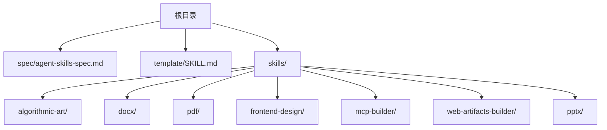
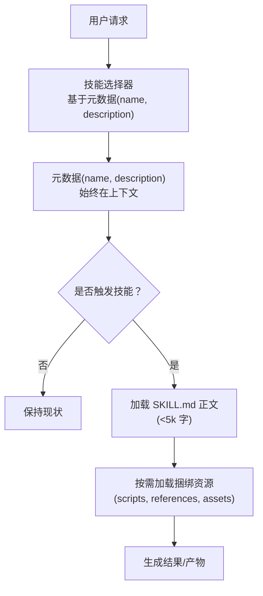
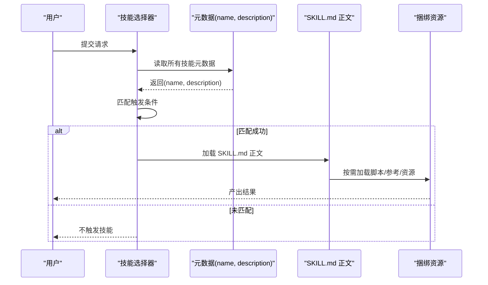
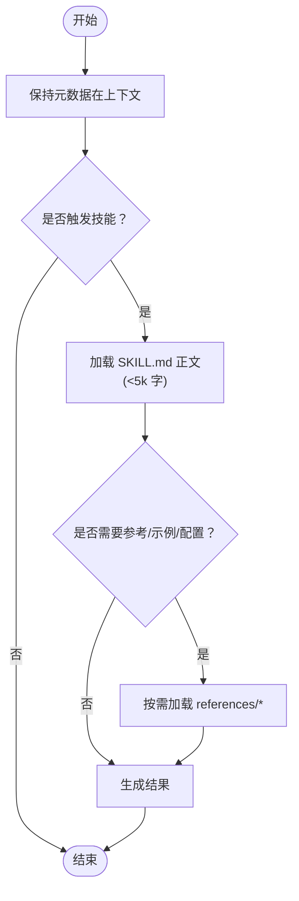
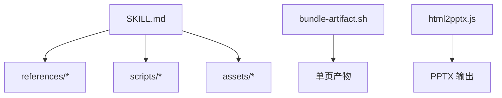

# 技能系统规范

<cite>
**本文引用的文件**
- [README.md](file://README.md)
- [spec/agent-skills-spec.md](file://spec/agent-skills-spec.md)
- [template/SKILL.md](file://template/SKILL.md)
- [skills/skill-creator/SKILL.md](file://skills/skill-creator/SKILL.md)
- [skills/skill-creator/scripts/quick_validate.py](file://skills/skill-creator/scripts/quick_validate.py)
- [skills/algorithmic-art/SKILL.md](file://skills/algorithmic-art/SKILL.md)
- [skills/docx/SKILL.md](file://skills/docx/SKILL.md)
- [skills/pdf/SKILL.md](file://skills/pdf/SKILL.md)
- [skills/frontend-design/SKILL.md](file://skills/frontend-design/SKILL.md)
- [skills/mcp-builder/SKILL.md](file://skills/mcp-builder/SKILL.md)
- [skills/mcp-builder/reference/node_mcp_server.md](file://skills/mcp-builder/reference/node_mcp_server.md)
- [skills/web-artifacts-builder/scripts/bundle-artifact.sh](file://skills/web-artifacts-builder/scripts/bundle-artifact.sh)
- [skills/pptx/scripts/html2pptx.js](file://skills/pptx/scripts/html2pptx.js)
</cite>

## 目录
1. [引言](#引言)
2. [项目结构](#项目结构)
3. [核心组件](#核心组件)
4. [架构总览](#架构总览)
5. [详细组件分析](#详细组件分析)
6. [依赖关系分析](#依赖关系分析)
7. [性能考量](#性能考量)
8. [故障排查指南](#故障排查指南)
9. [结论](#结论)
10. [附录](#附录)

## 引言
本规范文档围绕“Agent Skills”体系，系统阐述技能的结构、元数据与触发机制、渐进式披露设计原则及其对上下文管理的优化，并结合仓库中实际实现（如模板 SKILL.md、技能样例等）进行落地说明。目标是帮助读者快速理解并正确创建与使用技能，确保在有限上下文窗口内高效传递知识与能力。

## 项目结构
仓库采用“技能集合 + 规范 + 模板”的组织方式：
- skills：包含多个具体技能示例，每个技能以独立目录存放，核心为 SKILL.md（含 YAML 元数据与正文）以及可选的脚本、参考文档与资源。
- spec：存放规范链接或说明文件。
- template：提供技能模板 SKILL.md，作为新技能的起点。
- README：总体介绍、使用说明与示例技能导航。

图表来源
- [README.md](file://README.md#L1-L95)
- [spec/agent-skills-spec.md](file://spec/agent-skills-spec.md#L1-L4)
- [template/SKILL.md](file://template/SKILL.md#L1-L7)

章节来源
- [README.md](file://README.md#L1-L95)

## 核心组件
- 技能包（Skill Package）
  - 必备文件：SKILL.md（包含 YAML 前言元数据与正文）
  - 可选资源：scripts/（执行脚本）、references/（按需加载的参考文档）、assets/（输出用资源）
- YAML 元数据（name、description）
  - 用于触发与选择技能；Claude 依据元数据决定何时加载 SKILL.md 正文及后续资源
- 渐进式披露（Progressive Disclosure）
  - 三阶段加载：元数据（始终在上下文）→ SKILL.md 正文（触发时加载）→ 捆绑资源（按需加载）

章节来源
- [skills/skill-creator/SKILL.md](file://skills/skill-creator/SKILL.md#L47-L121)
- [skills/skill-creator/scripts/quick_validate.py](file://skills/skill-creator/scripts/quick_validate.py#L1-L56)
- [template/SKILL.md](file://template/SKILL.md#L1-L7)

## 架构总览
下图展示技能在触发前后的加载顺序与资源组织，体现“元数据优先、正文按需、资源随取”的渐进式披露策略。

图表来源
- [skills/skill-creator/SKILL.md](file://skills/skill-creator/SKILL.md#L114-L121)
- [skills/skill-creator/SKILL.md](file://skills/skill-creator/SKILL.md#L64-L91)

## 详细组件分析

### 组件A：元数据与触发机制
- 元数据字段
  - name：技能唯一标识，用于匹配与选择
  - description：技能用途与触发条件的完整描述，是 Claude 判断何时调用该技能的核心依据
- 触发流程
  - 选择器读取所有技能的元数据，结合用户意图进行匹配
  - 匹配成功后才加载 SKILL.md 正文，避免无谓消耗上下文
- 实现要点
  - 元数据应清晰、具体，覆盖典型使用场景与触发条件
  - 避免在正文重复“何时使用”的信息，因为正文仅在触发后加载

图表来源
- [skills/skill-creator/SKILL.md](file://skills/skill-creator/SKILL.md#L64-L91)
- [skills/skill-creator/SKILL.md](file://skills/skill-creator/SKILL.md#L114-L121)

章节来源
- [skills/skill-creator/SKILL.md](file://skills/skill-creator/SKILL.md#L64-L91)
- [skills/skill-creator/scripts/quick_validate.py](file://skills/skill-creator/scripts/quick_validate.py#L1-L56)
- [template/SKILL.md](file://template/SKILL.md#L1-L7)

### 组件B：渐进式披露设计原则
- 三阶段加载
  - 元数据（name + description）：始终在上下文，约 100 字
  - SKILL.md 正文：触发时加载，建议小于 5k 字
  - 捆绑资源：按需加载（脚本可直接执行无需读入上下文）
- 设计模式
  - 将复杂细节拆分到 references/ 等子文件，SKILL.md 中仅保留导航与选择指引
  - 对多变体/多框架/多领域技能，按域/变体组织，避免无关上下文进入
  - 控制 SKILL.md 行数，必要时拆分为多个参考文件并在 SKILL.md 中明确引用
- 优势
  - 显著降低上下文占用，提升模型在对话中处理更多历史与系统提示的能力
  - 通过“按需加载”，在保证功能完整性的同时控制 token 成本

图表来源
- [skills/skill-creator/SKILL.md](file://skills/skill-creator/SKILL.md#L114-L121)
- [skills/skill-creator/SKILL.md](file://skills/skill-creator/SKILL.md#L122-L201)

章节来源
- [skills/skill-creator/SKILL.md](file://skills/skill-creator/SKILL.md#L114-L201)

### 组件C：模板 SKILL.md 的结构与用法
- 结构组成
  - YAML 前言：name、description（必填），可选 license 等
  - 正文：指令、示例、指南等，触发后由 Claude 读取
- 使用建议
  - 在 description 中明确技能职责与触发时机
  - 正文聚焦操作步骤与注意事项，避免冗长背景
  - 大型参考材料放入 references/ 并在 SKILL.md 中清晰标注

章节来源
- [template/SKILL.md](file://template/SKILL.md#L1-L7)
- [skills/skill-creator/SKILL.md](file://skills/skill-creator/SKILL.md#L300-L320)

### 组件D：实际技能示例与最佳实践
- algorithmic-art
  - 元数据：name、description 明确算法艺术生成任务
  - 正文：两阶段流程（哲学创作 → p5.js 实现），强调参数化与交互式产物
  - 资源：templates/ 作为模板基础，要求从模板出发构建产物
- docx
  - 元数据：name、description 覆盖专业文档创建/编辑/分析
  - 正文：工作流决策树、文本提取、原始 XML 访问、docx-js 与 OOXML 编辑路径
  - 资源：docx-js.md、ooxml.md 等参考文档，SKILL.md 中明确引用
- pdf
  - 元数据：name、description 覆盖 PDF 文本/表格提取、表单处理、合并拆分等
  - 正文：pypdf、pdfplumber、reportlab 等工具使用示例与命令行工具
  - 资源：reference.md、forms.md 等，SKILL.md 中按需引用
- frontend-design
  - 元数据：name、description 覆盖前端界面设计与实现
  - 正文：设计思维、美学指导、避免通用 AI 风格等
- mcp-builder
  - 元数据：name、description 覆盖 MCP 服务器开发
  - 正文：四阶段开发流程、TypeScript/Python 框架、测试与评估
  - 资源：node_mcp_server.md、python_mcp_server.md、evaluation.md 等

章节来源
- [skills/algorithmic-art/SKILL.md](file://skills/algorithmic-art/SKILL.md#L1-L405)
- [skills/docx/SKILL.md](file://skills/docx/SKILL.md#L1-L197)
- [skills/pdf/SKILL.md](file://skills/pdf/SKILL.md#L1-L295)
- [skills/frontend-design/SKILL.md](file://skills/frontend-design/SKILL.md#L1-L43)
- [skills/mcp-builder/SKILL.md](file://skills/mcp-builder/SKILL.md#L1-L237)
- [skills/mcp-builder/reference/node_mcp_server.md](file://skills/mcp-builder/reference/node_mcp_server.md#L757-L815)

### 组件E：资源组织与按需加载
- scripts/
  - 可执行脚本，适合重复性高、确定性强的任务
  - 优点：token 效率高、可直接执行、无需读入上下文
- references/
  - 按需加载的参考文档，SKILL.md 中明确引用
  - 建议：大文档提供目录索引，便于 Claude 预览与定位
- assets/
  - 输出用资源（模板、图标、字体、样本文档等）
  - 与文档分离，避免加载到上下文

章节来源
- [skills/skill-creator/SKILL.md](file://skills/skill-creator/SKILL.md#L71-L101)
- [skills/skill-creator/SKILL.md](file://skills/skill-creator/SKILL.md#L82-L101)

### 组件F：打包与验证
- 打包流程
  - package_skill.py 自动校验元数据格式、命名规范、描述质量与文件组织
  - 通过后生成 .skill 文件（zip），便于分发
- 验证要点
  - 必须存在 SKILL.md
  - YAML 前言必须为字典且包含 name、description
  - 允许字段有限，避免冗余键

章节来源
- [skills/skill-creator/SKILL.md](file://skills/skill-creator/SKILL.md#L320-L347)
- [skills/skill-creator/scripts/quick_validate.py](file://skills/skill-creator/scripts/quick_validate.py#L1-L56)

## 依赖关系分析
- 技能与规范
  - 规范文件指向外部规范站点，仓库内提供模板与示例以支撑落地
- 技能内部依赖
  - SKILL.md 依赖 references/ 子文件（按需加载）
  - scripts/ 与 assets/ 作为外部资源，不直接写入上下文
- 工具链依赖
  - web-artifacts-builder 提供单页产物打包脚本，便于将前端应用打包为单一 HTML 艺术品
  - pptx 的 html2pptx.js 展示了资源转换与元素注入的实现思路

图表来源
- [skills/skill-creator/SKILL.md](file://skills/skill-creator/SKILL.md#L71-L101)
- [skills/web-artifacts-builder/scripts/bundle-artifact.sh](file://skills/web-artifacts-builder/scripts/bundle-artifact.sh#L1-L54)
- [skills/pptx/scripts/html2pptx.js](file://skills/pptx/scripts/html2pptx.js#L132-L167)

章节来源
- [skills/web-artifacts-builder/scripts/bundle-artifact.sh](file://skills/web-artifacts-builder/scripts/bundle-artifact.sh#L1-L54)
- [skills/pptx/scripts/html2pptx.js](file://skills/pptx/scripts/html2pptx.js#L132-L167)

## 性能考量
- 上下文窗口优化
  - 元数据始终在上下文，正文触发后加载，资源按需加载，有效控制 token 消耗
  - SKILL.md 行数控制在 500 行以内更佳，避免接近阈值导致上下文膨胀
- 资源执行效率
  - 脚本可在本地执行，无需读入上下文，适合重复性与确定性任务
- 参考文档组织
  - 将大型参考文档拆分为子文件并通过 SKILL.md 导航，减少一次性加载量

章节来源
- [skills/skill-creator/SKILL.md](file://skills/skill-creator/SKILL.md#L114-L121)
- [skills/skill-creator/SKILL.md](file://skills/skill-creator/SKILL.md#L82-L101)

## 故障排查指南
- 元数据缺失或格式错误
  - 症状：打包失败、无法识别技能
  - 排查：确认 SKILL.md 是否存在 YAML 前言，name 与 description 是否齐全
- 描述不充分
  - 症状：技能未被触发或误触发
  - 排查：在 description 中明确技能职责与触发条件，避免模糊表述
- 参考文档未按需加载
  - 症状：上下文过大、响应缓慢
  - 排查：将大文档拆分至 references/，并在 SKILL.md 中明确引用路径
- 资源未按约定组织
  - 症状：打包报错或运行异常
  - 排查：scripts/、references/、assets/ 目录结构与命名需符合规范

章节来源
- [skills/skill-creator/scripts/quick_validate.py](file://skills/skill-creator/scripts/quick_validate.py#L1-L56)
- [skills/skill-creator/SKILL.md](file://skills/skill-creator/SKILL.md#L320-L347)

## 结论
Agent Skills 规范通过“元数据优先、正文按需、资源随取”的渐进式披露设计，在有限上下文窗口内最大化地承载技能知识与能力。结合模板 SKILL.md 与大量示例技能，开发者可以快速构建高质量、可维护、可分发的技能包。建议在设计时严格遵循元数据完整性、正文简洁性与资源按需加载的原则，持续迭代以提升实用性与稳定性。

## 附录
- 规范链接：参见规范文件中的外部规范站点
- 模板 SKILL.md：作为新技能的起点，包含 YAML 元数据与正文占位
- 示例技能：涵盖创意设计、文档处理、前端开发、MCP 服务等多个领域，可作为设计参考

章节来源
- [spec/agent-skills-spec.md](file://spec/agent-skills-spec.md#L1-L4)
- [template/SKILL.md](file://template/SKILL.md#L1-L7)
- [README.md](file://README.md#L1-L95)