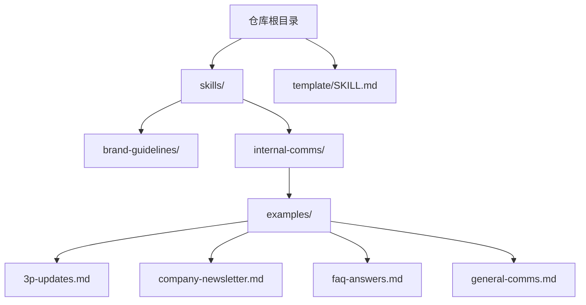
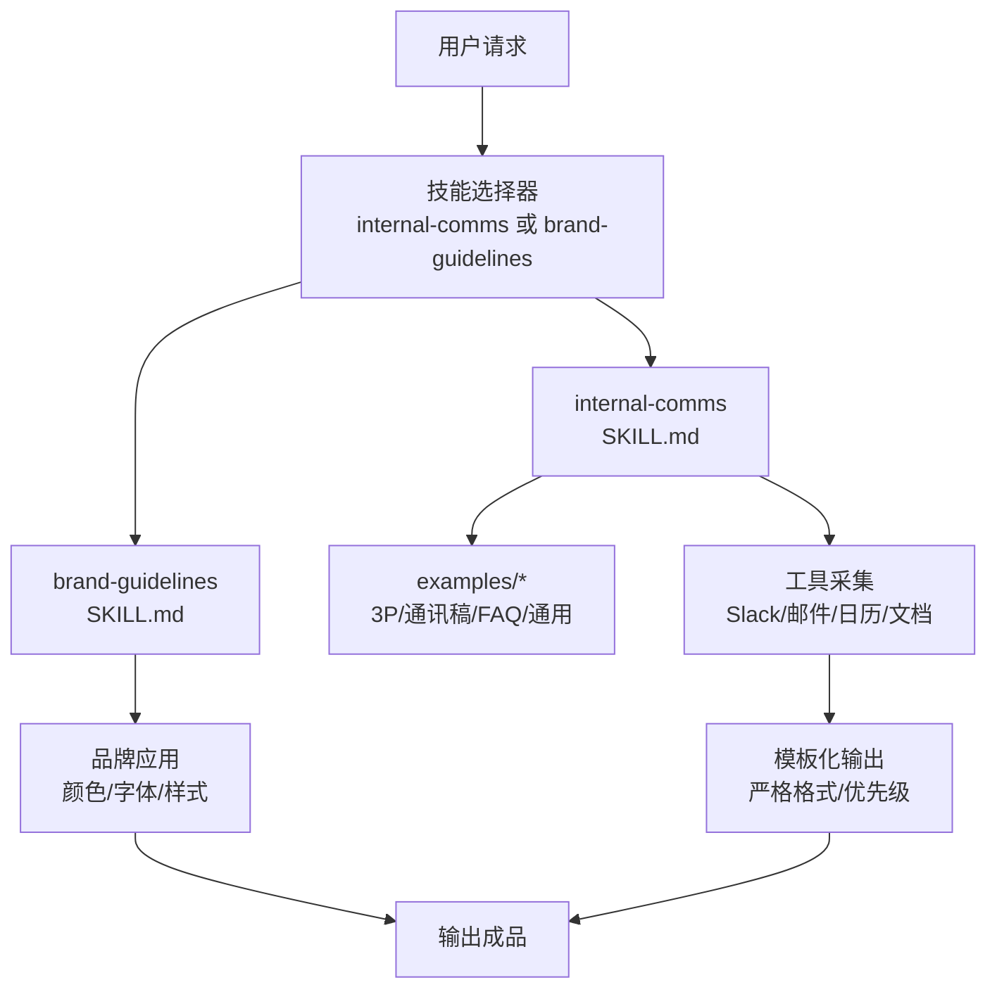
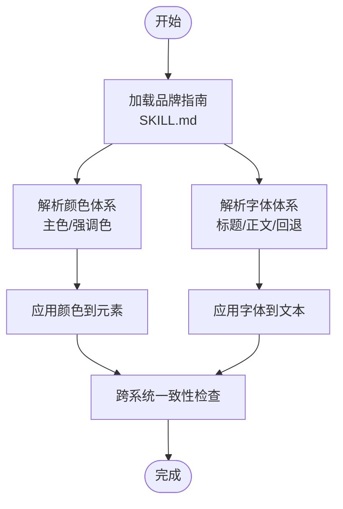
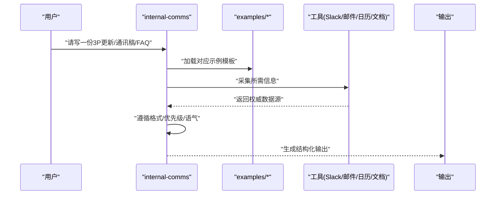
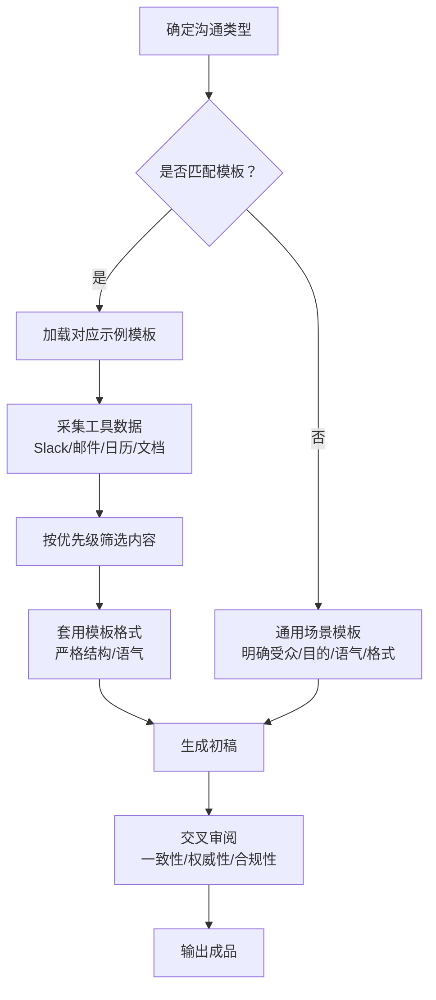
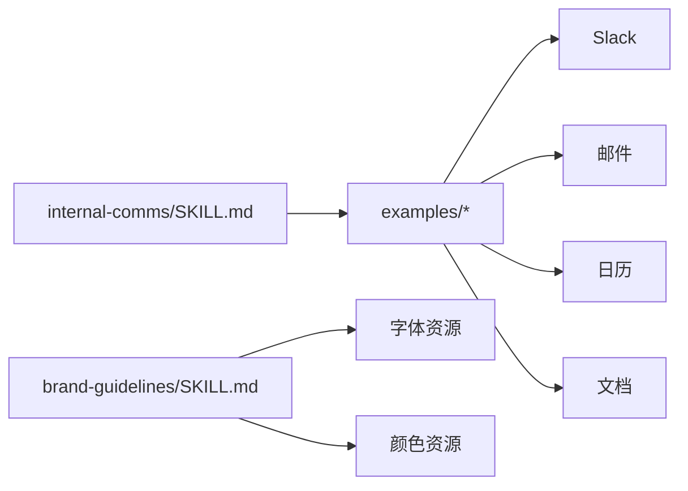

# 企业沟通技能

<cite>
**本文引用的文件**
- [README.md](file://README.md)
- [template/SKILL.md](file://template/SKILL.md)
- [skills/brand-guidelines/SKILL.md](file://skills/brand-guidelines/SKILL.md)
- [skills/brand-guidelines/LICENSE.txt](file://skills/brand-guidelines/LICENSE.txt)
- [skills/internal-comms/SKILL.md](file://skills/internal-comms/SKILL.md)
- [skills/internal-comms/examples/3p-updates.md](file://skills/internal-comms/examples/3p-updates.md)
- [skills/internal-comms/examples/company-newsletter.md](file://skills/internal-comms/examples/company-newsletter.md)
- [skills/internal-comms/examples/faq-answers.md](file://skills/internal-comms/examples/faq-answers.md)
- [skills/internal-comms/examples/general-comms.md](file://skills/internal-comms/examples/general-comms.md)
- [skills/internal-comms/LICENSE.txt](file://skills/internal-comms/LICENSE.txt)
</cite>

## 目录
1. [简介](#简介)
2. [项目结构](#项目结构)
3. [核心组件](#核心组件)
4. [架构总览](#架构总览)
5. [详细组件分析](#详细组件分析)
6. [依赖关系分析](#依赖关系分析)
7. [性能考量](#性能考量)
8. [故障排查指南](#故障排查指南)
9. [结论](#结论)
10. [附录](#附录)

## 简介
本文件系统化梳理“企业沟通技能”，重点覆盖两类场景：
- 品牌指南（brand-guidelines）：确保AI生成内容在视觉与语言层面符合企业品牌规范，涵盖字体使用、色彩搭配与语调控制。
- 内部通讯（internal-comms）：提供结构化写作能力，基于示例文件（如公司通讯稿、第三方更新通知、FAQ）实现模板化输出逻辑，帮助快速产出高质量内部沟通材料。

通过 SKILL.md 中的指令约束，AI 在不同场景下能稳定地遵循品牌定位与组织偏好，避免风格漂移；同时结合示例文件的格式与优先级规则，形成可复用的写作范式。文档还提供内容审核流程建议与典型使用模式，便于团队落地执行。

## 项目结构
该仓库以“技能”为单位组织，每个技能包含独立的说明文件与示例资源。与本主题相关的关键目录如下：
- skills/brand-guidelines：品牌视觉与语言规范说明，定义颜色、字体与应用策略。
- skills/internal-comms：内部沟通技能说明与示例模板，覆盖多种常用场景。
- template/SKILL.md：技能模板，用于新建自定义技能时参考。

图表来源
- [README.md](file://README.md#L1-L95)
- [skills/brand-guidelines/SKILL.md](file://skills/brand-guidelines/SKILL.md#L1-L74)
- [skills/internal-comms/SKILL.md](file://skills/internal-comms/SKILL.md#L1-L33)
- [skills/internal-comms/examples/3p-updates.md](file://skills/internal-comms/examples/3p-updates.md#L1-L47)
- [skills/internal-comms/examples/company-newsletter.md](file://skills/internal-comms/examples/company-newsletter.md#L1-L66)
- [skills/internal-comms/examples/faq-answers.md](file://skills/internal-comms/examples/faq-answers.md#L1-L30)
- [skills/internal-comms/examples/general-comms.md](file://skills/internal-comms/examples/general-comms.md#L1-L16)

章节来源
- [README.md](file://README.md#L1-L95)
- [template/SKILL.md](file://template/SKILL.md#L1-L7)

## 核心组件
- 品牌指南（brand-guidelines）
  - 明确主色与强调色，定义标题与正文字体族及回退方案。
  - 提供智能字体应用、文本样式与形状强调色的策略，保证跨系统一致性与可读性。
  - 技术细节中说明字体管理与颜色应用方式，确保品牌色彩与排版的一致性。
- 内部通讯（internal-comms）
  - 指导何时使用以及如何使用：按场景加载对应示例文件，严格遵循格式、语气与内容收集要求。
  - 覆盖三大场景：3P 更新（进度/计划/问题）、公司通讯稿、FAQ 回答；另提供通用场景模板。
  - 强调工具可用性与优先级：围绕公司范围影响、领导层公告、里程碑与外部认可进行取舍。

章节来源
- [skills/brand-guidelines/SKILL.md](file://skills/brand-guidelines/SKILL.md#L1-L74)
- [skills/internal-comms/SKILL.md](file://skills/internal-comms/SKILL.md#L1-L33)
- [skills/internal-comms/examples/3p-updates.md](file://skills/internal-comms/examples/3p-updates.md#L1-L47)
- [skills/internal-comms/examples/company-newsletter.md](file://skills/internal-comms/examples/company-newsletter.md#L1-L66)
- [skills/internal-comms/examples/faq-answers.md](file://skills/internal-comms/examples/faq-answers.md#L1-L30)
- [skills/internal-comms/examples/general-comms.md](file://skills/internal-comms/examples/general-comms.md#L1-L16)

## 架构总览
从使用视角看，技能由“指令约束 + 示例模板 + 工具集成”构成闭环：
- 指令约束：SKILL.md 定义何时使用、如何使用、关键词与风格边界。
- 示例模板：examples 下的 Markdown 文件提供具体格式、优先级与内容采集路径。
- 工具集成：示例文件中明确可使用的工具（Slack、邮件、日历、文档、外部媒体），指导 AI 获取权威数据源。

图表来源
- [skills/brand-guidelines/SKILL.md](file://skills/brand-guidelines/SKILL.md#L1-L74)
- [skills/internal-comms/SKILL.md](file://skills/internal-comms/SKILL.md#L1-L33)
- [skills/internal-comms/examples/3p-updates.md](file://skills/internal-comms/examples/3p-updates.md#L1-L47)
- [skills/internal-comms/examples/company-newsletter.md](file://skills/internal-comms/examples/company-newsletter.md#L1-L66)
- [skills/internal-comms/examples/faq-answers.md](file://skills/internal-comms/examples/faq-answers.md#L1-L30)

## 详细组件分析

### 组件一：品牌指南（brand-guidelines）
- 角色与职责
  - 作为视觉与语言风格的“守门人”，确保所有产出符合企业品牌标准。
  - 通过颜色体系与字体体系，统一视觉基调与可读性。
- 关键要素
  - 颜色体系：主色、次色与强调色，明确适用场景与对比度策略。
  - 字体体系：标题与正文分别指定字体族，并提供回退方案，保证跨平台一致性。
  - 应用策略：智能字体应用、文本样式与形状强调色循环，保持视觉活力与品牌一致性。
  - 技术细节：字体管理与颜色应用的技术实现，确保品牌色彩与排版在不同系统中稳定呈现。
- 使用建议
  - 在需要对外发布或内部正式材料时启用，确保输出具备统一的品牌外观。
  - 若环境未预装指定字体，应提前准备回退字体，避免样式异常。

图表来源
- [skills/brand-guidelines/SKILL.md](file://skills/brand-guidelines/SKILL.md#L1-L74)

章节来源
- [skills/brand-guidelines/SKILL.md](file://skills/brand-guidelines/SKILL.md#L1-L74)

### 组件二：内部通讯（internal-comms）
- 角色与职责
  - 为内部沟通提供结构化写作框架，确保不同场景（3P、通讯稿、FAQ）输出一致、高效且专业。
  - 通过示例文件明确格式、语气与内容采集路径，降低重复劳动并提升质量。
- 场景与模板
  - 3P 更新（Progress/Plans/Problems）：面向管理层与跨团队，强调简洁、数据驱动与可读性。
  - 公司通讯稿：面向全员，强调覆盖面、公司影响与外部认可，提供分段与优先级建议。
  - FAQ 回答：面向全公司，强调权威来源、清晰表述与统一口径。
  - 通用场景：当无法归类到上述模板时，提供通用原则与澄清步骤。
- 工具与采集
  - 明确可用工具：Slack、邮件、日历、文档、外部媒体，指导 AI 从权威渠道获取信息。
  - 采集时间窗：区分过去一周（Progress/Problem）、未来一周（Plan）等，确保时效性。
- 输出质量保障
  - 严格格式：固定标题与段落结构，避免多余格式。
  - 语气与风格：统一“我们”的视角、专业但亲和的语调。
  - 可读性：短句、要点化、分段清晰，适合快速阅读。

图表来源
- [skills/internal-comms/SKILL.md](file://skills/internal-comms/SKILL.md#L1-L33)
- [skills/internal-comms/examples/3p-updates.md](file://skills/internal-comms/examples/3p-updates.md#L1-L47)
- [skills/internal-comms/examples/company-newsletter.md](file://skills/internal-comms/examples/company-newsletter.md#L1-L66)
- [skills/internal-comms/examples/faq-answers.md](file://skills/internal-comms/examples/faq-answers.md#L1-L30)
- [skills/internal-comms/examples/general-comms.md](file://skills/internal-comms/examples/general-comms.md#L1-L16)

章节来源
- [skills/internal-comms/SKILL.md](file://skills/internal-comms/SKILL.md#L1-L33)
- [skills/internal-comms/examples/3p-updates.md](file://skills/internal-comms/examples/3p-updates.md#L1-L47)
- [skills/internal-comms/examples/company-newsletter.md](file://skills/internal-comms/examples/company-newsletter.md#L1-L66)
- [skills/internal-comms/examples/faq-answers.md](file://skills/internal-comms/examples/faq-answers.md#L1-L30)
- [skills/internal-comms/examples/general-comms.md](file://skills/internal-comms/examples/general-comms.md#L1-L16)

### 组件三：示例文件的模板化输出逻辑
- 3P 更新
  - 结构：Progress/Plans/Problems 三段式，每段限制 1-3 句，强调数据与事实。
  - 时间窗：明确过去一周（Progress/Problem）与未来一周（Plan）。
  - 工具采集：优先 Slack、Google Drive、邮件、日历中的高影响力信息。
- 公司通讯稿
  - 结构：分段（公告、优先事项、领导更新、社交动态等），每段包含若干要点。
  - 优先级：公司范围影响、领导层公告、里程碑、影响大多数员工的信息、外部认可。
  - 工具采集：Slack、邮件、日历、文档、外部媒体。
- FAQ 回答
  - 结构：问题与答案一一对应，答案简洁、权威、可追溯。
  - 来源：Slack、邮件、文档，必要时标注不确定性与需高层确认的情况。
- 通用场景
  - 明确受众、目的、语气与格式要求，匹配公司沟通风格。

图表来源
- [skills/internal-comms/examples/3p-updates.md](file://skills/internal-comms/examples/3p-updates.md#L1-L47)
- [skills/internal-comms/examples/company-newsletter.md](file://skills/internal-comms/examples/company-newsletter.md#L1-L66)
- [skills/internal-comms/examples/faq-answers.md](file://skills/internal-comms/examples/faq-answers.md#L1-L30)
- [skills/internal-comms/examples/general-comms.md](file://skills/internal-comms/examples/general-comms.md#L1-L16)

章节来源
- [skills/internal-comms/examples/3p-updates.md](file://skills/internal-comms/examples/3p-updates.md#L1-L47)
- [skills/internal-comms/examples/company-newsletter.md](file://skills/internal-comms/examples/company-newsletter.md#L1-L66)
- [skills/internal-comms/examples/faq-answers.md](file://skills/internal-comms/examples/faq-answers.md#L1-L30)
- [skills/internal-comms/examples/general-comms.md](file://skills/internal-comms/examples/general-comms.md#L1-L16)

## 依赖关系分析
- 组件耦合
  - internal-comms 依赖 examples 下的模板文件，形成“指令 + 模板”的强耦合关系。
  - brand-guidelines 依赖字体与颜色资源，强调技术实现与跨系统兼容性。
- 外部依赖
  - 工具链：Slack、邮件、日历、文档、外部媒体，用于权威数据采集。
- 潜在风险
  - 模板变更可能影响输出一致性，需版本化管理与回归测试。
  - 字体与颜色在不同系统中的表现差异，需回退策略与验证流程。

图表来源
- [skills/internal-comms/SKILL.md](file://skills/internal-comms/SKILL.md#L1-L33)
- [skills/internal-comms/examples/3p-updates.md](file://skills/internal-comms/examples/3p-updates.md#L1-L47)
- [skills/internal-comms/examples/company-newsletter.md](file://skills/internal-comms/examples/company-newsletter.md#L1-L66)
- [skills/internal-comms/examples/faq-answers.md](file://skills/internal-comms/examples/faq-answers.md#L1-L30)
- [skills/brand-guidelines/SKILL.md](file://skills/brand-guidelines/SKILL.md#L1-L74)

章节来源
- [skills/internal-comms/SKILL.md](file://skills/internal-comms/SKILL.md#L1-L33)
- [skills/brand-guidelines/SKILL.md](file://skills/brand-guidelines/SKILL.md#L1-L74)

## 性能考量
- 模板命中率：通过清晰的场景识别与模板映射，减少无效尝试与重算成本。
- 工具采集效率：优先使用高影响力渠道（大量回复/反应/附件）以提高信息密度。
- 输出稳定性：严格格式与语气约束，减少反复修改与返工。
- 跨系统一致性：品牌指南提供回退字体与颜色策略，降低渲染差异带来的二次处理成本。

## 故障排查指南
- 常见问题
  - 输出风格偏离品牌定位：检查是否正确加载品牌指南指令与颜色/字体策略。
  - 模板格式不一致：核对示例文件是否匹配当前场景，确认段落与优先级设置。
  - 数据来源不可用：确认工具权限与访问范围，必要时引导用户提供关键信息。
- 排查步骤
  - 确认技能选择是否正确（internal-comms vs brand-guidelines）。
  - 对照示例文件逐项校验格式、语气与优先级。
  - 验证工具采集结果的权威性与时效性。
  - 进行跨系统一致性检查（字体与颜色）。

章节来源
- [skills/brand-guidelines/SKILL.md](file://skills/brand-guidelines/SKILL.md#L1-L74)
- [skills/internal-comms/SKILL.md](file://skills/internal-comms/SKILL.md#L1-L33)
- [skills/internal-comms/examples/3p-updates.md](file://skills/internal-comms/examples/3p-updates.md#L1-L47)
- [skills/internal-comms/examples/company-newsletter.md](file://skills/internal-comms/examples/company-newsletter.md#L1-L66)
- [skills/internal-comms/examples/faq-answers.md](file://skills/internal-comms/examples/faq-answers.md#L1-L30)

## 结论
品牌指南与内部通讯技能共同构建了“视觉一致 + 内容规范”的双轮驱动体系。前者确保品牌外观稳定，后者确保沟通内容高效、专业且可复用。通过 SKILL.md 的指令约束与示例模板的结构化输出，团队可以快速生成季度通讯稿、标准化客户回应、3P 更新与 FAQ 等材料，显著提升沟通效率与一致性。

## 附录
- 典型使用模式
  - 快速生成季度通讯稿：选择内部通讯技能，加载公司通讯稿模板，采集日历与文档中的重要里程碑与领导公告，按优先级组织内容后输出。
  - 标准化客户回应：根据场景选择通用模板或 FAQ 模板，引用官方公告与文档，保持语气一致与来源可追溯。
  - 3P 更新：明确团队与时间窗，采集 Slack 与文档中的关键进展与计划，严格遵循三段式格式输出。
- 许可证信息
  - 品牌指南与内部通讯技能均采用 Apache 2.0 许可，允许使用、复制、修改与再分发，但需保留版权与许可声明。

章节来源
- [skills/brand-guidelines/LICENSE.txt](file://skills/brand-guidelines/LICENSE.txt#L1-L202)
- [skills/internal-comms/LICENSE.txt](file://skills/internal-comms/LICENSE.txt#L1-L202)