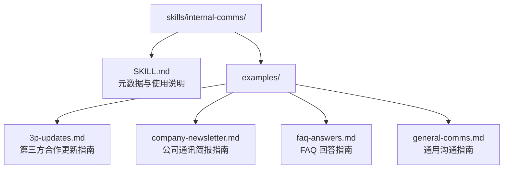
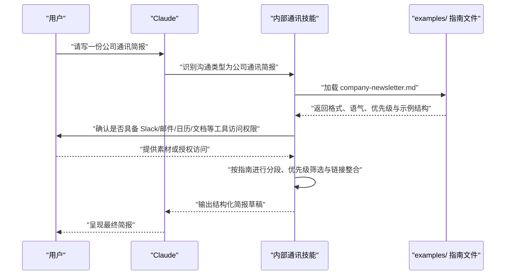
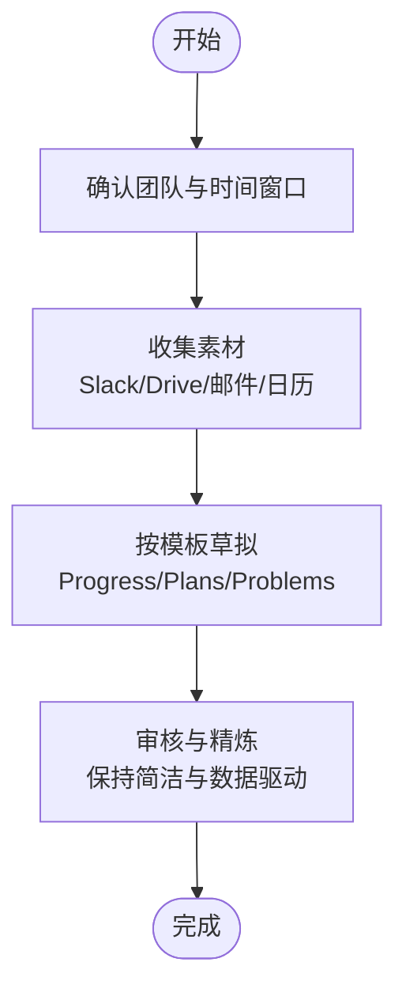
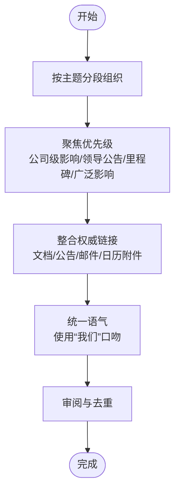
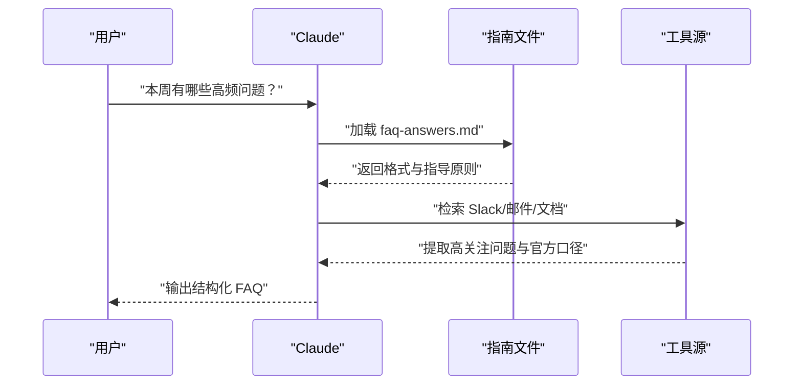
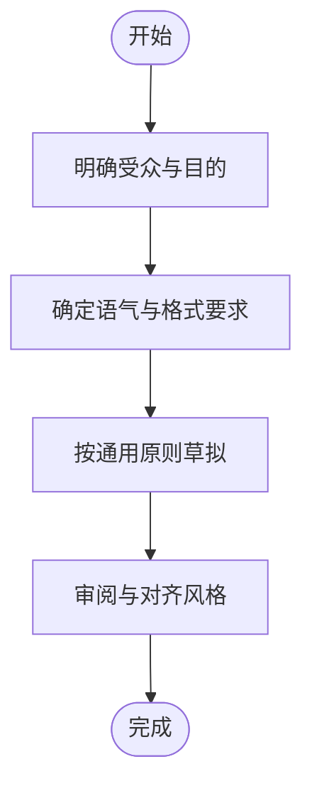
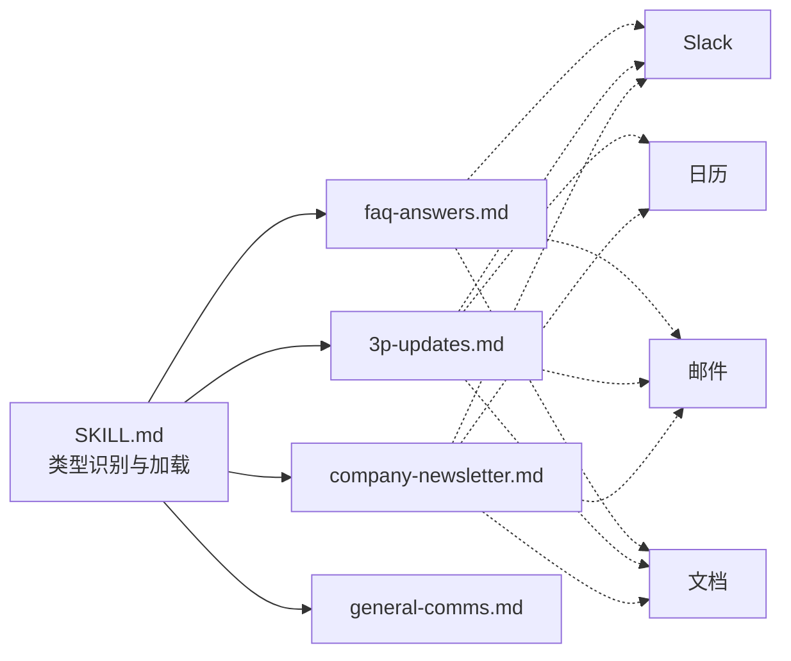

# 内部通讯技能

<cite>
**本文引用的文件**
- [skills/internal-comms/SKILL.md](file://skills/internal-comms/SKILL.md)
- [skills/internal-comms/examples/3p-updates.md](file://skills/internal-comms/examples/3p-updates.md)
- [skills/internal-comms/examples/company-newsletter.md](file://skills/internal-comms/examples/company-newsletter.md)
- [skills/internal-comms/examples/faq-answers.md](file://skills/internal-comms/examples/faq-answers.md)
- [skills/internal-comms/examples/general-comms.md](file://skills/internal-comms/examples/general-comms.md)
- [README.md](file://README.md)
- [template/SKILL.md](file://template/SKILL.md)
- [skills/internal-comms/LICENSE.txt](file://skills/internal-comms/LICENSE.txt)
</cite>

## 目录
1. [简介](#简介)
2. [项目结构](#项目结构)
3. [核心组件](#核心组件)
4. [架构总览](#架构总览)
5. [详细组件分析](#详细组件分析)
6. [依赖关系分析](#依赖关系分析)
7. [性能考量](#性能考量)
8. [故障排查指南](#故障排查指南)
9. [结论](#结论)
10. [附录](#附录)

## 简介
本技能旨在帮助在企业内部高效产出各类沟通内容，包括但不限于：第三方合作更新（3P）、公司通讯简报、常见问题解答、状态报告、领导层更新、项目进展、事件报告等。其核心价值在于通过“示例模板+提示工程”的方式，将公司既定的文体风格与信息组织逻辑标准化，从而提升沟通效率与一致性，降低重复劳动与风格偏差。

该技能强调“按类型加载相应指南文件”，并遵循“先识别类型、再加载模板、最后严格遵循格式”的流程，确保输出可复用、可审计、可扩展。

## 项目结构
内部通讯技能位于 skills/internal-comms 目录，包含一个 SKILL.md 元数据与使用说明，以及 examples/ 下的一组示例模板文件，分别覆盖不同类型的内部沟通场景。

图表来源
- [skills/internal-comms/SKILL.md](file://skills/internal-comms/SKILL.md#L1-L33)
- [skills/internal-comms/examples/3p-updates.md](file://skills/internal-comms/examples/3p-updates.md#L1-L47)
- [skills/internal-comms/examples/company-newsletter.md](file://skills/internal-comms/examples/company-newsletter.md#L1-L66)
- [skills/internal-comms/examples/faq-answers.md](file://skills/internal-comms/examples/faq-answers.md#L1-L30)
- [skills/internal-comms/examples/general-comms.md](file://skills/internal-comms/examples/general-comms.md#L1-L16)

章节来源
- [skills/internal-comms/SKILL.md](file://skills/internal-comms/SKILL.md#L1-L33)
- [README.md](file://README.md#L1-L95)

## 核心组件
- 使用说明与触发条件
  - 当请求涉及内部沟通（状态报告、领导层更新、第三方合作更新、公司通讯简报、FAQ、事件报告、项目更新等）时，应调用该技能。
- 模板选择机制
  - 根据沟通类型从 examples/ 目录中加载对应指南文件：
    - 第三方合作更新：examples/3p-updates.md
    - 公司通讯简报：examples/company-newsletter.md
    - FAQ 回答：examples/faq-answers.md
    - 其他通用场景：examples/general-comms.md
- 提示工程要点
  - 明确沟通类型
  - 加载并遵循模板的格式、语气与内容收集要求
  - 若类型不匹配现有模板，需请求澄清或补充上下文

章节来源
- [skills/internal-comms/SKILL.md](file://skills/internal-comms/SKILL.md#L7-L33)

## 架构总览
该技能采用“模板驱动 + 流程控制”的轻量级架构：SKILL.md 负责定义何时使用、如何使用；examples/ 下的各指南文件作为模板，约束输出格式、语气与信息取舍；用户输入与工具访问权限决定内容素材的丰富度。

图表来源
- [skills/internal-comms/SKILL.md](file://skills/internal-comms/SKILL.md#L17-L33)
- [skills/internal-comms/examples/company-newsletter.md](file://skills/internal-comms/examples/company-newsletter.md#L1-L66)

## 详细组件分析

### 组件一：第三方合作更新（3P）
- 目标受众：高管、领导者、团队成员
- 时间粒度：通常为一周
- 结构三段式：进度（Progress）、计划（Plans）、问题（Problems）
- 输出要求：简洁、数据驱动、每段不超过 1-3 句；可配趣味表情包；强调“我们”视角
- 工具与素材：Slack、Google Drive、邮件、日历会议等
- 工作流：明确范围（团队名、时间窗口）→ 收集素材 → 草拟 → 审核（30-60 秒可读）

图表来源
- [skills/internal-comms/examples/3p-updates.md](file://skills/internal-comms/examples/3p-updates.md#L1-L47)

章节来源
- [skills/internal-comms/examples/3p-updates.md](file://skills/internal-comms/examples/3p-updates.md#L1-L47)

### 组件二：公司通讯简报（Newsletter）
- 面向对象：全公司员工
- 规模与可读性：约 20-25 条，每条 1-2 句；适合 Slack 与邮件传播
- 内容属性：大量链接（Google Drive 文档、公告频道消息、高管邮件、季度计划等）；使用“我们”口吻
- 分段建议：按业务域或主题拆分（如公司公告、优先事项进展、领导动态、社交活动等）
- 优先级：公司级影响、领导层公告、重大里程碑、影响大多数员工的信息、外部认可
- 避免：过度细化的团队更新、仅小群体可见信息、重复已传达信息

图表来源
- [skills/internal-comms/examples/company-newsletter.md](file://skills/internal-comms/examples/company-newsletter.md#L1-L66)

章节来源
- [skills/internal-comms/examples/company-newsletter.md](file://skills/internal-comms/examples/company-newsletter.md#L1-L66)

### 组件三：FAQ 回答
- 目标：汇总员工普遍困惑的问题，给出清晰、一致的答案
- 信息来源：Slack 中高响应度问题、邮件中的 FAQ、Google Drive 文档
- 格式：问题与答案一一对应，简洁专业且亲和
- 指导原则：以官方沟通为依据；不确定信息需明确标注；提供权威链接；若需高层审批，需标注

图表来源
- [skills/internal-comms/examples/faq-answers.md](file://skills/internal-comms/examples/faq-answers.md#L1-L30)

章节来源
- [skills/internal-comms/examples/faq-answers.md](file://skills/internal-comms/examples/faq-answers.md#L1-L30)

### 组件四：通用沟通（General Comms）
- 适用场景：不属于标准格式（3P、简报、FAQ）的其他内部沟通
- 前置步骤：明确受众、目的、语气（正式/随意/紧急/信息性）、特定格式要求
- 原则：清晰简洁、主动语态、先重要后次要、包含相关链接与参考、契合公司风格

图表来源
- [skills/internal-comms/examples/general-comms.md](file://skills/internal-comms/examples/general-comms.md#L1-L16)

章节来源
- [skills/internal-comms/examples/general-comms.md](file://skills/internal-comms/examples/general-comms.md#L1-L16)

### 组件五：提示工程设计与模板映射
- 类型识别：根据请求内容判断应使用的指南文件
- 模板加载：按类型加载对应的 examples/* 指南文件
- 严格遵循：模板中对格式、语气、优先级、示例结构有明确约束
- 工具协同：在具备访问权限时，优先从 Slack/邮件/日历/文档等渠道采集素材
- 不匹配处理：当类型超出现有模板时，请求用户提供更多上下文或澄清期望

章节来源
- [skills/internal-comms/SKILL.md](file://skills/internal-comms/SKILL.md#L17-L33)
- [skills/internal-comms/examples/3p-updates.md](file://skills/internal-comms/examples/3p-updates.md#L1-L47)
- [skills/internal-comms/examples/company-newsletter.md](file://skills/internal-comms/examples/company-newsletter.md#L1-L66)
- [skills/internal-comms/examples/faq-answers.md](file://skills/internal-comms/examples/faq-answers.md#L1-L30)
- [skills/internal-comms/examples/general-comms.md](file://skills/internal-comms/examples/general-comms.md#L1-L16)

## 依赖关系分析
- 外部依赖
  - 工具访问：Slack、邮件、日历、Google Drive 等，用于素材采集与权威链接
- 内部依赖
  - SKILL.md 作为入口与流程控制
  - examples/ 下的各指南文件作为模板与约束
- 耦合与内聚
  - 各指南文件相对独立，耦合度低，便于按需扩展新类型
  - SKILL.md 仅负责类型识别与模板加载，职责单一，内聚良好

图表来源
- [skills/internal-comms/SKILL.md](file://skills/internal-comms/SKILL.md#L17-L33)
- [skills/internal-comms/examples/3p-updates.md](file://skills/internal-comms/examples/3p-updates.md#L1-L47)
- [skills/internal-comms/examples/company-newsletter.md](file://skills/internal-comms/examples/company-newsletter.md#L1-L66)
- [skills/internal-comms/examples/faq-answers.md](file://skills/internal-comms/examples/faq-answers.md#L1-L30)

章节来源
- [skills/internal-comms/SKILL.md](file://skills/internal-comms/SKILL.md#L17-L33)

## 性能考量
- 模板驱动的输出可显著减少重复思考与格式调整成本，提高吞吐量
- 在具备工具访问权限的情况下，优先使用自动化采集素材，减少人工输入与校对时间
- 对于高频场景（如周报/月报），建议将模板固化为可复用的脚手架，进一步缩短生成时间
- 严格遵循模板有助于减少返工，避免因风格不一致导致的二次修改

## 故障排查指南
- 沟通类型不明确
  - 现象：无法确定应加载哪个指南文件
  - 处理：根据请求内容进行类型识别；若仍不确定，请求用户提供更具体的场景说明
- 工具访问受限
  - 现象：缺少 Slack/邮件/日历/文档等素材
  - 处理：告知用户需要这些工具的访问权限；或引导用户提供关键信息
- 内容重复或偏离主题
  - 现象：输出包含过多团队细节、仅小群体可见信息或重复已传达内容
  - 处理：回到指南中的优先级与避坑清单，重新筛选与提炼
- 语气不一致
  - 现象：输出过于随意或过于生硬
  - 处理：对照指南中的语气与格式要求进行微调，确保与公司文化一致

章节来源
- [skills/internal-comms/SKILL.md](file://skills/internal-comms/SKILL.md#L17-L33)
- [skills/internal-comms/examples/company-newsletter.md](file://skills/internal-comms/examples/company-newsletter.md#L23-L35)
- [skills/internal-comms/examples/faq-answers.md](file://skills/internal-comms/examples/faq-answers.md#L23-L30)

## 结论
内部通讯技能通过“示例模板 + 提示工程”的方式，将企业内部沟通的文体与信息组织逻辑标准化，有效提升了沟通效率与一致性。其优势体现在：
- 明确的类型识别与模板加载机制，确保输出可复用
- 严格的格式与优先级约束，降低风格偏差与冗余信息
- 与工具链的协同，加速素材采集与权威链接整合
- 可扩展性强，易于按部门或业务线定制模板

## 附录
- 最佳实践
  - 定制模板：针对不同部门（如产品、市场、工程）可新增专用指南文件，复用“类型识别 + 模板加载 + 严格格式”的流程
  - 风险控制：在 FAQ 与通用沟通中，对不确定信息进行明确标注，并提供权威链接；必要时标注需高层审批
  - 审核建议：建立“初稿—审阅—反馈—修订”的闭环，确保内容准确合规
- 许可证
  - 本技能遵循 Apache License 2.0，可在满足许可条款的前提下自由使用与再分发

章节来源
- [skills/internal-comms/LICENSE.txt](file://skills/internal-comms/LICENSE.txt#L1-L202)
- [template/SKILL.md](file://template/SKILL.md#L1-L7)