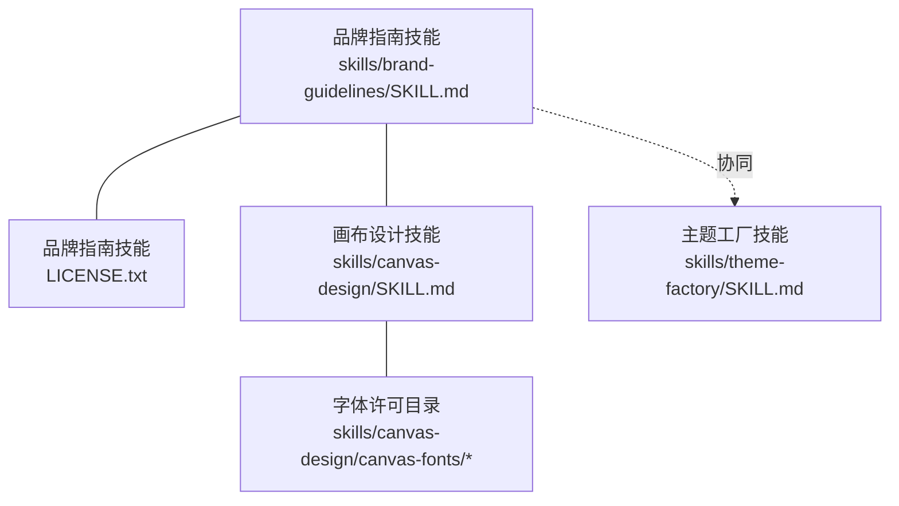
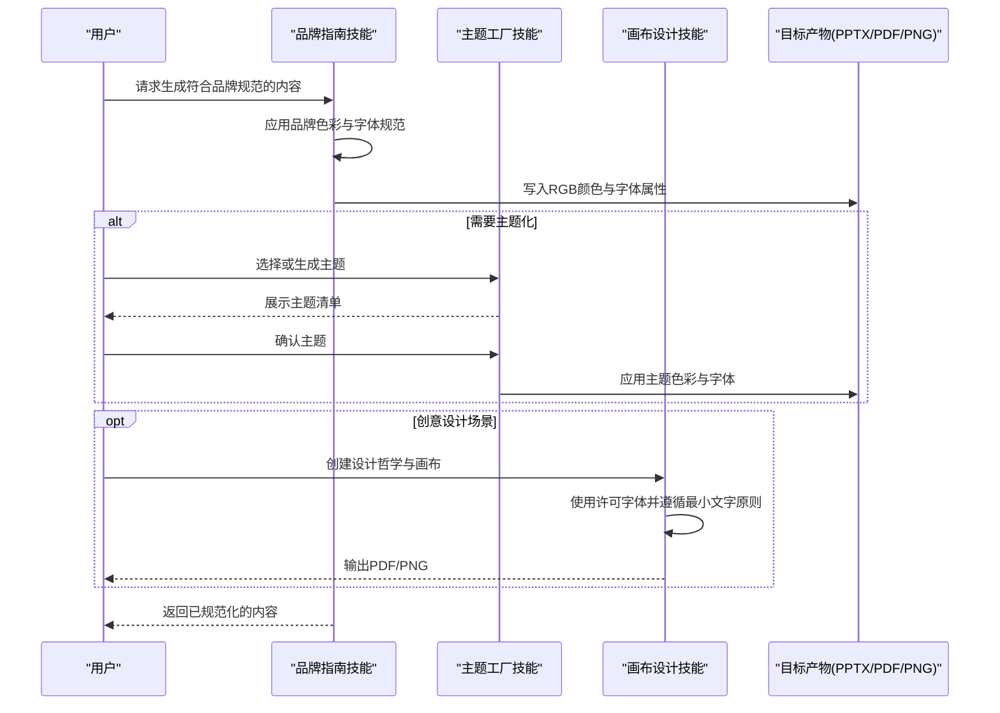
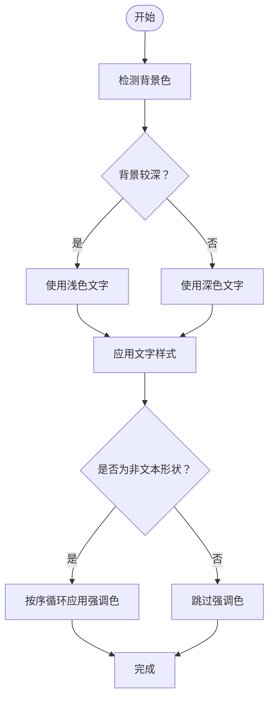
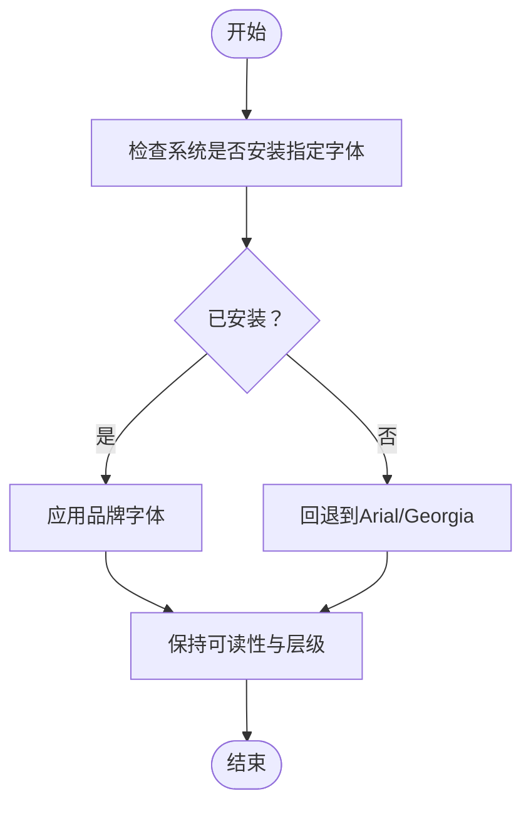
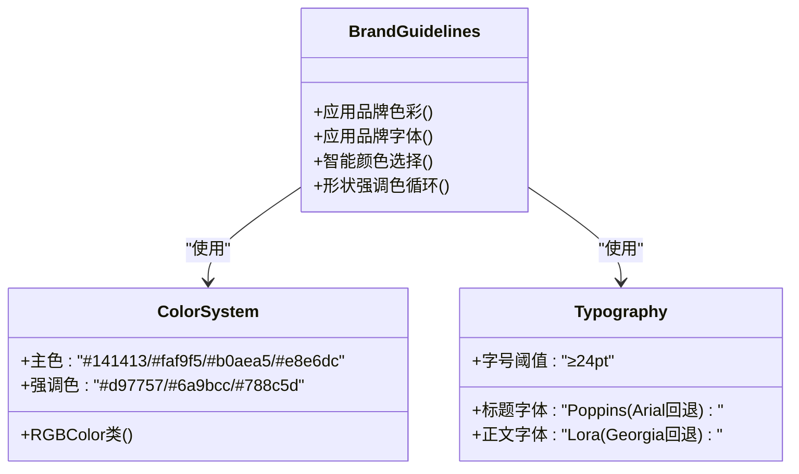

# 品牌指南技能

<cite>
**本文引用的文件**
- [brand-guidelines/SKILL.md](file://skills/brand-guidelines/SKILL.md)
- [brand-guidelines/LICENSE.txt](file://skills/brand-guidelines/LICENSE.txt)
- [canvas-design/SKILL.md](file://skills/canvas-design/SKILL.md)
- [canvas-design/canvas-fonts/ArsenalSC-OFL.txt](file://skills/canvas-design/canvas-fonts/ArsenalSC-OFL.txt)
- [canvas-design/canvas-fonts/Lora-OFL.txt](file://skills/canvas-design/canvas-fonts/Lora-OFL.txt)
- [canvas-design/canvas-fonts/WorkSans-OFL.txt](file://skills/canvas-design/canvas-fonts/WorkSans-OFL.txt)
- [theme-factory/SKILL.md](file://skills/theme-factory/SKILL.md)
</cite>

## 目录
1. [简介](#简介)
2. [项目结构](#项目结构)
3. [核心组件](#核心组件)
4. [架构总览](#架构总览)
5. [详细组件分析](#详细组件分析)
6. [依赖分析](#依赖分析)
7. [性能考虑](#性能考虑)
8. [故障排查指南](#故障排查指南)
9. [结论](#结论)
10. [附录](#附录)

## 简介
本文件面向“品牌指南技能”，系统化阐述其在规范AI生成内容中的作用与实施方式，重点解析以下方面：
- 在 SKILL.md 中定义的品牌一致性规则：色彩系统、字体选择与回退策略、文本样式与形状/强调色应用原则
- 如何作为强制性检查点，防止AI输出偏离企业品牌形象
- 实际应用场景示例：生成市场宣传材料时自动应用品牌规范
- 与创意设计类技能（如 theme-factory）的协同关系
- 通过更新 SKILL.md 指令实现品牌升级的方法
- 配置方法、使用限制与常见问题排查建议

## 项目结构
品牌指南技能位于 skills/brand-guidelines 目录，核心为 SKILL.md 与 LICENSE.txt；同时与 canvas-design 的字体许可文件存在关联，便于理解字体使用边界；与 theme-factory 提供的主题体系形成互补。

图表来源
- [brand-guidelines/SKILL.md](file://skills/brand-guidelines/SKILL.md#L1-L74)
- [brand-guidelines/LICENSE.txt](file://skills/brand-guidelines/LICENSE.txt#L1-L202)
- [canvas-design/SKILL.md](file://skills/canvas-design/SKILL.md#L1-L130)
- [canvas-design/canvas-fonts/ArsenalSC-OFL.txt](file://skills/canvas-design/canvas-fonts/ArsenalSC-OFL.txt#L1-L94)
- [theme-factory/SKILL.md](file://skills/theme-factory/SKILL.md#L1-L60)

章节来源
- [brand-guidelines/SKILL.md](file://skills/brand-guidelines/SKILL.md#L1-L74)
- [canvas-design/SKILL.md](file://skills/canvas-design/SKILL.md#L1-L130)
- [theme-factory/SKILL.md](file://skills/theme-factory/SKILL.md#L1-L60)

## 核心组件
- 品牌色彩系统：主色与强调色的精确色值与使用场景
- 字体与排版：标题与正文的字体选择、字号阈值与回退策略
- 文本样式：基于背景的智能颜色选择与层级保留
- 形状与强调色：非文本图形的强调色循环应用
- 技术实现细节：颜色应用采用 RGB 值并通过 python-pptx 的 RGBColor 类实现跨系统一致性

章节来源
- [brand-guidelines/SKILL.md](file://skills/brand-guidelines/SKILL.md#L15-L74)

## 架构总览
品牌指南技能在生成流程中扮演“后处理/规范化”角色，确保各类产物（如演示文稿、报告、海报等）符合企业品牌规范。其与主题工厂技能形成互补：前者提供严格的色彩与字体规范，后者提供可选的主题集合与应用流程。画布设计技能则提供创意表达与字体许可边界，帮助在艺术创作中合法合规地使用字体。

图表来源
- [brand-guidelines/SKILL.md](file://skills/brand-guidelines/SKILL.md#L15-L74)
- [theme-factory/SKILL.md](file://skills/theme-factory/SKILL.md#L1-L60)
- [canvas-design/SKILL.md](file://skills/canvas-design/SKILL.md#L1-L130)

## 详细组件分析

### 组件A：品牌色彩系统与应用
- 主色与强调色：明确主色与强调色的精确色值，用于正文、背景、次要元素与强调图形
- 背景与文字对比：根据背景色智能选择文字颜色，保证可读性与对比度
- 形状与强调色：非文本图形使用强调色循环，保持视觉统一与活力

图表来源
- [brand-guidelines/SKILL.md](file://skills/brand-guidelines/SKILL.md#L15-L59)

章节来源
- [brand-guidelines/SKILL.md](file://skills/brand-guidelines/SKILL.md#L15-L59)

### 组件B：字体选择与回退策略
- 标题字体与正文字体：标题（≥24pt）与正文分别指定字体，确保层级清晰
- 回退机制：若系统未安装指定字体，则自动回退到 Arial/Georgia，保证可读性
- 环境准备：建议预装 Poppins 与 Lora 以获得最佳一致性

图表来源
- [brand-guidelines/SKILL.md](file://skills/brand-guidelines/SKILL.md#L32-L67)

章节来源
- [brand-guidelines/SKILL.md](file://skills/brand-guidelines/SKILL.md#L32-L67)

### 组件C：技术实现与跨系统一致性
- 颜色精度：使用 RGB 值进行精确匹配
- 应用方式：通过 python-pptx 的 RGBColor 类写入颜色，确保跨平台一致性
- 可移植性：无需额外字体安装，直接利用系统字体

图表来源
- [brand-guidelines/SKILL.md](file://skills/brand-guidelines/SKILL.md#L15-L74)

章节来源
- [brand-guidelines/SKILL.md](file://skills/brand-guidelines/SKILL.md#L15-L74)

### 组件D：与创意设计类技能的协同
- 画布设计技能强调“视觉表达、空间传达、极少文字”的理念，并要求使用许可字体。品牌指南技能在此基础上提供严格的色彩与字体规范，确保创意作品在保持艺术性的同时不偏离企业品牌。
- 字体许可参考：画布设计技能的 canvas-fonts 目录包含多份 OFL 许可文件，用于确认字体的再分发与嵌入条件。

图表来源
- [canvas-design/SKILL.md](file://skills/canvas-design/SKILL.md#L1-L130)
- [canvas-design/canvas-fonts/ArsenalSC-OFL.txt](file://skills/canvas-design/canvas-fonts/ArsenalSC-OFL.txt#L1-L94)
- [canvas-design/canvas-fonts/Lora-OFL.txt](file://skills/canvas-design/canvas-fonts/Lora-OFL.txt#L1-L94)
- [canvas-design/canvas-fonts/WorkSans-OFL.txt](file://skills/canvas-design/canvas-fonts/WorkSans-OFL.txt#L1-L94)
- [theme-factory/SKILL.md](file://skills/theme-factory/SKILL.md#L1-L60)

章节来源
- [canvas-design/SKILL.md](file://skills/canvas-design/SKILL.md#L1-L130)
- [canvas-design/canvas-fonts/ArsenalSC-OFL.txt](file://skills/canvas-design/canvas-fonts/ArsenalSC-OFL.txt#L1-L94)
- [canvas-design/canvas-fonts/Lora-OFL.txt](file://skills/canvas-design/canvas-fonts/Lora-OFL.txt#L1-L94)
- [canvas-design/canvas-fonts/WorkSans-OFL.txt](file://skills/canvas-design/canvas-fonts/WorkSans-OFL.txt#L1-L94)
- [theme-factory/SKILL.md](file://skills/theme-factory/SKILL.md#L1-L60)

## 依赖分析
- 内部依赖
  - 品牌指南技能依赖于主题工厂技能提供的主题化能力（当需要在品牌规范内进一步定制主题时）
  - 画布设计技能提供字体许可与创意表达框架，保障字体使用的合法性与艺术性
- 外部依赖
  - python-pptx 的 RGBColor 类用于颜色写入
  - 系统字体（Poppins、Lora）或回退字体（Arial、Georgia）

图表来源
- [brand-guidelines/SKILL.md](file://skills/brand-guidelines/SKILL.md#L60-L74)
- [theme-factory/SKILL.md](file://skills/theme-factory/SKILL.md#L1-L60)
- [canvas-design/SKILL.md](file://skills/canvas-design/SKILL.md#L1-L130)

章节来源
- [brand-guidelines/SKILL.md](file://skills/brand-guidelines/SKILL.md#L60-L74)
- [theme-factory/SKILL.md](file://skills/theme-factory/SKILL.md#L1-L60)
- [canvas-design/SKILL.md](file://skills/canvas-design/SKILL.md#L1-L130)

## 性能考虑
- 字体加载与渲染：优先使用系统已安装字体，避免运行时字体下载或转换带来的延迟
- 颜色写入：批量应用 RGB 值时尽量合并写入操作，减少对底层对象模型的重复访问
- 可读性优先：在跨平台展示时，确保对比度满足可读性要求，避免因颜色差异导致的阅读困难

## 故障排查指南
- 症状：字体显示异常或回退到默认字体
  - 排查要点：确认系统是否安装 Poppins 与 Lora；若未安装，将自动回退至 Arial/Georgia
  - 建议：预装品牌字体以获得最佳一致性
- 症状：颜色在不同设备上呈现不一致
  - 排查要点：确认使用 RGB 值而非其他色彩模式；确保通过 RGBColor 类写入
  - 建议：在目标平台上进行对比测试，必要时微调强调色饱和度
- 症状：创意设计中字体版权风险
  - 排查要点：核对字体许可文件（OFL），确认允许嵌入与再分发
  - 建议：仅使用许可目录内的字体，并遵守许可条款
- 症状：主题化与品牌规范冲突
  - 排查要点：主题工厂技能提供主题清单；若现有主题不符合品牌规范，可生成自定义主题并在品牌规范内应用
  - 建议：先展示主题清单，再进行主题选择与应用

章节来源
- [brand-guidelines/SKILL.md](file://skills/brand-guidelines/SKILL.md#L32-L74)
- [canvas-design/canvas-fonts/ArsenalSC-OFL.txt](file://skills/canvas-design/canvas-fonts/ArsenalSC-OFL.txt#L1-L94)
- [theme-factory/SKILL.md](file://skills/theme-factory/SKILL.md#L1-L60)

## 结论
品牌指南技能通过严格的色彩与字体规范，将企业品牌一致性嵌入到AI生成流程中，成为防止输出偏离品牌标准的强制性检查点。它与主题工厂技能互补，既保证了规范性，又提供了主题化的灵活性；与画布设计技能协同，确保创意表达在合法合规的前提下实现专业级视觉效果。通过更新 SKILL.md 指令，可以平滑实现品牌升级与规范演进。

## 附录

### 配置方法
- 环境准备
  - 安装品牌字体：Poppins（标题）、Lora（正文），以获得最佳一致性
  - 确保系统具备 Arial（标题回退）与 Georgia（正文回退）
- 应用步骤
  - 在生成流程中启用品牌指南技能，使其对最终产物进行品牌化处理
  - 若需要主题化，先使用主题工厂技能展示主题清单并选择合适主题，再由品牌指南技能进行颜色与字体的最终校验与应用
  - 在创意设计场景下，遵循画布设计技能的最小文字原则，并使用许可字体

章节来源
- [brand-guidelines/SKILL.md](file://skills/brand-guidelines/SKILL.md#L32-L74)
- [theme-factory/SKILL.md](file://skills/theme-factory/SKILL.md#L1-L60)
- [canvas-design/SKILL.md](file://skills/canvas-design/SKILL.md#L1-L130)

### 使用限制
- 字体许可：仅可在许可范围内使用字体；嵌入与再分发需遵循 OFL 条款
- 平台兼容：跨平台展示时，颜色与字体可能受系统设置影响，应进行对比验证
- 主题冲突：若主题工厂技能的主题与品牌规范不一致，需生成自定义主题并在品牌规范内应用

章节来源
- [canvas-design/canvas-fonts/Lora-OFL.txt](file://skills/canvas-design/canvas-fonts/Lora-OFL.txt#L1-L94)
- [canvas-design/canvas-fonts/WorkSans-OFL.txt](file://skills/canvas-design/canvas-fonts/WorkSans-OFL.txt#L1-L94)
- [theme-factory/SKILL.md](file://skills/theme-factory/SKILL.md#L1-L60)

### 常见问题排查清单
- 字体未安装导致回退：预装品牌字体或接受回退方案
- 颜色不一致：使用 RGB 值并通过 RGBColor 类写入
- 版权风险：核对字体许可文件，仅使用许可字体
- 主题冲突：生成自定义主题并在品牌规范内应用

章节来源
- [brand-guidelines/SKILL.md](file://skills/brand-guidelines/SKILL.md#L32-L74)
- [canvas-design/canvas-fonts/ArsenalSC-OFL.txt](file://skills/canvas-design/canvas-fonts/ArsenalSC-OFL.txt#L1-L94)
- [theme-factory/SKILL.md](file://skills/theme-factory/SKILL.md#L1-L60)