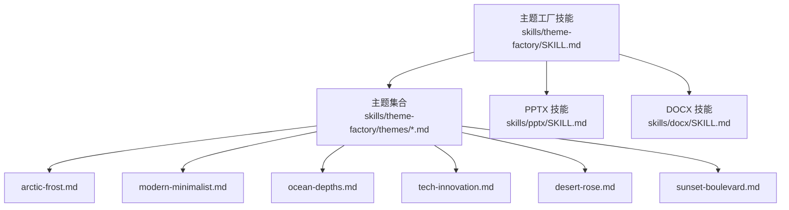
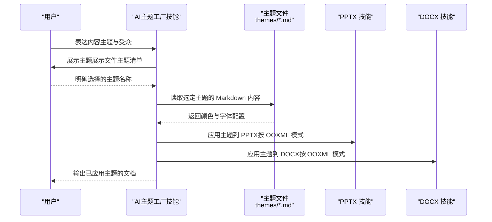
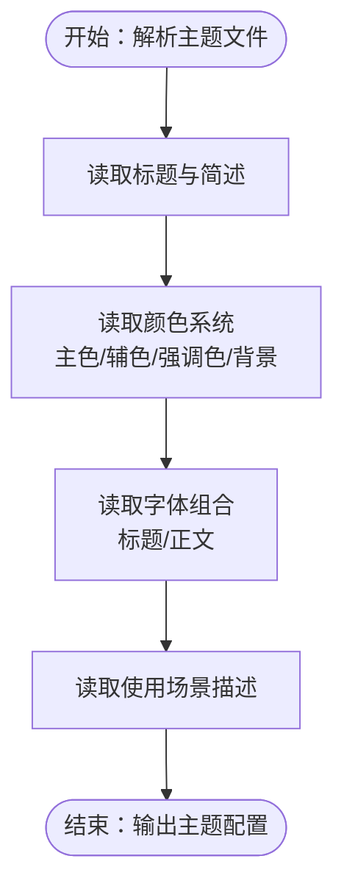
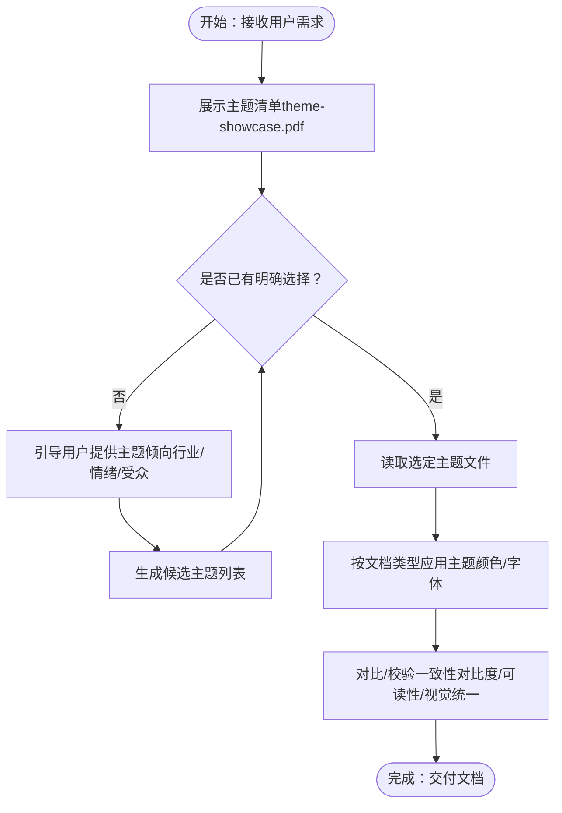
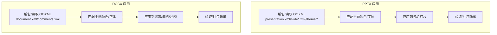
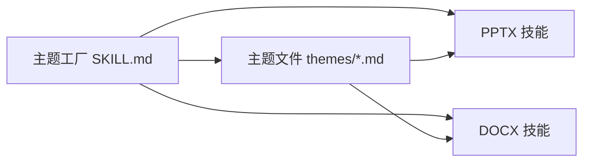

# 主题工厂技能

<cite>
**本文引用的文件**
- [README.md](file://README.md)
- [template/SKILL.md](file://template/SKILL.md)
- [skills/theme-factory/SKILL.md](file://skills/theme-factory/SKILL.md)
- [skills/theme-factory/themes/arctic-frost.md](file://skills/theme-factory/themes/arctic-frost.md)
- [skills/theme-factory/themes/modern-minimalist.md](file://skills/theme-factory/themes/modern-minimalist.md)
- [skills/theme-factory/themes/ocean-depths.md](file://skills/theme-factory/themes/ocean-depths.md)
- [skills/theme-factory/themes/tech-innovation.md](file://skills/theme-factory/themes/tech-innovation.md)
- [skills/theme-factory/themes/desert-rose.md](file://skills/theme-factory/themes/desert-rose.md)
- [skills/theme-factory/themes/sunset-boulevard.md](file://skills/theme-factory/themes/sunset-boulevard.md)
- [skills/pptx/SKILL.md](file://skills/pptx/SKILL.md)
- [skills/docx/SKILL.md](file://skills/docx/SKILL.md)
</cite>

## 目录
1. [简介](#简介)
2. [项目结构](#项目结构)
3. [核心组件](#核心组件)
4. [架构总览](#架构总览)
5. [详细组件分析](#详细组件分析)
6. [依赖关系分析](#依赖关系分析)
7. [性能考量](#性能考量)
8. [故障排查指南](#故障排查指南)
9. [结论](#结论)
10. [附录](#附录)

## 简介
本文件系统化梳理“主题工厂技能”的设计与应用，围绕预设主题的结构设计与应用逻辑展开，重点以 arctic-frost.md 为例，剖析其色彩系统（冷色调主色、高饱和点缀）、排版规则（字体组合、间距层级）与情绪板定义；说明 SKILL.md 如何引导 AI 根据用户需求匹配合适主题，并实现跨文档（PPTX、DOCX）的一致性应用；介绍主题文件的 Markdown 结构规范，包括元数据字段、样式示例与使用场景描述；最后提供主题扩展指南，帮助开发者创建新主题并确保与现有系统兼容。

## 项目结构
主题工厂技能位于 skills/theme-factory 目录下，包含：
- 主技能说明：SKILL.md
- 预设主题集合：themes/*.md（共 10 个主题）
- 与跨文档应用相关的参考技能：pptx、docx 的 SKILL.md

图表来源
- [skills/theme-factory/SKILL.md](file://skills/theme-factory/SKILL.md#L1-L60)
- [skills/theme-factory/themes/arctic-frost.md](file://skills/theme-factory/themes/arctic-frost.md#L1-L20)
- [skills/pptx/SKILL.md](file://skills/pptx/SKILL.md#L1-L120)
- [skills/docx/SKILL.md](file://skills/docx/SKILL.md#L1-L120)

章节来源
- [README.md](file://README.md#L1-L95)
- [skills/theme-factory/SKILL.md](file://skills/theme-factory/SKILL.md#L1-L60)

## 核心组件
- 主技能说明（SKILL.md）：定义主题工厂的目的、可用主题清单、应用流程与自定义主题生成指引。
- 主题文件（themes/*.md）：每个主题以 Markdown 结构化定义颜色系统、字体组合与适用场景。
- 跨文档应用参考（PPTX、DOCX 技能）：提供 OOXML/模板机制与文本替换流程，为主题在 PPTX/DOCX 中的一致应用提供方法论支撑。

章节来源
- [skills/theme-factory/SKILL.md](file://skills/theme-factory/SKILL.md#L1-L60)
- [skills/theme-factory/themes/arctic-frost.md](file://skills/theme-factory/themes/arctic-frost.md#L1-L20)
- [skills/pptx/SKILL.md](file://skills/pptx/SKILL.md#L1-L120)
- [skills/docx/SKILL.md](file://skills/docx/SKILL.md#L1-L120)

## 架构总览
主题工厂技能通过“主题选择—主题读取—样式应用—一致性验证”的闭环实现跨文档的主题化输出。AI 在收到用户需求后，先展示主题展示文件供用户选择，再读取对应主题文件中的颜色与字体配置，最终在目标文档中应用这些样式。

图表来源
- [skills/theme-factory/SKILL.md](file://skills/theme-factory/SKILL.md#L19-L57)
- [skills/pptx/SKILL.md](file://skills/pptx/SKILL.md#L1-L120)
- [skills/docx/SKILL.md](file://skills/docx/SKILL.md#L1-L120)

## 详细组件分析

### 组件A：主题文件结构规范（以 arctic-frost.md 为例）
- 标题与简述：明确主题名称与情绪板定位。
- 颜色系统：列出主色、辅色、强调色与背景色，建议提供十六进制值以便直接映射到设计系统。
- 字体组合：分别给出标题与正文的字体族，保证可读性与层次感。
- 使用场景：描述适合的应用领域，便于 AI 做上下文匹配。

图表来源
- [skills/theme-factory/themes/arctic-frost.md](file://skills/theme-factory/themes/arctic-frost.md#L1-L20)

章节来源
- [skills/theme-factory/themes/arctic-frost.md](file://skills/theme-factory/themes/arctic-frost.md#L1-L20)
- [skills/theme-factory/themes/modern-minimalist.md](file://skills/theme-factory/themes/modern-minimalist.md#L1-L20)
- [skills/theme-factory/themes/ocean-depths.md](file://skills/theme-factory/themes/ocean-depths.md#L1-L20)
- [skills/theme-factory/themes/tech-innovation.md](file://skills/theme-factory/themes/tech-innovation.md#L1-L20)
- [skills/theme-factory/themes/desert-rose.md](file://skills/theme-factory/themes/desert-rose.md#L1-L20)
- [skills/theme-factory/themes/sunset-boulevard.md](file://skills/theme-factory/themes/sunset-boulevard.md#L1-L20)

### 组件B：主题匹配与应用流程（SKILL.md）
- 目的与范围：为演示文稿与各类文档提供一致的专业风格。
- 使用步骤：展示主题清单、确认选择、读取主题、应用样式、保持视觉一致性。
- 自定义主题：当现有主题不满足时，基于输入生成新主题并复核后再应用。

图表来源
- [skills/theme-factory/SKILL.md](file://skills/theme-factory/SKILL.md#L19-L57)

章节来源
- [skills/theme-factory/SKILL.md](file://skills/theme-factory/SKILL.md#L1-L60)

### 组件C：跨文档一致性应用（PPTX/DOCX 参考）
- PPTX 技能要点：支持 OOXML 解包/编辑、布局与模板复用、文本替换与格式保留、主题与配色提取等，为主题在幻灯片中的落地提供技术路径。
- DOCX 技能要点：支持 OOXML 编辑、跟踪修订、注释与复杂格式处理，为文档主题化提供基础设施。

图表来源
- [skills/pptx/SKILL.md](file://skills/pptx/SKILL.md#L1-L120)
- [skills/docx/SKILL.md](file://skills/docx/SKILL.md#L1-L120)

章节来源
- [skills/pptx/SKILL.md](file://skills/pptx/SKILL.md#L1-L120)
- [skills/docx/SKILL.md](file://skills/docx/SKILL.md#L1-L120)

### 组件D：主题文件 Markdown 规范
- 元数据字段（来自模板 SKILL.md）：name、description 等，用于技能注册与检索。
- 主题文件结构（来自主题文件）：标题、简述、颜色系统、字体组合、使用场景。
- 建议补充：对比度与可访问性提示、字号层级与行距建议、图标/边框等视觉元素的使用建议。

章节来源
- [template/SKILL.md](file://template/SKILL.md#L1-L7)
- [skills/theme-factory/themes/arctic-frost.md](file://skills/theme-factory/themes/arctic-frost.md#L1-L20)

### 组件E：主题扩展指南
- 新主题命名：与现有主题风格一致，体现主题情绪与适用场景。
- 颜色系统设计：主色、辅色、强调色与背景色的搭配，建议提供十六进制值。
- 字体组合：标题与正文的字体族选择，确保可读性与层次。
- 使用场景：明确适用行业或场合，便于 AI 匹配。
- 验证与复核：生成后展示给用户确认，再进行应用。

章节来源
- [skills/theme-factory/SKILL.md](file://skills/theme-factory/SKILL.md#L58-L60)

## 依赖关系分析
- 主题工厂技能依赖于主题文件的结构化定义，AI 通过读取主题文件中的颜色与字体配置，将其映射到目标文档。
- PPTX/DOCX 技能提供底层的 OOXML 编辑能力，使主题在不同文档类型中得以一致呈现。
- 主题清单由主题工厂技能统一管理，AI 在应用前先进行可视化展示与确认。

图表来源
- [skills/theme-factory/SKILL.md](file://skills/theme-factory/SKILL.md#L19-L57)
- [skills/theme-factory/themes/arctic-frost.md](file://skills/theme-factory/themes/arctic-frost.md#L1-L20)
- [skills/pptx/SKILL.md](file://skills/pptx/SKILL.md#L1-L120)
- [skills/docx/SKILL.md](file://skills/docx/SKILL.md#L1-L120)

章节来源
- [skills/theme-factory/SKILL.md](file://skills/theme-factory/SKILL.md#L19-L57)
- [skills/pptx/SKILL.md](file://skills/pptx/SKILL.md#L1-L120)
- [skills/docx/SKILL.md](file://skills/docx/SKILL.md#L1-L120)

## 性能考量
- 主题读取与解析：主题文件为纯文本 Markdown，解析成本低，适合在对话过程中快速加载。
- 文档应用阶段：PPTX/DOCX 的 OOXML 处理涉及解包、修改与打包，应尽量批量处理以减少重复 IO。
- 对比度与可读性：在应用主题时优先检查对比度，避免频繁重算，可在主题定义中提供对比度建议以降低运行期开销。

## 故障排查指南
- 主题未生效：检查主题文件是否正确读取，确认颜色与字体配置是否被正确映射到目标文档。
- 文档格式异常：在 PPTX/DOCX 的 OOXML 编辑后需进行验证与打包，避免结构损坏。
- 用户偏好不明确：若用户未提供明确主题倾向，可引导其描述行业、情绪或受众，以缩小候选范围。

章节来源
- [skills/pptx/SKILL.md](file://skills/pptx/SKILL.md#L171-L181)
- [skills/docx/SKILL.md](file://skills/docx/SKILL.md#L130-L142)

## 结论
主题工厂技能通过标准化的主题文件结构与清晰的应用流程，实现了跨文档（PPTX、DOCX）的一致性主题化输出。以 arctic-frost.md 为代表的预设主题体现了冷色调主色与高饱和点缀的色彩系统、清晰的字体组合与明确的使用场景；SKILL.md 提供了从主题选择到应用的完整方法论。结合 PPTX/DOCX 技能的 OOXML 能力，可确保主题在不同文档类型中稳定落地。开发者可遵循本文档提供的结构规范与扩展指南，创建符合品牌与业务需求的新主题，并与现有系统保持兼容。

## 附录
- 主题文件示例路径
  - [arctic-frost.md](file://skills/theme-factory/themes/arctic-frost.md#L1-L20)
  - [modern-minimalist.md](file://skills/theme-factory/themes/modern-minimalist.md#L1-L20)
  - [ocean-depths.md](file://skills/theme-factory/themes/ocean-depths.md#L1-L20)
  - [tech-innovation.md](file://skills/theme-factory/themes/tech-innovation.md#L1-L20)
  - [desert-rose.md](file://skills/theme-factory/themes/desert-rose.md#L1-L20)
  - [sunset-boulevard.md](file://skills/theme-factory/themes/sunset-boulevard.md#L1-L20)
- 技能模板与规范
  - [template/SKILL.md](file://template/SKILL.md#L1-L7)
- 跨文档应用参考
  - [skills/pptx/SKILL.md](file://skills/pptx/SKILL.md#L1-L120)
  - [skills/docx/SKILL.md](file://skills/docx/SKILL.md#L1-L120)