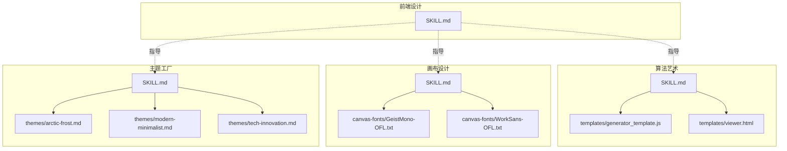
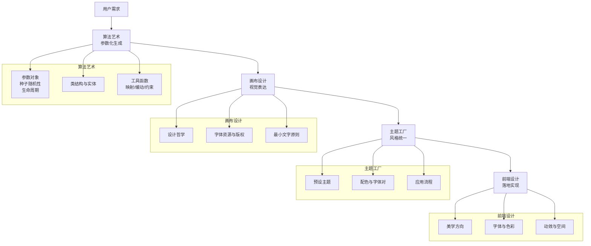
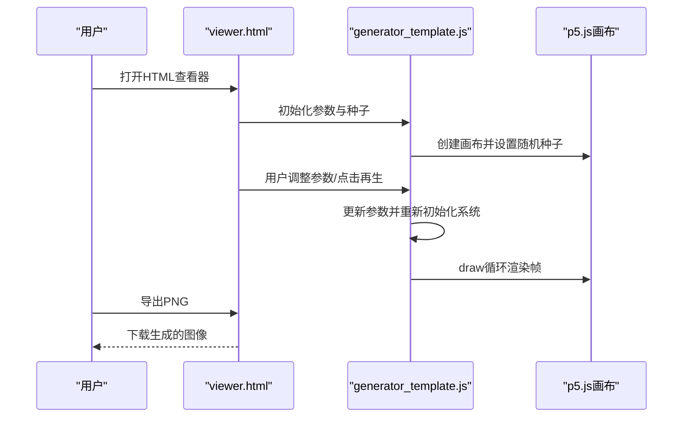
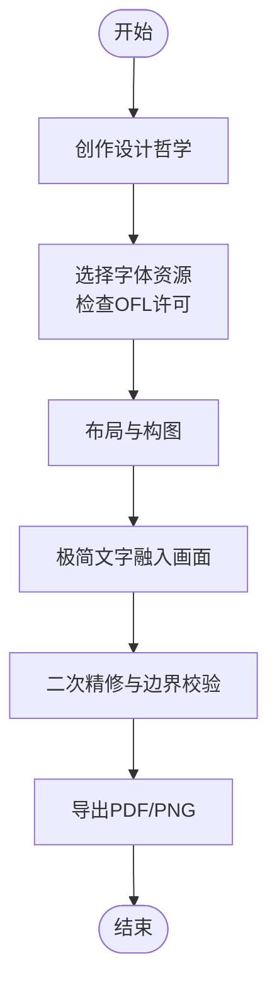
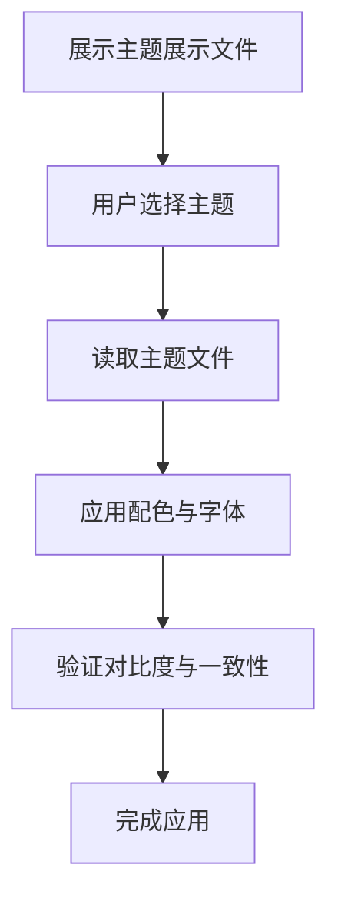

# 创意设计技能

<cite>
**本文引用的文件**
- [algorithmic-art/SKILL.md](file://skills/algorithmic-art/SKILL.md)
- [algorithmic-art/templates/generator_template.js](file://skills/algorithmic-art/templates/generator_template.js)
- [algorithmic-art/templates/viewer.html](file://skills/algorithmic-art/templates/viewer.html)
- [canvas-design/SKILL.md](file://skills/canvas-design/SKILL.md)
- [theme-factory/SKILL.md](file://skills/theme-factory/SKILL.md)
- [theme-factory/themes/arctic-frost.md](file://skills/theme-factory/themes/arctic-frost.md)
- [theme-factory/themes/modern-minimalist.md](file://skills/theme-factory/themes/modern-minimalist.md)
- [theme-factory/themes/tech-innovation.md](file://skills/theme-factory/themes/tech-innovation.md)
- [frontend-design/SKILL.md](file://skills/frontend-design/SKILL.md)
- [canvas-design/canvas-fonts/GeistMono-OFL.txt](file://skills/canvas-design/canvas-fonts/GeistMono-OFL.txt)
- [canvas-design/canvas-fonts/WorkSans-OFL.txt](file://skills/canvas-design/canvas-fonts/WorkSans-OFL.txt)
</cite>

## 目录
1. [引言](#引言)
2. [项目结构](#项目结构)
3. [核心组件](#核心组件)
4. [架构总览](#架构总览)
5. [详细组件分析](#详细组件分析)
6. [依赖关系分析](#依赖关系分析)
7. [性能考量](#性能考量)
8. [故障排查指南](#故障排查指南)
9. [结论](#结论)
10. [附录](#附录)

## 引言
本文件面向“创意设计技能”的四个核心方向：算法艺术、画布设计、主题工厂与前端设计。目标是帮助用户理解并高效使用这些技能，以生成具有特定美学风格的创意作品，覆盖从参数化算法到品牌一致的UI输出。文档将重点解释：
- 算法艺术如何通过模板实现参数化艺术生成，包括动画曲线、颜色渐变与几何变换的编程控制；
- 画布设计中字体资源（如GeistMono、WorkSans）的管理与视觉表达；
- 主题工厂的预设主题系统与样式定义逻辑；
- 四项技能如何协同支持前端设计任务，实现品牌一致的UI输出；
- 提供创意参数调优指南与典型应用场景。

## 项目结构
该仓库采用按技能划分的目录结构，每个技能包含独立的说明文档、模板与资源。算法艺术与画布设计提供可复用的模板与字体资源；主题工厂提供预设主题与应用流程；前端设计提供美学与实现指导。

图表来源
- [algorithmic-art/SKILL.md](file://skills/algorithmic-art/SKILL.md#L1-L60)
- [algorithmic-art/templates/generator_template.js](file://skills/algorithmic-art/templates/generator_template.js#L1-L60)
- [algorithmic-art/templates/viewer.html](file://skills/algorithmic-art/templates/viewer.html#L1-L60)
- [canvas-design/SKILL.md](file://skills/canvas-design/SKILL.md#L1-L60)
- [theme-factory/SKILL.md](file://skills/theme-factory/SKILL.md#L1-L60)
- [theme-factory/themes/arctic-frost.md](file://skills/theme-factory/themes/arctic-frost.md#L1-L20)
- [theme-factory/themes/modern-minimalist.md](file://skills/theme-factory/themes/modern-minimalist.md#L1-L20)
- [theme-factory/themes/tech-innovation.md](file://skills/theme-factory/themes/tech-innovation.md#L1-L20)
- [frontend-design/SKILL.md](file://skills/frontend-design/SKILL.md#L1-L43)

章节来源
- [algorithmic-art/SKILL.md](file://skills/algorithmic-art/SKILL.md#L1-L60)
- [canvas-design/SKILL.md](file://skills/canvas-design/SKILL.md#L1-L60)
- [theme-factory/SKILL.md](file://skills/theme-factory/SKILL.md#L1-L60)
- [frontend-design/SKILL.md](file://skills/frontend-design/SKILL.md#L1-L43)

## 核心组件
- 算法艺术（algorithmic-art）
  - 通过模板组织参数、使用种子随机性保证可重现性、提供类结构与实用函数，支撑静态/动态/交互式生成。
- 画布设计（canvas-design）
  - 以设计哲学为起点，强调空间、色彩、构图与极简文字；提供字体资源清单与使用规范。
- 主题工厂（theme-factory）
  - 提供10个预设主题，每个主题包含配色与字体对，支持统一风格应用与自定义主题生成。
- 前端设计（frontend-design）
  - 指导构建生产级前端界面，强调字体选择、色彩与主题一致性、动效与空间构成。

章节来源
- [algorithmic-art/SKILL.md](file://skills/algorithmic-art/SKILL.md#L130-L211)
- [canvas-design/SKILL.md](file://skills/canvas-design/SKILL.md#L1-L60)
- [theme-factory/SKILL.md](file://skills/theme-factory/SKILL.md#L1-L60)
- [frontend-design/SKILL.md](file://skills/frontend-design/SKILL.md#L1-L43)

## 架构总览
四类技能在创意产出流程中形成“理念—实现—风格—落地”的闭环：
- 算法艺术：以哲学为内核，用参数化算法与种子随机性生成可探索的艺术；模板提供一致的交互体验。
- 画布设计：以视觉哲学为内核，用字体与版式表达信息；字体资源确保版权合规与风格统一。
- 主题工厂：以主题为内核，提供配色与字体组合，保障跨文档的一致性与专业度。
- 前端设计：以美学为内核，构建生产级界面，强调差异化与细节打磨。

图表来源
- [algorithmic-art/SKILL.md](file://skills/algorithmic-art/SKILL.md#L130-L211)
- [algorithmic-art/templates/generator_template.js](file://skills/algorithmic-art/templates/generator_template.js#L1-L60)
- [canvas-design/SKILL.md](file://skills/canvas-design/SKILL.md#L100-L117)
- [theme-factory/SKILL.md](file://skills/theme-factory/SKILL.md#L1-L60)
- [frontend-design/SKILL.md](file://skills/frontend-design/SKILL.md#L20-L43)

## 详细组件分析

### 组件A：算法艺术（algorithmic-art）
- 参数化组织与种子随机性
  - 将所有可调参数集中在一个对象中，便于连接UI控件、重置默认值与序列化配置；使用种子初始化随机数与噪声，确保可重现性。
- 生命周期与类结构
  - setup阶段完成画布创建与系统初始化；draw阶段支持静态生成、连续动画或用户触发再生；当涉及多实体时使用类封装状态与渲染。
- 实用函数与性能
  - 提供颜色工具、映射与缓动、边界约束等通用函数；针对大规模元素给出性能建议（预计算、简单碰撞检测、向量高效使用）。
- 动画曲线、颜色渐变与几何变换
  - 使用噪声场与缓动函数控制粒子运动轨迹与时间演化；通过颜色工具与配色数组实现渐变与层次；利用向量与角度函数实现几何变换与方向控制。
- 交互与导出
  - 提供参数更新与再生机制；支持导出PNG图像，便于保存与分享。

图表来源
- [algorithmic-art/templates/viewer.html](file://skills/algorithmic-art/templates/viewer.html#L440-L599)
- [algorithmic-art/templates/generator_template.js](file://skills/algorithmic-art/templates/generator_template.js#L1-L120)

章节来源
- [algorithmic-art/SKILL.md](file://skills/algorithmic-art/SKILL.md#L130-L211)
- [algorithmic-art/templates/generator_template.js](file://skills/algorithmic-art/templates/generator_template.js#L1-L223)
- [algorithmic-art/templates/viewer.html](file://skills/algorithmic-art/templates/viewer.html#L1-L599)

### 组件B：画布设计（canvas-design）
- 设计哲学与视觉表达
  - 以形式、空间、色彩、构图为出发点，强调信息通过空间与视觉传达而非文字；文本作为稀疏的视觉点缀。
- 字体资源与版权
  - 提供多种字体的OFL许可文件，确保在设计中合法使用；鼓励将字体融入画面本身，而非仅作排版。
- 最小文字原则与边界控制
  - 文字应稀少且与画面融合；严格控制元素边界与留白，避免重叠与溢出。

图表来源
- [canvas-design/SKILL.md](file://skills/canvas-design/SKILL.md#L100-L117)
- [canvas-design/canvas-fonts/GeistMono-OFL.txt](file://skills/canvas-design/canvas-fonts/GeistMono-OFL.txt#L1-L94)
- [canvas-design/canvas-fonts/WorkSans-OFL.txt](file://skills/canvas-design/canvas-fonts/WorkSans-OFL.txt#L1-L94)

章节来源
- [canvas-design/SKILL.md](file://skills/canvas-design/SKILL.md#L1-L130)
- [canvas-design/canvas-fonts/GeistMono-OFL.txt](file://skills/canvas-design/canvas-fonts/GeistMono-OFL.txt#L1-L94)
- [canvas-design/canvas-fonts/WorkSans-OFL.txt](file://skills/canvas-design/canvas-fonts/WorkSans-OFL.txt#L1-L94)

### 组件C：主题工厂（theme-factory）
- 预设主题系统
  - 提供10个主题，每个主题包含配色表、字体对与适用场景说明；主题文件结构清晰，便于解析与应用。
- 应用流程
  - 展示主题展示文件供用户选择；根据选择读取对应主题文件并应用于目标文档或页面；确保对比度与可读性。
- 自定义主题
  - 当现有主题不满足需求时，基于输入生成新主题，经审核后应用。

图表来源
- [theme-factory/SKILL.md](file://skills/theme-factory/SKILL.md#L1-L60)
- [theme-factory/themes/arctic-frost.md](file://skills/theme-factory/themes/arctic-frost.md#L1-L20)
- [theme-factory/themes/modern-minimalist.md](file://skills/theme-factory/themes/modern-minimalist.md#L1-L20)
- [theme-factory/themes/tech-innovation.md](file://skills/theme-factory/themes/tech-innovation.md#L1-L20)

章节来源
- [theme-factory/SKILL.md](file://skills/theme-factory/SKILL.md#L1-L60)
- [theme-factory/themes/arctic-frost.md](file://skills/theme-factory/themes/arctic-frost.md#L1-L20)
- [theme-factory/themes/modern-minimalist.md](file://skills/theme-factory/themes/modern-minimalist.md#L1-L20)
- [theme-factory/themes/tech-innovation.md](file://skills/theme-factory/themes/tech-innovation.md#L1-L20)

### 组件D：前端设计（frontend-design）
- 设计思维与美学方向
  - 明确目的、语气与约束，选择极端化的美学方向并精准执行；避免通用AI风格，追求独特性与记忆点。
- 字体、色彩与动效
  - 选用有个性的字体组合；使用CSS变量保持一致性；通过高影响力动效与微交互提升体验；背景与细节需与整体风格匹配。
- 复杂度与执行精度
  - 根据美学方向匹配实现复杂度；最大化地打磨细节，确保每个元素都服务于整体风格。

章节来源
- [frontend-design/SKILL.md](file://skills/frontend-design/SKILL.md#L1-L43)

## 依赖关系分析
- 算法艺术与画布设计
  - 算法艺术生成的图像可作为画布设计的素材基础；两者共同服务于视觉表达与信息传达。
- 画布设计与主题工厂
  - 画布设计中的字体与配色需遵循主题工厂提供的主题规范，确保跨文档一致性。
- 主题工厂与前端设计
  - 主题工厂的主题文件可直接用于前端设计的样式体系，保证品牌风格在网页端的一致呈现。
- 算法艺术与前端设计
  - 算法艺术的交互体验与导出能力可迁移到前端设计中，作为可视化组件或演示页面的一部分。

图表来源
- [algorithmic-art/SKILL.md](file://skills/algorithmic-art/SKILL.md#L130-L211)
- [canvas-design/SKILL.md](file://skills/canvas-design/SKILL.md#L100-L117)
- [theme-factory/SKILL.md](file://skills/theme-factory/SKILL.md#L1-L60)
- [frontend-design/SKILL.md](file://skills/frontend-design/SKILL.md#L20-L43)

章节来源
- [algorithmic-art/SKILL.md](file://skills/algorithmic-art/SKILL.md#L130-L211)
- [canvas-design/SKILL.md](file://skills/canvas-design/SKILL.md#L100-L117)
- [theme-factory/SKILL.md](file://skills/theme-factory/SKILL.md#L1-L60)
- [frontend-design/SKILL.md](file://skills/frontend-design/SKILL.md#L20-L43)

## 性能考量
- 算法艺术
  - 控制元素数量与计算复杂度，优先使用预计算与高效数据结构；在需要平滑动画时关注帧率与重绘成本。
- 画布设计
  - 合理使用字体与栅格，避免过度渲染；注意导出分辨率与文件体积平衡。
- 主题工厂
  - 在前端应用主题时，尽量使用CSS变量与轻量级样式切换，减少DOM重排。
- 前端设计
  - 优先使用CSS动画与硬件加速；对复杂动效进行节流与懒加载处理。

[本节为通用指导，无需列出具体文件来源]

## 故障排查指南
- 算法艺术
  - 若种子相同但结果不同，检查是否正确初始化了随机种子与噪声种子；确认参数对象未被意外修改。
  - 若导出失败，检查导出函数调用与画布尺寸设置。
- 画布设计
  - 若字体显示异常，确认字体已下载并在项目中可用；检查OFL许可与使用范围。
  - 若文字与图形重叠，调整留白与边界约束。
- 主题工厂
  - 若主题应用后对比度不足，调整配色或补充对比色；确保字体与背景的可读性。
- 前端设计
  - 若动效卡顿，减少重绘区域或降低动画复杂度；检查浏览器兼容性与性能监控工具。

章节来源
- [algorithmic-art/templates/generator_template.js](file://skills/algorithmic-art/templates/generator_template.js#L1-L120)
- [algorithmic-art/templates/viewer.html](file://skills/algorithmic-art/templates/viewer.html#L440-L599)
- [canvas-design/SKILL.md](file://skills/canvas-design/SKILL.md#L100-L117)
- [theme-factory/SKILL.md](file://skills/theme-factory/SKILL.md#L1-L60)
- [frontend-design/SKILL.md](file://skills/frontend-design/SKILL.md#L20-L43)

## 结论
通过算法艺术的参数化生成、画布设计的视觉哲学、主题工厂的品牌风格统一以及前端设计的生产级实现，可以系统化地输出高质量的创意作品。建议在实际项目中：
- 先以算法艺术生成探索参数空间，再以画布设计固化视觉语言；
- 以主题工厂确保跨文档风格一致；
- 在前端设计中复用主题与算法艺术的交互体验，形成完整的设计与交付闭环。

[本节为总结性内容，无需列出具体文件来源]

## 附录

### 创意参数调优指南（算法艺术）
- 种子与可重现性
  - 使用种子初始化随机与噪声，确保相同输入产生相同输出；适合批量探索与版本对比。
- 参数组织
  - 将可调参数集中在参数对象中，便于UI绑定与重置；区分“数量/尺度/概率/角度/阈值”等类别。
- 动画曲线与缓动
  - 使用缓动函数控制速度曲线，使运动更自然；结合噪声场实现有机变化。
- 颜色与渐变
  - 使用配色数组与颜色工具函数，建立主色、辅色与强调色的层次；通过透明度与混合模式增强深度。
- 几何变换
  - 利用向量与角度函数实现旋转、缩放与位移；在类结构中封装实体的状态与渲染逻辑。
- 性能优化
  - 预计算与简化运算；限制昂贵操作；在需要时降低元素数量或简化计算。

章节来源
- [algorithmic-art/SKILL.md](file://skills/algorithmic-art/SKILL.md#L130-L211)
- [algorithmic-art/templates/generator_template.js](file://skills/algorithmic-art/templates/generator_template.js#L1-L223)

### 字体资源与版权（画布设计）
- 字体许可
  - 使用OFL许可字体，确保可嵌入与修改；在设计中合法使用字体资源。
- 字体选择
  - 根据主题与受众选择合适的字体组合；将字体融入画面，而非仅作排版。
- 版权合规
  - 严格遵守字体许可条款，避免商业用途限制与保留名称使用限制。

章节来源
- [canvas-design/SKILL.md](file://skills/canvas-design/SKILL.md#L100-L117)
- [canvas-design/canvas-fonts/GeistMono-OFL.txt](file://skills/canvas-design/canvas-fonts/GeistMono-OFL.txt#L1-L94)
- [canvas-design/canvas-fonts/WorkSans-OFL.txt](file://skills/canvas-design/canvas-fonts/WorkSans-OFL.txt#L1-L94)

### 典型应用场景
- 社交媒体视觉素材生成
  - 使用算法艺术生成可探索的参数化作品，结合主题工厂的配色与字体，快速产出系列化视觉素材。
- 产品原型配色方案设计
  - 以主题工厂为主题蓝本，结合画布设计的最小文字原则，输出品牌一致的原型配色与字体方案。
- 前端落地与演示
  - 将算法艺术的交互体验与导出能力集成到前端设计中，构建可视化演示页面或交互组件。

章节来源
- [theme-factory/SKILL.md](file://skills/theme-factory/SKILL.md#L1-L60)
- [canvas-design/SKILL.md](file://skills/canvas-design/SKILL.md#L100-L117)
- [frontend-design/SKILL.md](file://skills/frontend-design/SKILL.md#L20-L43)