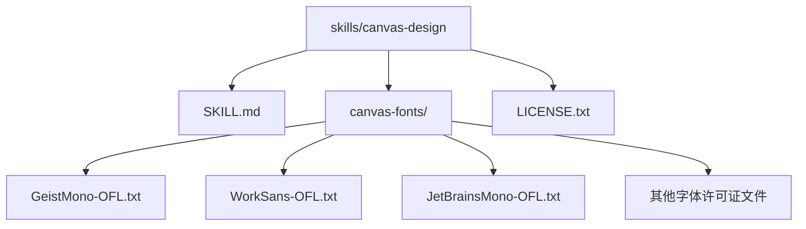
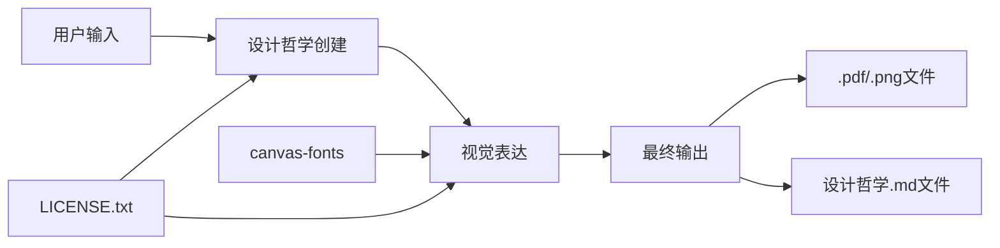
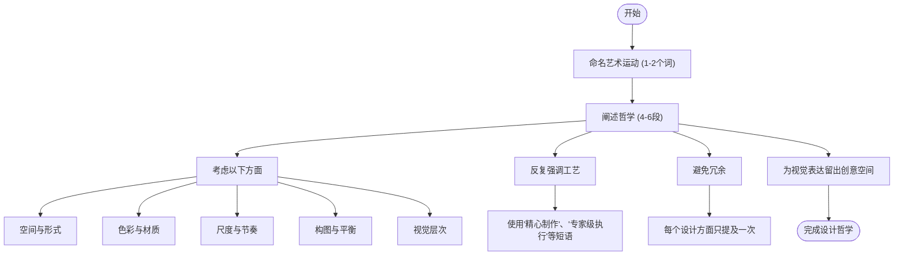
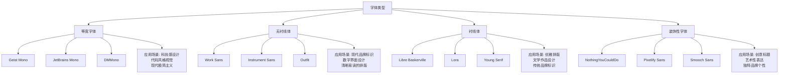
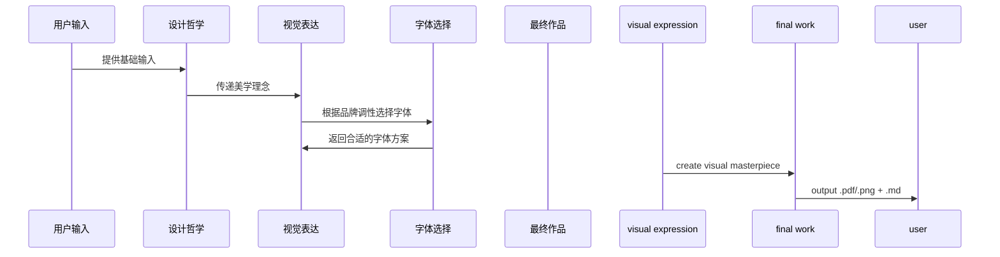
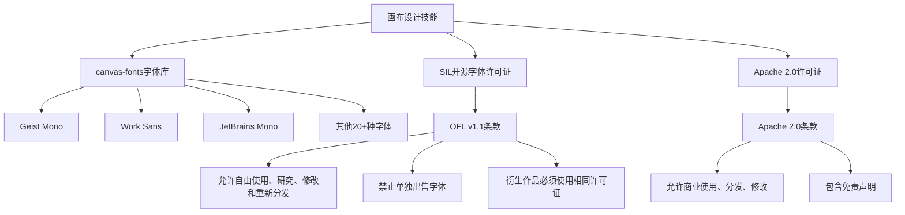

# 画布设计技能

<cite>
**本文档引用的文件**
- [SKILL.md](file://skills/canvas-design/SKILL.md)
- [LICENSE.txt](file://skills/canvas-design/LICENSE.txt)
- [GeistMono-OFL.txt](file://skills/canvas-design/canvas-fonts/GeistMono-OFL.txt)
- [WorkSans-OFL.txt](file://skills/canvas-design/canvas-fonts/WorkSans-OFL.txt)
- [JetBrainsMono-OFL.txt](file://skills/canvas-design/canvas-fonts/JetBrainsMono-OFL.txt)
- [THIRD_PARTY_NOTICES.md](file://THIRD_PARTY_NOTICES.md)
</cite>

## 目录
1. [简介](#简介)
2. [项目结构](#项目结构)
3. [核心组件](#核心组件)
4. [架构概述](#架构概述)
5. [详细组件分析](#详细组件分析)
6. [依赖分析](#依赖分析)
7. [性能考虑](#性能考虑)
8. [故障排除指南](#故障排除指南)
9. [结论](#结论)
10. [附录](#附录)（如有必要）

## 简介
画布设计技能旨在通过设计哲学创造精美的视觉艺术作品，输出格式为.png和.pdf文档。该技能的核心在于将美学理念转化为视觉表达，强调形式、空间、色彩和构图的视觉传达。设计过程中始终遵循专家级工艺标准，确保最终作品呈现出经过精心打磨的艺术品质。本技能特别注重字体资源在视觉表达中的核心作用，通过精心选择和搭配字体来匹配品牌调性，实现从科技感到优雅排版的多样化设计风格。

## 项目结构
画布设计技能的文件组织结构清晰，主要包含设计指令文件、字体资源库和许可证文件。核心功能由SKILL.md文件定义，其中详细描述了设计哲学的创建流程和视觉表达规范。字体资源集中存储在canvas-fonts目录下，每个字体都配有相应的开源许可证文件，确保合规使用。

**图示来源**
- [SKILL.md](file://skills/canvas-design/SKILL.md#L1-L130)
- [canvas-fonts/](file://skills/canvas-design/canvas-fonts#L1-L20)

## 核心组件
画布设计技能的核心组件包括设计哲学创建引擎和视觉表达系统。设计哲学创建引擎负责生成美学理念，强调视觉表达、空间沟通和艺术诠释。视觉表达系统则将这些理念转化为具体的视觉作品，确保90%的内容为视觉设计，10%为必要的文字信息。整个流程分为两个关键步骤：首先创建设计哲学（.md文件），然后在画布上进行视觉表达（.pdf或.png文件）。

**章节来源**
- [SKILL.md](file://skills/canvas-design/SKILL.md#L7-L117)

## 架构概述
画布设计技能的架构采用两阶段处理模式：设计哲学生成和视觉创作。第一阶段侧重于抽象美学理念的构建，第二阶段专注于将这些理念转化为具体的视觉作品。整个系统强调专家级工艺，要求每个细节都经过精心打磨，呈现出仿佛耗费无数小时完成的艺术品质。字体资源作为关键设计元素，被战略性地应用于增强作品的视觉冲击力和品牌一致性。

**图示来源**
- [SKILL.md](file://skills/canvas-design/SKILL.md#L1-L130)
- [LICENSE.txt](file://skills/canvas-design/LICENSE.txt#L1-L202)

## 详细组件分析

### 设计哲学创建分析
设计哲学创建是画布设计技能的第一步，其目标是构建一个美学运动的视觉哲学。这个过程不受用户输入的严格约束，而是将其作为创意基础。创建的哲学必须强调视觉表达、空间沟通和艺术诠释，同时反复强调作品应呈现出专家级工艺的特点。

#### 设计哲学创建流程

**图示来源**
- [SKILL.md](file://skills/canvas-design/SKILL.md#L15-L85)

### 字体资源分析
字体资源在画布设计技能中扮演着至关重要的角色，直接影响作品的视觉风格和品牌调性。系统提供了丰富的开源字体选择，每种字体都有其独特的视觉特征和适用场景。

#### 字体类型与应用场景

**图示来源**
- [SKILL.md](file://skills/canvas-design/SKILL.md#L108-L110)
- [canvas-fonts/](file://skills/canvas-design/canvas-fonts#L1-L20)

### 视觉表达分析
视觉表达阶段是将设计哲学转化为具体作品的关键环节。此过程要求创作者深入理解设计哲学，并通过视觉元素将其完整呈现。文本在此阶段仅作为视觉元素的补充，始终保持最小化原则。

#### 视觉表达流程

**Diagram sources**
- [SKILL.md](file://skills/canvas-design/SKILL.md#L100-L117)
- [canvas-fonts/](file://skills/canvas-design/canvas-fonts#L1-L20)

## 依赖分析
画布设计技能的依赖关系清晰明确，主要依赖于字体资源库和开源许可证框架。所有字体均采用SIL开源字体许可证（OFL）v1.1，确保了合法合规的使用。系统架构避免了复杂的外部依赖，保持了设计流程的独立性和完整性。

**图示来源**
- [LICENSE.txt](file://skills/canvas-design/LICENSE.txt#L1-L202)
- [GeistMono-OFL.txt](file://skills/canvas-design/canvas-fonts/GeistMono-OFL.txt#L1-L94)
- [WorkSans-OFL.txt](file://skills/canvas-design/canvas-fonts/WorkSans-OFL.txt#L1-L94)
- [JetBrainsMono-OFL.txt](file://skills/canvas-design/canvas-fonts/JetBrainsMono-OFL.txt#L1-L94)

## 性能考虑
画布设计技能的性能主要体现在设计效率和资源管理上。由于所有字体资源都已预先加载并本地存储，字体选择和应用过程快速高效。系统设计避免了网络依赖，确保了设计流程的稳定性和响应速度。对于复杂的设计任务，系统通过分阶段处理（设计哲学创建+视觉表达）来优化工作流程，提高整体效率。

## 故障排除指南
当遇到设计相关问题时，应首先检查设计哲学是否充分体现了专家级工艺的要求。如果视觉表达效果不理想，建议重新审视字体选择是否与品牌调性匹配。对于字体显示问题，确认所选字体是否属于canvas-fonts目录下的合规字体。若作品缺乏艺术感，应回到设计哲学阶段，强化对"精心制作"、"专家级执行"等工艺要求的描述。

**章节来源**
- [SKILL.md](file://skills/canvas-design/SKILL.md#L122-L127)

## 结论
画布设计技能通过系统化的设计哲学和丰富的字体资源库，实现了高质量视觉艺术作品的创建。该技能强调专家级工艺标准，要求每个设计细节都经过精心打磨。字体资源作为核心设计元素，通过合理的搭配和应用，能够有效匹配不同的品牌调性，从科技感到优雅排版均可完美呈现。整个系统架构简洁高效，依赖关系清晰，确保了设计流程的合规性和稳定性。

## 附录

### 字体配对建议
- **科技品牌**: Geist Mono + Work Sans - 等宽字体展现技术感，无衬线体确保可读性
- **奢侈品牌**: Libre Baskerville + Italiana - 衬线体传递优雅，手写体增添个性
- **创意机构**: Smooch Sans + Bricolage Grotesque - 装饰性字体突出创意，几何字体保持平衡
- **金融科技**: JetBrains Mono + Instrument Sans - 代码字体体现专业，现代字体传递创新

### 可访问性指南
- **对比度要求**: 文本与背景的对比度至少达到4.5:1（小文本）或3:1（大文本）
- **字号调整**: 移动端最小字号16px，桌面端最小字号14px，标题字号至少是正文的1.5倍
- **字体选择**: 避免使用过于装饰性的字体作为正文，确保在不同设备上都有良好的可读性
- **响应式设计**: 在小屏幕上优先使用无衬线体，减少字体种类，保持布局简洁