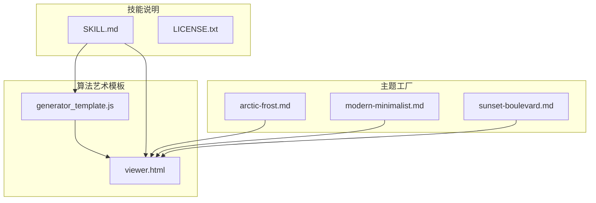
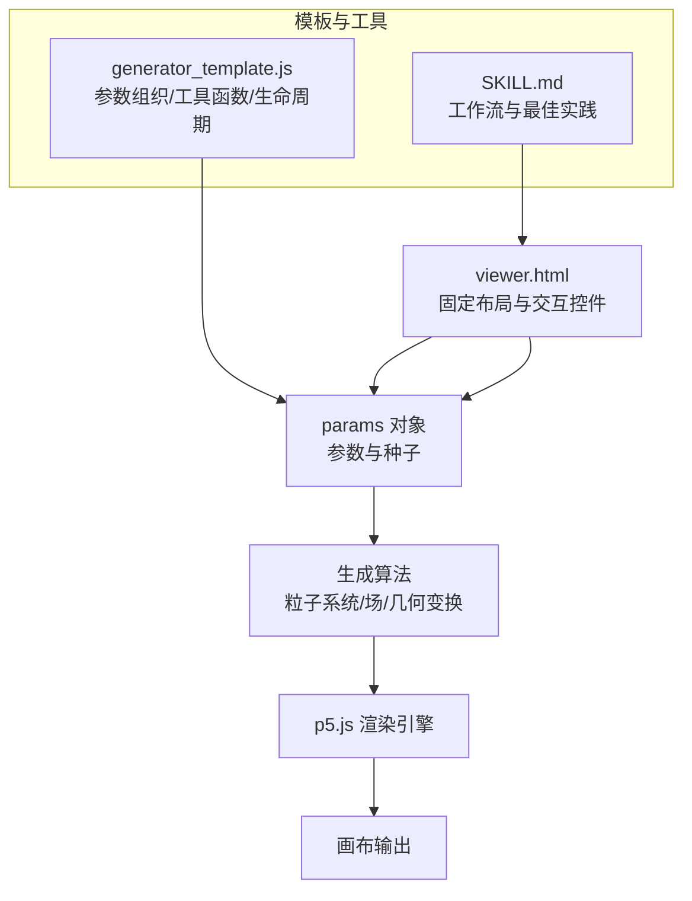
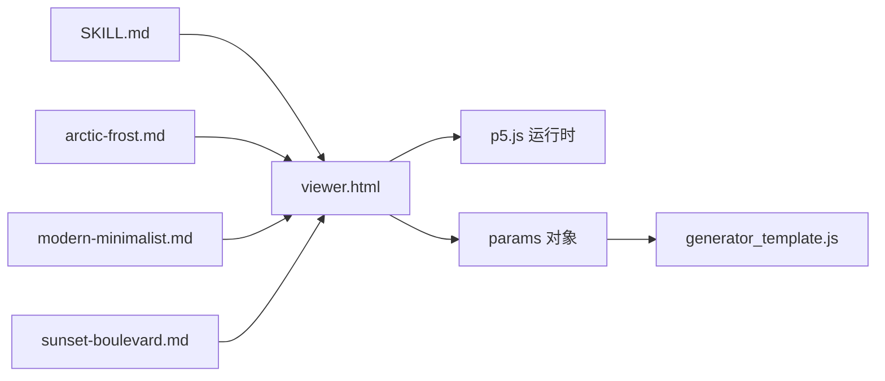

# 算法艺术技能

<cite>
**本文引用的文件**
- [generator_template.js](file://skills/algorithmic-art/templates/generator_template.js)
- [viewer.html](file://skills/algorithmic-art/templates/viewer.html)
- [SKILL.md](file://skills/algorithmic-art/SKILL.md)
- [LICENSE.txt](file://skills/algorithmic-art/LICENSE.txt)
- [arctic-frost.md](file://skills/theme-factory/themes/arctic-frost.md)
- [modern-minimalist.md](file://skills/theme-factory/themes/modern-minimalist.md)
- [sunset-boulevard.md](file://skills/theme-factory/themes/sunset-boulevard.md)
</cite>

## 目录
1. [简介](#简介)
2. [项目结构](#项目结构)
3. [核心组件](#核心组件)
4. [架构总览](#架构总览)
5. [详细组件分析](#详细组件分析)
6. [依赖关系分析](#依赖关系分析)
7. [性能考量](#性能考量)
8. [故障排查指南](#故障排查指南)
9. [结论](#结论)
10. [附录](#附录)

## 简介
本技术文档围绕算法艺术技能展开，重点解析以下内容：
- 如何在 JavaScript 模板中实现参数化生成逻辑（以 generator_template.js 为核心）
- viewer.html 如何实时渲染生成结果并提供交互式参数控制
- YAML 元数据中的 name 与 description 如何触发该技能
- 动画缓动函数、颜色渐变算法与几何变换矩阵在生成过程中的作用机制
- 如何通过调整脚本参数控制艺术输出的复杂度与风格
- 扩展新图形模式（如分形结构或粒子系统）的方法
- 常见问题排查与性能优化策略
- 与 theme-factory 配色方案的集成方式

## 项目结构
算法艺术技能由两部分组成：模板与技能说明文档。模板用于快速构建可交互的生成式艺术作品；技能说明文档定义了工作流程、参数组织原则与最佳实践。

图表来源
- [generator_template.js](file://skills/algorithmic-art/templates/generator_template.js#L1-L223)
- [viewer.html](file://skills/algorithmic-art/templates/viewer.html#L1-L599)
- [SKILL.md](file://skills/algorithmic-art/SKILL.md#L1-L405)
- [arctic-frost.md](file://skills/theme-factory/themes/arctic-frost.md#L1-L20)
- [modern-minimalist.md](file://skills/theme-factory/themes/modern-minimalist.md#L1-L20)
- [sunset-boulevard.md](file://skills/theme-factory/themes/sunset-boulevard.md#L1-L20)

章节来源
- [SKILL.md](file://skills/algorithmic-art/SKILL.md#L1-L405)

## 核心组件
- 参数化生成器模板（generator_template.js）
  - 统一参数组织、种子随机性、生命周期管理、类结构、性能建议、工具函数、导出能力等
- 可视化与交互模板（viewer.html）
  - 固定布局与 Anthropic 品牌风格、种子导航区、参数控制区、颜色选择区、动作区
  - 内置粒子系统骨架与 UI 控制函数，便于替换为自定义算法

章节来源
- [generator_template.js](file://skills/algorithmic-art/templates/generator_template.js#L24-L223)
- [viewer.html](file://skills/algorithmic-art/templates/viewer.html#L331-L599)
- [SKILL.md](file://skills/algorithmic-art/SKILL.md#L131-L305)

## 架构总览
算法艺术的运行时架构由“模板 + 参数 + 交互层 + 渲染层”构成。模板负责 UI 结构与交互事件绑定，参数对象驱动生成逻辑，渲染层基于 p5.js 实时绘制。

图表来源
- [viewer.html](file://skills/algorithmic-art/templates/viewer.html#L331-L599)
- [generator_template.js](file://skills/algorithmic-art/templates/generator_template.js#L24-L223)
- [SKILL.md](file://skills/algorithmic-art/SKILL.md#L131-L305)

## 详细组件分析

### 参数化生成逻辑（generator_template.js）
- 参数组织
  - 将所有可调参数集中在一个对象中，便于连接 UI 控件、重置默认值、序列化配置
  - 示例路径：[参数对象定义](file://skills/algorithmic-art/templates/generator_template.js#L24-L36)
- 种子随机性
  - 使用初始化函数统一设置随机种子与噪声种子，确保可重现性
  - 示例路径：[种子初始化函数](file://skills/algorithmic-art/templates/generator_template.js#L43-L47)
- 生命周期
  - setup 中完成画布创建、种子初始化与系统初始化；draw 支持静态、动画与用户触发再生三种模式
  - 示例路径：[setup/draw 模式](file://skills/algorithmic-art/templates/generator_template.js#L53-L84)
- 类结构
  - 当需要多个实体时使用类封装，分离更新与渲染逻辑
  - 示例路径：[Entity 类](file://skills/algorithmic-art/templates/generator_template.js#L92-L110)
- 性能考虑
  - 大规模元素时预计算、简化昂贵操作、合理使用向量与碰撞检测
  - 示例路径：[性能建议](file://skills/algorithmic-art/templates/generator_template.js#L116-L126)
- 工具函数
  - 颜色工具：十六进制转 RGB、从调色板取色
  - 映射与缓动：数值映射、三次缓动函数
  - 边界处理：环绕边界
  - 示例路径：[颜色与映射工具](file://skills/algorithmic-art/templates/generator_template.js#L131-L160)
- 参数更新与再生
  - 提供参数更新与系统再生接口，支持实时调整与全量重算
  - 示例路径：[参数更新与再生](file://skills/algorithmic-art/templates/generator_template.js#L165-L177)
- 常用模式
  - 透明背景淡入营造轨迹/尾迹效果
  - 使用噪声函数引入有机变化
  - 从角度构造向量
  - 示例路径：[常用模式](file://skills/algorithmic-art/templates/generator_template.js#L182-L198)
- 导出能力
  - 提供图像导出功能，按种子命名保存
  - 示例路径：[导出函数](file://skills/algorithmic-art/templates/generator_template.js#L203-L205)

章节来源
- [generator_template.js](file://skills/algorithmic-art/templates/generator_template.js#L24-L223)

### viewer.html 的实时渲染与交互
- 品牌与布局
  - 固定侧边栏结构（标题、副标题、种子区、参数区、颜色区、动作区），Anthropic 品牌色与字体
  - 示例路径：[样式与品牌色](file://skills/algorithmic-art/templates/viewer.html#L27-L70)
- 种子导航
  - 输入框、上一个/下一个、随机、跳转到指定种子；每次变更都会重新初始化系统
  - 示例路径：[种子控制函数](file://skills/algorithmic-art/templates/viewer.html#L533-L567)
- 参数控制
  - 数值滑条与值显示联动，实时更新参数并触发系统初始化
  - 示例路径：[参数更新函数](file://skills/algorithmic-art/templates/viewer.html#L522-L529)
- 颜色选择
  - 可选的颜色拾取器，支持动态更新调色板
  - 示例路径：[颜色更新函数](file://skills/algorithmic-art/templates/viewer.html#L526-L529)
- 系统初始化与渲染骨架
  - 初始化系统、生成流场、粒子数组与画布尺寸，移除加载提示
  - 示例路径：[初始化与渲染骨架](file://skills/algorithmic-art/templates/viewer.html#L475-L506)
- 粒子系统骨架
  - 留白处为粒子类与生成算法占位，需按哲学与参数填充
  - 示例路径：[粒子系统骨架](file://skills/algorithmic-art/templates/viewer.html#L507-L517)

章节来源
- [viewer.html](file://skills/algorithmic-art/templates/viewer.html#L331-L599)

### 缓动函数、颜色渐变与几何变换矩阵
- 动画缓动函数
  - 提供三次缓动函数，用于平滑过渡与非线性插值
  - 示例路径：[三次缓动函数](file://skills/algorithmic-art/templates/generator_template.js#L150-L152)
- 颜色渐变算法
  - 十六进制转 RGB、从调色板循环取色，支持多色彩渐变与对比
  - 示例路径：[颜色工具](file://skills/algorithmic-art/templates/generator_template.js#L131-L143)
- 几何变换矩阵
  - 使用向量从角度构造方向向量，支持旋转与缩放的基础变换
  - 示例路径：[向量工具](file://skills/algorithmic-art/templates/generator_template.js#L194-L197)

章节来源
- [generator_template.js](file://skills/algorithmic-art/templates/generator_template.js#L131-L198)

### YAML 元数据触发机制
- 技能元数据
  - SKILL.md 文件顶部包含 YAML 头部，其中 name 与 description 定义了技能标识与用途
  - 示例路径：[技能元数据](file://skills/algorithmic-art/SKILL.md#L1-L5)
- 触发条件
  - 当用户请求涉及“算法艺术、生成式艺术、流场、粒子系统”等内容时，系统依据元数据匹配并激活该技能
  - 示例路径：[技能描述与用途](file://skills/algorithmic-art/SKILL.md#L1-L5)

章节来源
- [SKILL.md](file://skills/algorithmic-art/SKILL.md#L1-L5)

### 调整脚本参数控制复杂度与风格
- 参数类型建议
  - 计数类：粒子数量、分支数量
  - 尺寸类：速度、间距、缩放
  - 概率类：事件发生概率、阈值
  - 角度类：旋转方向、扩散角
  - 示例路径：[参数组织建议](file://skills/algorithmic-art/templates/generator_template.js#L24-L36)
- 参数更新策略
  - 对于影响全局状态的参数（如计数、分辨率）采用全量再生；对局部行为（如速度、阈值）可实时更新
  - 示例路径：[参数更新与再生](file://skills/algorithmic-art/templates/generator_template.js#L165-L177)
- 风格控制
  - 通过噪声尺度、缓动曲线、颜色调色板与透明度混合，控制视觉节奏与层次
  - 示例路径：[常用模式与工具](file://skills/algorithmic-art/templates/generator_template.js#L182-L198)

章节来源
- [generator_template.js](file://skills/algorithmic-art/templates/generator_template.js#L24-L177)

### 扩展新图形模式
- 分形结构
  - 建议使用递归或 L-system 思想，结合噪声扰动打破完美对称，按层级衰减线条粗细
  - 参考路径：[哲学示例与实现思路](file://skills/algorithmic-art/SKILL.md#L64-L75)
- 粒子系统
  - 基于流场或噪声的粒子运动，结合轨迹长度与透明度混合形成密度场
  - 参考路径：[粒子系统骨架](file://skills/algorithmic-art/templates/viewer.html#L507-L517)
- 场与力
  - 使用二维场函数或 Perlin 噪声生成向量场，粒子沿场线移动
  - 参考路径：[流场生成占位](file://skills/algorithmic-art/templates/viewer.html#L499-L501)

章节来源
- [SKILL.md](file://skills/algorithmic-art/SKILL.md#L64-L75)
- [viewer.html](file://skills/algorithmic-art/templates/viewer.html#L499-L517)

### 与 theme-factory 配色方案的集成
- 主题文件结构
  - theme-factory 提供多种主题的配色与排版规范，可在 viewer.html 中直接复用品牌色变量
  - 示例路径：[Arctic Frost 主题](file://skills/theme-factory/themes/arctic-frost.md#L1-L20)
- 集成方式
  - 在 viewer.html 的根变量中引入主题色，保持 UI 与艺术风格一致
  - 示例路径：[品牌色变量](file://skills/algorithmic-art/templates/viewer.html#L27-L37)
- 适用场景
  - 不同主题适合不同风格的艺术表达：极简灰阶强调结构与留白，暖色调强调能量与活力，冷色调强调冷静与清晰
  - 示例路径：[Modern Minimalist](file://skills/theme-factory/themes/modern-minimalist.md#L1-L20)、[Sunset Boulevard](file://skills/theme-factory/themes/sunset-boulevard.md#L1-L20)

章节来源
- [arctic-frost.md](file://skills/theme-factory/themes/arctic-frost.md#L1-L20)
- [modern-minimalist.md](file://skills/theme-factory/themes/modern-minimalist.md#L1-L20)
- [sunset-boulevard.md](file://skills/theme-factory/themes/sunset-boulevard.md#L1-L20)
- [viewer.html](file://skills/algorithmic-art/templates/viewer.html#L27-L37)

## 依赖关系分析
- viewer.html 依赖 p5.js 运行时与模板中的参数与工具函数
- generator_template.js 为 viewer.html 提供参数组织与工具函数的参考实现
- SKILL.md 定义工作流与最佳实践，指导参数设计与 UI 控件映射
- theme-factory 主题文件为 UI 提供品牌色，不直接影响算法

图表来源
- [viewer.html](file://skills/algorithmic-art/templates/viewer.html#L23-L27)
- [generator_template.js](file://skills/algorithmic-art/templates/generator_template.js#L24-L36)
- [SKILL.md](file://skills/algorithmic-art/SKILL.md#L131-L305)
- [arctic-frost.md](file://skills/theme-factory/themes/arctic-frost.md#L1-L20)
- [modern-minimalist.md](file://skills/theme-factory/themes/modern-minimalist.md#L1-L20)
- [sunset-boulevard.md](file://skills/theme-factory/themes/sunset-boulevard.md#L1-L20)

## 性能考量
- 降低每帧计算成本
  - 预计算常量、减少三角函数与平方根调用次数
  - 使用 p5 向量高效运算，避免重复对象创建
- 控制元素规模
  - 限制粒子数量、降低网格分辨率、减少轨迹长度
- 动画帧率
  - 目标 60fps，必要时降低更新频率或关闭自动重绘
- 内存与垃圾回收
  - 及时释放不再使用的对象，避免频繁分配

章节来源
- [generator_template.js](file://skills/algorithmic-art/templates/generator_template.js#L116-L126)

## 故障排查指南
- 输出异常
  - 检查种子是否正确设置与传递，确认随机与噪声种子同步初始化
  - 示例路径：[种子初始化](file://skills/algorithmic-art/templates/generator_template.js#L43-L47)
  - 示例路径：[种子控制函数](file://skills/algorithmic-art/templates/viewer.html#L533-L567)
- 性能瓶颈
  - 优先检查粒子数量与每帧更新逻辑；必要时启用再生而非实时更新
  - 示例路径：[参数更新与再生](file://skills/algorithmic-art/templates/generator_template.js#L165-L177)
- UI 不响应
  - 确认滑条与输入框的 id 与 updateParam/updateColor 对应
  - 示例路径：[参数与颜色更新函数](file://skills/algorithmic-art/templates/viewer.html#L522-L529)
- 颜色不生效
  - 确认调色板数组存在且索引合法；检查颜色拾取器与值显示联动
  - 示例路径：[颜色工具](file://skills/algorithmic-art/templates/generator_template.js#L131-L143)
  - 示例路径：[颜色区控件](file://skills/algorithmic-art/templates/viewer.html#L391-L421)

章节来源
- [generator_template.js](file://skills/algorithmic-art/templates/generator_template.js#L43-L47)
- [viewer.html](file://skills/algorithmic-art/templates/viewer.html#L522-L567)

## 结论
算法艺术技能通过模板化的参数组织与交互界面，为生成式艺术创作提供了标准化的起点。借助 seeded 随机性与工具函数，开发者可以专注于算法哲学的表达；通过 viewer.html 的参数与种子控制，实现对复杂度与风格的精细调节。配合 theme-factory 的配色方案，既能保证 UI 的品牌一致性，又能突出艺术表现力。建议在实现新图形模式时，遵循参数化、可重现与高性能的原则，持续迭代以达到“精心打磨”的艺术效果。

## 附录
- 许可证
  - 算法艺术模板与技能文档遵循 Apache 2.0 许可
  - 示例路径：[许可证](file://skills/algorithmic-art/LICENSE.txt#L1-L202)

章节来源
- [LICENSE.txt](file://skills/algorithmic-art/LICENSE.txt#L1-L202)