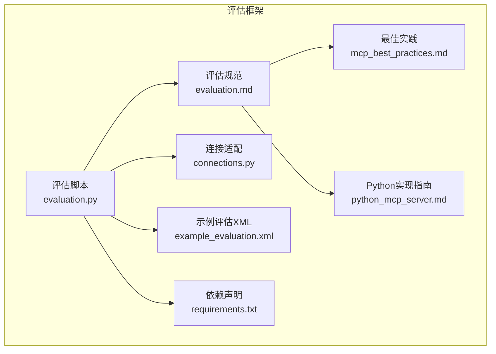
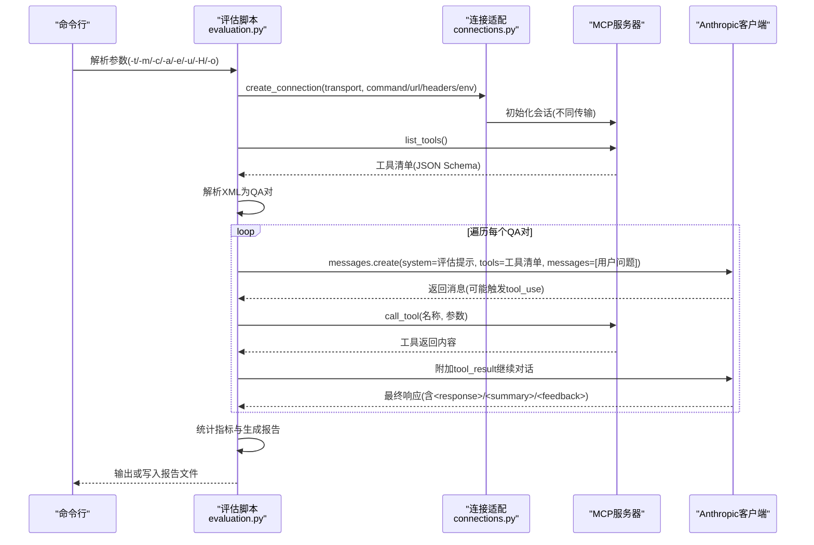
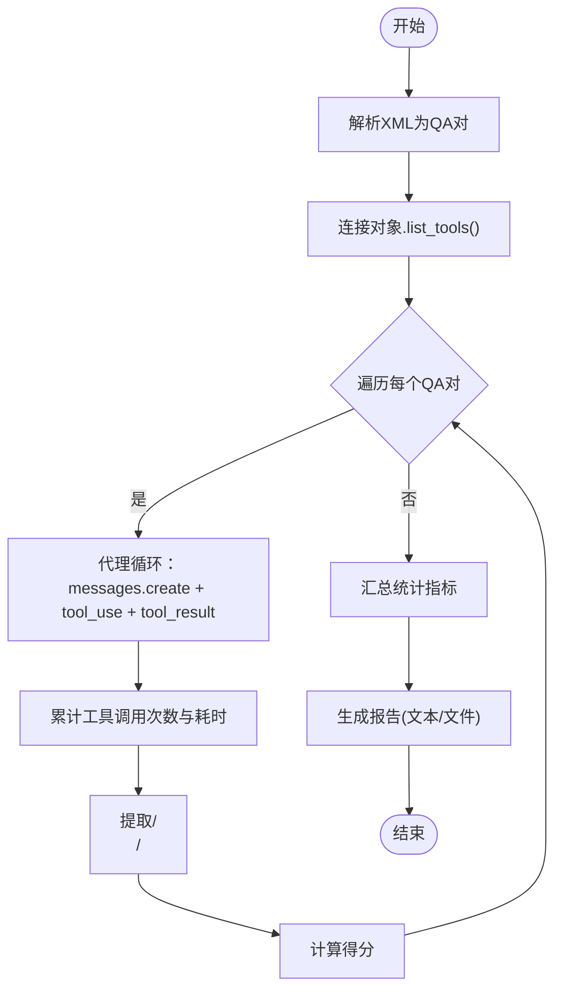
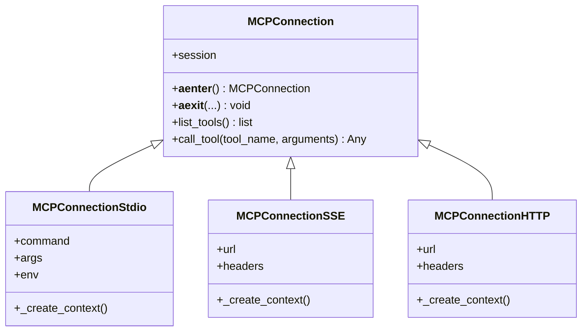
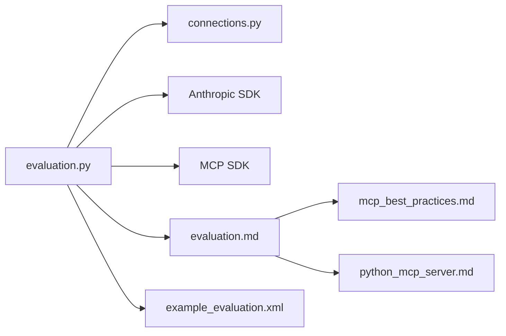

# MCP服务器评估框架

<cite>
**本文引用的文件**
- [evaluation.md](file://skills/mcp-builder/reference/evaluation.md)
- [evaluation.py](file://skills/mcp-builder/scripts/evaluation.py)
- [example_evaluation.xml](file://skills/mcp-builder/scripts/example_evaluation.xml)
- [connections.py](file://skills/mcp-builder/scripts/connections.py)
- [requirements.txt](file://skills/mcp-builder/scripts/requirements.txt)
- [mcp_best_practices.md](file://skills/mcp-builder/reference/mcp_best_practices.md)
- [python_mcp_server.md](file://skills/mcp-builder/reference/python_mcp_server.md)
</cite>

## 目录
1. [引言](#引言)
2. [项目结构](#项目结构)
3. [核心组件](#核心组件)
4. [架构总览](#架构总览)
5. [详细组件分析](#详细组件分析)
6. [依赖关系分析](#依赖关系分析)
7. [性能考量](#性能考量)
8. [故障排查指南](#故障排查指南)
9. [结论](#结论)
10. [附录](#附录)

## 引言
本文件系统化介绍MCP服务器的评估框架，依据评估规范文档，详细说明如何使用评估脚本验证MCP服务的合规性与稳定性。评估流程覆盖连接测试、工具发现、资源获取与错误场景模拟；并结合示例评估XML的结构，指导编写自定义评估场景。文档还提供评估结果解析方法、常见失败原因排查指南，并给出将评估集成到CI/CD流程的建议，以确保MCP服务的质量保障。

## 项目结构
评估框架位于技能仓库的“mcp-builder”子模块中，包含以下关键文件：
- 规范与指南：evaluation.md（评估规范）、mcp_best_practices.md（最佳实践）、python_mcp_server.md（Python实现指南）
- 评估执行器：evaluation.py（评估主程序）
- 连接适配层：connections.py（支持stdio、SSE、HTTP三种传输）
- 示例评估：example_evaluation.xml（示例QA对）
- 依赖声明：requirements.txt（第三方库）

图表来源
- [evaluation.py](file://skills/mcp-builder/scripts/evaluation.py#L1-L374)
- [connections.py](file://skills/mcp-builder/scripts/connections.py#L1-L152)
- [evaluation.md](file://skills/mcp-builder/reference/evaluation.md#L1-L602)
- [example_evaluation.xml](file://skills/mcp-builder/scripts/example_evaluation.xml#L1-L23)
- [requirements.txt](file://skills/mcp-builder/scripts/requirements.txt#L1-L3)
- [mcp_best_practices.md](file://skills/mcp-builder/reference/mcp_best_practices.md#L1-L250)
- [python_mcp_server.md](file://skills/mcp-builder/reference/python_mcp_server.md#L1-L719)

章节来源
- [evaluation.py](file://skills/mcp-builder/scripts/evaluation.py#L1-L374)
- [connections.py](file://skills/mcp-builder/scripts/connections.py#L1-L152)
- [evaluation.md](file://skills/mcp-builder/reference/evaluation.md#L1-L602)
- [example_evaluation.xml](file://skills/mcp-builder/scripts/example_evaluation.xml#L1-L23)
- [requirements.txt](file://skills/mcp-builder/scripts/requirements.txt#L1-L3)
- [mcp_best_practices.md](file://skills/mcp-builder/reference/mcp_best_practices.md#L1-L250)
- [python_mcp_server.md](file://skills/mcp-builder/reference/python_mcp_server.md#L1-L719)

## 核心组件
- 评估规范（evaluation.md）：定义评估目标、问题设计原则、稳定性要求、输出格式与验证流程，提供运行步骤与命令行选项说明。
- 评估脚本（evaluation.py）：加载评估XML、连接MCP服务器、列举工具、驱动代理循环调用工具、统计指标并生成报告。
- 连接适配（connections.py）：抽象MCP连接接口，分别实现stdio、SSE、HTTP三类传输，负责初始化会话、列出工具、调用工具。
- 示例评估XML（example_evaluation.xml）：展示标准的QA对结构，便于理解评估输入格式与答案要求。
- 依赖声明（requirements.txt）：声明Anthropic SDK与MCP SDK版本要求。
- 最佳实践（mcp_best_practices.md）：提供工具命名、响应格式、分页、传输选择、安全与错误处理等工程实践建议。
- Python实现指南（python_mcp_server.md）：面向Python MCP服务器实现，涵盖命名约定、工具注册、输入校验、响应格式、分页、错误处理、上下文注入、资源注册、生命周期管理与传输配置等。

章节来源
- [evaluation.md](file://skills/mcp-builder/reference/evaluation.md#L1-L602)
- [evaluation.py](file://skills/mcp-builder/scripts/evaluation.py#L1-L374)
- [connections.py](file://skills/mcp-builder/scripts/connections.py#L1-L152)
- [example_evaluation.xml](file://skills/mcp-builder/scripts/example_evaluation.xml#L1-L23)
- [requirements.txt](file://skills/mcp-builder/scripts/requirements.txt#L1-L3)
- [mcp_best_practices.md](file://skills/mcp-builder/reference/mcp_best_practices.md#L1-L250)
- [python_mcp_server.md](file://skills/mcp-builder/reference/python_mcp_server.md#L1-L719)

## 架构总览
评估执行链路如下：
- 命令行参数解析后创建连接对象（根据传输类型选择stdio/SSE/HTTP）
- 初始化MCP会话并列举可用工具
- 解析评估XML为QA对列表
- 并发或串行逐条执行任务：代理循环在工具调用间迭代，记录每个工具的调用次数与耗时
- 汇总统计指标（准确率、平均时长、平均工具调用数、总工具调用数），生成报告

图表来源
- [evaluation.py](file://skills/mcp-builder/scripts/evaluation.py#L1-L374)
- [connections.py](file://skills/mcp-builder/scripts/connections.py#L1-L152)

章节来源
- [evaluation.py](file://skills/mcp-builder/scripts/evaluation.py#L1-L374)
- [connections.py](file://skills/mcp-builder/scripts/connections.py#L1-L152)

## 详细组件分析

### 评估规范与流程
- 评估目标：衡量MCP服务器是否能通过LLM仅使用工具回答真实复杂问题，而非工具实现的完整性。
- 问题设计原则：
  - 独立、只读、非破坏性、幂等
  - 多跳、深度探索、可能涉及大量分页与历史数据
  - 答案必须可直接字符串比较、稳定且单一
- 输出格式：XML，包含多个<qa_pair>，每个包含<question>与<answer>。
- 验证流程：检查XML结构→并行尝试解答→标记写操作→收集正确答案→移除需要写操作的任务→汇总统计。

章节来源
- [evaluation.md](file://skills/mcp-builder/reference/evaluation.md#L1-L602)

### 评估脚本（evaluation.py）
- 功能要点：
  - 解析XML评估文件为QA对列表
  - 从连接对象获取工具清单（名称、描述、输入Schema）
  - 代理循环：基于系统提示词驱动LLM逐步调用工具，累积工具调用次数与耗时
  - 提取最终响应、摘要与反馈，计算得分与统计指标
  - 支持多种模型与输出报告路径
- 关键流程：
  - 列举工具：连接对象封装list_tools
  - 工具调用：连接对象封装call_tool
  - 报告生成：汇总准确率、平均时长、平均工具调用数、总工具调用数

图表来源
- [evaluation.py](file://skills/mcp-builder/scripts/evaluation.py#L1-L374)

章节来源
- [evaluation.py](file://skills/mcp-builder/scripts/evaluation.py#L1-L374)

### 连接适配（connections.py）
- 抽象基类MCPConnection：统一生命周期管理（异步上下文）、列出工具、调用工具
- 三种具体实现：
  - stdio：启动外部进程并通过标准流通信
  - SSE：通过Server-Sent Events连接远程服务器
  - HTTP(Streamable HTTP)：通过可流式HTTP连接远程服务器
- 工厂函数create_connection：按传输类型创建对应连接实例

图表来源
- [connections.py](file://skills/mcp-builder/scripts/connections.py#L1-L152)

章节来源
- [connections.py](file://skills/mcp-builder/scripts/connections.py#L1-L152)

### 示例评估XML（example_evaluation.xml）
- 结构：顶层<evaluation>包含多个<qa_pair>，每个包含<question>与<answer>
- 要求：答案应为单一可直接比较值，符合规范中的稳定性与可验证性要求
- 使用方式：作为评估输入文件传给评估脚本，脚本解析后逐条执行

章节来源
- [example_evaluation.xml](file://skills/mcp-builder/scripts/example_evaluation.xml#L1-L23)

### 依赖声明（requirements.txt）
- anthropic：Anthropic SDK，用于调用Claude模型
- mcp：MCP SDK，用于建立与MCP服务器的连接与工具交互

章节来源
- [requirements.txt](file://skills/mcp-builder/scripts/requirements.txt#L1-L3)

### 最佳实践与Python实现指南
- 工具命名与设计：清晰、动作导向、带服务前缀、描述准确、提供注解（只读、破坏性、幂等等）
- 响应格式：同时支持JSON与Markdown，便于机器处理与人类阅读
- 分页：尊重limit参数、返回has_more/next_offset/total_count
- 传输选择：stdio适合本地集成，Streamable HTTP适合远程多客户端场景
- 安全与错误处理：认证授权、输入校验、错误消息可读且不泄露内部信息
- Python实现要点：FastMCP、装饰器注册工具、Pydantic输入校验、上下文注入、资源注册、生命周期管理、传输配置

章节来源
- [mcp_best_practices.md](file://skills/mcp-builder/reference/mcp_best_practices.md#L1-L250)
- [python_mcp_server.md](file://skills/mcp-builder/reference/python_mcp_server.md#L1-L719)

## 依赖关系分析
- 评估脚本依赖连接适配层以屏蔽不同传输差异
- 评估脚本依赖Anthropic SDK进行对话与工具调用
- 评估脚本依赖MCP SDK进行会话初始化与工具交互
- 评估规范与最佳实践为评估脚本与服务器实现提供设计约束与质量标准

图表来源
- [evaluation.py](file://skills/mcp-builder/scripts/evaluation.py#L1-L374)
- [connections.py](file://skills/mcp-builder/scripts/connections.py#L1-L152)
- [evaluation.md](file://skills/mcp-builder/reference/evaluation.md#L1-L602)
- [example_evaluation.xml](file://skills/mcp-builder/scripts/example_evaluation.xml#L1-L23)
- [mcp_best_practices.md](file://skills/mcp-builder/reference/mcp_best_practices.md#L1-L250)
- [python_mcp_server.md](file://skills/mcp-builder/reference/python_mcp_server.md#L1-L719)

章节来源
- [evaluation.py](file://skills/mcp-builder/scripts/evaluation.py#L1-L374)
- [connections.py](file://skills/mcp-builder/scripts/connections.py#L1-L152)
- [evaluation.md](file://skills/mcp-builder/reference/evaluation.md#L1-L602)
- [example_evaluation.xml](file://skills/mcp-builder/scripts/example_evaluation.xml#L1-L23)
- [mcp_best_practices.md](file://skills/mcp-builder/reference/mcp_best_practices.md#L1-L250)
- [python_mcp_server.md](file://skills/mcp-builder/reference/python_mcp_server.md#L1-L719)

## 性能考量
- 工具调用次数与平均时长：评估脚本统计每任务工具调用次数与总时长，帮助识别工具效率与LLM上下文限制影响
- 分页与大数据集：建议服务器实现合理的limit与分页元数据，避免一次性返回过多数据导致上下文溢出
- 传输开销：SSE/HTTP相比stdio可能引入网络延迟，需关注超时与重试策略
- 模型选择：当任务复杂度高或工具返回量大时，可考虑更高能力的模型以提升成功率

章节来源
- [evaluation.py](file://skills/mcp-builder/scripts/evaluation.py#L1-L374)
- [mcp_best_practices.md](file://skills/mcp-builder/reference/mcp_best_practices.md#L1-L250)

## 故障排查指南
- 连接错误
  - stdio：确认命令与参数正确，必要时设置环境变量
  - SSE/HTTP：检查URL可达性与请求头，确保鉴权头正确
- 准确率低
  - 查看代理反馈，审视工具描述、输入参数文档与错误消息是否清晰
  - 检查工具返回数据量是否过大导致上下文不足
- 超时问题
  - 提升模型能力，优化工具返回大小，确保分页工作正常
- 评估文件解析失败
  - 确认XML结构完整，每个<qa_pair>包含<question>与<answer>，答案为单一可直接比较值

章节来源
- [evaluation.md](file://skills/mcp-builder/reference/evaluation.md#L578-L602)
- [evaluation.py](file://skills/mcp-builder/scripts/evaluation.py#L1-L374)

## 结论
该评估框架通过规范化的评估文件、统一的连接适配与详尽的报告统计，系统性验证MCP服务器在真实复杂任务下的合规性与稳定性。结合最佳实践与Python实现指南，可进一步提升工具设计质量与服务可靠性。建议将评估纳入持续集成流程，定期运行以保障MCP服务在生产环境中的质量与一致性。

## 附录

### 评估流程阶段说明
- 连接测试：通过create_connection工厂创建指定传输类型的连接，初始化会话并验证连通性
- 工具发现：list_tools获取工具清单，供代理循环与LLM使用
- 资源获取：代理循环在tool_use与tool_result之间迭代，逐步完成任务
- 错误场景模拟：评估脚本捕获工具异常并记录，代理反馈可用于定位工具缺陷

章节来源
- [evaluation.py](file://skills/mcp-builder/scripts/evaluation.py#L1-L374)
- [connections.py](file://skills/mcp-builder/scripts/connections.py#L1-L152)

### 评估结果解析方法
- 指标解读
  - 准确率：正确回答数量/总任务数
  - 平均任务时长：总时长/任务数
  - 平均工具调用数：总工具调用数/任务数
  - 总工具调用数：各任务工具调用数之和
- 报告字段
  - 每任务包含问题、期望答案、实际答案、正确性标识、耗时、工具调用详情、摘要与反馈
- 建议
  - 将报告保存为文件以便归档与对比
  - 结合代理反馈改进工具描述、输入参数与错误消息

章节来源
- [evaluation.py](file://skills/mcp-builder/scripts/evaluation.py#L1-L374)
- [evaluation.md](file://skills/mcp-builder/reference/evaluation.md#L501-L577)

### CI/CD集成建议
- 在CI中安装依赖并设置API密钥
- 执行评估脚本，将报告输出到专用目录
- 对比历史报告，监控准确率与工具调用趋势
- 失败时触发告警与回滚策略

章节来源
- [evaluation.md](file://skills/mcp-builder/reference/evaluation.md#L378-L577)
- [requirements.txt](file://skills/mcp-builder/scripts/requirements.txt#L1-L3)