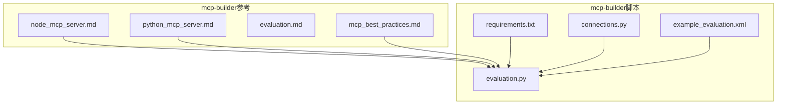
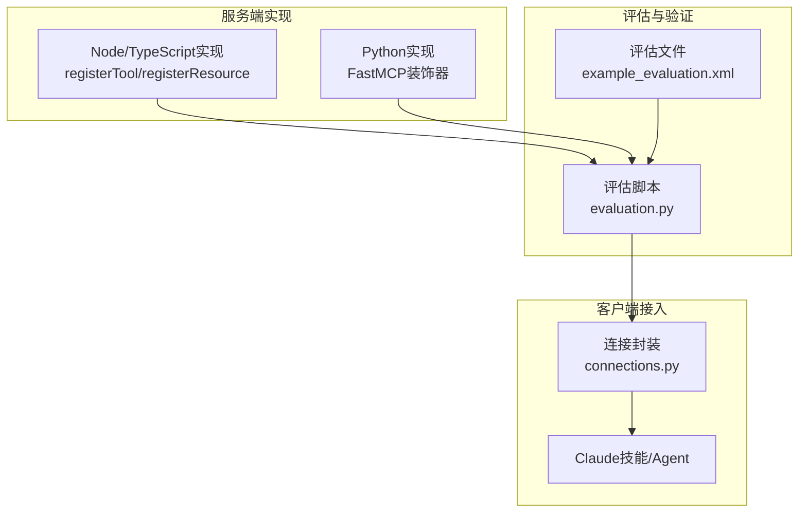
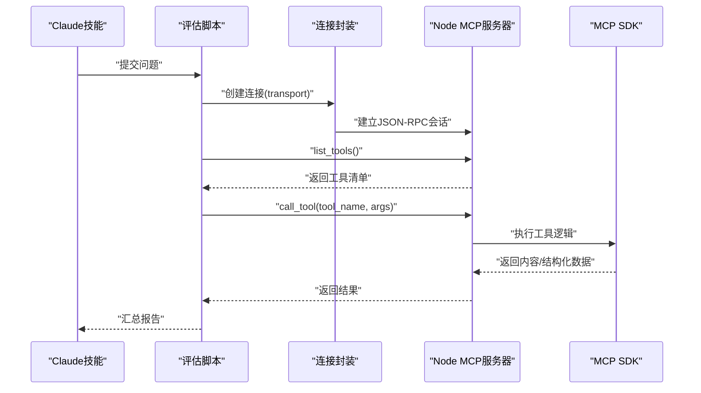
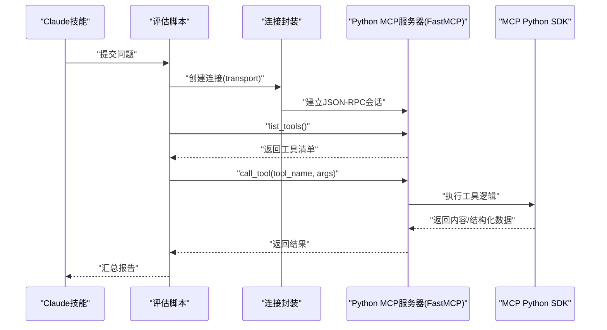
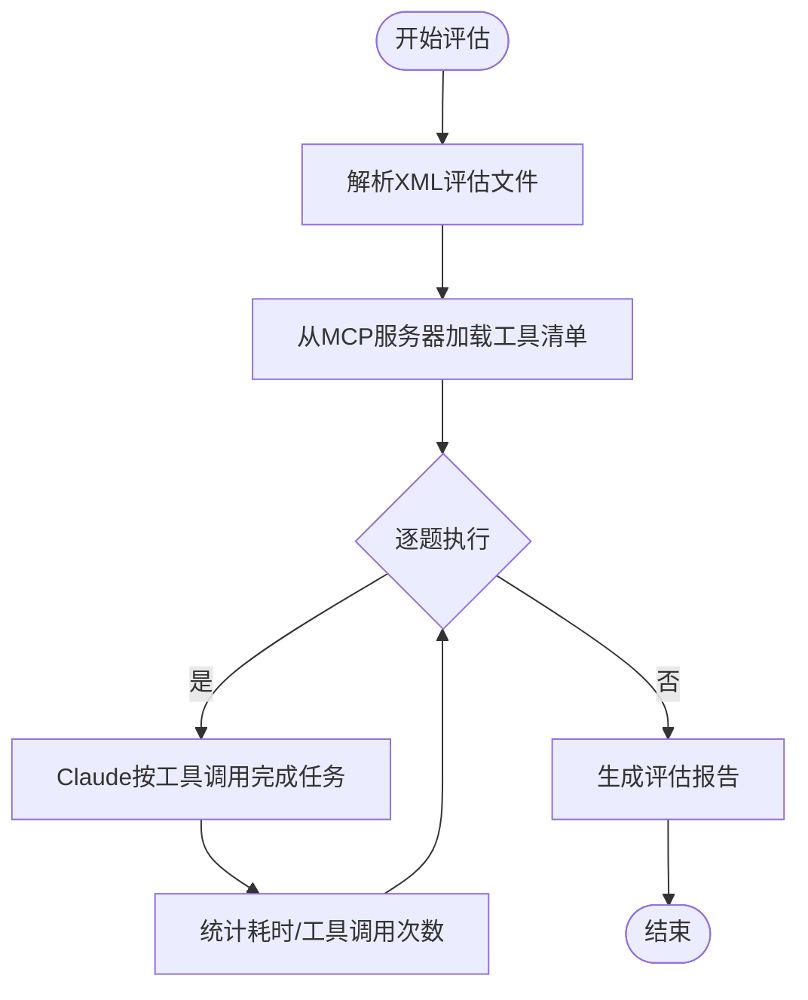
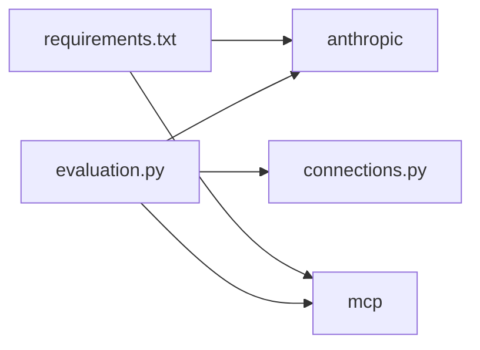

# MCP构建器

<cite>
**本文引用的文件**
- [skills/mcp-builder/reference/node_mcp_server.md](file://skills/mcp-builder/reference/node_mcp_server.md)
- [skills/mcp-builder/reference/python_mcp_server.md](file://skills/mcp-builder/reference/python_mcp_server.md)
- [skills/mcp-builder/reference/evaluation.md](file://skills/mcp-builder/reference/evaluation.md)
- [skills/mcp-builder/reference/mcp_best_practices.md](file://skills/mcp-builder/reference/mcp_best_practices.md)
- [skills/mcp-builder/scripts/requirements.txt](file://skills/mcp-builder/scripts/requirements.txt)
- [skills/mcp-builder/scripts/connections.py](file://skills/mcp-builder/scripts/connections.py)
- [skills/mcp-builder/scripts/evaluation.py](file://skills/mcp-builder/scripts/evaluation.py)
- [skills/mcp-builder/scripts/example_evaluation.xml](file://skills/mcp-builder/scripts/example_evaluation.xml)
</cite>

## 目录
1. [简介](#简介)
2. [项目结构](#项目结构)
3. [核心组件](#核心组件)
4. [架构总览](#架构总览)
5. [详细组件分析](#详细组件分析)
6. [依赖关系分析](#依赖关系分析)
7. [性能考量](#性能考量)
8. [故障排查指南](#故障排查指南)
9. [结论](#结论)
10. [附录](#附录)

## 简介
本文件面向“MCP构建器”技能，系统化阐述其作为Model Context Protocol（MCP）集成框架的核心职责：为Claude等大模型提供可发现、可调用、可验证的外部工具与资源端点，形成统一的JSON-RPC交互面。文档基于仓库内的Node/TypeScript与Python实现指南，结合评估框架与最佳实践，给出服务端注册外部工具、暴露资源端点、构建MCP规范JSON-RPC接口的方法论，并提供在Claude技能中调用MCP服务的完整流程说明。

## 项目结构
MCP构建器技能位于skills/mcp-builder目录下，包含：
- reference：Node/TypeScript与Python实现指南、评估框架说明、最佳实践
- scripts：评估脚本、连接封装、示例评估文件与依赖清单

图表来源
- [skills/mcp-builder/reference/node_mcp_server.md](file://skills/mcp-builder/reference/node_mcp_server.md#L1-L120)
- [skills/mcp-builder/reference/python_mcp_server.md](file://skills/mcp-builder/reference/python_mcp_server.md#L1-L120)
- [skills/mcp-builder/reference/evaluation.md](file://skills/mcp-builder/reference/evaluation.md#L1-L60)
- [skills/mcp-builder/reference/mcp_best_practices.md](file://skills/mcp-builder/reference/mcp_best_practices.md#L1-L60)
- [skills/mcp-builder/scripts/requirements.txt](file://skills/mcp-builder/scripts/requirements.txt#L1-L3)
- [skills/mcp-builder/scripts/connections.py](file://skills/mcp-builder/scripts/connections.py#L1-L60)
- [skills/mcp-builder/scripts/evaluation.py](file://skills/mcp-builder/scripts/evaluation.py#L1-L60)
- [skills/mcp-builder/scripts/example_evaluation.xml](file://skills/mcp-builder/scripts/example_evaluation.xml#L1-L23)

章节来源
- [skills/mcp-builder/reference/node_mcp_server.md](file://skills/mcp-builder/reference/node_mcp_server.md#L1-L120)
- [skills/mcp-builder/reference/python_mcp_server.md](file://skills/mcp-builder/reference/python_mcp_server.md#L1-L120)
- [skills/mcp-builder/scripts/requirements.txt](file://skills/mcp-builder/scripts/requirements.txt#L1-L3)
- [skills/mcp-builder/scripts/connections.py](file://skills/mcp-builder/scripts/connections.py#L1-L60)
- [skills/mcp-builder/scripts/evaluation.py](file://skills/mcp-builder/scripts/evaluation.py#L1-L60)
- [skills/mcp-builder/scripts/example_evaluation.xml](file://skills/mcp-builder/scripts/example_evaluation.xml#L1-L23)

## 核心组件
- 服务端实现指南（Node/TypeScript与Python）
  - 使用官方SDK初始化MCP服务器，注册工具、资源与提示词，支持多种响应格式与分页策略
  - 输入校验采用Zod（Node/TypeScript）或Pydantic（Python），确保运行时类型安全
- 评估框架
  - 基于XML的问答对，要求只使用只读、非破坏性、幂等操作，挑战复杂度与稳定性
  - 提供评估脚本，自动拉取工具清单、驱动Claude按工具调用完成任务并生成报告
- 连接封装
  - 统一封装stdio、SSE、Streamable HTTP三种传输方式，便于测试与集成
- 最佳实践
  - 服务器命名、工具命名、响应格式、分页、传输选择、安全与错误处理等

章节来源
- [skills/mcp-builder/reference/node_mcp_server.md](file://skills/mcp-builder/reference/node_mcp_server.md#L50-L120)
- [skills/mcp-builder/reference/python_mcp_server.md](file://skills/mcp-builder/reference/python_mcp_server.md#L35-L70)
- [skills/mcp-builder/reference/evaluation.md](file://skills/mcp-builder/reference/evaluation.md#L1-L60)
- [skills/mcp-builder/reference/mcp_best_practices.md](file://skills/mcp-builder/reference/mcp_best_practices.md#L1-L60)
- [skills/mcp-builder/scripts/connections.py](file://skills/mcp-builder/scripts/connections.py#L1-L60)
- [skills/mcp-builder/scripts/evaluation.py](file://skills/mcp-builder/scripts/evaluation.py#L1-L60)

## 架构总览
MCP构建器以“服务端实现指南”为核心，通过SDK注册工具与资源；“评估框架”用于验证工具可用性与正确性；“连接封装”提供统一的客户端接入；“最佳实践”贯穿设计与实现。

图表来源
- [skills/mcp-builder/reference/node_mcp_server.md](file://skills/mcp-builder/reference/node_mcp_server.md#L58-L120)
- [skills/mcp-builder/reference/python_mcp_server.md](file://skills/mcp-builder/reference/python_mcp_server.md#L35-L70)
- [skills/mcp-builder/scripts/evaluation.py](file://skills/mcp-builder/scripts/evaluation.py#L1-L60)
- [skills/mcp-builder/scripts/example_evaluation.xml](file://skills/mcp-builder/scripts/example_evaluation.xml#L1-L23)
- [skills/mcp-builder/scripts/connections.py](file://skills/mcp-builder/scripts/connections.py#L1-L60)

## 详细组件分析

### Node/TypeScript MCP服务端实现模式
- 初始化与命名
  - 使用SDK创建McpServer实例，遵循服务名命名约定（如“{service}-mcp-server”）
- 工具注册
  - 使用registerTool注册工具，明确title、description、inputSchema、annotations
  - 输入校验采用Zod Schema，严格模式避免多余字段
- 资源注册
  - 使用registerResource暴露数据端点，支持URI模板与动态列表
- 响应格式与分页
  - 支持Markdown与JSON两种输出格式；分页返回total/count/offset/has_more/next_offset
- 错误处理
  - 明确错误消息，区分404/403/429等状态码，避免泄露内部细节
- 传输选项
  - 支持stdio与Streamable HTTP，按环境选择运行方式

图表来源
- [skills/mcp-builder/reference/node_mcp_server.md](file://skills/mcp-builder/reference/node_mcp_server.md#L58-L120)
- [skills/mcp-builder/scripts/connections.py](file://skills/mcp-builder/scripts/connections.py#L1-L120)
- [skills/mcp-builder/scripts/evaluation.py](file://skills/mcp-builder/scripts/evaluation.py#L1-L120)

章节来源
- [skills/mcp-builder/reference/node_mcp_server.md](file://skills/mcp-builder/reference/node_mcp_server.md#L58-L120)
- [skills/mcp-builder/reference/node_mcp_server.md](file://skills/mcp-builder/reference/node_mcp_server.md#L180-L274)
- [skills/mcp-builder/reference/node_mcp_server.md](file://skills/mcp-builder/reference/node_mcp_server.md#L382-L435)
- [skills/mcp-builder/reference/node_mcp_server.md](file://skills/mcp-builder/reference/node_mcp_server.md#L584-L756)
- [skills/mcp-builder/reference/node_mcp_server.md](file://skills/mcp-builder/reference/node_mcp_server.md#L760-L840)

### Python MCP服务端实现模式
- 初始化与命名
  - 使用FastMCP创建服务器，遵循“{service}_mcp”的命名约定
- 工具注册
  - 使用@mcp.tool装饰器，输入参数由Pydantic模型约束，自动提取描述与schema
- 响应格式与分页
  - 同样支持Markdown与JSON；分页返回total/count/offset/has_more/next_offset
- 上下文注入与资源
  - 可通过Context参数进行进度上报、日志记录、用户交互与资源读取
  - 使用@mcp.resource注册资源端点，支持URI模板
- 结构化输出
  - 支持返回TypedDict、Pydantic模型等结构化类型，自动序列化
- 传输选项
  - 支持stdio与Streamable HTTP两种传输

图表来源
- [skills/mcp-builder/reference/python_mcp_server.md](file://skills/mcp-builder/reference/python_mcp_server.md#L35-L70)
- [skills/mcp-builder/reference/python_mcp_server.md](file://skills/mcp-builder/reference/python_mcp_server.md#L121-L181)
- [skills/mcp-builder/reference/python_mcp_server.md](file://skills/mcp-builder/reference/python_mcp_server.md#L207-L226)
- [skills/mcp-builder/reference/python_mcp_server.md](file://skills/mcp-builder/reference/python_mcp_server.md#L330-L472)
- [skills/mcp-builder/reference/python_mcp_server.md](file://skills/mcp-builder/reference/python_mcp_server.md#L476-L554)
- [skills/mcp-builder/reference/python_mcp_server.md](file://skills/mcp-builder/reference/python_mcp_server.md#L589-L637)
- [skills/mcp-builder/scripts/connections.py](file://skills/mcp-builder/scripts/connections.py#L1-L120)
- [skills/mcp-builder/scripts/evaluation.py](file://skills/mcp-builder/scripts/evaluation.py#L1-L120)

章节来源
- [skills/mcp-builder/reference/python_mcp_server.md](file://skills/mcp-builder/reference/python_mcp_server.md#L35-L70)
- [skills/mcp-builder/reference/python_mcp_server.md](file://skills/mcp-builder/reference/python_mcp_server.md#L121-L181)
- [skills/mcp-builder/reference/python_mcp_server.md](file://skills/mcp-builder/reference/python_mcp_server.md#L207-L226)
- [skills/mcp-builder/reference/python_mcp_server.md](file://skills/mcp-builder/reference/python_mcp_server.md#L330-L472)
- [skills/mcp-builder/reference/python_mcp_server.md](file://skills/mcp-builder/reference/python_mcp_server.md#L476-L554)
- [skills/mcp-builder/reference/python_mcp_server.md](file://skills/mcp-builder/reference/python_mcp_server.md#L589-L637)

### 评估框架与验证流程
- 评估目标
  - 验证LLM仅通过MCP工具即可回答真实、复杂、稳定的单值问题
- 评估要求
  - 10个独立、只读、非破坏性、幂等的问题；每个问题可能需要数十次工具调用
  - 输出为单一可直接比较的值，且答案稳定不变
- 评估脚本工作流
  - 解析XML评估文件，加载MCP工具清单，逐题驱动Claude使用工具完成任务
  - 记录每题耗时、工具调用次数与分布，生成报告
- 传输类型
  - stdio：脚本自动启动本地服务器进程
  - SSE/HTTP：需先启动服务器，脚本连接已运行的服务器

图表来源
- [skills/mcp-builder/reference/evaluation.md](file://skills/mcp-builder/reference/evaluation.md#L1-L60)
- [skills/mcp-builder/reference/evaluation.md](file://skills/mcp-builder/reference/evaluation.md#L378-L473)
- [skills/mcp-builder/scripts/evaluation.py](file://skills/mcp-builder/scripts/evaluation.py#L1-L120)
- [skills/mcp-builder/scripts/evaluation.py](file://skills/mcp-builder/scripts/evaluation.py#L220-L273)

章节来源
- [skills/mcp-builder/reference/evaluation.md](file://skills/mcp-builder/reference/evaluation.md#L1-L60)
- [skills/mcp-builder/reference/evaluation.md](file://skills/mcp-builder/reference/evaluation.md#L378-L473)
- [skills/mcp-builder/scripts/evaluation.py](file://skills/mcp-builder/scripts/evaluation.py#L1-L120)
- [skills/mcp-builder/scripts/evaluation.py](file://skills/mcp-builder/scripts/evaluation.py#L220-L273)
- [skills/mcp-builder/scripts/example_evaluation.xml](file://skills/mcp-builder/scripts/example_evaluation.xml#L1-L23)

### 安全性、错误处理与版本兼容性建议
- 安全性
  - 使用OAuth 2.1或API Key进行认证；密钥存储在环境变量中；避免在代码中硬编码
  - 对输入进行严格校验（路径、URL、标识符、大小范围），防止注入与越权
  - 错误处理不泄露内部细节；启用DNS重绑定保护（本地Streamable HTTP）
- 错误处理
  - 使用标准JSON-RPC错误码；在结果对象内报告工具错误，提供可操作建议
- 版本兼容性
  - 优先使用现代API（Node的registerTool/registerResource/registerPrompt；Python的@mcp.tool/@mcp.resource）
  - 传输选择：远程多客户端场景优选Streamable HTTP；本地集成优选stdio

章节来源
- [skills/mcp-builder/reference/mcp_best_practices.md](file://skills/mcp-builder/reference/mcp_best_practices.md#L150-L204)
- [skills/mcp-builder/reference/mcp_best_practices.md](file://skills/mcp-builder/reference/mcp_best_practices.md#L205-L228)
- [skills/mcp-builder/reference/node_mcp_server.md](file://skills/mcp-builder/reference/node_mcp_server.md#L58-L64)
- [skills/mcp-builder/reference/python_mcp_server.md](file://skills/mcp-builder/reference/python_mcp_server.md#L35-L44)

## 依赖关系分析
- 评估脚本依赖
  - anthropic：调用Claude模型
  - mcp：MCP客户端会话与传输抽象
  - 通过connections.py统一封装stdio、SSE、HTTP三类传输
- 示例依赖
  - requirements.txt声明了最低版本要求，确保与MCP SDK兼容

图表来源
- [skills/mcp-builder/scripts/requirements.txt](file://skills/mcp-builder/scripts/requirements.txt#L1-L3)
- [skills/mcp-builder/scripts/evaluation.py](file://skills/mcp-builder/scripts/evaluation.py#L1-L60)
- [skills/mcp-builder/scripts/connections.py](file://skills/mcp-builder/scripts/connections.py#L1-L60)

章节来源
- [skills/mcp-builder/scripts/requirements.txt](file://skills/mcp-builder/scripts/requirements.txt#L1-L3)
- [skills/mcp-builder/scripts/evaluation.py](file://skills/mcp-builder/scripts/evaluation.py#L1-L60)
- [skills/mcp-builder/scripts/connections.py](file://skills/mcp-builder/scripts/connections.py#L1-L60)

## 性能考量
- 分页与字符限制
  - 严格遵守limit参数，返回has_more/next_offset/total_count；必要时对超长响应进行截断并提示
- 并发与上下文
  - 评估阶段并行解决多个任务，避免超出上下文窗口；合理设置工具调用上限
- 传输选择
  - 多客户端场景使用Streamable HTTP；本地开发使用stdio，减少网络开销

章节来源
- [skills/mcp-builder/reference/node_mcp_server.md](file://skills/mcp-builder/reference/node_mcp_server.md#L382-L435)
- [skills/mcp-builder/reference/python_mcp_server.md](file://skills/mcp-builder/reference/python_mcp_server.md#L182-L206)
- [skills/mcp-builder/reference/mcp_best_practices.md](file://skills/mcp-builder/reference/mcp_best_practices.md#L108-L150)

## 故障排查指南
- 连接问题
  - stdio：确认命令与参数正确；检查环境变量是否传入
  - SSE/HTTP：核对URL可达性与请求头；确保鉴权头或令牌有效
- 低准确率
  - 检查工具描述与输入参数文档是否清晰；确认工具返回数据量适中
- 超时
  - 使用更强模型；优化工具返回数据规模；检查分页是否正确

章节来源
- [skills/mcp-builder/reference/evaluation.md](file://skills/mcp-builder/reference/evaluation.md#L578-L602)
- [skills/mcp-builder/scripts/evaluation.py](file://skills/mcp-builder/scripts/evaluation.py#L305-L373)

## 结论
MCP构建器技能通过标准化的服务端实现模式、严格的评估流程与最佳实践，为Claude等智能体提供了稳定、可扩展、可验证的外部能力接入通道。依托Node/TypeScript与Python两大实现指南，结合评估脚本与连接封装，能够快速构建高质量的MCP服务器并在实际场景中持续迭代优化。

## 附录

### 在Claude技能中调用MCP服务的完整流程
- 准备MCP服务器
  - 选择Node/TypeScript或Python实现，按指南注册工具与资源，配置传输（stdio或Streamable HTTP）
- 准备评估文件
  - 编写XML评估文件，包含10个只读、独立、幂等、稳定的问答对
- 运行评估
  - 安装依赖后，根据传输类型选择命令行参数运行评估脚本
  - stdio：脚本自动启动服务器进程
  - SSE/HTTP：先启动服务器，再由脚本连接
- 查看报告
  - 评估脚本输出准确率、平均耗时、工具调用次数与分布，辅助改进工具设计

章节来源
- [skills/mcp-builder/reference/evaluation.md](file://skills/mcp-builder/reference/evaluation.md#L378-L473)
- [skills/mcp-builder/scripts/evaluation.py](file://skills/mcp-builder/scripts/evaluation.py#L305-L373)
- [skills/mcp-builder/scripts/example_evaluation.xml](file://skills/mcp-builder/scripts/example_evaluation.xml#L1-L23)