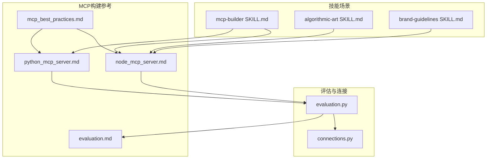
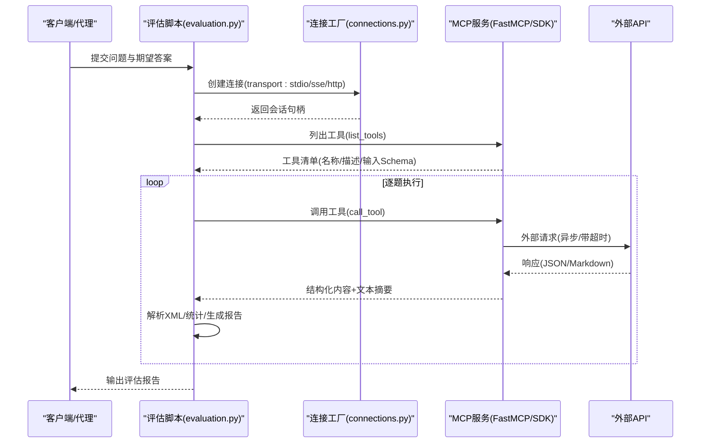
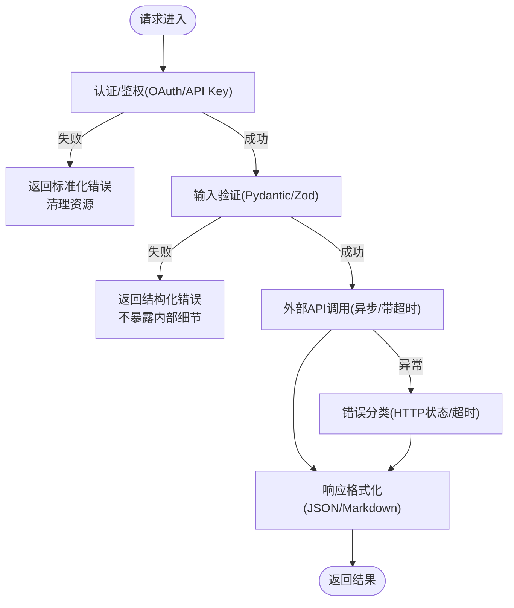
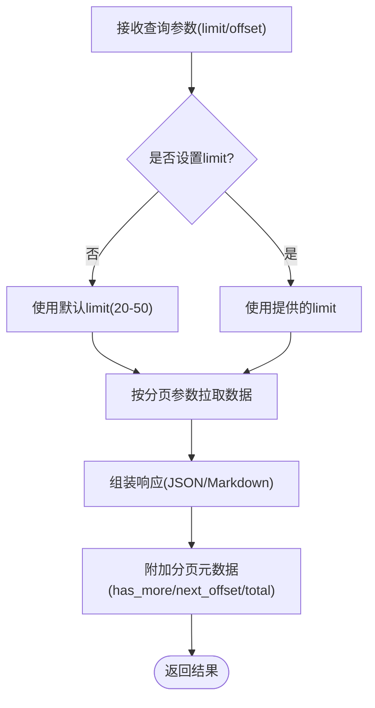
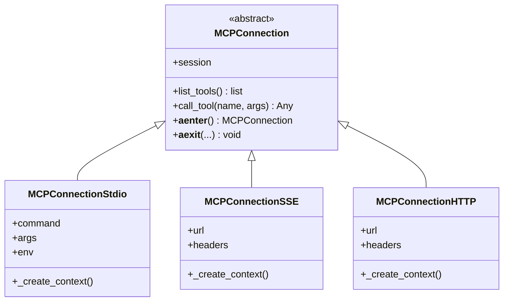
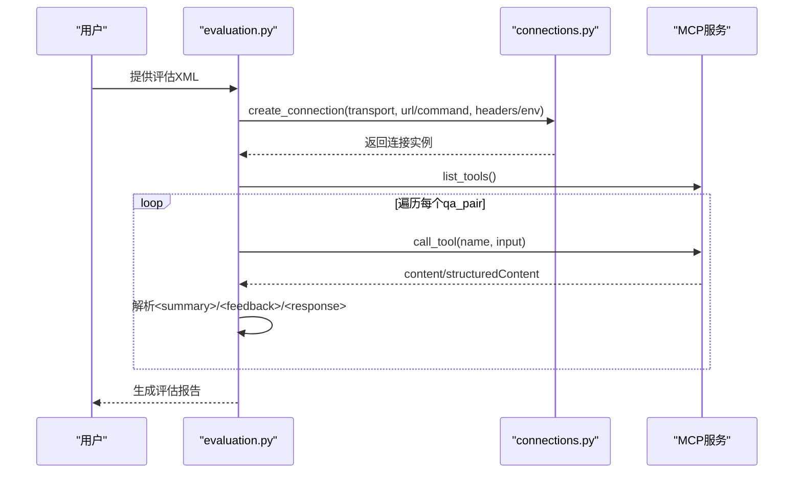
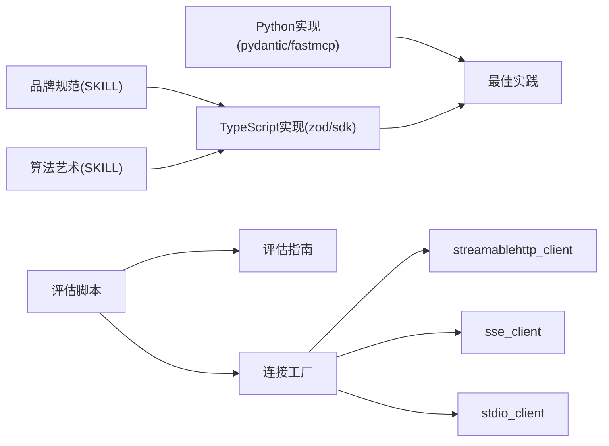

# MCP构建最佳实践

<cite>
**本文引用的文件**
- [mcp_best_practices.md](file://skills/mcp-builder/reference/mcp_best_practices.md)
- [python_mcp_server.md](file://skills/mcp-builder/reference/python_mcp_server.md)
- [node_mcp_server.md](file://skills/mcp-builder/reference/node_mcp_server.md)
- [evaluation.md](file://skills/mcp-builder/reference/evaluation.md)
- [connections.py](file://skills/mcp-builder/scripts/connections.py)
- [evaluation.py](file://skills/mcp-builder/scripts/evaluation.py)
- [mcp-builder SKILL.md](file://skills/mcp-builder/SKILL.md)
- [algorithmic-art SKILL.md](file://skills/algorithmic-art/SKILL.md)
- [brand-guidelines SKILL.md](file://skills/brand-guidelines/SKILL.md)
</cite>

## 目录
1. [引言](#引言)
2. [项目结构](#项目结构)
3. [核心组件](#核心组件)
4. [架构总览](#架构总览)
5. [详细组件分析](#详细组件分析)
6. [依赖关系分析](#依赖关系分析)
7. [性能考虑](#性能考虑)
8. [故障排查指南](#故障排查指南)
9. [结论](#结论)
10. [附录](#附录)

## 引言
本指南整合了MCP最佳实践与语言实现指南，围绕安全性（认证授权、输入验证、DNS回绑防护）、可靠性（错误处理、重试与超时）、兼容性（命名规范、版本与向后兼容）、性能优化（异步I/O、分页、字符限制、资源复用）以及部署适配（本地、远程、边缘），系统化地指导开发者构建高内聚、低耦合的MCP服务接口。同时结合技能场景，给出可操作的设计模式与反模式对比，帮助在不同环境中稳定交付高质量的MCP集成服务。

## 项目结构
该仓库为多技能集合，其中“mcp-builder”提供MCP服务器开发的参考与脚手架；“evaluation”脚本用于对MCP服务器进行自动化评估；“best practices”与语言实现指南为通用准则与范式；部分技能文档（如算法艺术、品牌规范）提供界面与交互风格参考，便于统一MCP工具输出的可读性与一致性。

图表来源
- [mcp_best_practices.md](file://skills/mcp-builder/reference/mcp_best_practices.md#L1-L250)
- [python_mcp_server.md](file://skills/mcp-builder/reference/python_mcp_server.md#L1-L719)
- [node_mcp_server.md](file://skills/mcp-builder/reference/node_mcp_server.md#L1-L970)
- [evaluation.md](file://skills/mcp-builder/reference/evaluation.md#L1-L602)
- [connections.py](file://skills/mcp-builder/scripts/connections.py#L1-L152)
- [evaluation.py](file://skills/mcp-builder/scripts/evaluation.py#L1-L374)
- [mcp-builder SKILL.md](file://skills/mcp-builder/SKILL.md#L1-L237)
- [algorithmic-art SKILL.md](file://skills/algorithmic-art/SKILL.md#L1-L405)
- [brand-guidelines SKILL.md](file://skills/brand-guidelines/SKILL.md#L1-L74)

章节来源
- [mcp-builder SKILL.md](file://skills/mcp-builder/SKILL.md#L1-L237)

## 核心组件
- 安全与合规：认证授权（OAuth 2.1、API Key）、输入验证（路径、URL、参数范围、注入防护）、错误处理（不暴露内部细节、清理资源）、DNS回绑防护（本地流式HTTP需校验Origin、绑定127.0.0.1）。
- 可靠性：标准JSON-RPC错误码、工具级错误返回、可操作的错误提示、资源清理、超时控制与重试策略。
- 兼容性：服务与工具命名约定（snake_case、带服务前缀、动词优先、避免冲突）、响应格式（JSON与Markdown双支持）、分页（limit、offset/游标、has_more、next_offset/next_cursor、total_count）。
- 性能优化：异步I/O（async/await）、共享HTTP客户端、字符限制与截断、结构化输出类型（TypedDict、Pydantic模型）、生命周期管理（lifespan）。
- 部署适配：传输选择（stdio vs streamable HTTP）、通知机制（仅在能力变更时发送）、资源注册（URI模板）、上下文注入（进度、日志、用户交互）。

章节来源
- [mcp_best_practices.md](file://skills/mcp-builder/reference/mcp_best_practices.md#L152-L250)
- [python_mcp_server.md](file://skills/mcp-builder/reference/python_mcp_server.md#L150-L230)
- [node_mcp_server.md](file://skills/mcp-builder/reference/node_mcp_server.md#L586-L756)

## 架构总览
下图展示MCP服务端与客户端的交互流程，包括工具注册、输入验证、外部API调用、响应格式化与错误处理，以及评估脚本对工具可用性的自动化测试。

图表来源
- [evaluation.py](file://skills/mcp-builder/scripts/evaluation.py#L1-L374)
- [connections.py](file://skills/mcp-builder/scripts/connections.py#L1-L152)
- [python_mcp_server.md](file://skills/mcp-builder/reference/python_mcp_server.md#L330-L473)
- [node_mcp_server.md](file://skills/mcp-builder/reference/node_mcp_server.md#L586-L756)

## 详细组件分析

### 组件A：安全与合规（认证、输入验证、错误处理、DNS回绑）
- 认证授权
  - OAuth 2.1：使用权威CA签发证书、校验访问令牌、仅接受面向本服务的令牌。
  - API Key：从环境变量加载、启动时校验、失败时给出明确提示。
- 输入验证
  - 路径清洗（防止目录穿越）、URL与外部标识符校验、参数大小与范围检查、命令注入防护、使用Pydantic/Zod进行运行时校验。
- 错误处理
  - 不向客户端暴露内部错误；服务端记录安全相关错误；提供有帮助但不泄露细节的错误信息；异常后清理资源。
- DNS回绑防护
  - 本地流式HTTP服务器启用防护、校验Origin头、绑定到127.0.0.1。

图表来源
- [mcp_best_practices.md](file://skills/mcp-builder/reference/mcp_best_practices.md#L152-L201)
- [python_mcp_server.md](file://skills/mcp-builder/reference/python_mcp_server.md#L208-L227)
- [node_mcp_server.md](file://skills/mcp-builder/reference/node_mcp_server.md#L409-L435)

章节来源
- [mcp_best_practices.md](file://skills/mcp-builder/reference/mcp_best_practices.md#L152-L201)
- [python_mcp_server.md](file://skills/mcp-builder/reference/python_mcp_server.md#L208-L227)
- [node_mcp_server.md](file://skills/mcp-builder/reference/node_mcp_server.md#L409-L435)

### 组件B：响应格式与分页
- 响应格式
  - JSON：机器可读结构化数据，包含字段与元数据；Markdown：人类可读格式，使用标题、列表、格式化；时间戳转人类可读；显示ID与显示名；省略冗余元数据。
- 分页
  - 始终尊重limit参数；实现offset或游标分页；返回has_more、next_offset/next_cursor、total_count；默认20-50条；避免一次性加载全部结果。

图表来源
- [mcp_best_practices.md](file://skills/mcp-builder/reference/mcp_best_practices.md#L84-L106)
- [python_mcp_server.md](file://skills/mcp-builder/reference/python_mcp_server.md#L182-L206)
- [node_mcp_server.md](file://skills/mcp-builder/reference/node_mcp_server.md#L354-L381)

章节来源
- [mcp_best_practices.md](file://skills/mcp-builder/reference/mcp_best_practices.md#L84-L106)
- [python_mcp_server.md](file://skills/mcp-builder/reference/python_mcp_server.md#L182-L206)
- [node_mcp_server.md](file://skills/mcp-builder/reference/node_mcp_server.md#L354-L381)

### 组件C：传输与部署适配（stdio vs streamable HTTP）
- 传输选择
  - stdio：本地集成、命令行工具、子进程运行、无需网络配置；注意不要将日志写入stdout。
  - Streamable HTTP：远程服务、多客户端、Web服务、支持服务端推送。
- 连接工厂
  - 支持stdio、SSE、HTTP三种连接方式；根据transport参数创建对应客户端；提供list_tools与call_tool封装。
- 通知与资源
  - 仅在工具/资源能力发生真实变化时发送通知；通过URI模板注册资源；上下文注入支持进度、日志、用户交互。

图表来源
- [connections.py](file://skills/mcp-builder/scripts/connections.py#L1-L152)

章节来源
- [mcp_best_practices.md](file://skills/mcp-builder/reference/mcp_best_practices.md#L108-L149)
- [python_mcp_server.md](file://skills/mcp-builder/reference/python_mcp_server.md#L619-L636)
- [node_mcp_server.md](file://skills/mcp-builder/reference/node_mcp_server.md#L817-L878)
- [connections.py](file://skills/mcp-builder/scripts/connections.py#L1-L152)

### 组件D：评估与质量保障（自动化测试与反馈）
- 评估脚本
  - 支持stdio、SSE、HTTP三种传输；自动解析XML评估任务；循环调用工具并统计耗时与工具调用次数；输出汇总与逐题反馈。
- 评估指南
  - 10个只读、独立、非破坏性、幂等的问题；复杂度高、需要多次工具调用；答案单一且可直接字符串比较；稳定不变的历史数据；输出XML格式。

图表来源
- [evaluation.py](file://skills/mcp-builder/scripts/evaluation.py#L1-L374)
- [evaluation.md](file://skills/mcp-builder/reference/evaluation.md#L1-L602)
- [connections.py](file://skills/mcp-builder/scripts/connections.py#L1-L152)

章节来源
- [evaluation.py](file://skills/mcp-builder/scripts/evaluation.py#L1-L374)
- [evaluation.md](file://skills/mcp-builder/reference/evaluation.md#L1-L602)

### 组件E：设计模式与反模式（Python/TypeScript）
- 良好实践
  - 使用FastMCP/@modelcontextprotocol/sdk进行工具注册与上下文注入；Pydantic/Zod进行输入验证；统一错误处理与格式化；分页与字符限制；结构化输出类型；生命周期管理；异步I/O。
- 反模式
  - 手工参数校验替代Pydantic/Zod；同步网络请求阻塞；重复代码；未实现分页或一次性加载全量数据；未设置超时；未区分stdout/stderr日志；未提供清晰的错误消息。

章节来源
- [python_mcp_server.md](file://skills/mcp-builder/reference/python_mcp_server.md#L640-L719)
- [node_mcp_server.md](file://skills/mcp-builder/reference/node_mcp_server.md#L485-L525)

## 依赖关系分析
- 语言实现与最佳实践耦合紧密：Python使用FastMCP与Pydantic，TypeScript使用MCP SDK与Zod；两者均遵循统一的最佳实践（命名、分页、响应格式、安全、错误处理）。
- 评估脚本依赖连接工厂以适配不同传输；连接工厂再依赖MCP客户端库（stdio、SSE、HTTP）。
- 技能文档为界面与交互风格提供参考，确保工具输出一致的人类可读性与品牌一致性。

图表来源
- [python_mcp_server.md](file://skills/mcp-builder/reference/python_mcp_server.md#L1-L719)
- [node_mcp_server.md](file://skills/mcp-builder/reference/node_mcp_server.md#L1-L970)
- [mcp_best_practices.md](file://skills/mcp-builder/reference/mcp_best_practices.md#L1-L250)
- [evaluation.py](file://skills/mcp-builder/scripts/evaluation.py#L1-L374)
- [connections.py](file://skills/mcp-builder/scripts/connections.py#L1-L152)
- [evaluation.md](file://skills/mcp-builder/reference/evaluation.md#L1-L602)
- [algorithmic-art SKILL.md](file://skills/algorithmic-art/SKILL.md#L1-L405)
- [brand-guidelines SKILL.md](file://skills/brand-guidelines/SKILL.md#L1-L74)

章节来源
- [python_mcp_server.md](file://skills/mcp-builder/reference/python_mcp_server.md#L1-L719)
- [node_mcp_server.md](file://skills/mcp-builder/reference/node_mcp_server.md#L1-L970)
- [evaluation.py](file://skills/mcp-builder/scripts/evaluation.py#L1-L374)
- [connections.py](file://skills/mcp-builder/scripts/connections.py#L1-L152)
- [evaluation.md](file://skills/mcp-builder/reference/evaluation.md#L1-L602)

## 性能考虑
- 异步I/O与超时：所有网络请求使用异步客户端并设置合理超时；对外部API调用进行限流与重试（指数退避）。
- 分页与字符限制：严格遵守limit与offset；对长响应进行字符上限控制与截断提示；必要时提供has_more与next_offset。
- 资源复用：共享HTTP客户端、数据库连接池、缓存；在lifespan中初始化并在关闭时释放。
- 输出优化：优先返回结构化数据（structuredContent/JSON）与人类可读文本（Markdown）；避免冗余元数据与大对象序列化。

章节来源
- [python_mcp_server.md](file://skills/mcp-builder/reference/python_mcp_server.md#L246-L263)
- [node_mcp_server.md](file://skills/mcp-builder/reference/node_mcp_server.md#L382-L407)
- [mcp_best_practices.md](file://skills/mcp-builder/reference/mcp_best_practices.md#L84-L106)

## 故障排查指南
- 连接问题
  - stdio：确认命令与参数正确；stdio服务器不应将日志写入stdout。
  - SSE/HTTP：检查URL可达性与请求头；确保所需API Key已设置。
- 准入失败
  - OAuth/API Key：核对令牌来源与有效期；启动时校验密钥；失败时给出明确提示。
- 超时与吞吐
  - 增加模型能力或简化复杂问题；检查分页是否正确；减少单次响应体量。
- 评估失败
  - 查看代理对工具的反馈；检查工具描述与输入参数文档；确认返回值格式与稳定性。

章节来源
- [evaluation.md](file://skills/mcp-builder/reference/evaluation.md#L578-L602)
- [evaluation.py](file://skills/mcp-builder/scripts/evaluation.py#L326-L359)
- [mcp_best_practices.md](file://skills/mcp-builder/reference/mcp_best_practices.md#L152-L201)

## 结论
通过遵循统一的最佳实践与语言实现指南，结合评估脚本与连接工厂，开发者可以在本地、远程与边缘环境下构建健壮、可维护、高性能的MCP服务。关键在于：严格的认证授权与输入验证、可靠的错误处理与超时控制、清晰的命名与响应格式、合理的分页与字符限制、以及持续的质量保障与迭代优化。

## 附录
- 设计要点清单
  - 命名：snake_case、服务前缀、动词优先、避免冲突。
  - 响应：JSON与Markdown双支持；时间戳与显示名格式化。
  - 分页：limit/offset/has_more/next_offset/total_count。
  - 安全：OAuth 2.1、API Key、输入验证、DNS回绑防护。
  - 可靠性：标准错误码、可操作错误消息、资源清理、超时与重试。
  - 性能：异步I/O、字符限制、结构化输出、生命周期管理。
  - 部署：stdio/local vs streamable HTTP/remote；通知与资源注册；上下文注入。

章节来源
- [mcp_best_practices.md](file://skills/mcp-builder/reference/mcp_best_practices.md#L1-L250)
- [python_mcp_server.md](file://skills/mcp-builder/reference/python_mcp_server.md#L1-L719)
- [node_mcp_server.md](file://skills/mcp-builder/reference/node_mcp_server.md#L1-L970)
- [evaluation.md](file://skills/mcp-builder/reference/evaluation.md#L1-L602)
- [connections.py](file://skills/mcp-builder/scripts/connections.py#L1-L152)
- [evaluation.py](file://skills/mcp-builder/scripts/evaluation.py#L1-L374)
- [mcp-builder SKILL.md](file://skills/mcp-builder/SKILL.md#L1-L237)
- [algorithmic-art SKILL.md](file://skills/algorithmic-art/SKILL.md#L1-L405)
- [brand-guidelines SKILL.md](file://skills/brand-guidelines/SKILL.md#L1-L74)