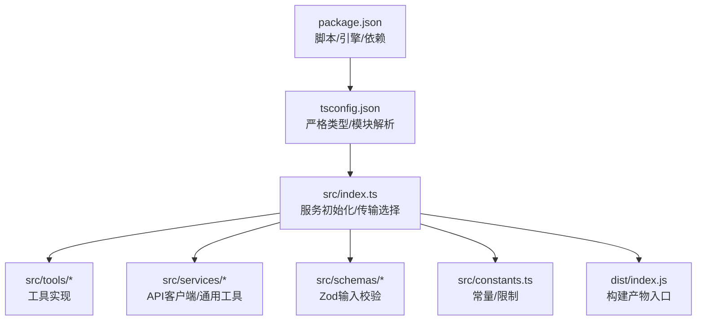
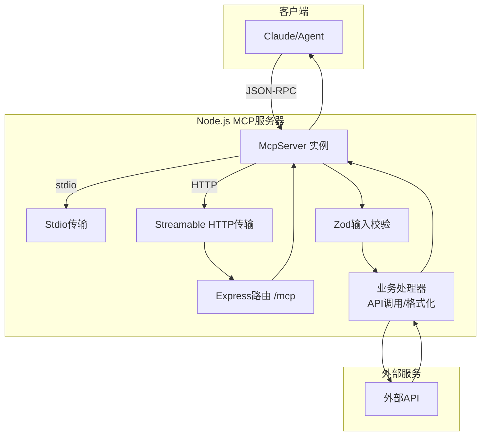
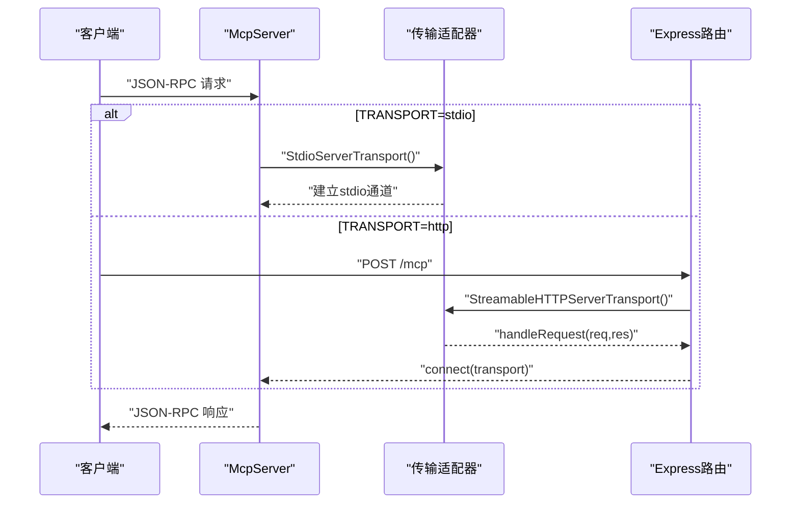
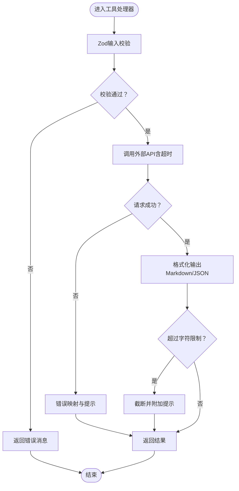
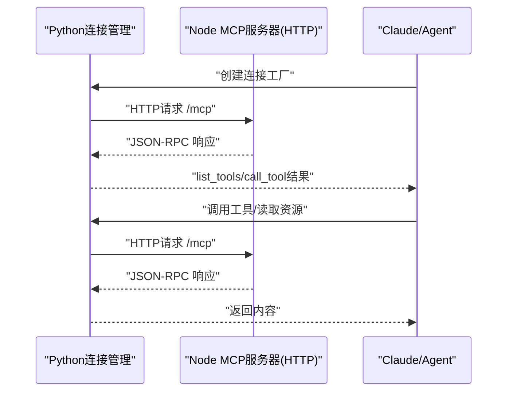
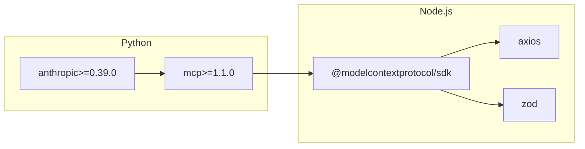

# Node.js MCP服务器实现

<cite>
**本文引用的文件**
- [node_mcp_server.md](file://skills/mcp-builder/reference/node_mcp_server.md)
- [connections.py](file://skills/mcp-builder/scripts/connections.py)
- [requirements.txt](file://skills/mcp-builder/scripts/requirements.txt)
- [SKILL.md](file://skills/mcp-builder/SKILL.md)
</cite>

## 目录
1. [引言](#引言)
2. [项目结构](#项目结构)
3. [核心组件](#核心组件)
4. [架构总览](#架构总览)
5. [详细组件分析](#详细组件分析)
6. [依赖关系分析](#依赖关系分析)
7. [性能考虑](#性能考虑)
8. [故障排查指南](#故障排查指南)
9. [结论](#结论)
10. [附录](#附录)

## 引言
本文件面向希望在Node.js环境中实现MCP（Model Context Protocol）服务器的工程师，系统性讲解基于TypeScript SDK的实现方案，重点围绕以下目标展开：
- 解析服务架构与JSON-RPC通信机制
- 使用@modelcontextprotocol/sdk注册工具与资源端点
- 展示服务初始化、请求处理与响应返回的完整流程
- 结合Python侧连接管理脚本connections.py，阐述跨语言集成模式
- 提供生产级特性：错误处理、超时控制、日志记录
- 给出在Claude技能中调用该MCP服务的实践建议

## 项目结构
Node.js MCP服务器采用模块化目录组织，遵循TypeScript SDK推荐的最佳实践：
- 顶层package.json定义工程元信息、脚本与依赖
- tsconfig.json启用严格类型检查与现代模块解析
- src目录下按职责拆分：入口index.ts、工具实现、共享服务与验证schema
- dist目录用于构建产物，入口为dist/index.js

图表来源
- [node_mcp_server.md](file://skills/mcp-builder/reference/node_mcp_server.md#L526-L582)

章节来源
- [node_mcp_server.md](file://skills/mcp-builder/reference/node_mcp_server.md#L77-L94)

## 核心组件
- 服务初始化与命名规范
  - 使用McpServer类创建实例，设置name与version，遵循“{service}-mcp-server”的命名约定
- 工具注册与输入校验
  - 使用registerTool注册工具，提供title、description、inputSchema与annotations
  - 输入参数通过Zod进行运行时校验，支持默认值、枚举与严格模式
- 资源注册与URI模板
  - 使用registerResource与registerResourceList暴露数据资源，支持URI模板参数
- 传输层选择
  - stdio：本地子进程集成
  - Streamable HTTP：远程Web服务，无状态JSON交互，便于扩展与多客户端接入

章节来源
- [node_mcp_server.md](file://skills/mcp-builder/reference/node_mcp_server.md#L50-L81)

## 架构总览
Node.js MCP服务器通过SDK提供的传输适配器与HTTP框架对接，形成如下交互链路：
- 客户端发起JSON-RPC请求（工具调用或资源访问）
- 服务器根据TRANSPORT环境变量选择stdio或Streamable HTTP
- 服务器对请求进行路由与参数校验（Zod）
- 执行业务逻辑（API调用、格式化输出）
- 返回结构化内容（content与structuredContent）

图表来源
- [node_mcp_server.md](file://skills/mcp-builder/reference/node_mcp_server.md#L817-L858)
- [node_mcp_server.md](file://skills/mcp-builder/reference/node_mcp_server.md#L586-L756)

## 详细组件分析

### 服务初始化与传输选择
- 初始化
  - 创建McpServer实例，设置name与version
- 传输选择
  - stdio：适用于本地开发与子进程集成
  - Streamable HTTP：适用于远程部署，每个请求创建新传输实例，避免会话状态耦合
- 环境变量
  - 通过TRANSPORT选择stdio或http；通过环境变量注入密钥与端口

图表来源
- [node_mcp_server.md](file://skills/mcp-builder/reference/node_mcp_server.md#L817-L858)
- [node_mcp_server.md](file://skills/mcp-builder/reference/node_mcp_server.md#L586-L756)

章节来源
- [node_mcp_server.md](file://skills/mcp-builder/reference/node_mcp_server.md#L586-L756)

### 工具注册与请求处理
- 注册工具
  - 使用registerTool，提供工具元数据与处理器函数
  - 输入参数通过Zod schema进行严格校验
- 处理流程
  - 参数解构与校验
  - 调用外部API（带超时与错误处理）
  - 生成文本内容与结构化数据（structuredContent）
  - 分页与字符限制控制

图表来源
- [node_mcp_server.md](file://skills/mcp-builder/reference/node_mcp_server.md#L276-L407)
- [node_mcp_server.md](file://skills/mcp-builder/reference/node_mcp_server.md#L408-L466)

章节来源
- [node_mcp_server.md](file://skills/mcp-builder/reference/node_mcp_server.md#L276-L407)
- [node_mcp_server.md](file://skills/mcp-builder/reference/node_mcp_server.md#L408-L466)

### 资源注册与URI模板
- 资源端点
  - 使用registerResource与URI模板（如file://documents/{name}）暴露静态或半静态数据
  - 支持动态列出可用资源（registerResourceList）
- 适用场景
  - 数据访问简单、参数少、可模板化的场景优先使用资源
  - 需要复杂业务逻辑或副作用的操作使用工具

章节来源
- [node_mcp_server.md](file://skills/mcp-builder/reference/node_mcp_server.md#L760-L815)

### 跨语言集成：Python连接管理与Node服务器协作
- Python侧连接管理
  - 提供MCPConnection抽象基类与三种实现：stdio、SSE、Streamable HTTP
  - 封装ClientSession生命周期，统一list_tools与call_tool接口
- Node侧服务器
  - 通过Streamable HTTP暴露/mcp端点，支持无状态JSON交互
- 协作模式
  - Claude技能通过mcp>=1.1.0客户端以HTTP方式连接Node服务器
  - 通过Anthropic>=0.39.0 SDK在Claude中声明MCP能力并调用工具

图表来源
- [connections.py](file://skills/mcp-builder/scripts/connections.py#L1-L152)
- [node_mcp_server.md](file://skills/mcp-builder/reference/node_mcp_server.md#L817-L858)
- [requirements.txt](file://skills/mcp-builder/scripts/requirements.txt#L1-L3)

章节来源
- [connections.py](file://skills/mcp-builder/scripts/connections.py#L1-L152)
- [requirements.txt](file://skills/mcp-builder/scripts/requirements.txt#L1-L3)

### 生产级特性：错误处理、超时控制与日志记录
- 错误处理
  - 对Axios错误进行分类（404/403/429等），返回可操作的提示
  - 捕获网络超时（ECONNABORTED）并提示重试
- 超时控制
  - HTTP请求设置超时时间（示例30秒），避免阻塞
- 日志记录
  - 在Python侧连接管理中提供上下文日志接口（log_info/log_error/log_debug），可在Node侧配合标准输出或第三方日志库使用
- 字符限制与分页
  - 设定CHARACTER_LIMIT常量，超过阈值时截断并提示用户调整过滤条件或分页参数

章节来源
- [node_mcp_server.md](file://skills/mcp-builder/reference/node_mcp_server.md#L408-L466)
- [node_mcp_server.md](file://skills/mcp-builder/reference/node_mcp_server.md#L382-L407)
- [connections.py](file://skills/mcp-builder/scripts/connections.py#L1-L152)

### 在Claude技能中调用MCP服务
- 依赖准备
  - 安装anthropic>=0.39.0与mcp>=1.1.0
- 连接与调用
  - 使用mcp客户端以HTTP方式连接Node服务器的/mcp端点
  - 先list_tools获取可用工具清单，再按需call_tool传入参数
- 最佳实践
  - 在工具描述中明确输入/输出字段与示例
  - 合理设置annotations（只读、幂等、破坏性等）提升安全性与可预测性

章节来源
- [requirements.txt](file://skills/mcp-builder/scripts/requirements.txt#L1-L3)
- [connections.py](file://skills/mcp-builder/scripts/connections.py#L55-L71)
- [node_mcp_server.md](file://skills/mcp-builder/reference/node_mcp_server.md#L586-L756)

## 依赖关系分析
- Node.js侧
  - @modelcontextprotocol/sdk：MCP服务器核心能力（McpServer、传输适配器、工具/资源注册）
  - axios：HTTP请求与超时控制
  - zod：输入参数运行时校验
- Python侧
  - mcp>=1.1.0：客户端连接与工具调用
  - anthropic>=0.39.0：Claude技能集成

图表来源
- [node_mcp_server.md](file://skills/mcp-builder/reference/node_mcp_server.md#L526-L556)
- [requirements.txt](file://skills/mcp-builder/scripts/requirements.txt#L1-L3)

章节来源
- [node_mcp_server.md](file://skills/mcp-builder/reference/node_mcp_server.md#L526-L556)
- [requirements.txt](file://skills/mcp-builder/scripts/requirements.txt#L1-L3)

## 性能考虑
- 传输选择
  - Streamable HTTP适合远程部署与多客户端接入，避免状态会话带来的复杂性
- 请求超时与并发
  - 为外部API调用设置合理超时，避免阻塞请求队列
- 输出体积控制
  - 使用CHARACTER_LIMIT限制单次响应大小，必要时引导用户使用分页参数
- 并发与资源释放
  - HTTP模式下每次请求新建传输实例，确保res.on('close')触发后正确关闭，避免资源泄漏

章节来源
- [node_mcp_server.md](file://skills/mcp-builder/reference/node_mcp_server.md#L817-L858)
- [node_mcp_server.md](file://skills/mcp-builder/reference/node_mcp_server.md#L382-L407)

## 故障排查指南
- 常见问题定位
  - 环境变量缺失：确认API密钥与端口等环境变量已设置
  - 传输类型不匹配：检查TRANSPORT是否与部署方式一致（stdio vs http）
  - 超时与网络错误：查看Axios错误码与ECONNABORTED提示
  - 输入校验失败：核对Zod schema约束与字段描述
- 资源与工具不可用
  - 使用list_tools确认工具清单
  - 检查工具描述与annotations是否正确
- 日志与调试
  - 在Python侧连接管理中使用log_info/log_error进行上下文诊断
  - Node侧可通过标准输出输出启动信息与错误

章节来源
- [node_mcp_server.md](file://skills/mcp-builder/reference/node_mcp_server.md#L586-L756)
- [connections.py](file://skills/mcp-builder/scripts/connections.py#L55-L71)

## 结论
本方案以TypeScript SDK为核心，结合Zod输入校验、Streamable HTTP传输与清晰的项目结构，提供了可扩展、可维护且具备生产级特性的MCP服务器实现路径。通过Python侧连接管理与Claude技能的协同，能够稳定地在多语言环境中提供工具与资源服务，满足复杂任务编排与数据访问需求。

## 附录
- 项目配置要点
  - package.json：定义name、version、scripts与依赖版本
  - tsconfig.json：启用严格模式与现代模块解析
- 参考文档
  - MCP最佳实践与TypeScript实现指南
  - Python MCP服务器参考（用于对比与理解协议差异）

章节来源
- [node_mcp_server.md](file://skills/mcp-builder/reference/node_mcp_server.md#L526-L582)
- [SKILL.md](file://skills/mcp-builder/SKILL.md#L196-L237)