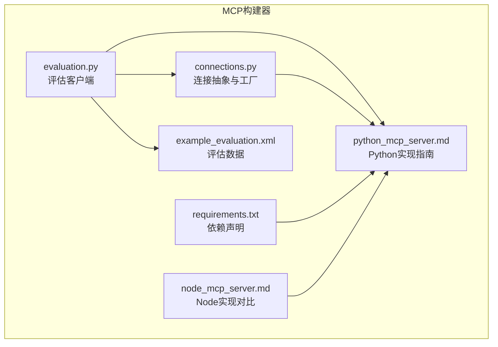
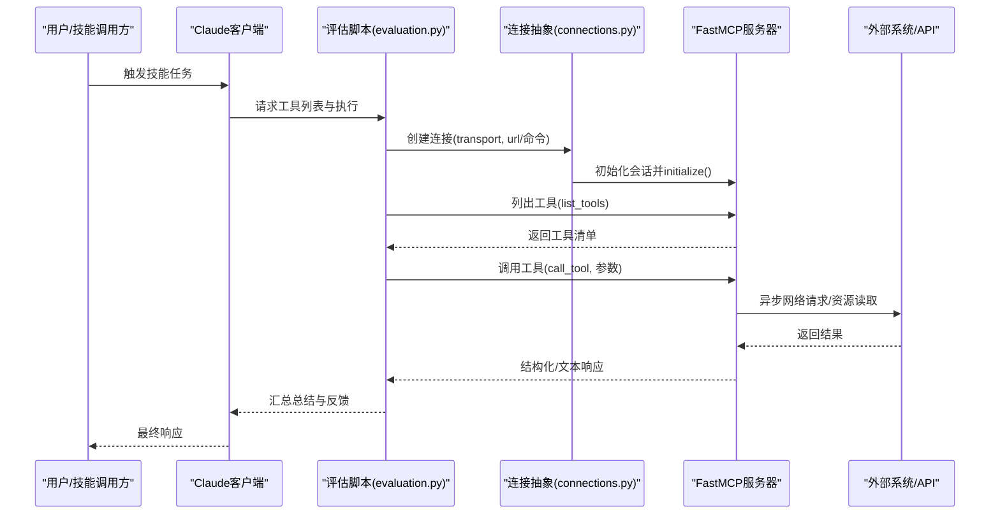
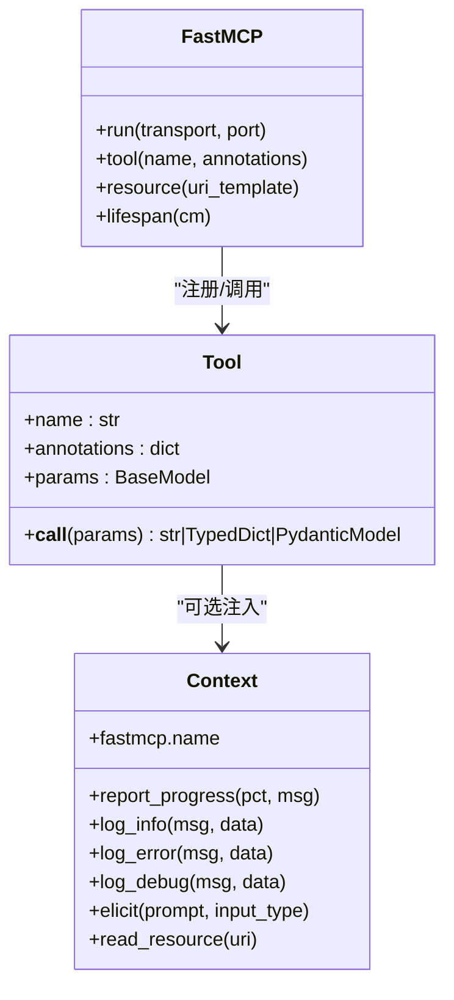
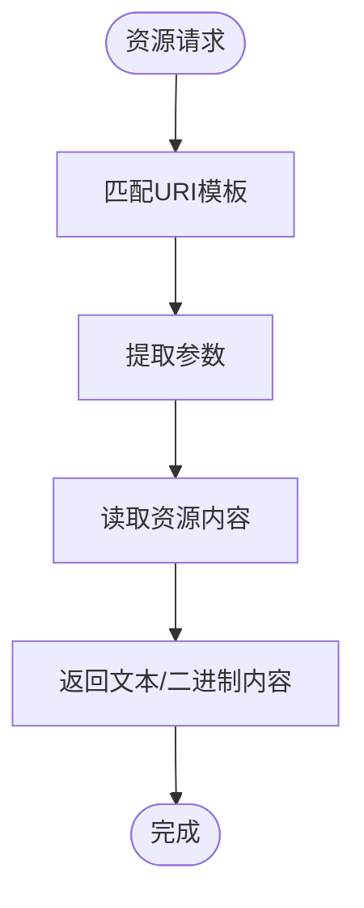
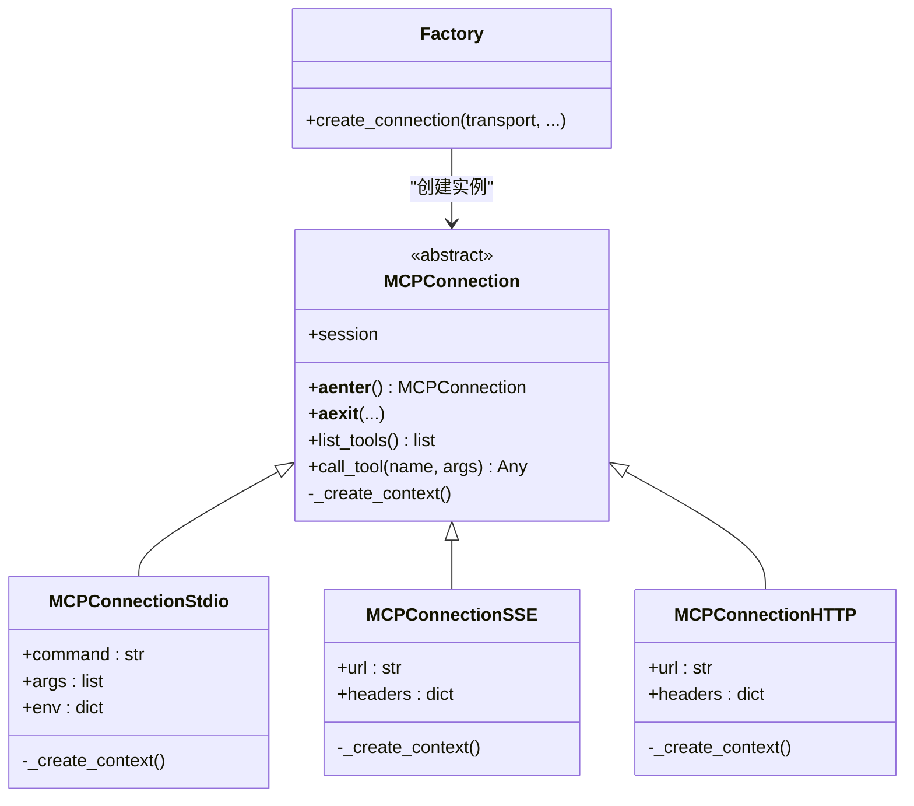
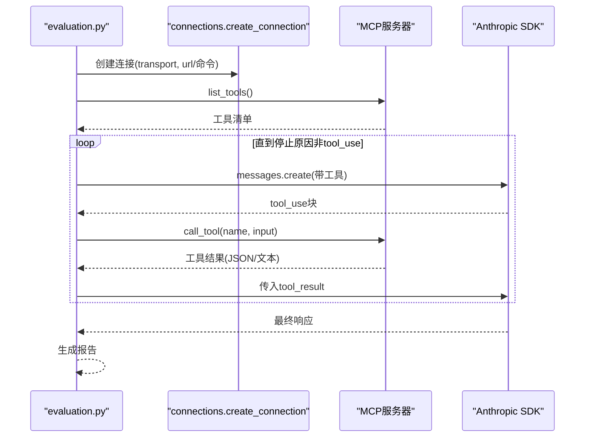
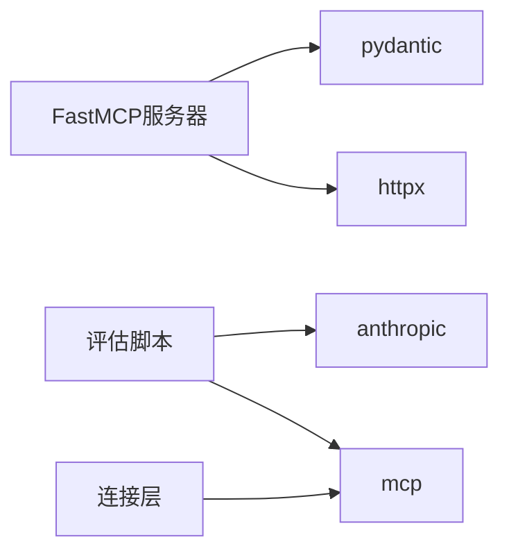
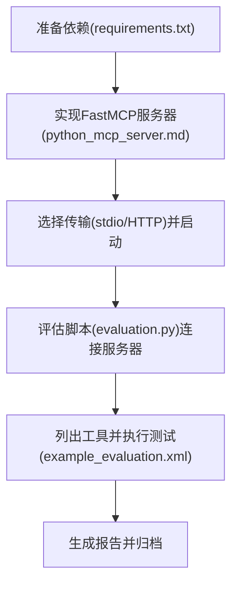

# Python MCP服务器实现

<cite>
**本文引用的文件**
- [python_mcp_server.md](file://skills/mcp-builder/reference/python_mcp_server.md)
- [connections.py](file://skills/mcp-builder/scripts/connections.py)
- [requirements.txt](file://skills/mcp-builder/scripts/requirements.txt)
- [evaluation.py](file://skills/mcp-builder/scripts/evaluation.py)
- [example_evaluation.xml](file://skills/mcp-builder/scripts/example_evaluation.xml)
- [node_mcp_server.md](file://skills/mcp-builder/reference/node_mcp_server.md)
</cite>

## 目录
1. [引言](#引言)
2. [项目结构](#项目结构)
3. [核心组件](#核心组件)
4. [架构总览](#架构总览)
5. [详细组件分析](#详细组件分析)
6. [依赖关系分析](#依赖关系分析)
7. [性能考量](#性能考量)
8. [故障排查指南](#故障排查指南)
9. [结论](#结论)
10. [附录](#附录)

## 引言
本文件面向希望基于Python生态构建符合MCP（Model Context Protocol）规范的服务器实现者，系统性阐述工具注册、资源暴露、异步请求处理、连接交互、依赖管理与环境配置、以及异常传播等关键主题。文档以“Python MCP服务器实现指南”为依据，结合连接层与评估脚本，给出从服务启动到被Claude技能调用的完整流程说明，并提供可运行示例的路径定位，帮助读者快速落地。

## 项目结构
该仓库中与Python MCP服务器实现直接相关的核心位置如下：
- 参考文档：skills/mcp-builder/reference/python_mcp_server.md 提供了Python/FastMCP的完整实现指南与最佳实践
- 连接层：skills/mcp-builder/scripts/connections.py 提供了统一的MCP连接抽象与工厂方法，支持stdio、SSE、Streamable HTTP三种传输
- 依赖声明：skills/mcp-builder/scripts/requirements.txt 指明了mcp与anthropic等关键依赖
- 评估脚本：skills/mcp-builder/scripts/evaluation.py 提供了通过Claude对MCP服务器进行自动化评估的客户端工具
- 示例评估数据：skills/mcp-builder/scripts/example_evaluation.xml 提供了测试用的问答对XML样例
- 对比参考：skills/mcp-builder/reference/node_mcp_server.md 提供了Node/TypeScript实现的对比视角，便于理解跨语言差异

图表来源
- [python_mcp_server.md](file://skills/mcp-builder/reference/python_mcp_server.md#L1-L200)
- [connections.py](file://skills/mcp-builder/scripts/connections.py#L1-L152)
- [requirements.txt](file://skills/mcp-builder/scripts/requirements.txt#L1-L3)
- [evaluation.py](file://skills/mcp-builder/scripts/evaluation.py#L1-L120)
- [example_evaluation.xml](file://skills/mcp-builder/scripts/example_evaluation.xml#L1-L23)
- [node_mcp_server.md](file://skills/mcp-builder/reference/node_mcp_server.md#L1-L120)

章节来源
- [python_mcp_server.md](file://skills/mcp-builder/reference/python_mcp_server.md#L1-L120)
- [connections.py](file://skills/mcp-builder/scripts/connections.py#L1-L60)
- [requirements.txt](file://skills/mcp-builder/scripts/requirements.txt#L1-L3)

## 核心组件
- FastMCP服务器框架：用于定义工具、资源与生命周期管理，自动从函数签名与docstring生成描述与输入schema，支持装饰器式工具注册与上下文注入
- 工具注册与输入验证：通过Pydantic模型进行参数校验，确保输入约束与类型安全；工具返回值支持字符串与结构化类型（如TypedDict、Pydantic模型）
- 资源注册：通过URI模板暴露静态或半静态数据，适合简单参数访问场景
- 上下文能力：Context参数可访问进度上报、日志、用户交互（elicit）、读取资源等高级特性
- 生命周期管理：通过lifespan在服务器启动时初始化持久资源并在关闭时清理
- 传输选择：支持stdio（本地子进程）与Streamable HTTP（远程服务）两种主要传输机制

章节来源
- [python_mcp_server.md](file://skills/mcp-builder/reference/python_mcp_server.md#L35-L120)
- [python_mcp_server.md](file://skills/mcp-builder/reference/python_mcp_server.md#L476-L719)

## 架构总览
下图展示了从Claude技能到MCP服务器的交互路径，以及连接层如何适配不同传输方式：

图表来源
- [evaluation.py](file://skills/mcp-builder/scripts/evaluation.py#L1-L120)
- [connections.py](file://skills/mcp-builder/scripts/connections.py#L1-L120)
- [python_mcp_server.md](file://skills/mcp-builder/reference/python_mcp_server.md#L619-L719)

## 详细组件分析

### 组件A：FastMCP服务器与工具注册
- 服务器命名与初始化：遵循“{service}_mcp”的命名约定，使用FastMCP创建实例
- 工具装饰器：通过@mcp.tool(name, annotations)进行注册，自动提取描述与输入schema
- 输入验证：使用Pydantic BaseModel定义参数模型，含字段约束、校验器与配置
- 输出格式：支持Markdown与JSON两种输出格式，便于人类可读与机器解析
- 错误处理：统一错误格式化函数，区分HTTP状态码与超时等异常
- 上下文能力：可选注入Context参数，支持进度上报、日志、用户交互与资源读取
- 生命周期：通过lifespan管理数据库连接、配置加载等长生命周期资源
- 传输选择：默认stdio，也可选择Streamable HTTP并通过端口运行

图表来源
- [python_mcp_server.md](file://skills/mcp-builder/reference/python_mcp_server.md#L35-L120)
- [python_mcp_server.md](file://skills/mcp-builder/reference/python_mcp_server.md#L476-L719)

章节来源
- [python_mcp_server.md](file://skills/mcp-builder/reference/python_mcp_server.md#L35-L120)
- [python_mcp_server.md](file://skills/mcp-builder/reference/python_mcp_server.md#L476-L719)

### 组件B：资源注册与暴露
- 资源注册：通过@mcp.resource("uri-template")将静态或半静态数据暴露为资源，适合简单参数访问
- URI模板：支持动态参数提取，便于灵活访问
- 与工具的区别：资源适用于简单参数访问，工具适用于复杂业务逻辑与验证

图表来源
- [python_mcp_server.md](file://skills/mcp-builder/reference/python_mcp_server.md#L527-L554)

章节来源
- [python_mcp_server.md](file://skills/mcp-builder/reference/python_mcp_server.md#L527-L554)

### 组件C：连接层与外部系统交互
- 抽象基类：MCPConnection定义统一入口，封装会话初始化与资源清理
- 传输适配：MCPConnectionStdio、MCPConnectionSSE、MCPConnectionHTTP分别对应stdio、SSE、Streamable HTTP
- 工厂方法：create_connection根据transport类型返回相应连接实例
- 工具发现与调用：list_tools与call_tool提供与服务器交互的标准接口

图表来源
- [connections.py](file://skills/mcp-builder/scripts/connections.py#L1-L152)

章节来源
- [connections.py](file://skills/mcp-builder/scripts/connections.py#L1-L152)

### 组件D：评估脚本与Claude集成
- 工具枚举：通过连接对象列出服务器可用工具
- 代理循环：基于Anthropic SDK发起消息请求，当返回tool_use时，调用连接的call_tool获取结果
- 指标统计：记录每个工具的调用次数与时延，汇总报告
- 传输配置：支持stdio、SSE、HTTP三种传输，可通过命令行参数指定

图表来源
- [evaluation.py](file://skills/mcp-builder/scripts/evaluation.py#L1-L200)
- [connections.py](file://skills/mcp-builder/scripts/connections.py#L112-L152)

章节来源
- [evaluation.py](file://skills/mcp-builder/scripts/evaluation.py#L1-L200)
- [example_evaluation.xml](file://skills/mcp-builder/scripts/example_evaluation.xml#L1-L23)

## 依赖关系分析
- Python SDK依赖：mcp>=1.1.0，anthropic>=0.39.0（用于与Claude交互）
- 第三方库：httpx（异步HTTP客户端），pydantic（输入验证），typing/enum等标准库
- 传输依赖：stdio无需额外依赖；SSE/Streamable HTTP由mcp客户端库提供

图表来源
- [requirements.txt](file://skills/mcp-builder/scripts/requirements.txt#L1-L3)
- [python_mcp_server.md](file://skills/mcp-builder/reference/python_mcp_server.md#L1-L40)
- [evaluation.py](file://skills/mcp-builder/scripts/evaluation.py#L1-L40)

章节来源
- [requirements.txt](file://skills/mcp-builder/scripts/requirements.txt#L1-L3)
- [python_mcp_server.md](file://skills/mcp-builder/reference/python_mcp_server.md#L1-L40)
- [evaluation.py](file://skills/mcp-builder/scripts/evaluation.py#L1-L40)

## 性能考量
- 异步I/O：所有网络请求与资源访问均采用异步模式，避免阻塞事件循环
- 客户端复用：使用AsyncClient上下文管理器，减少连接开销
- 分页与过滤：提供limit/offset等参数，控制结果规模，避免一次性返回大量数据
- 响应格式：在Markdown与JSON之间按需切换，兼顾人类可读与机器解析效率
- 进度上报：通过Context.report_progress反馈长耗时操作，提升可观测性

章节来源
- [python_mcp_server.md](file://skills/mcp-builder/reference/python_mcp_server.md#L246-L320)
- [python_mcp_server.md](file://skills/mcp-builder/reference/python_mcp_server.md#L520-L554)

## 故障排查指南
- 输入验证失败：检查Pydantic模型字段约束与校验器是否覆盖边界情况
- 网络错误：区分HTTP状态码与超时，使用统一错误格式化函数输出清晰提示
- 传输问题：确认transport类型与URL/命令参数正确；stdio需提供可执行命令
- 连接泄漏：确保使用AsyncExitStack与上下文管理器，保证会话与资源正确释放
- 评估失败：核对评估XML格式、工具名称与参数一致性；检查连接工厂参数

章节来源
- [python_mcp_server.md](file://skills/mcp-builder/reference/python_mcp_server.md#L207-L263)
- [connections.py](file://skills/mcp-builder/scripts/connections.py#L1-L120)
- [evaluation.py](file://skills/mcp-builder/scripts/evaluation.py#L289-L374)

## 结论
通过FastMCP与Pydantic的组合，Python MCP服务器能够以最小样板代码实现强健的工具注册、输入验证与结构化输出；借助连接层抽象，可灵活适配多种传输方式；配合评估脚本，可自动化验证工具质量与性能。建议在实际项目中优先采用装饰器式工具注册、上下文能力与生命周期管理，严格遵循命名与注解规范，确保工具可组合、可维护且易于被Claude技能调用。

## 附录

### 从服务启动到被Claude调用的全流程示例（步骤级）
- 准备依赖：安装mcp与anthropic等依赖
- 实现服务器：使用FastMCP定义工具与资源，设置annotations与输入模型
- 启动服务器：选择stdio或Streamable HTTP传输并运行
- 评估验证：使用evaluation.py连接服务器，列出工具并执行测试用例
- 生成报告：汇总准确率、平均时延与工具调用指标

图表来源
- [requirements.txt](file://skills/mcp-builder/scripts/requirements.txt#L1-L3)
- [python_mcp_server.md](file://skills/mcp-builder/reference/python_mcp_server.md#L619-L719)
- [evaluation.py](file://skills/mcp-builder/scripts/evaluation.py#L220-L374)
- [example_evaluation.xml](file://skills/mcp-builder/scripts/example_evaluation.xml#L1-L23)

章节来源
- [requirements.txt](file://skills/mcp-builder/scripts/requirements.txt#L1-L3)
- [python_mcp_server.md](file://skills/mcp-builder/reference/python_mcp_server.md#L619-L719)
- [evaluation.py](file://skills/mcp-builder/scripts/evaluation.py#L220-L374)
- [example_evaluation.xml](file://skills/mcp-builder/scripts/example_evaluation.xml#L1-L23)