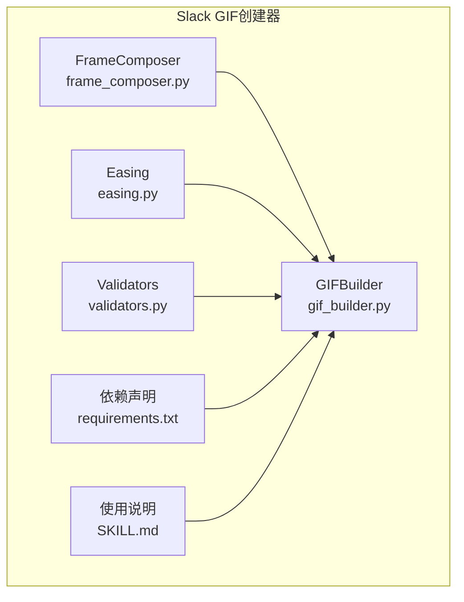
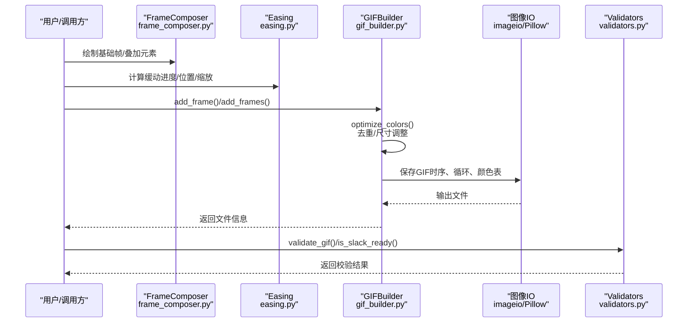
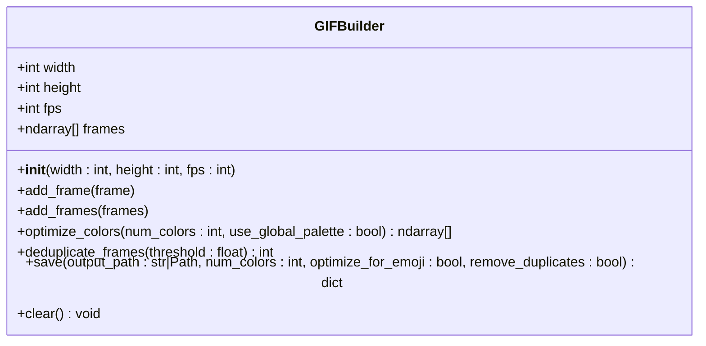
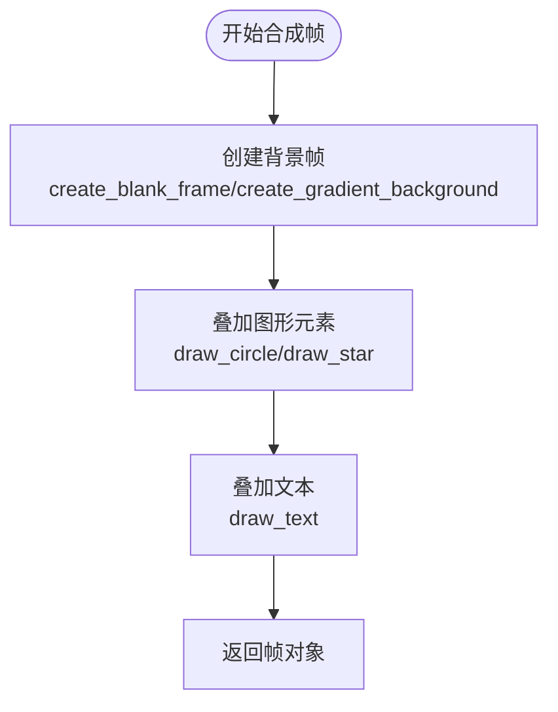
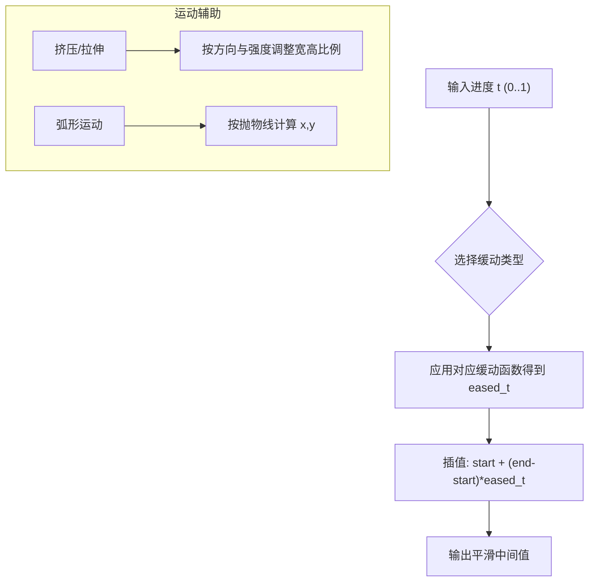
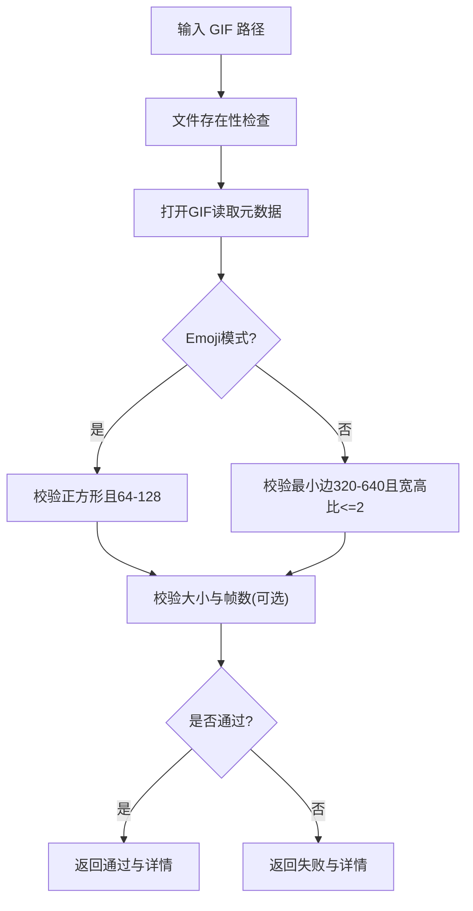
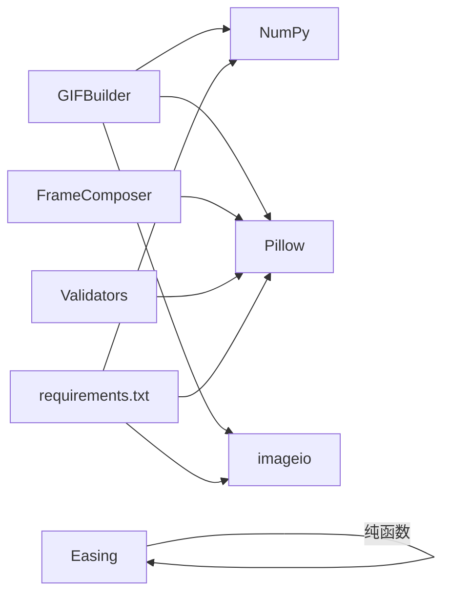

# Slack GIF创建器

<cite>
**本文引用的文件**
- [gif_builder.py](file://skills/slack-gif-creator/core/gif_builder.py)
- [frame_composer.py](file://skills/slack-gif-creator/core/frame_composer.py)
- [easing.py](file://skills/slack-gif-creator/core/easing.py)
- [validators.py](file://skills/slack-gif-creator/core/validators.py)
- [requirements.txt](file://skills/slack-gif-creator/requirements.txt)
- [SKILL.md](file://skills/slack-gif-creator/SKILL.md)
</cite>

## 目录
1. [简介](#简介)
2. [项目结构](#项目结构)
3. [核心组件](#核心组件)
4. [架构总览](#架构总览)
5. [详细组件分析](#详细组件分析)
6. [依赖关系分析](#依赖关系分析)
7. [性能考量](#性能考量)
8. [故障排查指南](#故障排查指南)
9. [结论](#结论)
10. [附录](#附录)

## 简介
本文件为Slack GIF创建器技能的技术文档，聚焦动画生成引擎的架构与实现，围绕以下目标展开：
- 解释gif_builder.py如何协调帧合成、时序控制与GIF编码流程；
- 结合frame_composer.py说明视觉元素的叠加与布局逻辑；
- 阐述easing.py中缓动函数对动画流畅度的影响机制；
- 描述validators.py如何确保输入参数与输出格式的合法性；
- 提供从参数配置到最终GIF输出的完整调用链路示例，覆盖帧率控制、颜色优化与文件大小限制等性能调优策略。

## 项目结构
该技能位于skills/slack-gif-creator目录下，核心模块包括：
- 核心构建器：gif_builder.py（GIFBuilder类）
- 帧合成工具：frame_composer.py（常见图形绘制与背景生成）
- 缓动与运动：easing.py（多种缓动函数与运动辅助）
- 合法性校验：validators.py（尺寸、帧数、大小等验证）
- 依赖声明：requirements.txt
- 使用说明与最佳实践：SKILL.md

图表来源
- [gif_builder.py](file://skills/slack-gif-creator/core/gif_builder.py#L1-L270)
- [frame_composer.py](file://skills/slack-gif-creator/core/frame_composer.py#L1-L177)
- [easing.py](file://skills/slack-gif-creator/core/easing.py#L1-L235)
- [validators.py](file://skills/slack-gif-creator/core/validators.py#L1-L137)
- [requirements.txt](file://skills/slack-gif-creator/requirements.txt#L1-L4)
- [SKILL.md](file://skills/slack-gif-creator/SKILL.md#L1-L255)

章节来源
- [requirements.txt](file://skills/slack-gif-creator/requirements.txt#L1-L4)
- [SKILL.md](file://skills/slack-gif-creator/SKILL.md#L1-L255)

## 核心组件
- GIFBuilder：负责接收帧、颜色量化、去重、时序控制与GIF编码输出；支持emoji模式下的尺寸与帧数优化。
- FrameComposer：提供空白帧、圆形、文本、渐变背景、五角星等常用绘制工具，便于快速合成帧。
- Easing：提供线性与多项式、弹性、弹跳、回退等多种缓动函数，以及基于缓动的插值与弧形运动计算。
- Validators：读取已生成GIF并校验尺寸、帧数、大小与FPS，判断是否符合Slack要求。

章节来源
- [gif_builder.py](file://skills/slack-gif-creator/core/gif_builder.py#L1-L270)
- [frame_composer.py](file://skills/slack-gif-creator/core/frame_composer.py#L1-L177)
- [easing.py](file://skills/slack-gif-creator/core/easing.py#L1-L235)
- [validators.py](file://skills/slack-gif-creator/core/validators.py#L1-L137)

## 架构总览
下图展示了从帧生成到GIF输出的端到端流程，以及各模块之间的协作关系。

图表来源
- [gif_builder.py](file://skills/slack-gif-creator/core/gif_builder.py#L1-L270)
- [frame_composer.py](file://skills/slack-gif-creator/core/frame_composer.py#L1-L177)
- [easing.py](file://skills/slack-gif-creator/core/easing.py#L1-L235)
- [validators.py](file://skills/slack-gif-creator/core/validators.py#L1-L137)

## 详细组件分析

### GIFBuilder（帧合成、颜色量化、时序与编码）
- 初始化与参数
  - 宽高与帧率在构造时确定，作为后续尺寸校正与时序的基础。
- 帧管理
  - 支持单帧与批量添加；自动将PIL Image转换为RGB数组并按目标尺寸重采样。
- 颜色优化
  - 通过全局调色板或逐帧量化减少颜色数，提升压缩比与文件体积可控性。
- 去重策略
  - 基于相邻帧像素均值差异计算相似度，阈值可调，保留细微动画同时降低冗余。
- Emoji模式
  - 自动将尺寸约束至128x128以内，颜色上限下调，并在帧数较多时进行降采样以满足时长与体积要求。
- 时序控制
  - 帧间隔由帧率推导为毫秒级，采用无限循环播放。
- 输出与统计
  - 写入GIF后统计文件大小、帧数、时长、颜色数等信息并打印提示。

图表来源
- [gif_builder.py](file://skills/slack-gif-creator/core/gif_builder.py#L1-L270)

章节来源
- [gif_builder.py](file://skills/slack-gif-creator/core/gif_builder.py#L1-L270)

### FrameComposer（视觉元素叠加与布局）
- 基础帧
  - 创建指定尺寸与背景色的空白帧。
- 图形绘制
  - 圆形：支持填充与描边，按中心与半径绘制椭圆。
  - 文本：支持默认字体与居中定位。
  - 渐变背景：按行插值生成垂直渐变。
  - 星形：计算五角星顶点与内点，绘制多边形。
- 复合布局
  - 可先生成背景，再叠加形状、文字与装饰元素，形成复杂帧。

图表来源
- [frame_composer.py](file://skills/slack-gif-creator/core/frame_composer.py#L1-L177)

章节来源
- [frame_composer.py](file://skills/slack-gif-creator/core/frame_composer.py#L1-L177)

### Easing（缓动函数与运动模型）
- 缓动函数族
  - 线性、二次、三次、弹跳、弹性、回退等，提供平滑自然的非线性进度曲线。
- 插值
  - 将起止值按缓动进度插值得到中间值，用于位置、透明度、缩放等连续量。
- 运动辅助
  - 挤压/拉伸：在垂直/水平方向按强度动态调整比例，保持体积守恒感。
  - 弧形轨迹：根据起点、终点与弧高计算抛物线路径上的位置，模拟自然落点。

图表来源
- [easing.py](file://skills/slack-gif-creator/core/easing.py#L1-L235)

章节来源
- [easing.py](file://skills/slack-gif-creator/core/easing.py#L1-L235)

### Validators（合法性校验）
- 输入校验
  - 文件存在性检查与异常处理。
- 读取元数据
  - 打开GIF获取尺寸、帧计数、时长与FPS估算。
- 规则判定
  - Emoji模式：要求正方形且在64-128范围内；消息GIF：宽高最小值在320-640之间，宽高比不超过2:1。
- 快速判断
  - is_slack_ready提供布尔快速通道，validate_gif返回详细报告。

图表来源
- [validators.py](file://skills/slack-gif-creator/core/validators.py#L1-L137)

章节来源
- [validators.py](file://skills/slack-gif-creator/core/validators.py#L1-L137)

## 依赖关系分析
- 外部依赖
  - Pillow：图像处理与绘制、量化、打开GIF读取元数据。
  - imageio：写入GIF，设置帧间隔与循环次数。
  - imageio-ffmpeg：可选，用于某些编解码场景（在requirements中声明）。
  - NumPy：数组操作，支撑颜色量化与帧比较。
- 内部耦合
  - GIFBuilder依赖Pillow与imageio进行I/O，依赖NumPy进行数值处理。
  - FrameComposer仅依赖Pillow，不直接依赖其他模块。
  - Easing纯函数库，无外部依赖。
  - Validators依赖Pillow读取GIF元数据。

图表来源
- [gif_builder.py](file://skills/slack-gif-creator/core/gif_builder.py#L1-L270)
- [frame_composer.py](file://skills/slack-gif-creator/core/frame_composer.py#L1-L177)
- [easing.py](file://skills/slack-gif-creator/core/easing.py#L1-L235)
- [validators.py](file://skills/slack-gif-creator/core/validators.py#L1-L137)
- [requirements.txt](file://skills/slack-gif-creator/requirements.txt#L1-L4)

章节来源
- [requirements.txt](file://skills/slack-gif-creator/requirements.txt#L1-L4)

## 性能考量
- 帧率控制
  - 低帧率（如10-15）可显著减小文件体积；emoji模式下会进一步限制帧数以控制时长。
- 颜色优化
  - 全局调色板可提升压缩效率；颜色数建议在48-128之间，emoji模式默认更严格。
- 尺寸与帧数
  - emoji推荐128x128；消息GIF通常480x480；帧数过多会导致体积与时长上升。
- 去重策略
  - 对近似重复帧进行去重，可在保留细节的同时减少冗余。
- 输出统计
  - 保存后输出KB/MB、帧数、FPS与时长，便于评估与二次优化。

章节来源
- [gif_builder.py](file://skills/slack-gif-creator/core/gif_builder.py#L1-L270)
- [SKILL.md](file://skills/slack-gif-creator/SKILL.md#L1-L255)

## 故障排查指南
- 无帧可保存
  - 若未添加任何帧即调用保存，将抛出错误；请先add_frame/add_frames。
- 尺寸不匹配
  - 添加的帧若尺寸与构建器设定不符，会自动重采样；如出现模糊或失真，建议在生成阶段就按目标尺寸绘制。
- 颜色过多导致体积过大
  - 降低num_colors或启用emoji模式；必要时开启remove_duplicates。
- FPS过高或帧数过多
  - emoji模式会自动降帧；也可手动降低FPS或减少帧数。
- 校验不通过
  - 使用validators.validate_gif查看具体维度、帧数与大小；根据报告调整参数。

章节来源
- [gif_builder.py](file://skills/slack-gif-creator/core/gif_builder.py#L1-L270)
- [validators.py](file://skills/slack-gif-creator/core/validators.py#L1-L137)

## 结论
该动画生成引擎以GIFBuilder为核心，结合FrameComposer的可视化能力、Easing的运动模型与Validators的合规校验，形成了从帧生成到GIF输出的完整闭环。通过颜色量化、全局调色板、帧去重与emoji模式下的尺寸/帧数约束，能够在保证视觉质量的前提下有效控制文件体积与时长，满足Slack平台的要求。

## 附录

### 完整调用链路示例（参数到输出）
- 步骤概览
  - 初始化GIFBuilder（宽高、帧率）。
  - 使用FrameComposer绘制基础帧与叠加元素。
  - 使用Easing计算位置、缩放或透明度等连续量。
  - 将帧加入GIFBuilder，必要时启用emoji模式与去重。
  - 保存GIF并获取统计信息。
  - 使用Validators进行合规校验。
- 关键参数与建议
  - emoji：128x128，FPS 10-15，颜色48-64，帧数≤12。
  - 消息：480x480，FPS 15-24，颜色64-128，时长≤3秒。
- 性能优化要点
  - 减帧、降色、降尺寸、去重、emoji模式。
  - 优先使用全局调色板与Lanczos重采样。

章节来源
- [SKILL.md](file://skills/slack-gif-creator/SKILL.md#L1-L255)
- [gif_builder.py](file://skills/slack-gif-creator/core/gif_builder.py#L1-L270)
- [frame_composer.py](file://skills/slack-gif-creator/core/frame_composer.py#L1-L177)
- [easing.py](file://skills/slack-gif-creator/core/easing.py#L1-L235)
- [validators.py](file://skills/slack-gif-creator/core/validators.py#L1-L137)