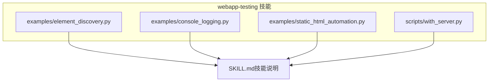
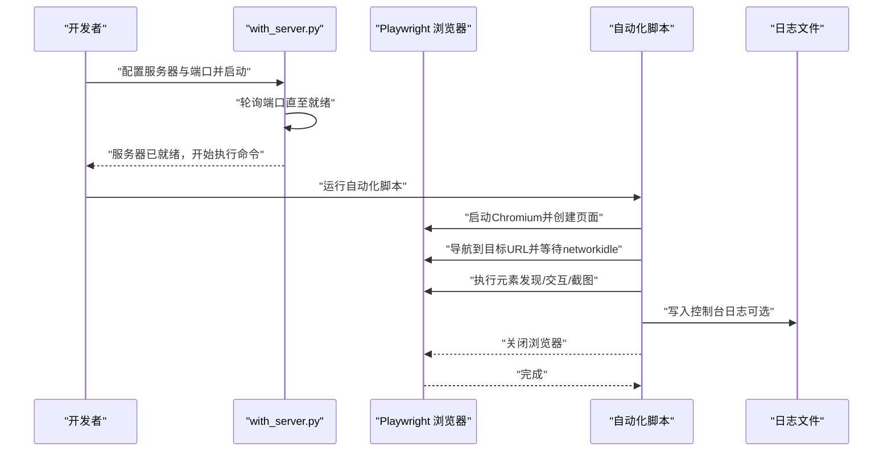
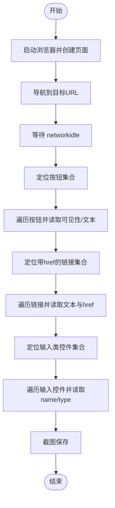
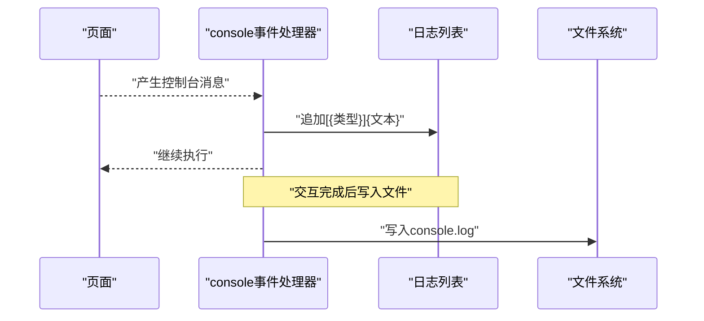
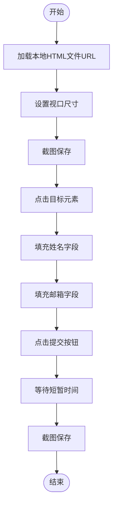
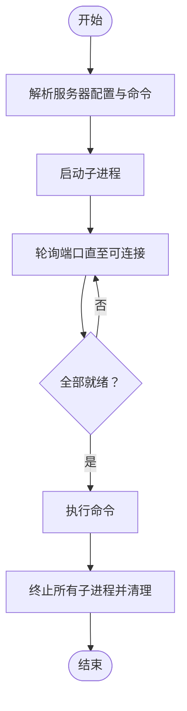
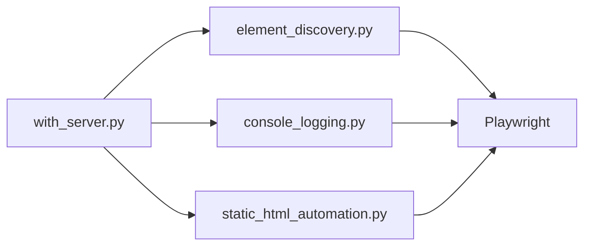

# Web应用测试

<cite>
**本文引用的文件**
- [SKILL.md](file://skills/webapp-testing/SKILL.md)
- [element_discovery.py](file://skills/webapp-testing/examples/element_discovery.py)
- [console_logging.py](file://skills/webapp-testing/examples/console_logging.py)
- [static_html_automation.py](file://skills/webapp-testing/examples/static_html_automation.py)
- [with_server.py](file://skills/webapp-testing/scripts/with_server.py)
</cite>

## 目录
1. [引言](#引言)
2. [项目结构](#项目结构)
3. [核心组件](#核心组件)
4. [架构总览](#架构总览)
5. [详细组件分析](#详细组件分析)
6. [依赖关系分析](#依赖关系分析)
7. [性能与稳定性考量](#性能与稳定性考量)
8. [故障排查指南](#故障排查指南)
9. [结论](#结论)
10. [附录：测试脚本编写范式与最佳实践](#附录测试脚本编写范式与最佳实践)

## 引言
本技术指南聚焦于Web应用测试中的自动化UI测试能力，围绕以下三个示例脚本展开：
- 基于选择器与属性匹配的元素识别算法（element_discovery.py）
- 前端运行时日志捕获与辅助调试（console_logging.py）
- 静态页面DOM操作与交互模拟（static_html_automation.py）

同时，结合服务器生命周期管理脚本（with_server.py）与技能说明文档（SKILL.md），给出测试脚本的编写范式、与浏览器环境的集成方式，并通过实际用例展示断言、等待机制与测试报告生成的思路。

## 项目结构
Web应用测试技能位于 skills/webapp-testing 目录，包含示例脚本与服务器管理脚本：
- examples/：示例脚本，演示元素发现、控制台日志捕获、静态HTML自动化
- scripts/：服务器生命周期管理工具，支持单/多服务启动、端口就绪检测、命令执行与清理

图表来源
- [SKILL.md](file://skills/webapp-testing/SKILL.md#L1-L96)
- [element_discovery.py](file://skills/webapp-testing/examples/element_discovery.py#L1-L40)
- [console_logging.py](file://skills/webapp-testing/examples/console_logging.py#L1-L35)
- [static_html_automation.py](file://skills/webapp-testing/examples/static_html_automation.py#L1-L33)
- [with_server.py](file://skills/webapp-testing/scripts/with_server.py#L1-L106)

章节来源
- [SKILL.md](file://skills/webapp-testing/SKILL.md#L1-L96)

## 核心组件
- 元素发现与选择器匹配（element_discovery.py）
  - 使用同步Playwright打开Chromium，导航到本地开发地址，等待网络空闲后，通过定位器查询按钮、链接、输入框等元素，并输出可见性信息与属性值；最后截图保存以便可视化核验。
- 控制台日志捕获（console_logging.py）
  - 注册“console”事件监听器，收集页面运行时的控制台消息（类型与文本），并与用户交互动作配合，最终将日志写入文件，便于调试与审计。
- 静态HTML自动化（static_html_automation.py）
  - 通过file://协议加载本地HTML文件，截图、点击、填充表单并提交，验证静态页面的交互流程与渲染结果。
- 服务器生命周期管理（with_server.py）
  - 支持启动一个或多个子进程作为服务，轮询端口直到可连接，再执行指定命令，最后统一清理所有服务进程。

章节来源
- [element_discovery.py](file://skills/webapp-testing/examples/element_discovery.py#L1-L40)
- [console_logging.py](file://skills/webapp-testing/examples/console_logging.py#L1-L35)
- [static_html_automation.py](file://skills/webapp-testing/examples/static_html_automation.py#L1-L33)
- [with_server.py](file://skills/webapp-testing/scripts/with_server.py#L1-L106)

## 架构总览
下图展示了从服务器准备到自动化脚本执行的整体流程，以及各组件之间的协作关系。

图表来源
- [with_server.py](file://skills/webapp-testing/scripts/with_server.py#L1-L106)
- [element_discovery.py](file://skills/webapp-testing/examples/element_discovery.py#L1-L40)
- [console_logging.py](file://skills/webapp-testing/examples/console_logging.py#L1-L35)
- [static_html_automation.py](file://skills/webapp-testing/examples/static_html_automation.py#L1-L33)

## 详细组件分析

### 组件A：元素发现与选择器匹配（element_discovery.py）
- 设计要点
  - 使用同步Playwright上下文，启动无头浏览器，新建页面并导航至本地开发地址。
  - 等待页面达到“networkidle”状态，确保动态内容加载完成后再进行元素发现。
  - 通过定位器选择器查询按钮、带href的链接、输入类控件，并输出名称、类型、可见性等信息。
  - 截图保存用于可视化核验。
- 处理逻辑与复杂度
  - 定位器查询与遍历为线性复杂度 O(n)，其中 n 为匹配元素数量。
  - 可见性判断与属性读取为常数时间操作。
- 错误处理与边界
  - 若页面未完全加载即进行发现，可能导致元素缺失或属性为空；应遵循“先等待networkidle，再发现”的原则。
  - 对隐藏元素采用可见性检查，避免输出不可见文本。
- 性能影响
  - 无头模式减少资源消耗；截图仅在必要时执行，避免频繁I/O。
- 断言与等待建议
  - 断言：统计元素数量、校验特定属性值、确认可见性。
  - 等待：优先使用等待网络空闲与显式等待定位器出现，其次使用超时等待作为兜底。

图表来源
- [element_discovery.py](file://skills/webapp-testing/examples/element_discovery.py#L1-L40)

章节来源
- [element_discovery.py](file://skills/webapp-testing/examples/element_discovery.py#L1-L40)

### 组件B：控制台日志捕获与辅助调试（console_logging.py）
- 设计要点
  - 注册“console”事件回调，将消息类型与文本追加到内存列表，并打印到标准输出。
  - 导航页面并等待网络空闲后，触发用户交互动作，从而产生前端日志。
  - 将收集到的日志写入持久化文件，便于后续分析与归档。
- 处理逻辑与复杂度
  - 日志收集为线性复杂度 O(m)，m 为消息数量。
  - 文件写入为一次I/O操作，成本与消息量成正比。
- 错误处理与边界
  - 若页面未加载完成即触发交互，可能遗漏部分日志；应先等待networkidle。
  - 控制台事件回调在页面生命周期内持续生效，需注意日志去重与过滤策略（可在回调中按需扩展）。
- 性能影响
  - 控制台日志捕获对性能影响极小；写文件操作建议在脚本末尾集中执行。
- 断言与等待建议
  - 断言：检查是否存在错误级别日志、特定关键词日志、日志数量阈值。
  - 等待：在交互前后分别等待，确保日志完整到达。

图表来源
- [console_logging.py](file://skills/webapp-testing/examples/console_logging.py#L1-L35)

章节来源
- [console_logging.py](file://skills/webapp-testing/examples/console_logging.py#L1-L35)

### 组件C：静态HTML自动化（static_html_automation.py）
- 设计要点
  - 通过file://协议加载本地HTML文件，设置视口尺寸，截图保存。
  - 执行点击、填充表单字段、提交等交互动作，再次截图验证结果。
- 处理逻辑与复杂度
  - 交互操作为常数时间；截图与I/O为一次性开销。
- 错误处理与边界
  - 路径必须为绝对路径，否则无法正确解析file:// URL。
  - 交互前应确保元素存在，可通过等待或显式断言保障。
- 性能影响
  - 无头模式与少量截图对性能影响较小。
- 断言与等待建议
  - 断言：校验提交后的页面状态、弹窗提示、URL变化或元素可见性。
  - 等待：在提交后等待短暂时间或显式等待特定元素出现。

图表来源
- [static_html_automation.py](file://skills/webapp-testing/examples/static_html_automation.py#L1-L33)

章节来源
- [static_html_automation.py](file://skills/webapp-testing/examples/static_html_automation.py#L1-L33)

### 组件D：服务器生命周期管理（with_server.py）
- 设计要点
  - 支持多服务器配置，逐个启动并轮询端口直至可连接。
  - 在所有服务器就绪后执行指定命令，最后统一终止所有子进程。
- 处理逻辑与复杂度
  - 端口探测为轮询O(T)，T为超时时间；进程管理为常数级。
- 错误处理与边界
  - 超时未就绪抛出异常并清理；命令参数不匹配会直接报错退出。
- 性能影响
  - 启动与清理过程对系统资源有短期占用，但整体可控。
- 断言与等待建议
  - 断言：检查命令返回码；在脚本中补充对目标服务可用性的二次验证。
  - 等待：根据服务启动耗时调整超时参数。

图表来源
- [with_server.py](file://skills/webapp-testing/scripts/with_server.py#L1-L106)

章节来源
- [with_server.py](file://skills/webapp-testing/scripts/with_server.py#L1-L106)

## 依赖关系分析
- 组件耦合
  - 示例脚本均依赖Playwright同步API，彼此独立，无直接耦合。
  - with_server.py与示例脚本通过命令行组合使用，形成“服务器准备—脚本执行—清理”的链路。
- 外部依赖
  - Playwright浏览器驱动与Chromium内核。
  - 操作系统端口探测与进程管理能力。
- 潜在循环依赖
  - 不存在循环依赖，脚本间为单向调用关系。

图表来源
- [with_server.py](file://skills/webapp-testing/scripts/with_server.py#L1-L106)
- [element_discovery.py](file://skills/webapp-testing/examples/element_discovery.py#L1-L40)
- [console_logging.py](file://skills/webapp-testing/examples/console_logging.py#L1-L35)
- [static_html_automation.py](file://skills/webapp-testing/examples/static_html_automation.py#L1-L33)

章节来源
- [with_server.py](file://skills/webapp-testing/scripts/with_server.py#L1-L106)
- [element_discovery.py](file://skills/webapp-testing/examples/element_discovery.py#L1-L40)
- [console_logging.py](file://skills/webapp-testing/examples/console_logging.py#L1-L35)
- [static_html_automation.py](file://skills/webapp-testing/examples/static_html_automation.py#L1-L33)

## 性能与稳定性考量
- 等待策略
  - 优先使用等待网络空闲与显式等待定位器出现，减少随机失败。
  - 对不稳定交互使用超时等待作为兜底，避免无限阻塞。
- 并发与资源
  - 无头模式降低资源消耗；批量截图建议合并或延迟执行。
- 日志与报告
  - 控制台日志与截图可作为轻量级测试报告素材，建议统一命名与目录结构。
- 稳定性
  - 服务器管理脚本提供可靠的端口探测与清理，减少外部环境不确定性。

[本节为通用指导，无需列出章节来源]

## 故障排查指南
- 页面未加载完成即发现元素
  - 现象：元素数量为0或属性为空。
  - 排查：确保先等待网络空闲，再进行元素发现与断言。
  - 参考：技能说明中明确指出“不要在动态应用上先于networkidle检查DOM”。
- 控制台日志缺失
  - 现象：写入文件的日志条目过少。
  - 排查：确认页面已等待networkidle，交互动作触发了前端日志输出；检查事件监听是否注册成功。
- 静态HTML无法加载
  - 现象：file:// URL无效或路径错误。
  - 排查：确保使用绝对路径构造file:// URL；检查文件权限与存在性。
- 服务器未就绪导致脚本失败
  - 现象：with_server.py在超时后报错。
  - 排查：增大超时参数，检查服务命令与端口配置；确认防火墙与端口占用情况。
- 进程清理不彻底
  - 现象：遗留子进程占用资源。
  - 排查：确认with_server.py的清理逻辑已执行；必要时手动终止残留进程。

章节来源
- [SKILL.md](file://skills/webapp-testing/SKILL.md#L78-L82)
- [with_server.py](file://skills/webapp-testing/scripts/with_server.py#L23-L32)
- [static_html_automation.py](file://skills/webapp-testing/examples/static_html_automation.py#L1-L33)
- [console_logging.py](file://skills/webapp-testing/examples/console_logging.py#L1-L35)

## 结论
通过上述三个示例脚本与服务器管理工具，可以构建一套完整的Web应用自动化UI测试工作流：
- 使用元素发现脚本进行选择器探索与断言；
- 使用控制台日志捕获提升调试效率；
- 使用静态HTML自动化验证简单页面交互；
- 使用服务器生命周期管理确保测试环境稳定可靠。

配合规范的等待与断言策略，可有效提升测试稳定性与可维护性。

[本节为总结性内容，无需列出章节来源]

## 附录：测试脚本编写范式与最佳实践
- 脚本编写范式
  - 同步Playwright上下文：始终使用同步API编写脚本，保持简洁一致。
  - 生命周期管理：先等待网络空闲，再进行元素发现与交互；最后关闭浏览器。
  - 选择器策略：优先使用语义化选择器（如text、role），其次CSS或ID。
  - 等待策略：显式等待优于固定超时；对不稳定元素增加重试与断言。
- 与浏览器环境集成
  - 使用with_server.py自动管理本地开发服务器，确保URL与端口正确。
  - 在CI环境中，建议将截图与日志输出到统一目录，便于归档与分析。
- 断言与报告
  - 断言：数量、可见性、属性值、URL变化、控制台日志关键字。
  - 报告：截图+控制台日志+简要步骤说明，形成轻量级测试报告。
- 实际用例建议
  - 动态页面：先等待networkidle，截图核验，再定位按钮/链接/输入框执行交互。
  - 控制台调试：注册console事件，交互前后分别记录日志，定位前端异常。
  - 静态页面：file://加载，截图对比提交前后状态，断言关键元素可见或文案变更。

章节来源
- [SKILL.md](file://skills/webapp-testing/SKILL.md#L16-L96)
- [element_discovery.py](file://skills/webapp-testing/examples/element_discovery.py#L1-L40)
- [console_logging.py](file://skills/webapp-testing/examples/console_logging.py#L1-L35)
- [static_html_automation.py](file://skills/webapp-testing/examples/static_html_automation.py#L1-L33)
- [with_server.py](file://skills/webapp-testing/scripts/with_server.py#L1-L106)