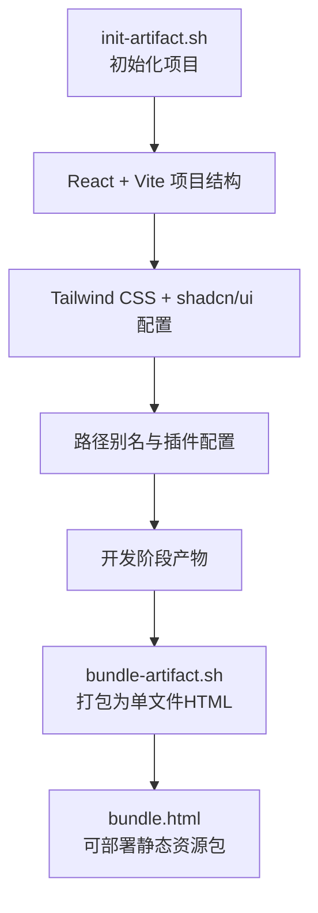
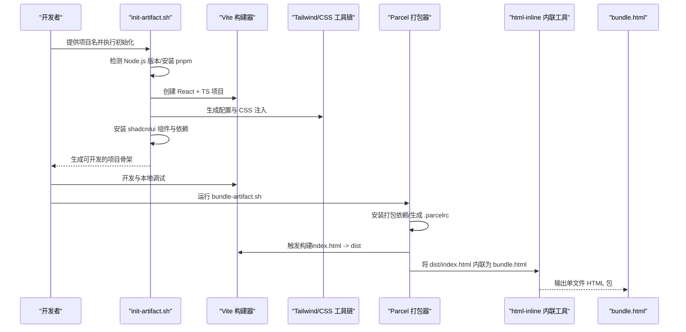
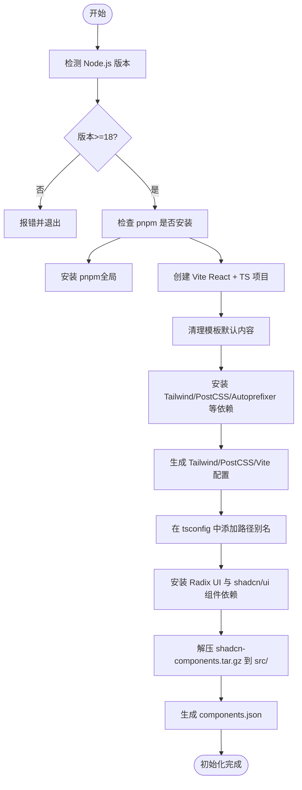
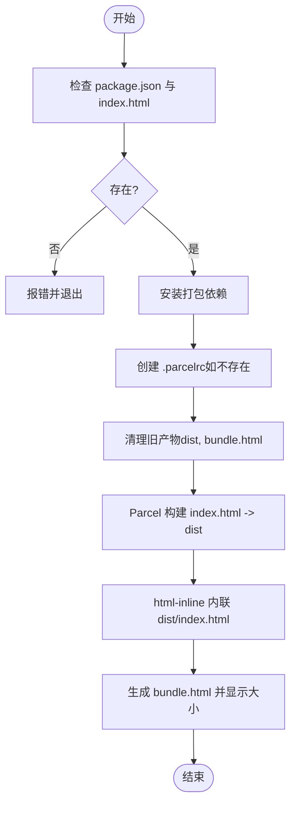
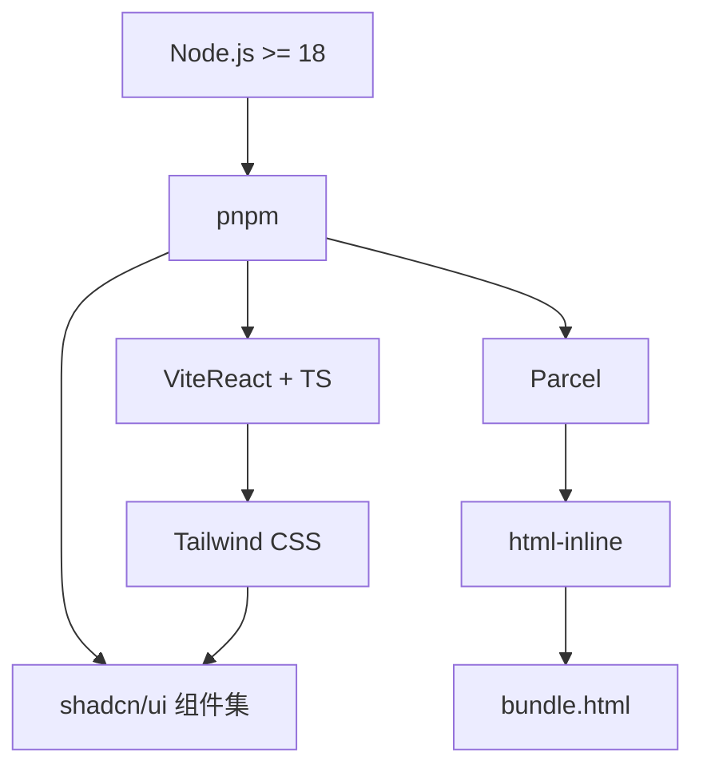

# Web构件构建

<cite>
**本文引用的文件**
- [bundle-artifact.sh](file://skills/web-artifacts-builder/scripts/bundle-artifact.sh)
- [init-artifact.sh](file://skills/web-artifacts-builder/scripts/init-artifact.sh)
- [SKILL.md](file://skills/web-artifacts-builder/SKILL.md)
- [README.md](file://README.md)
</cite>

## 目录
1. [简介](#简介)
2. [项目结构](#项目结构)
3. [核心组件](#核心组件)
4. [架构总览](#架构总览)
5. [详细组件分析](#详细组件分析)
6. [依赖关系分析](#依赖关系分析)
7. [性能考量](#性能考量)
8. [故障排查指南](#故障排查指南)
9. [结论](#结论)
10. [附录](#附录)

## 简介
本参考文档围绕“Web构件构建”技能中的两个核心脚本展开：init-artifact.sh 与 bundle-artifact.sh。前者用于初始化标准化的前端构件项目结构（React + Vite + Tailwind CSS + shadcn/ui），后者用于将开发完成的前端应用打包为单文件 HTML 静态资源包，便于在 Claude 对话中作为可交互的构件进行展示与分发。文档将从系统架构、组件关系、数据流、处理逻辑、集成点、错误处理与性能特征等维度进行深入解析，并提供 CI/CD 集成建议与常见问题排查方案。

## 项目结构
- 脚本位置与职责
  - init-artifact.sh：创建并配置一个标准化的 React + Vite + Tailwind CSS + shadcn/ui 前端项目骨架，自动注入路径别名、Tailwind 配置、Radix UI 组件依赖与 40+ 个 shadcn/ui 组件。
  - bundle-artifact.sh：在已有项目基础上，安装打包依赖、生成 .parcelrc 配置、清理旧产物、调用 Parcel 构建、再通过 html-inline 将所有资源内联到单个 HTML 文件，最终输出 bundle.html。
- 关键输入与输出
  - 输入：项目根目录需包含 index.html；init-artifact.sh 还需要脚本目录下的 shadcn-components.tar.gz。
  - 输出：bundle.html（单文件 HTML 包含全部资源）；dist 目录（Parcel 构建中间产物）。

图表来源
- [init-artifact.sh](file://skills/web-artifacts-builder/scripts/init-artifact.sh#L1-L323)
- [bundle-artifact.sh](file://skills/web-artifacts-builder/scripts/bundle-artifact.sh#L1-L54)

章节来源
- [SKILL.md](file://skills/web-artifacts-builder/SKILL.md#L1-L74)
- [README.md](file://README.md#L1-L95)

## 核心组件
- init-artifact.sh
  - 功能要点
    - 检测 Node.js 版本并选择合适的 Vite 版本（Node 20 使用最新版，Node 18 兼容版本固定）。
    - 自动安装 pnpm（若未安装）。
    - 创建 Vite React + TS 项目，清理模板默认图标与标题，注入自定义标题。
    - 安装 Tailwind CSS、PostCSS、Autoprefixer、类型与动画扩展等依赖。
    - 生成 postcss.config.js 与 tailwind.config.js，并在 src/index.css 中添加 Tailwind 指令与 CSS 变量。
    - 在 tsconfig.json 与 tsconfig.app.json 中添加路径别名 @/* -> ./src/*。
    - 更新 vite.config.ts，设置路径别名映射至 src。
    - 安装 Radix UI 与 shadcn/ui 所需的 40+ 组件依赖。
    - 解压 shadcn-components.tar.gz 到 src/ 并生成 components.json 作为参考配置。
  - 参数与前置条件
    - 必须传入项目名称参数；脚本目录需存在 shadcn-components.tar.gz。
  - 输出目录结构（关键）
    - 项目根目录：index.html、package.json、vite.config.ts、tsconfig.json、tsconfig.app.json、components.json 等。
    - src/：包含解压后的 shadcn/ui 组件源码与样式。
    - 配置文件：postcss.config.js、tailwind.config.js、src/index.css。
- bundle-artifact.sh
  - 功能要点
    - 校验项目根目录存在 package.json 与 index.html。
    - 安装打包依赖（parcel、@parcel/config-default、parcel-resolver-tspaths、html-inline）。
    - 若不存在 .parcelrc，则创建带路径别名支持的 Parcel 配置。
    - 清理旧构建产物（dist、bundle.html）。
    - 使用 Parcel 构建 index.html，目标目录 dist，关闭 Source Map。
    - 使用 html-inline 将 dist/index.html 内联为单文件 bundle.html。
    - 输出文件大小信息。
  - 参数与前置条件
    - 无需参数；必须在已初始化的项目根目录下运行。
  - 输出目录结构（关键）
    - dist/：Parcel 构建产物（构建期间临时目录）。
    - bundle.html：最终单文件 HTML 包。

章节来源
- [init-artifact.sh](file://skills/web-artifacts-builder/scripts/init-artifact.sh#L1-L323)
- [bundle-artifact.sh](file://skills/web-artifacts-builder/scripts/bundle-artifact.sh#L1-L54)

## 架构总览
下图展示了从初始化到打包的完整流程，以及各组件之间的依赖关系与数据流向。

图表来源
- [init-artifact.sh](file://skills/web-artifacts-builder/scripts/init-artifact.sh#L1-L323)
- [bundle-artifact.sh](file://skills/web-artifacts-builder/scripts/bundle-artifact.sh#L1-L54)

## 详细组件分析

### init-artifact.sh 组件分析
- 设计模式与实现要点
  - 条件化依赖安装：根据 Node.js 版本选择 Vite 版本，确保兼容性。
  - 平台适配：通过 OSTYPE 判断操作系统，选择 sed 的就地编辑语法。
  - 配置生成：动态写入 postcss.config.js、tailwind.config.js、vite.config.ts、tsconfig.json、tsconfig.app.json、components.json。
  - 组件注入：通过 tar 解压将 shadcn/ui 组件源码放入 src/，并生成 components.json 作为参考。
- 数据结构与复杂度
  - 配置文件写入为 O(n) 操作（n 为配置行数），对磁盘 I/O 影响有限。
  - 依赖安装为外部进程调用，时间取决于网络与包管理器性能。
- 依赖链
  - Node.js >= 18（脚本检测并报错）
  - pnpm（若缺失则全局安装）
  - Vite（Node 20 使用最新版，Node 18 固定版本）
  - Tailwind CSS 3.4.1 及相关工具
  - shadcn/ui 组件集合（通过 tar.gz 注入）
- 错误处理
  - Node.js 版本过低时直接退出。
  - 缺少项目名或 shadcn-components.tar.gz 时提示并退出。
  - 依赖安装失败会中断后续步骤。
- 性能影响
  - 初始化阶段会进行多次 npm/pnpm 安装与文件写入，首次运行耗时较长。
  - 生成的配置文件体积小，对运行时开销影响可忽略。

图表来源
- [init-artifact.sh](file://skills/web-artifacts-builder/scripts/init-artifact.sh#L1-L323)

章节来源
- [init-artifact.sh](file://skills/web-artifacts-builder/scripts/init-artifact.sh#L1-L323)

### bundle-artifact.sh 组件分析
- 设计模式与实现要点
  - 前置校验：确保 package.json 与 index.html 存在，避免无入口构建。
  - 依赖安装：仅在需要时安装打包依赖，减少重复安装成本。
  - 配置生成：按需创建 .parcelrc，启用路径别名解析器。
  - 构建与内联：先构建 dist，再将 dist/index.html 内联为 bundle.html。
- 数据流
  - 输入：index.html（项目入口）、package.json（依赖声明）、.parcelrc（可选）。
  - 处理：Parcel 构建 -> html-inline 内联 -> 生成 bundle.html。
  - 输出：bundle.html（单文件 HTML 包含 JS/CSS/资源）。
- 错误处理
  - 无 package.json 或 index.html 时立即退出并提示。
  - 构建或内联失败会中断流程并返回错误码。
- 性能特征
  - Parcel 构建关闭 Source Map，减少体积与构建时间。
  - html-inline 将所有资源内联，便于在 Claude 对话中直接展示，但可能增大文件体积。

图表来源
- [bundle-artifact.sh](file://skills/web-artifacts-builder/scripts/bundle-artifact.sh#L1-L54)

章节来源
- [bundle-artifact.sh](file://skills/web-artifacts-builder/scripts/bundle-artifact.sh#L1-L54)

## 依赖关系分析
- 外部工具与环境
  - Node.js：版本 >= 18；Node 20 使用最新 Vite，Node 18 使用固定版本。
  - pnpm：全局可用，用于安装依赖与执行脚本命令。
  - Vite：React + TS 模板，配合路径别名与插件。
  - Parcel：用于二次打包与内联，依赖 .parcelrc 配置。
  - html-inline：将构建产物内联为单文件 HTML。
  - Tailwind CSS：提供原子化样式与主题变量。
  - shadcn/ui：40+ 组件库，通过 tar.gz 注入。
- 内部耦合
  - init-artifact.sh 与 bundle-artifact.sh 之间通过项目结构耦合：bundle-artifact.sh 依赖 init-artifact.sh 生成的 index.html、package.json、tsconfig 与 .parcelrc。
  - .parcelrc 与路径别名配置直接影响 Parcel 的解析行为，从而影响打包结果。

图表来源
- [init-artifact.sh](file://skills/web-artifacts-builder/scripts/init-artifact.sh#L1-L323)
- [bundle-artifact.sh](file://skills/web-artifacts-builder/scripts/bundle-artifact.sh#L1-L54)

章节来源
- [init-artifact.sh](file://skills/web-artifacts-builder/scripts/init-artifact.sh#L1-L323)
- [bundle-artifact.sh](file://skills/web-artifacts-builder/scripts/bundle-artifact.sh#L1-L54)

## 性能考量
- 构建时间
  - init-artifact.sh 首次运行会进行大量依赖安装，建议在 CI/CD 中缓存 pnpm 缓存目录以加速。
  - bundle-artifact.sh 构建阶段关闭 Source Map，有助于缩短构建时间并减小产物体积。
- 产物体积
  - html-inline 将所有资源内联，便于展示但会增大 bundle.html 的体积。对于大型应用，可考虑拆分或按需加载策略（需在业务层面权衡）。
- 并发与并行
  - pnpm 支持并发安装，合理利用其内置的并行能力可提升安装效率。
- 缓存与增量
  - Parcel 默认具备增量构建能力，建议在本地开发时保留缓存目录以提升二次构建速度。

## 故障排查指南
- Node.js 版本过低
  - 现象：脚本报错并退出。
  - 处理：升级 Node.js 至 18+。
  - 参考
    - [init-artifact.sh](file://skills/web-artifacts-builder/scripts/init-artifact.sh#L11-L15)
- 缺少项目名参数
  - 现象：脚本报错并退出。
  - 处理：在调用时提供项目名参数。
  - 参考
    - [init-artifact.sh](file://skills/web-artifacts-builder/scripts/init-artifact.sh#L39-L43)
- 缺少 shadcn-components.tar.gz
  - 现象：脚本报错并退出。
  - 处理：确认脚本目录存在该 tar.gz 文件。
  - 参考
    - [init-artifact.sh](file://skills/web-artifacts-builder/scripts/init-artifact.sh#L49-L54)
- 未找到 package.json 或 index.html
  - 现象：脚本报错并退出。
  - 处理：确保在项目根目录下运行，且存在 index.html 与 package.json。
  - 参考
    - [bundle-artifact.sh](file://skills/web-artifacts-builder/scripts/bundle-artifact.sh#L7-L17)
- pnpm 未安装
  - 现象：安装 pnpm 失败或命令不可用。
  - 处理：全局安装 pnpm 后重试。
  - 参考
    - [init-artifact.sh](file://skills/web-artifacts-builder/scripts/init-artifact.sh#L33-L37)
- Parcel 构建失败
  - 现象：Parcel 报错或无法生成 dist。
  - 处理：检查 index.html 入口是否存在；确认 .parcelrc 配置正确；清理 dist 后重试。
  - 参考
    - [bundle-artifact.sh](file://skills/web-artifacts-builder/scripts/bundle-artifact.sh#L23-L32)
    - [bundle-artifact.sh](file://skills/web-artifacts-builder/scripts/bundle-artifact.sh#L38-L41)
- html-inline 失败
  - 现象：无法生成 bundle.html。
  - 处理：确认 dist/index.html 存在；检查 html-inline 版本与 Node.js 兼容性；重新执行内联步骤。
  - 参考
    - [bundle-artifact.sh](file://skills/web-artifacts-builder/scripts/bundle-artifact.sh#L42-L45)

章节来源
- [init-artifact.sh](file://skills/web-artifacts-builder/scripts/init-artifact.sh#L11-L15)
- [init-artifact.sh](file://skills/web-artifacts-builder/scripts/init-artifact.sh#L33-L37)
- [init-artifact.sh](file://skills/web-artifacts-builder/scripts/init-artifact.sh#L39-L54)
- [bundle-artifact.sh](file://skills/web-artifacts-builder/scripts/bundle-artifact.sh#L7-L17)
- [bundle-artifact.sh](file://skills/web-artifacts-builder/scripts/bundle-artifact.sh#L23-L32)
- [bundle-artifact.sh](file://skills/web-artifacts-builder/scripts/bundle-artifact.sh#L38-L45)

## 结论
init-artifact.sh 与 bundle-artifact.sh 协同工作，实现了从标准化前端项目初始化到单文件 HTML 构件打包的完整闭环。前者负责搭建开发环境与组件生态，后者负责将产物内联为可直接分享的静态资源包。通过合理的参数配置、环境依赖与 CI/CD 缓存策略，可以显著提升构建效率与稳定性。

## 附录

### 使用方法与最佳实践
- 初始化项目
  - 步骤：在 skills/web-artifacts-builder/scripts 目录下执行初始化脚本，传入项目名；进入新项目后即可开始开发。
  - 参考
    - [SKILL.md](file://skills/web-artifacts-builder/SKILL.md#L24-L31)
    - [init-artifact.sh](file://skills/web-artifacts-builder/scripts/init-artifact.sh#L39-L63)
- 开发与调试
  - 使用 pnpm dev 启动本地开发服务器，按需修改 src 下的组件与页面。
  - 参考
    - [init-artifact.sh](file://skills/web-artifacts-builder/scripts/init-artifact.sh#L304-L323)
- 打包为单文件 HTML
  - 在项目根目录执行打包脚本，生成 bundle.html。
  - 参考
    - [SKILL.md](file://skills/web-artifacts-builder/SKILL.md#L46-L51)
    - [bundle-artifact.sh](file://skills/web-artifacts-builder/scripts/bundle-artifact.sh#L38-L54)
- 分享与测试
  - 将 bundle.html 直接分享给用户；如需验证，可在需要时使用其他工具进行测试。
  - 参考
    - [SKILL.md](file://skills/web-artifacts-builder/SKILL.md#L62-L71)

### CI/CD 集成建议
- 缓存策略
  - 缓存 pnpm 缓存目录，减少依赖安装时间。
  - 缓存 Parcel 构建缓存（如存在），提升增量构建速度。
- 步骤编排
  - 安装 Node.js（>=18）
  - 安装 pnpm
  - 执行 init-artifact.sh 初始化项目
  - 安装依赖（pnpm install）
  - 执行 bundle-artifact.sh 生成 bundle.html
  - 上传 bundle.html 作为制品
- 并行与并发
  - 在多项目或多分支场景下，合理拆分任务并并行执行，缩短流水线总时长。