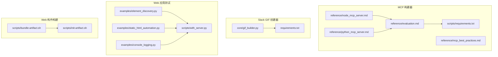
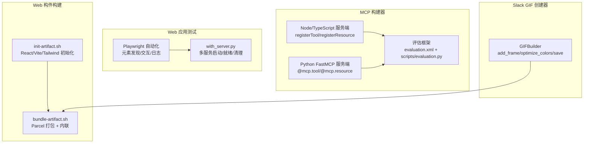
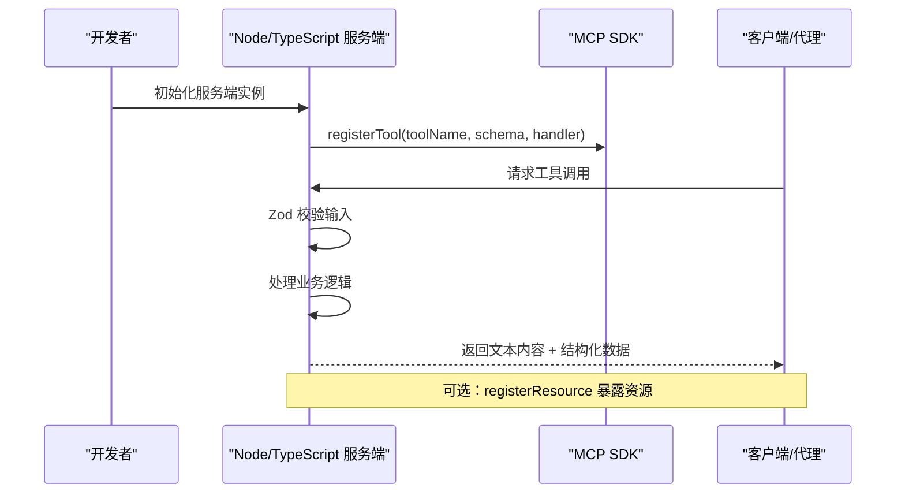
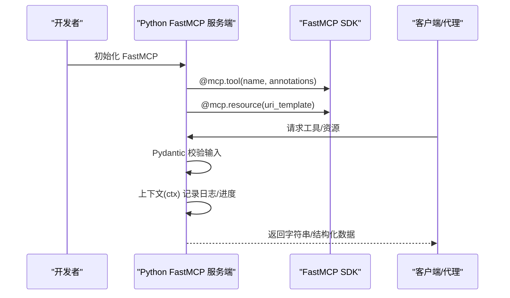
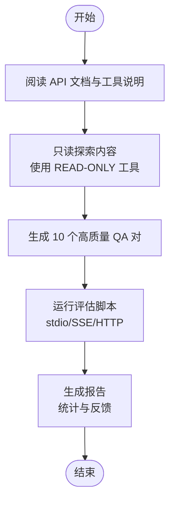
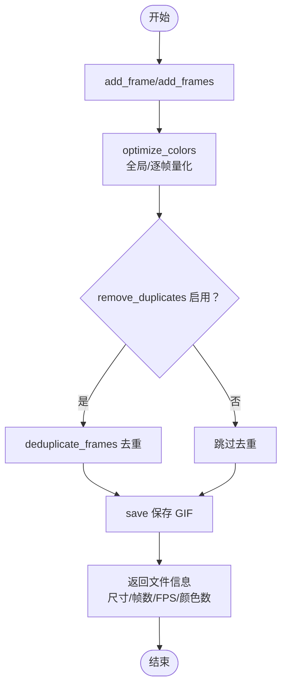
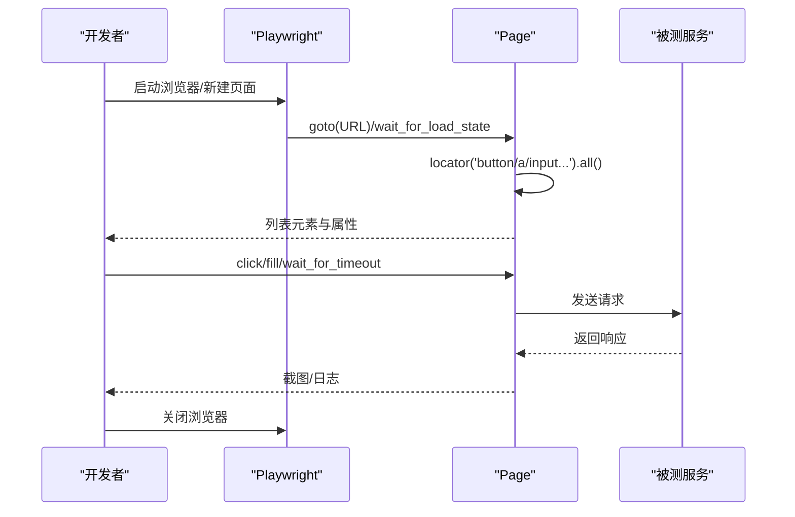
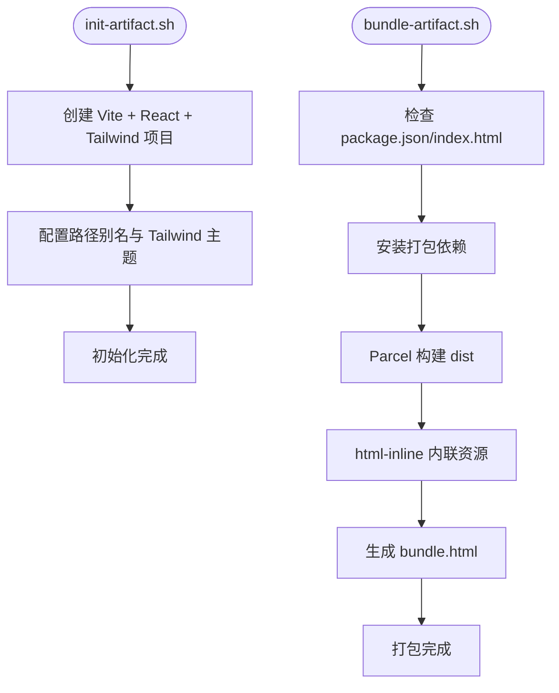
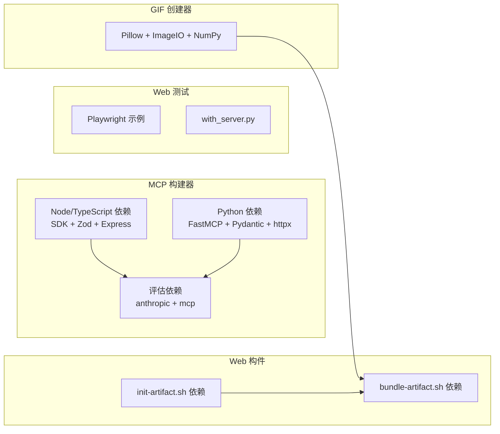

# 开发与自动化技能

<cite>
**本文引用的文件**
- [skills/mcp-builder/reference/node_mcp_server.md](file://skills/mcp-builder/reference/node_mcp_server.md)
- [skills/mcp-builder/reference/python_mcp_server.md](file://skills/mcp-builder/reference/python_mcp_server.md)
- [skills/mcp-builder/reference/evaluation.md](file://skills/mcp-builder/reference/evaluation.md)
- [skills/mcp-builder/reference/mcp_best_practices.md](file://skills/mcp-builder/reference/mcp_best_practices.md)
- [skills/mcp-builder/scripts/requirements.txt](file://skills/mcp-builder/scripts/requirements.txt)
- [skills/slack-gif-creator/core/gif_builder.py](file://skills/slack-gif-creator/core/gif_builder.py)
- [skills/slack-gif-creator/requirements.txt](file://skills/slack-gif-creator/requirements.txt)
- [skills/webapp-testing/examples/element_discovery.py](file://skills/webapp-testing/examples/element_discovery.py)
- [skills/webapp-testing/examples/static_html_automation.py](file://skills/webapp-testing/examples/static_html_automation.py)
- [skills/webapp-testing/examples/console_logging.py](file://skills/webapp-testing/examples/console_logging.py)
- [skills/webapp-testing/scripts/with_server.py](file://skills/webapp-testing/scripts/with_server.py)
- [skills/web-artifacts-builder/scripts/bundle-artifact.sh](file://skills/web-artifacts-builder/scripts/bundle-artifact.sh)
- [skills/web-artifacts-builder/scripts/init-artifact.sh](file://skills/web-artifacts-builder/scripts/init-artifact.sh)
</cite>

## 目录
1. [引言](#引言)
2. [项目结构](#项目结构)
3. [核心组件](#核心组件)
4. [架构总览](#架构总览)
5. [详细组件分析](#详细组件分析)
6. [依赖关系分析](#依赖关系分析)
7. [性能考量](#性能考量)
8. [故障排查指南](#故障排查指南)
9. [结论](#结论)
10. [附录](#附录)

## 引言
本技术文档聚焦于四个关键技能：MCP 构建器、Slack GIF 创建器、Web 应用测试、Web 构件构建。文档旨在帮助开发者快速理解并高效使用这些技能，涵盖以下要点：
- MCP 构建器：基于 Model Context Protocol 标准，提供 Node/TypeScript 与 Python 的服务端实现指南，强调资源注册、工具暴露与评估框架。
- Slack GIF 创建器：以帧合成与动画时序控制为核心，提供颜色量化、去重与优化策略。
- Web 应用测试：利用 Playwright 实现页面元素发现与自动化交互测试，并提供服务器生命周期管理脚本。
- Web 构件构建：通过打包脚本将前端产物内联为单 HTML 构件，便于在对话场景中直接使用。

同时，文档给出调试方法、依赖管理与安全调用建议，帮助团队在不同语言栈与运行环境中稳定落地。

## 项目结构
该仓库采用按技能分层的组织方式，每个技能位于独立目录下，包含参考文档、示例脚本与依赖清单。下图展示与本文相关的技能模块及其文件分布。

图表来源
- [skills/mcp-builder/reference/node_mcp_server.md](file://skills/mcp-builder/reference/node_mcp_server.md#L1-L120)
- [skills/mcp-builder/reference/python_mcp_server.md](file://skills/mcp-builder/reference/python_mcp_server.md#L1-L120)
- [skills/mcp-builder/reference/evaluation.md](file://skills/mcp-builder/reference/evaluation.md#L1-L60)
- [skills/mcp-builder/reference/mcp_best_practices.md](file://skills/mcp-builder/reference/mcp_best_practices.md#L1-L60)
- [skills/mcp-builder/scripts/requirements.txt](file://skills/mcp-builder/scripts/requirements.txt#L1-L3)
- [skills/slack-gif-creator/core/gif_builder.py](file://skills/slack-gif-creator/core/gif_builder.py#L1-L60)
- [skills/slack-gif-creator/requirements.txt](file://skills/slack-gif-creator/requirements.txt#L1-L4)
- [skills/webapp-testing/examples/element_discovery.py](file://skills/webapp-testing/examples/element_discovery.py#L1-L40)
- [skills/webapp-testing/examples/static_html_automation.py](file://skills/webapp-testing/examples/static_html_automation.py#L1-L33)
- [skills/webapp-testing/examples/console_logging.py](file://skills/webapp-testing/examples/console_logging.py#L1-L35)
- [skills/webapp-testing/scripts/with_server.py](file://skills/webapp-testing/scripts/with_server.py#L1-L106)
- [skills/web-artifacts-builder/scripts/bundle-artifact.sh](file://skills/web-artifacts-builder/scripts/bundle-artifact.sh#L1-L54)
- [skills/web-artifacts-builder/scripts/init-artifact.sh](file://skills/web-artifacts-builder/scripts/init-artifact.sh#L1-L120)

章节来源
- [skills/mcp-builder/reference/node_mcp_server.md](file://skills/mcp-builder/reference/node_mcp_server.md#L1-L120)
- [skills/mcp-builder/reference/python_mcp_server.md](file://skills/mcp-builder/reference/python_mcp_server.md#L1-L120)
- [skills/slack-gif-creator/core/gif_builder.py](file://skills/slack-gif-creator/core/gif_builder.py#L1-L60)
- [skills/webapp-testing/examples/element_discovery.py](file://skills/webapp-testing/examples/element_discovery.py#L1-L40)
- [skills/web-artifacts-builder/scripts/bundle-artifact.sh](file://skills/web-artifacts-builder/scripts/bundle-artifact.sh#L1-L54)

## 核心组件
- MCP 构建器（Node/TypeScript 与 Python）
  - 提供服务端初始化、工具注册、输入验证（Zod/Pydantic）、响应格式化、分页与字符限制、错误处理、传输选择（stdio/streamable HTTP）等最佳实践。
  - 评估框架用于设计复杂只读问答任务，确保答案稳定可验证。
- Slack GIF 创建器
  - 基于帧数组与 PIL/ImageIO，提供颜色量化、帧去重、尺寸与帧率优化，以及 Emoji 专用优化路径。
- Web 应用测试
  - 使用 Playwright 发现元素、交互页面、捕获控制台日志；with_server 脚本负责多服务器启动、就绪检测与清理。
- Web 构件构建
  - 通过 Parcel 打包并内联为单 HTML 文件，支持路径别名与跨平台配置。

章节来源
- [skills/mcp-builder/reference/node_mcp_server.md](file://skills/mcp-builder/reference/node_mcp_server.md#L1-L200)
- [skills/mcp-builder/reference/python_mcp_server.md](file://skills/mcp-builder/reference/python_mcp_server.md#L1-L200)
- [skills/mcp-builder/reference/evaluation.md](file://skills/mcp-builder/reference/evaluation.md#L1-L120)
- [skills/slack-gif-creator/core/gif_builder.py](file://skills/slack-gif-creator/core/gif_builder.py#L1-L120)
- [skills/webapp-testing/examples/element_discovery.py](file://skills/webapp-testing/examples/element_discovery.py#L1-L40)
- [skills/webapp-testing/scripts/with_server.py](file://skills/webapp-testing/scripts/with_server.py#L1-L106)
- [skills/web-artifacts-builder/scripts/bundle-artifact.sh](file://skills/web-artifacts-builder/scripts/bundle-artifact.sh#L1-L54)

## 架构总览
下图展示了四个技能在系统中的协作关系与数据流。

图表来源
- [skills/mcp-builder/reference/node_mcp_server.md](file://skills/mcp-builder/reference/node_mcp_server.md#L580-L756)
- [skills/mcp-builder/reference/python_mcp_server.md](file://skills/mcp-builder/reference/python_mcp_server.md#L330-L472)
- [skills/mcp-builder/reference/evaluation.md](file://skills/mcp-builder/reference/evaluation.md#L378-L473)
- [skills/slack-gif-creator/core/gif_builder.py](file://skills/slack-gif-creator/core/gif_builder.py#L160-L266)
- [skills/webapp-testing/scripts/with_server.py](file://skills/webapp-testing/scripts/with_server.py#L1-L106)
- [skills/web-artifacts-builder/scripts/bundle-artifact.sh](file://skills/web-artifacts-builder/scripts/bundle-artifact.sh#L1-L54)
- [skills/web-artifacts-builder/scripts/init-artifact.sh](file://skills/web-artifacts-builder/scripts/init-artifact.sh#L1-L120)

## 详细组件分析

### MCP 构建器（Node/TypeScript）
- 服务端初始化与命名规范
  - 使用 SDK 初始化服务端实例，遵循服务名命名模式，避免版本号与日期。
- 工具注册与输入验证
  - 使用 registerTool 注册工具，结合 Zod Schema 进行运行时校验，明确 title/description/inputSchema/annotations。
- 响应格式与分页
  - 支持 Markdown 与 JSON 双格式输出；分页返回 total/count/offset/has_more/next_offset 等字段。
- 错误处理与字符限制
  - 统一错误映射与可操作提示；设置字符上限并提供截断提示。
- 传输与部署
  - 支持 stdio（本地）与 Streamable HTTP（远程），并提供示例启动逻辑。
- 资源注册
  - 通过 registerResource 暴露静态或半静态数据，支持 URI 模板与动态列表。

图表来源
- [skills/mcp-builder/reference/node_mcp_server.md](file://skills/mcp-builder/reference/node_mcp_server.md#L20-L756)

章节来源
- [skills/mcp-builder/reference/node_mcp_server.md](file://skills/mcp-builder/reference/node_mcp_server.md#L1-L200)
- [skills/mcp-builder/reference/node_mcp_server.md](file://skills/mcp-builder/reference/node_mcp_server.md#L200-L500)
- [skills/mcp-builder/reference/node_mcp_server.md](file://skills/mcp-builder/reference/node_mcp_server.md#L500-L756)

### MCP 构建器（Python）
- 服务端初始化与命名规范
  - 使用 FastMCP 初始化，遵循服务名命名模式。
- 工具注册与输入验证
  - 使用 @mcp.tool 装饰器注册，Pydantic BaseModel 定义输入模型与约束。
- 响应格式与分页
  - 支持 Markdown 与 JSON 输出；分页返回 total/count/offset/has_more/next_offset。
- 错误处理与上下文注入
  - 统一错误格式化；支持 Context 注入进行进度报告、日志与用户交互。
- 资源注册与结构化输出
  - @mcp.resource 暴露资源；支持 TypedDict/Pydantic 模型作为结构化返回类型。
- 传输与生命周期
  - 支持 stdio 与 Streamable HTTP；可通过 lifespan 管理持久资源。

图表来源
- [skills/mcp-builder/reference/python_mcp_server.md](file://skills/mcp-builder/reference/python_mcp_server.md#L1-L200)
- [skills/mcp-builder/reference/python_mcp_server.md](file://skills/mcp-builder/reference/python_mcp_server.md#L330-L520)

章节来源
- [skills/mcp-builder/reference/python_mcp_server.md](file://skills/mcp-builder/reference/python_mcp_server.md#L1-L200)
- [skills/mcp-builder/reference/python_mcp_server.md](file://skills/mcp-builder/reference/python_mcp_server.md#L200-L520)

### 评估框架（evaluation.xml）
- 评估目标
  - 设计 10 个“只读、独立、非破坏性、幂等”的问题，要求 LLM 仅使用 MCP 工具回答，且答案为单一可验证值。
- 输出格式
  - XML 结构，包含多个 <qa_pair>，每对包含 <question> 与 <answer>。
- 运行方式
  - 支持 stdio（自动拉起本地服务器）、SSE/HTTP（需先启动服务器）三种传输类型，可指定模型、头信息与环境变量。

图表来源
- [skills/mcp-builder/reference/evaluation.md](file://skills/mcp-builder/reference/evaluation.md#L1-L120)
- [skills/mcp-builder/reference/evaluation.md](file://skills/mcp-builder/reference/evaluation.md#L378-L473)

章节来源
- [skills/mcp-builder/reference/evaluation.md](file://skills/mcp-builder/reference/evaluation.md#L1-L120)
- [skills/mcp-builder/reference/evaluation.md](file://skills/mcp-builder/reference/evaluation.md#L378-L473)
- [skills/mcp-builder/scripts/requirements.txt](file://skills/mcp-builder/scripts/requirements.txt#L1-L3)

### Slack GIF 创建器（帧合成与动画时序）
- 关键能力
  - add_frame/add_frames：接收 numpy 数组或 PIL 图像，统一转为 RGB 并调整尺寸。
  - optimize_colors：全局/逐帧颜色量化，支持目标色数与抖动策略。
  - deduplicate_frames：相邻帧相似度阈值去重，保留细微动画。
  - save：计算帧时长（毫秒），保存 GIF（循环播放），返回尺寸、帧数、FPS、颜色数等元信息。
  - Emoji 优化：尺寸裁剪至 128x128、降低色数、按帧数压缩。
- 动画时序控制
  - 帧时长 = 1000 / fps，总时长 = 帧数 / fps。

图表来源
- [skills/slack-gif-creator/core/gif_builder.py](file://skills/slack-gif-creator/core/gif_builder.py#L160-L266)

章节来源
- [skills/slack-gif-creator/core/gif_builder.py](file://skills/slack-gif-creator/core/gif_builder.py#L1-L120)
- [skills/slack-gif-creator/core/gif_builder.py](file://skills/slack-gif-creator/core/gif_builder.py#L120-L200)
- [skills/slack-gif-creator/core/gif_builder.py](file://skills/slack-gif-creator/core/gif_builder.py#L200-L266)

### Web 应用测试（Playwright 自动化）
- 元素发现与交互
  - 使用 page.locator 发现按钮、链接、输入框等元素，打印可见文本与属性，截图留证。
- 静态 HTML 自动化
  - 通过 file:// 协议打开本地 HTML，执行点击、填写表单、提交等动作并截图。
- 控制台日志捕获
  - 监听 console 事件，收集并保存日志，辅助定位前端异常。
- 多服务器生命周期管理
  - with_server.py 支持启动多个服务器进程，轮询端口等待就绪，执行命令后统一清理。

图表来源
- [skills/webapp-testing/examples/element_discovery.py](file://skills/webapp-testing/examples/element_discovery.py#L1-L40)
- [skills/webapp-testing/examples/static_html_automation.py](file://skills/webapp-testing/examples/static_html_automation.py#L1-L33)
- [skills/webapp-testing/examples/console_logging.py](file://skills/webapp-testing/examples/console_logging.py#L1-L35)
- [skills/webapp-testing/scripts/with_server.py](file://skills/webapp-testing/scripts/with_server.py#L1-L106)

章节来源
- [skills/webapp-testing/examples/element_discovery.py](file://skills/webapp-testing/examples/element_discovery.py#L1-L40)
- [skills/webapp-testing/examples/static_html_automation.py](file://skills/webapp-testing/examples/static_html_automation.py#L1-L33)
- [skills/webapp-testing/examples/console_logging.py](file://skills/webapp-testing/examples/console_logging.py#L1-L35)
- [skills/webapp-testing/scripts/with_server.py](file://skills/webapp-testing/scripts/with_server.py#L1-L106)

### Web 构件构建（单 HTML 构件）
- 初始化模板
  - init-artifact.sh 自动检测 Node 版本，安装 pnpm，创建 Vite + React + Tailwind 项目，配置路径别名与主题变量。
- 打包与内联
  - bundle-artifact.sh 安装 Parcel 与 html-inline，生成 dist，再将所有资源内联到单个 HTML 文件，输出 bundle.html 并显示大小。

图表来源
- [skills/web-artifacts-builder/scripts/init-artifact.sh](file://skills/web-artifacts-builder/scripts/init-artifact.sh#L1-L120)
- [skills/web-artifacts-builder/scripts/bundle-artifact.sh](file://skills/web-artifacts-builder/scripts/bundle-artifact.sh#L1-L54)

章节来源
- [skills/web-artifacts-builder/scripts/init-artifact.sh](file://skills/web-artifacts-builder/scripts/init-artifact.sh#L1-L120)
- [skills/web-artifacts-builder/scripts/bundle-artifact.sh](file://skills/web-artifacts-builder/scripts/bundle-artifact.sh#L1-L54)

## 依赖关系分析
- MCP 构建器
  - Node/TypeScript：依赖 MCP SDK、Zod、Express（HTTP 传输）。
  - Python：依赖 FastMCP、Pydantic、httpx。
  - 评估脚本：依赖 anthropic、mcp。
- Slack GIF 创建器
  - Pillow、ImageIO、ImageIO-FFmpeg、NumPy。
- Web 应用测试
  - Playwright（示例脚本）、with_server.py 使用标准库 socket/subprocess。
- Web 构件构建
  - init-artifact.sh 依赖 pnpm、Vite、Tailwind 等；bundle-artifact.sh 依赖 Parcel 与 html-inline。

图表来源
- [skills/mcp-builder/reference/node_mcp_server.md](file://skills/mcp-builder/reference/node_mcp_server.md#L520-L580)
- [skills/mcp-builder/reference/python_mcp_server.md](file://skills/mcp-builder/reference/python_mcp_server.md#L330-L472)
- [skills/mcp-builder/scripts/requirements.txt](file://skills/mcp-builder/scripts/requirements.txt#L1-L3)
- [skills/slack-gif-creator/requirements.txt](file://skills/slack-gif-creator/requirements.txt#L1-L4)
- [skills/web-artifacts-builder/scripts/bundle-artifact.sh](file://skills/web-artifacts-builder/scripts/bundle-artifact.sh#L1-L54)
- [skills/web-artifacts-builder/scripts/init-artifact.sh](file://skills/web-artifacts-builder/scripts/init-artifact.sh#L1-L120)

章节来源
- [skills/mcp-builder/reference/node_mcp_server.md](file://skills/mcp-builder/reference/node_mcp_server.md#L520-L580)
- [skills/mcp-builder/reference/python_mcp_server.md](file://skills/mcp-builder/reference/python_mcp_server.md#L330-L472)
- [skills/mcp-builder/scripts/requirements.txt](file://skills/mcp-builder/scripts/requirements.txt#L1-L3)
- [skills/slack-gif-creator/requirements.txt](file://skills/slack-gif-creator/requirements.txt#L1-L4)
- [skills/web-artifacts-builder/scripts/bundle-artifact.sh](file://skills/web-artifacts-builder/scripts/bundle-artifact.sh#L1-L54)
- [skills/web-artifacts-builder/scripts/init-artifact.sh](file://skills/web-artifacts-builder/scripts/init-artifact.sh#L1-L120)

## 性能考量
- MCP 构建器
  - 输入验证与分页：使用 Zod/Pydantic 严格约束参数范围，避免超大结果集一次性加载；合理设置 limit 与 offset。
  - 字符限制：控制响应长度，必要时提供截断提示与分页建议。
  - 传输选择：远端多客户端场景优先 Streamable HTTP；本地工具优先 stdio。
- Slack GIF 创建器
  - 颜色量化：根据目标尺寸与平台限制选择色数；全局调色板提升压缩比。
  - 帧去重：在保留动画细节的前提下减少重复帧；Emoji 场景进一步降采样。
  - 帧时长：根据动画流畅度与体积平衡 fps。
- Web 应用测试
  - 服务器就绪检测：with_server.py 通过端口轮询等待，避免过早发起测试导致失败。
  - 页面等待：使用 wait_for_load_state('networkidle') 确保网络空闲后再断言。
- Web 构件构建
  - 内联策略：将 CSS/JS/资源合并为单 HTML，减少请求数；注意体积控制与缓存策略。

[本节为通用指导，无需特定文件来源]

## 故障排查指南
- MCP 构建器
  - 连接问题：确认传输类型与 URL/端口正确；stdio 模式由评估脚本自动启动，SSE/HTTP 需手动启动。
  - 工具描述不清：检查工具注解与输入/输出模式是否与实际一致。
  - 分页异常：核对 limit/offset/has_more/next_offset 是否正确返回。
- Slack GIF 创建器
  - 无帧可保存：确保已调用 add_frame/add_frames。
  - 颜色过多导致体积过大：降低 num_colors 或启用 remove_duplicates。
  - 尺寸不匹配：确保输入帧尺寸与构造函数 width/height 一致。
- Web 应用测试
  - 元素未找到：检查选择器与页面状态；使用 wait_for_load_state 等待稳定。
  - 控制台报错：查看 console 日志文件定位前端异常。
  - 多服务器未就绪：with_server.py 默认超时 30 秒，可适当增加 --timeout。
- Web 构件构建
  - 缺少 package.json/index.html：bundle-artifact.sh 会报错并退出。
  - Parcel/内联失败：确认 pnpm 安装成功与 .parcelrc 配置正确。

章节来源
- [skills/mcp-builder/reference/evaluation.md](file://skills/mcp-builder/reference/evaluation.md#L578-L602)
- [skills/slack-gif-creator/core/gif_builder.py](file://skills/slack-gif-creator/core/gif_builder.py#L160-L266)
- [skills/webapp-testing/examples/console_logging.py](file://skills/webapp-testing/examples/console_logging.py#L1-L35)
- [skills/webapp-testing/scripts/with_server.py](file://skills/webapp-testing/scripts/with_server.py#L1-L106)
- [skills/web-artifacts-builder/scripts/bundle-artifact.sh](file://skills/web-artifacts-builder/scripts/bundle-artifact.sh#L1-L54)

## 结论
本文围绕 MCP 构建器、Slack GIF 创建器、Web 应用测试与 Web 构件构建四类技能，系统梳理了实现要点、数据流与依赖关系，并提供了调试与性能优化建议。通过标准化工具注册、严格的输入验证与分页策略、合理的颜色量化与帧去重、稳定的多服务器生命周期管理以及高效的单 HTML 构件打包，可在不同语言与运行环境下可靠地交付高质量自动化能力。

[本节为总结性内容，无需特定文件来源]

## 附录
- 安全调用建议
  - 认证与授权：优先使用 OAuth 2.1 令牌与受信证书；API Key 存储于环境变量。
  - 输入验证：对路径、URL、标识符进行校验，防止注入与越权访问。
  - 错误处理：避免泄露内部错误细节；记录安全相关错误并清理资源。
  - DNS 重绑定防护：本地 HTTP 服务绑定 127.0.0.1 并校验 Origin。
- 调试方法
  - MCP：使用评估框架生成高质量 QA，结合报告反馈迭代工具设计。
  - GIF：逐步打印文件大小与帧数，对比优化前后效果。
  - Web 测试：开启 headless 模式并截图，结合控制台日志定位问题。
  - 构件：检查 .parcelrc 与路径别名，确认内联资源完整。

章节来源
- [skills/mcp-builder/reference/mcp_best_practices.md](file://skills/mcp-builder/reference/mcp_best_practices.md#L150-L250)
- [skills/mcp-builder/reference/evaluation.md](file://skills/mcp-builder/reference/evaluation.md#L578-L602)
- [skills/slack-gif-creator/core/gif_builder.py](file://skills/slack-gif-creator/core/gif_builder.py#L230-L266)
- [skills/webapp-testing/examples/console_logging.py](file://skills/webapp-testing/examples/console_logging.py#L1-L35)
- [skills/web-artifacts-builder/scripts/bundle-artifact.sh](file://skills/web-artifacts-builder/scripts/bundle-artifact.sh#L1-L54)