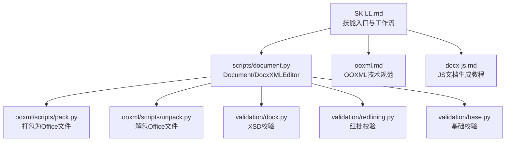
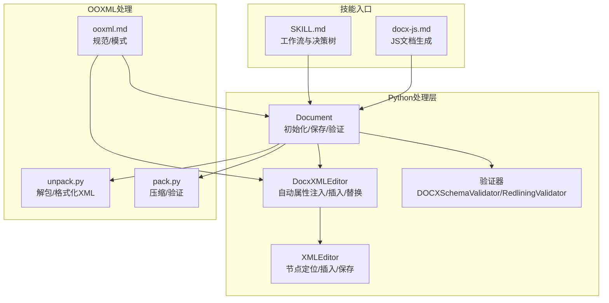
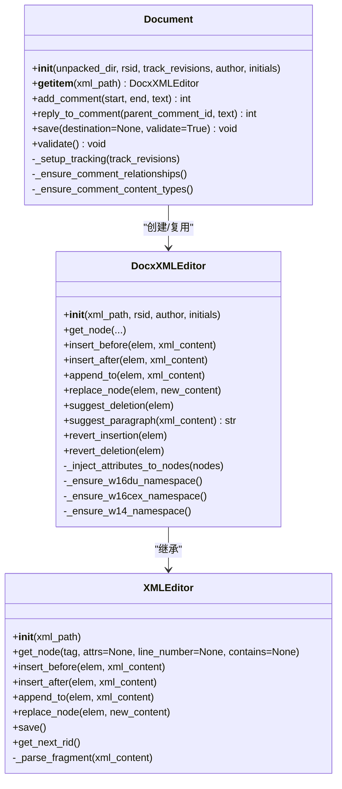
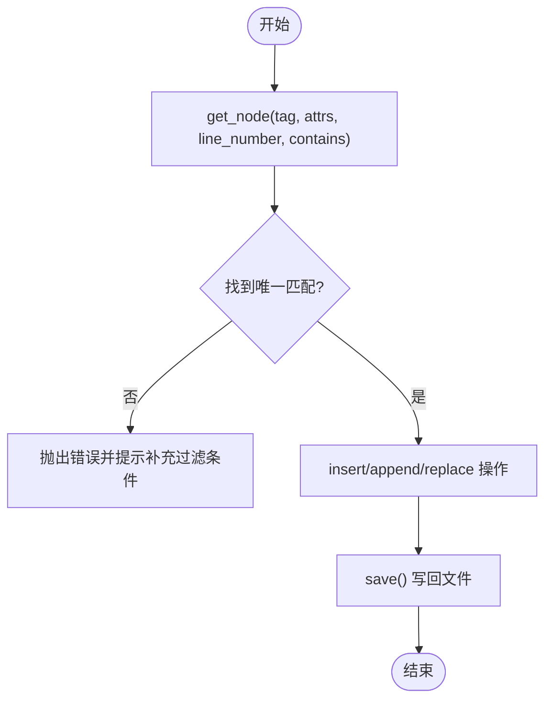
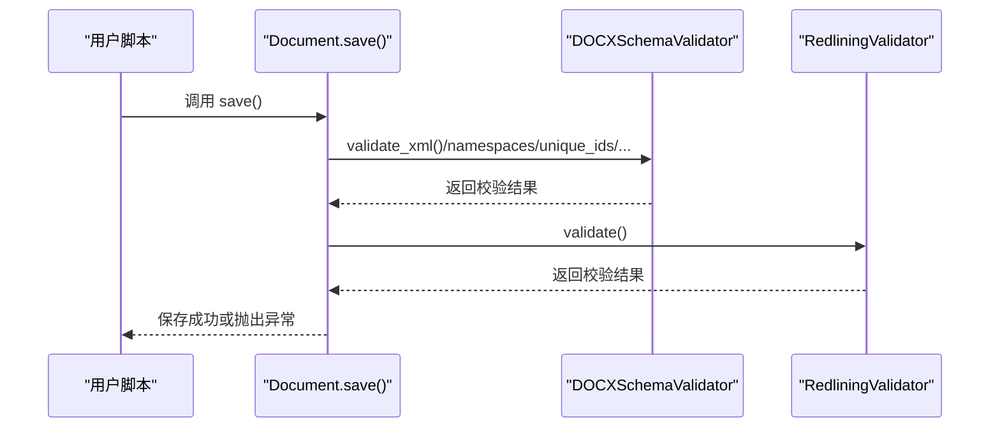
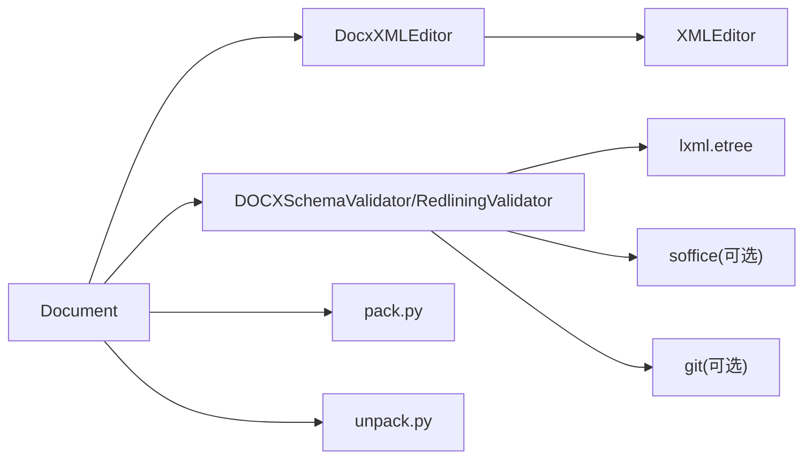

# DOCX处理技能

<cite>
**本文引用的文件**
- [SKILL.md](file://skills/docx/SKILL.md)
- [ooxml.md](file://skills/docx/ooxml.md)
- [document.py](file://skills/docx/scripts/document.py)
- [utilities.py](file://skills/docx/scripts/utilities.py)
- [unpack.py](file://skills/docx/ooxml/scripts/unpack.py)
- [pack.py](file://skills/docx/ooxml/scripts/pack.py)
- [docx-js.md](file://skills/docx/docx-js.md)
- [docx.py](file://skills/docx/ooxml/scripts/validation/docx.py)
- [redlining.py](file://skills/docx/ooxml/scripts/validation/redlining.py)
- [base.py](file://skills/docx/ooxml/scripts/validation/base.py)
</cite>

## 目录
1. [引言](#引言)
2. [项目结构](#项目结构)
3. [核心组件](#核心组件)
4. [架构总览](#架构总览)
5. [详细组件分析](#详细组件分析)
6. [依赖关系分析](#依赖关系分析)
7. [性能考虑](#性能考虑)
8. [故障排查指南](#故障排查指南)
9. [结论](#结论)
10. [附录](#附录)

## 引言
本技术文档围绕DOCX处理技能，系统阐述YAML元数据如何定义技能入口点，以及Python脚本如何与Claude AI协作完成文档创建、编辑、修订跟踪（红批）与评论管理。文档同时结合Office Open XML（OOXML）规范，说明命名空间、部件关系与内容类型在底层文档结构中的作用，并提供通过Python脚本动态生成符合标准的DOCX文件的方法。此外，还涵盖utilities.py中的辅助函数在模板处理与数据绑定中的用途，以及批量处理场景下的性能优化建议与常见问题排查方法。

## 项目结构
docx技能位于skills/docx目录下，包含以下关键部分：
- 技能元数据：SKILL.md定义了工作流决策树、文本提取、原始XML访问、新建文档与编辑现有文档的流程，以及红批工作流与图像转换等。
- 文档库与工具：scripts/document.py提供Document类与DocxXMLEditor，用于注释、修订跟踪与保存；scripts/utilities.py提供XMLEditor通用DOM操作与定位能力。
- OOXML参考与打包：ooxml.md提供技术规范、内容模式、Tracked Changes模式与直接DOM操作指南；ooxml/scripts/pack.py与unpack.py分别负责打包与解包。
- 验证器：validation子目录包含schema校验、红批校验与基础校验逻辑。
- JS文档生成：docx-js.md提供docx库使用教程，便于从零创建符合Word规范的文档。

图表来源
- [SKILL.md](file://skills/docx/SKILL.md#L1-L197)
- [document.py](file://skills/docx/scripts/document.py#L1-L120)
- [ooxml.md](file://skills/docx/ooxml.md#L1-L120)
- [pack.py](file://skills/docx/ooxml/scripts/pack.py#L1-L80)
- [unpack.py](file://skills/docx/ooxml/scripts/unpack.py#L1-L30)
- [docx.py](file://skills/docx/ooxml/scripts/validation/docx.py#L1-L70)
- [redlining.py](file://skills/docx/ooxml/scripts/validation/redlining.py#L1-L60)
- [base.py](file://skills/docx/ooxml/scripts/validation/base.py#L1-L120)
- [docx-js.md](file://skills/docx/docx-js.md#L1-L40)

章节来源
- [SKILL.md](file://skills/docx/SKILL.md#L1-L197)
- [ooxml.md](file://skills/docx/ooxml.md#L1-L120)

## 核心组件
- Document类：封装对word/目录下各XML文件的编辑与保存，自动设置people.xml、RSID、settings.xml、注释关系与内容类型，支持保存时验证与复制回原目录。
- DocxXMLEditor：基于XMLEditor扩展，自动注入RSID、作者、时间戳、命名空间声明与属性，提供插入、替换、删除、撤销插入/删除等高级操作。
- XMLEditor：提供按标签、属性、行号范围与文本内容定位节点的能力，支持插入前后、追加子元素与保存。
- 验证器：DOCXSchemaValidator与RedliningValidator分别进行XSD校验与红批一致性校验，确保文档结构与修订逻辑正确。
- 打包/解包：unpack.py解压并格式化XML；pack.py压缩并清理XML空白、可选验证。

章节来源
- [document.py](file://skills/docx/scripts/document.py#L1-L120)
- [utilities.py](file://skills/docx/scripts/utilities.py#L1-L120)
- [docx.py](file://skills/docx/ooxml/scripts/validation/docx.py#L1-L70)
- [redlining.py](file://skills/docx/ooxml/scripts/validation/redlining.py#L1-L60)
- [pack.py](file://skills/docx/ooxml/scripts/pack.py#L1-L80)
- [unpack.py](file://skills/docx/ooxml/scripts/unpack.py#L1-L30)

## 架构总览
下图展示了从技能入口到底层OOXML处理与验证的整体架构，以及与Claude AI协作的关键路径。

图表来源
- [SKILL.md](file://skills/docx/SKILL.md#L1-L197)
- [docx-js.md](file://skills/docx/docx-js.md#L1-L40)
- [document.py](file://skills/docx/scripts/document.py#L612-L886)
- [utilities.py](file://skills/docx/scripts/utilities.py#L1-L120)
- [docx.py](file://skills/docx/ooxml/scripts/validation/docx.py#L1-L70)
- [redlining.py](file://skills/docx/ooxml/scripts/validation/redlining.py#L1-L60)
- [unpack.py](file://skills/docx/ooxml/scripts/unpack.py#L1-L30)
- [pack.py](file://skills/docx/ooxml/scripts/pack.py#L1-L80)
- [ooxml.md](file://skills/docx/ooxml.md#L1-L120)

## 详细组件分析

### Document类与DocxXMLEditor：文档创建、内容插入、样式应用与修订跟踪
- 初始化与基础设施
  - 复制解包目录至临时目录，打包原始目录为临时docx以作为验证基线。
  - 自动生成RSID，设置默认作者与首字母，缓存懒加载的编辑器实例。
  - 自动设置people.xml、settings.xml中的rsids与trackRevisions（可选），并确保注释关系与内容类型声明齐全。
- 注释与回复
  - add_comment：在document.xml中插入commentRangeStart/End与commentReference，在comments.xml、commentsExtended.xml、commentsIds.xml、commentsExtensible.xml中同步添加注释实体。
  - reply_to_comment：基于父注释信息在document.xml中插入新的commentRangeStart/End与commentReference，并在相应注释文件中新增回复条目。
- 修订跟踪（红批）
  - suggest_deletion：对w:r或w:p进行删除标记，转换w:t为w:delText，更新run属性rsidR→rsidDel，必要时在pPr/rPr中添加del标记。
  - suggest_paragraph：为新段落包裹w:ins并添加rPr标记，便于列表编号等场景的插入跟踪。
  - revert_insertion：将某w:ins内的内容转换为w:del，保留原有rsidRDel映射，适用于拒绝他人插入。
  - revert_deletion：将某w:del内的内容克隆为w:ins并恢复w:delText→w:t，适用于恢复他人删除。
- 自动属性注入
  - 对插入的新元素自动注入w:rsidR/RSIDP、w:author、w:date、w:id、w16du:dateUtc、xml:space等属性，确保符合OOXML规范与审阅一致性。
- 保存与验证
  - save：确保注释关系与内容类型，逐个保存已修改的XML文件，执行schema与红批验证，最后复制回原目录。

图表来源
- [document.py](file://skills/docx/scripts/document.py#L612-L886)
- [document.py](file://skills/docx/scripts/document.py#L1-L240)
- [utilities.py](file://skills/docx/scripts/utilities.py#L1-L120)

章节来源
- [document.py](file://skills/docx/scripts/document.py#L612-L886)
- [document.py](file://skills/docx/scripts/document.py#L1-L240)
- [utilities.py](file://skills/docx/scripts/utilities.py#L1-L120)

### XMLEditor：节点定位与DOM操作
- 节点定位
  - 支持按标签、属性、行号范围与文本内容过滤，返回唯一匹配元素；若无匹配或多重匹配则抛出错误，提示补充过滤条件。
  - 内置行号追踪解析器，解析时记录每个元素的原始行列位置，便于与工具输出的行号对应。
- DOM操作
  - insert_before/insert_after/append_to/replace_node：均返回插入的节点列表，便于保持顺序与后续链式操作。
  - save：按原文件编码写回，避免破坏ASCII/UTF-8差异。
  - _parse_fragment：解析XML片段并导入当前DOM，自动继承根命名空间声明，保证片段合法性。

图表来源
- [utilities.py](file://skills/docx/scripts/utilities.py#L76-L182)
- [utilities.py](file://skills/docx/scripts/utilities.py#L206-L311)

章节来源
- [utilities.py](file://skills/docx/scripts/utilities.py#L76-L182)
- [utilities.py](file://skills/docx/scripts/utilities.py#L206-L311)

### 验证器：Schema与红批一致性
- DOCXSchemaValidator
  - XML语法检查、命名空间声明检查、唯一ID检查、文件引用与关系ID检查、内容类型声明检查、XSD校验（对比原始文件仅报告新增错误）、空白保留检查、删除/插入结构检查、段落数量对比。
- RedliningValidator
  - 若存在Claude的修订，则移除Claude的ins/del后提取文本，与原始文档文本对比，借助git word diff生成差异，确保未在他人修订内部直接修改文本。
- 基础验证器（BaseSchemaValidator）
  - 统一的XML语法、命名空间、唯一ID、关系引用、内容类型、XSD对比与清理无关命名空间等通用逻辑。

图表来源
- [document.py](file://skills/docx/scripts/document.py#L838-L886)
- [docx.py](file://skills/docx/ooxml/scripts/validation/docx.py#L1-L70)
- [redlining.py](file://skills/docx/ooxml/scripts/validation/redlining.py#L1-L60)
- [base.py](file://skills/docx/ooxml/scripts/validation/base.py#L1-L120)

章节来源
- [docx.py](file://skills/docx/ooxml/scripts/validation/docx.py#L1-L70)
- [redlining.py](file://skills/docx/ooxml/scripts/validation/redlining.py#L1-L60)
- [base.py](file://skills/docx/ooxml/scripts/validation/base.py#L1-L120)

### OOXML规范与命名空间、部件关系、内容类型
- 技术规范要点
  - 元素顺序与空白处理：w:pPr内元素顺序、w:t的xml:space='preserve'、Unicode转义规则。
  - 修订跟踪：w:del与w:ins必须闭合，RSID必须为8位十六进制，trackRevisions放置位置。
  - 图片：word/media中放置媒体，document.xml中引用，设置尺寸防止溢出。
- 命名空间与关系
  - 文档库会自动声明w16du、w16cex、w14等命名空间，确保日期UTC与时序ID等扩展字段可用。
  - 关系与内容类型：comments.xml、commentsExtended.xml、commentsIds.xml、commentsExtensible.xml的关系与Override声明由Document自动维护。
- 直接DOM操作
  - 可通过XMLEditor直接访问任意XML文件，进行节点移动、替换与插入，但需遵循OOXML结构约束。

章节来源
- [ooxml.md](file://skills/docx/ooxml.md#L1-L120)
- [document.py](file://skills/docx/scripts/document.py#L88-L120)
- [document.py](file://skills/docx/scripts/document.py#L1067-L1277)

### 动态生成DOCX（JS侧）与与Python侧协同
- JS侧（docx库）
  - 使用Document、Paragraph、TextRun、Table、ImageRun等组件构建文档，通过Packer导出缓冲区或Blob。
  - 严格遵循列表、表格、链接、页眉页脚、页面设置等规范，避免使用Unicode符号替代列表、避免单独PageBreak等常见陷阱。
- Python侧（OOXML）
  - 适合对已有文档进行结构化编辑、修订跟踪与注释管理，通过unpack.py解包、编辑、再pack.py打包。
  - 与Claude AI协作时，可先用JS生成初稿，再用Python进行审阅与修订跟踪。

章节来源
- [docx-js.md](file://skills/docx/docx-js.md#L1-L120)
- [unpack.py](file://skills/docx/ooxml/scripts/unpack.py#L1-L30)
- [pack.py](file://skills/docx/ooxml/scripts/pack.py#L1-L80)

## 依赖关系分析
- 组件耦合
  - Document依赖DocxXMLEditor与XMLEditor，后者提供通用DOM操作能力。
  - 验证器独立于编辑器，但依赖已解包的XML文件与原始docx用于对比。
  - 打包/解包工具与验证器共同保障最终产物的合法性。
- 外部依赖
  - defusedxml用于安全解析与序列化。
  - lxml用于XSD校验与XPath查询。
  - soffice用于可选的二次验证（HTML转换）。
  - git用于红批校验时的word diff。

图表来源
- [document.py](file://skills/docx/scripts/document.py#L612-L886)
- [docx.py](file://skills/docx/ooxml/scripts/validation/docx.py#L1-L70)
- [redlining.py](file://skills/docx/ooxml/scripts/validation/redlining.py#L1-L60)
- [pack.py](file://skills/docx/ooxml/scripts/pack.py#L1-L80)
- [unpack.py](file://skills/docx/ooxml/scripts/unpack.py#L1-L30)

章节来源
- [document.py](file://skills/docx/scripts/document.py#L612-L886)
- [docx.py](file://skills/docx/ooxml/scripts/validation/docx.py#L1-L70)
- [redlining.py](file://skills/docx/ooxml/scripts/validation/redlining.py#L1-L60)
- [pack.py](file://skills/docx/ooxml/scripts/pack.py#L1-L80)
- [unpack.py](file://skills/docx/ooxml/scripts/unpack.py#L1-L30)

## 性能考虑
- 流式写入与内存释放
  - 在大规模文档处理时，优先使用懒加载编辑器（Document内部缓存_editors），减少重复解析。
  - 保存前尽量合并多次插入/替换操作，减少DOM遍历次数。
  - 使用临时目录进行打包，避免直接修改原目录导致的IO竞争。
- XML格式化与压缩
  - 解包阶段统一格式化XML，便于人类阅读；打包阶段去除多余空白与注释，减小体积。
  - 建议在批量处理中分批保存与验证，避免一次性占用过多内存。
- 并发与批处理
  - 将不同XML文件的编辑任务拆分为多个进程/线程（注意defusedxml/minidom非线程安全，应串行化DOM操作），并在完成后统一保存。

[本节为通用指导，不直接分析具体文件]

## 故障排查指南
- 打包失败
  - 现象：pack.py报错或soffice不可用。
  - 排查：确认输入目录为解包后的word等目录；检查是否启用--force跳过验证；若soffice不可用，可忽略验证或安装LibreOffice。
  - 参考：[pack.py](file://skills/docx/ooxml/scripts/pack.py#L1-L80)
- 字体丢失或样式错乱
  - 现象：字体不显示或样式不生效。
  - 排查：确保使用内置样式或自定义样式且ID正确；避免在他人修订内部直接修改文本；检查w:t的xml:space与Unicode转义。
  - 参考：[ooxml.md](file://skills/docx/ooxml.md#L1-L120)
- 样式错乱（列表/表格/链接）
  - 现象：列表显示为普通文本、表格边框缺失、超链接无效。
  - 排查：使用编号配置而非Unicode符号；为表格设置columnWidths与单元格宽度；为超链接添加Hyperlink样式并在styles.xml中定义。
  - 参考：[docx-js.md](file://skills/docx/docx-js.md#L109-L220)
- 修订跟踪不一致
  - 现象：红批校验失败或文本不匹配。
  - 排查：使用revert_insertion/revert_deletion正确处理他人修订；确保所有改动均在w:ins/w:del包裹内；必要时使用RedliningValidator进行差异比对。
  - 参考：[document.py](file://skills/docx/scripts/document.py#L240-L432)，[redlining.py](file://skills/docx/ooxml/scripts/validation/redlining.py#L1-L120)

章节来源
- [pack.py](file://skills/docx/ooxml/scripts/pack.py#L1-L80)
- [ooxml.md](file://skills/docx/ooxml.md#L1-L120)
- [docx-js.md](file://skills/docx/docx-js.md#L109-L220)
- [document.py](file://skills/docx/scripts/document.py#L240-L432)
- [redlining.py](file://skills/docx/ooxml/scripts/validation/redlining.py#L1-L120)

## 结论
本技能通过SKILL.md明确工作流与Claude AI协作方式，结合Document/DocxXMLEditor与XMLEditor实现对DOCX文档的结构化编辑、注释与修订跟踪，并通过验证器确保符合OOXML规范。配合unpack/pack工具与ooxml.md规范，可在复杂文档处理场景中实现高可靠与高效率的自动化。对于批量处理，建议采用分批保存、临时目录与格式化压缩等策略，以提升稳定性与性能。

[本节为总结性内容，不直接分析具体文件]

## 附录
- 实际代码示例路径（不展示具体代码内容）
  - 创建并保存文档：[document.py](file://skills/docx/scripts/document.py#L612-L886)
  - 插入/替换节点与自动属性注入：[document.py](file://skills/docx/scripts/document.py#L1-L240)，[utilities.py](file://skills/docx/scripts/utilities.py#L206-L311)
  - 添加注释与回复：[document.py](file://skills/docx/scripts/document.py#L713-L831)
  - 删除/插入修订与撤销：[document.py](file://skills/docx/scripts/document.py#L240-L432)
  - 解包/打包与验证：[unpack.py](file://skills/docx/ooxml/scripts/unpack.py#L1-L30)，[pack.py](file://skills/docx/ooxml/scripts/pack.py#L1-L80)
  - OOXML规范与模式：[ooxml.md](file://skills/docx/ooxml.md#L1-L200)
  - JS文档生成（docx库）：[docx-js.md](file://skills/docx/docx-js.md#L1-L120)