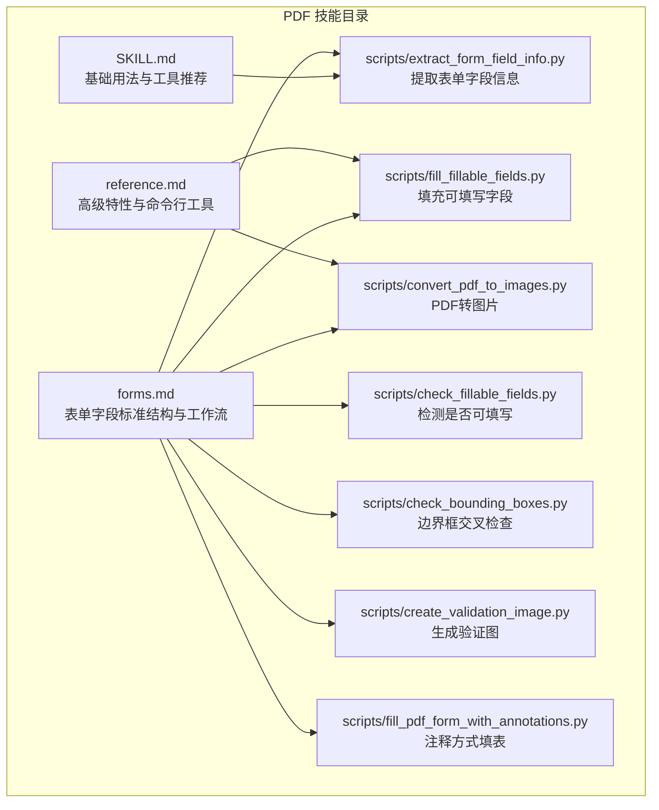
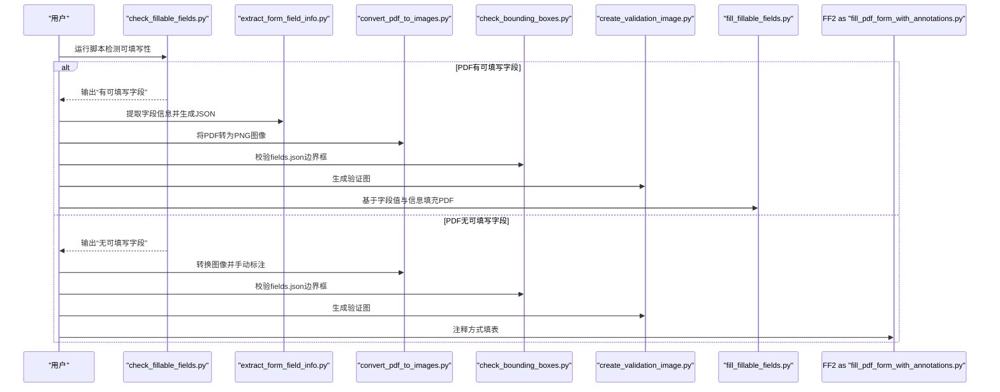
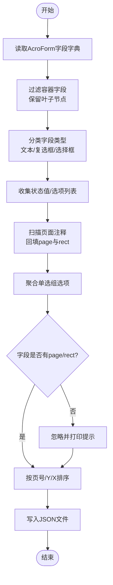
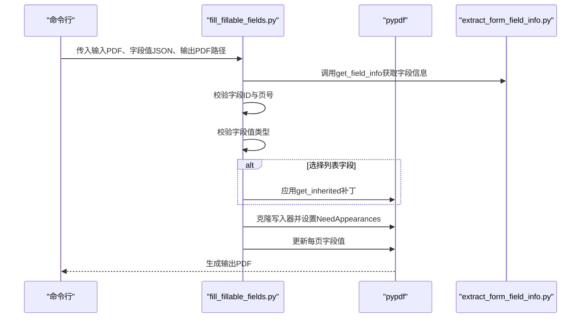
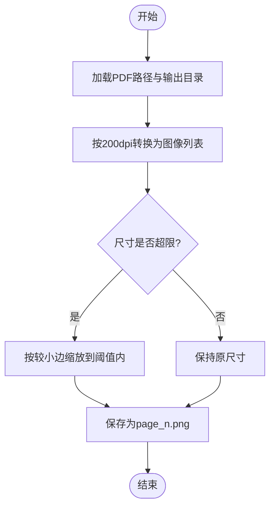
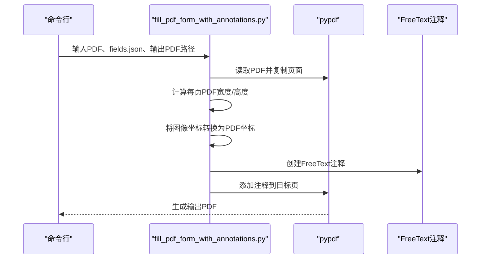
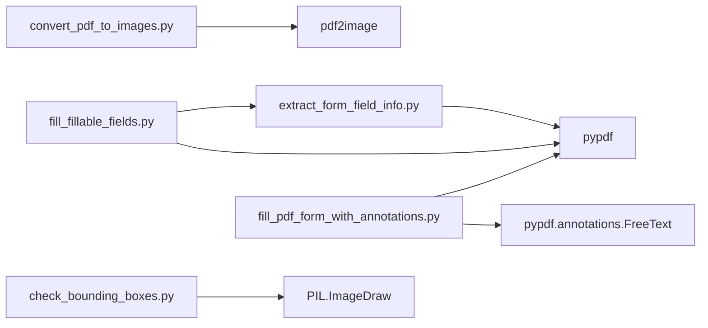

# PDF处理技能

<cite>
**本文引用的文件**
- [SKILL.md](file://skills/pdf/SKILL.md)
- [forms.md](file://skills/pdf/forms.md)
- [reference.md](file://skills/pdf/reference.md)
- [extract_form_field_info.py](file://skills/pdf/scripts/extract_form_field_info.py)
- [fill_fillable_fields.py](file://skills/pdf/scripts/fill_fillable_fields.py)
- [convert_pdf_to_images.py](file://skills/pdf/scripts/convert_pdf_to_images.py)
- [check_fillable_fields.py](file://skills/pdf/scripts/check_fillable_fields.py)
- [check_bounding_boxes.py](file://skills/pdf/scripts/check_bounding_boxes.py)
- [create_validation_image.py](file://skills/pdf/scripts/create_validation_image.py)
- [fill_pdf_form_with_annotations.py](file://skills/pdf/scripts/fill_pdf_form_with_annotations.py)
</cite>

## 目录
1. [简介](#简介)
2. [项目结构](#项目结构)
3. [核心组件](#核心组件)
4. [架构总览](#架构总览)
5. [详细组件分析](#详细组件分析)
6. [依赖关系分析](#依赖关系分析)
7. [性能考量](#性能考量)
8. [故障排查指南](#故障排查指南)
9. [结论](#结论)
10. [附录](#附录)

## 简介
本技术文档围绕“PDF处理技能”展开，系统阐述如何基于仓库中的脚本与规范，启用并完成PDF分析与编辑能力。重点覆盖：
- 使用 extract_form_field_info.py 基于 pypdf 提取可填写表单字段的名称、类型、页面与位置信息，并结合 forms.md 的 AcroForm 标准结构进行理解。
- 使用 fill_fillable_fields.py 实现字段值注入、类型校验、以及针对选择列表字段的 pypdf 内部缺陷的补丁处理；同时讨论字体设置与签名兼容性注意事项。
- 使用 convert_pdf_to_images.py 生成预览图与OCR准备阶段所需的图像序列。
- 涉及高级主题：PDF线性化、权限控制与元数据操作、分页处理与资源释放、常见问题定位与性能优化策略。

## 项目结构
PDF处理技能位于 skills/pdf 目录下，包含技能说明、表单规范、参考文档与一组Python脚本，分别负责表单字段提取、字段填充、图像转换、边界框检查与注释标注等任务。

图表来源
- [SKILL.md](file://skills/pdf/SKILL.md#L1-L295)
- [forms.md](file://skills/pdf/forms.md#L1-L206)
- [reference.md](file://skills/pdf/reference.md#L1-L612)
- [extract_form_field_info.py](file://skills/pdf/scripts/extract_form_field_info.py#L1-L153)
- [fill_fillable_fields.py](file://skills/pdf/scripts/fill_fillable_fields.py#L1-L115)
- [convert_pdf_to_images.py](file://skills/pdf/scripts/convert_pdf_to_images.py#L1-L36)
- [check_fillable_fields.py](file://skills/pdf/scripts/check_fillable_fields.py#L1-L13)
- [check_bounding_boxes.py](file://skills/pdf/scripts/check_bounding_boxes.py#L1-L71)
- [create_validation_image.py](file://skills/pdf/scripts/create_validation_image.py#L1-L42)
- [fill_pdf_form_with_annotations.py](file://skills/pdf/scripts/fill_pdf_form_with_annotations.py#L1-L108)

章节来源
- [SKILL.md](file://skills/pdf/SKILL.md#L1-L295)
- [forms.md](file://skills/pdf/forms.md#L1-L206)
- [reference.md](file://skills/pdf/reference.md#L1-L612)

## 核心组件
- 表单字段提取器：从PDF中读取AcroForm字段，解析类型、状态值、选项、页面与矩形坐标，输出标准化JSON，供后续填充使用。
- 字段填充器：对已知字段进行值注入与类型校验，必要时应用内部缺陷补丁，确保外观一致与跨查看器兼容。
- 图像转换器：将每一页PDF转换为PNG图像，支持缩放与批量保存，用于预览与OCR准备。
- 可填写检测器：快速判断PDF是否具备可填写字段，决定后续流程分支。
- 边界框检查器：验证fields.json中标签与输入区域不交叉、高度满足字体大小等约束。
- 验证图像生成器：将fields.json中的边界框绘制到对应页面图像上，辅助人工复核。
- 注释式填表器：通过FreeText注释在PDF上添加文本，支持坐标系转换与字体设置。

章节来源
- [extract_form_field_info.py](file://skills/pdf/scripts/extract_form_field_info.py#L1-L153)
- [fill_fillable_fields.py](file://skills/pdf/scripts/fill_fillable_fields.py#L1-L115)
- [convert_pdf_to_images.py](file://skills/pdf/scripts/convert_pdf_to_images.py#L1-L36)
- [check_fillable_fields.py](file://skills/pdf/scripts/check_fillable_fields.py#L1-L13)
- [check_bounding_boxes.py](file://skills/pdf/scripts/check_bounding_boxes.py#L1-L71)
- [create_validation_image.py](file://skills/pdf/scripts/create_validation_image.py#L1-L42)
- [fill_pdf_form_with_annotations.py](file://skills/pdf/scripts/fill_pdf_form_with_annotations.py#L1-L108)

## 架构总览
以下序列图展示“可填写表单”场景下的端到端流程：先检测可填写性，再提取字段信息，生成预览图，人工确认边界框，最后执行字段填充。

图表来源
- [check_fillable_fields.py](file://skills/pdf/scripts/check_fillable_fields.py#L1-L13)
- [extract_form_field_info.py](file://skills/pdf/scripts/extract_form_field_info.py#L1-L153)
- [convert_pdf_to_images.py](file://skills/pdf/scripts/convert_pdf_to_images.py#L1-L36)
- [check_bounding_boxes.py](file://skills/pdf/scripts/check_bounding_boxes.py#L1-L71)
- [create_validation_image.py](file://skills/pdf/scripts/create_validation_image.py#L1-L42)
- [fill_fillable_fields.py](file://skills/pdf/scripts/fill_fillable_fields.py#L1-L115)
- [fill_pdf_form_with_annotations.py](file://skills/pdf/scripts/fill_pdf_form_with_annotations.py#L1-L108)

## 详细组件分析

### 组件A：表单字段提取器（extract_form_field_info.py）
职责与流程
- 读取PDF并获取AcroForm字段字典，过滤容器字段，仅保留叶子节点字段。
- 解析字段类型：文本、复选框、选择框；复选框状态值由_states推断；选择框选项列表来自_states。
- 从页面注释中回填每个字段的页面索引与矩形坐标，形成最终字段清单。
- 对单选组（radio_group）进行聚合：同一父名的多个注释作为选项集合，记录每个选项的值与矩形。
- 排序：按页号、Y坐标（PDF坐标系翻转）、X坐标排序，便于后续人工核对与自动化处理。

关键实现要点
- 字段ID拼接：通过注释链向上查找父级，形成完整路径ID，避免同名冲突。
- 复选框状态值：当_states包含"/Off"时，另一项即为“选中值”，否则提示可能不正确。
- 单选组处理：遍历注释，收集相同父名的选项，记录值与矩形。
- 位置缺失字段：若无法从注释中找到页面与矩形，则忽略该字段并打印提示。
- 排序键：以“page + 翻转Y + X”为键，保证阅读顺序一致。

图表来源
- [extract_form_field_info.py](file://skills/pdf/scripts/extract_form_field_info.py#L1-L153)

章节来源
- [extract_form_field_info.py](file://skills/pdf/scripts/extract_form_field_info.py#L1-L153)
- [forms.md](file://skills/pdf/forms.md#L1-L206)

### 组件B：字段填充器（fill_fillable_fields.py）
职责与流程
- 读取字段值JSON，按页分组。
- 通过get_field_info校验字段ID与页号一致性，并对值进行类型校验（复选框、单选组、选择框）。
- 克隆PDF写入器，逐页更新字段值，设置NeedAppearances标志以提升跨查看器显示一致性。
- 针对选择列表字段的pypdf内部缺陷，动态修补DictionaryObject.get_inherited方法返回Opt键值列表，避免TypeError。

关键实现要点
- 分组与校验：按page组织字段值，逐一比对字段存在性与页号，出现错误立即终止。
- 类型校验：复选框要求值必须等于“选中值”或“未选中值”；单选组与选择框要求值必须在允许选项内。
- NeedAppearances：设置为True可促使查看器重新渲染外观，减少显示差异。
- 内部缺陷补丁：仅在运行时替换get_inherited行为，避免影响全局环境。

图表来源
- [fill_fillable_fields.py](file://skills/pdf/scripts/fill_fillable_fields.py#L1-L115)
- [extract_form_field_info.py](file://skills/pdf/scripts/extract_form_field_info.py#L1-L153)

章节来源
- [fill_fillable_fields.py](file://skills/pdf/scripts/fill_fillable_fields.py#L1-L115)
- [forms.md](file://skills/pdf/forms.md#L1-L206)

### 组件C：图像转换器（convert_pdf_to_images.py）
职责与流程
- 使用pdf2image将PDF每一页转换为PNG图像，默认分辨率200dpi。
- 若宽高超过阈值（默认1000），按比例缩放，保持纵横比不变。
- 逐页保存为page_1.png、page_2.png…，并打印进度信息。

图表来源
- [convert_pdf_to_images.py](file://skills/pdf/scripts/convert_pdf_to_images.py#L1-L36)

章节来源
- [convert_pdf_to_images.py](file://skills/pdf/scripts/convert_pdf_to_images.py#L1-L36)

### 组件D：可填写检测器（check_fillable_fields.py）
职责与流程
- 使用pypdf读取PDF并查询字段字典，若非空则判定为可填写；否则提示需要采用注释方式填表。

章节来源
- [check_fillable_fields.py](file://skills/pdf/scripts/check_fillable_fields.py#L1-L13)

### 组件E：边界框检查器（check_bounding_boxes.py）
职责与流程
- 读取fields.json，对每页的label与entry边界框进行两两交叉检测。
- 检查entry框高度是否小于字体大小，不足则提示调整。
- 支持最多20条错误消息，避免输出过长。

章节来源
- [check_bounding_boxes.py](file://skills/pdf/scripts/check_bounding_boxes.py#L1-L71)

### 组件F：验证图像生成器（create_validation_image.py）
职责与流程
- 读取fields.json，将每页的entry（红色）与label（蓝色）矩形绘制到对应页面图像上，生成验证图。

章节来源
- [create_validation_image.py](file://skills/pdf/scripts/create_validation_image.py#L1-L42)

### 组件G：注释式填表器（fill_pdf_form_with_annotations.py）
职责与流程
- 读取fields.json，计算每页PDF尺寸，将图像坐标转换为PDF坐标。
- 为每个字段创建FreeText注释，设置文本、字体、字号、颜色等属性，并添加到指定页。
- 注意：字体大小/颜色在不同查看器中表现不稳定，建议优先使用可填写字段方式。

图表来源
- [fill_pdf_form_with_annotations.py](file://skills/pdf/scripts/fill_pdf_form_with_annotations.py#L1-L108)

章节来源
- [fill_pdf_form_with_annotations.py](file://skills/pdf/scripts/fill_pdf_form_with_annotations.py#L1-L108)

## 依赖关系分析
- extract_form_field_info.py 依赖 pypdf 的 PdfReader 获取字段与注释信息。
- fill_fillable_fields.py 依赖 extract_form_field_info.py 的字段信息函数，同时依赖 pypdf 的 PdfWriter 更新字段值与NeedAppearances。
- convert_pdf_to_images.py 依赖 pdf2image 将PDF转图像。
- check_bounding_boxes.py 依赖 PIL ImageDraw 绘制矩形。
- fill_pdf_form_with_annotations.py 依赖 pypdf 的 PdfReader、PdfWriter 与 FreeText 注释类。

图表来源
- [extract_form_field_info.py](file://skills/pdf/scripts/extract_form_field_info.py#L1-L153)
- [fill_fillable_fields.py](file://skills/pdf/scripts/fill_fillable_fields.py#L1-L115)
- [convert_pdf_to_images.py](file://skills/pdf/scripts/convert_pdf_to_images.py#L1-L36)
- [check_bounding_boxes.py](file://skills/pdf/scripts/check_bounding_boxes.py#L1-L71)
- [fill_pdf_form_with_annotations.py](file://skills/pdf/scripts/fill_pdf_form_with_annotations.py#L1-L108)

章节来源
- [extract_form_field_info.py](file://skills/pdf/scripts/extract_form_field_info.py#L1-L153)
- [fill_fillable_fields.py](file://skills/pdf/scripts/fill_fillable_fields.py#L1-L115)
- [convert_pdf_to_images.py](file://skills/pdf/scripts/convert_pdf_to_images.py#L1-L36)
- [check_bounding_boxes.py](file://skills/pdf/scripts/check_bounding_boxes.py#L1-L71)
- [fill_pdf_form_with_annotations.py](file://skills/pdf/scripts/fill_pdf_form_with_annotations.py#L1-L108)

## 性能考量
- 大PDF分页处理
  - 使用 qpdf 的 --split-pages 或自定义批处理按页切片，避免一次性加载整份PDF导致内存压力。
  - 参考参考文档中的分块处理示例，按固定页数切分并逐块写入。
- 文本提取
  - 对纯文本场景优先使用 pdftotext -bbox-layout；表格与结构化文本使用 pdfplumber。
- 图像提取
  - 使用 pdfimages 快速导出嵌入图像；预览使用低分辨率，最终输出使用高分辨率。
- 字体与外观
  - 设置NeedAppearances可改善跨查看器显示一致性，但可能触发“保存更改”对话框。
  - 字体大小/颜色在不同查看器中表现不稳定，优先采用可填写字段方式。
- 线性化与权限
  - 参考参考文档，使用 qpdf --linearize 生成适合流式传输的线性化PDF；使用 --encrypt/--show-encryption 控制权限与加密状态。
- 资源释放
  - 在循环中及时关闭文件句柄与写入器；对图像转换后的中间结果及时删除临时文件。

章节来源
- [reference.md](file://skills/pdf/reference.md#L1-L612)
- [SKILL.md](file://skills/pdf/SKILL.md#L1-L295)

## 故障排查指南
- 表单识别不准
  - 确认字段是否具备注释矩形；若缺失，将被忽略并打印提示。可尝试使用convert_pdf_to_images.py生成预览图，人工核对字段位置。
  - 单选组可能分散在多个注释中，需确保父名一致且均被采集。
- 填充后布局错乱
  - 检查fields.json中entry框高度是否小于字体大小；必要时增大框高或减小字号。
  - 对选择列表字段，确保值在允许选项内；若报TypeError，确认已应用补丁。
  - 设置NeedAppearances为True以改善外观渲染。
- 查看器显示异常
  - 字体大小/颜色在不同查看器中表现不一致，优先采用可填写字段方式。
- 权限与加密
  - 使用 qpdf --show-encryption 检查加密状态；必要时使用 --decrypt 移除密码保护。
- OCR准备
  - 扫描版PDF建议先convert_pdf_to_images.py生成高分辨率图像，再进行OCR处理。

章节来源
- [extract_form_field_info.py](file://skills/pdf/scripts/extract_form_field_info.py#L1-L153)
- [fill_fillable_fields.py](file://skills/pdf/scripts/fill_fillable_fields.py#L1-L115)
- [check_bounding_boxes.py](file://skills/pdf/scripts/check_bounding_boxes.py#L1-L71)
- [convert_pdf_to_images.py](file://skills/pdf/scripts/convert_pdf_to_images.py#L1-L36)
- [reference.md](file://skills/pdf/reference.md#L1-L612)

## 结论
本技能体系通过一组协同脚本，实现了从PDF表单字段提取、类型校验、值注入，到图像预览与注释填表的完整闭环。配合forms.md的AcroForm标准与reference.md的高级特性，可在不同场景下灵活选择最佳方案。对于复杂PDF，建议优先采用可填写字段方式，辅以线性化与权限控制，确保性能与兼容性。

## 附录
- 表单字段JSON结构（节选）
  - 文本字段：包含field_id、page、rect、type="text"。
  - 复选框：type="checkbox"，包含checked_value、unchecked_value。
  - 单选组：type="radio_group"，包含radio_options（含value与rect）。
  - 选择框：type="choice"，包含choice_options（含value与text）。
- 注释填表JSON结构（节选）
  - pages：每页的image_width与image_height。
  - form_fields：每条字段包含page_number、description、label_bounding_box、entry_bounding_box、entry_text（text、font_size、font_color等）。

章节来源
- [forms.md](file://skills/pdf/forms.md#L1-L206)