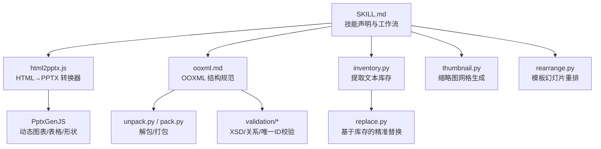
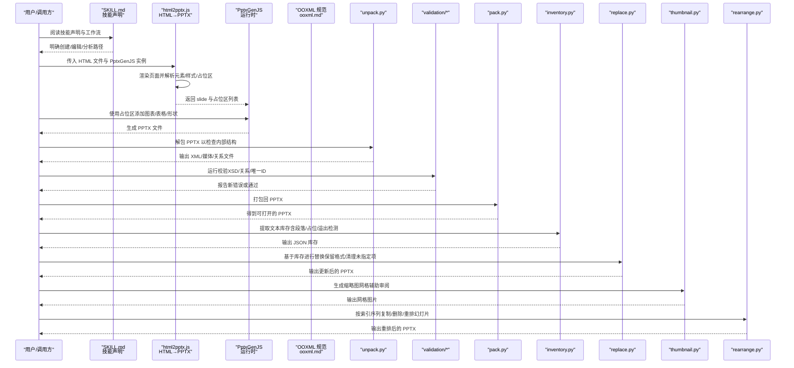
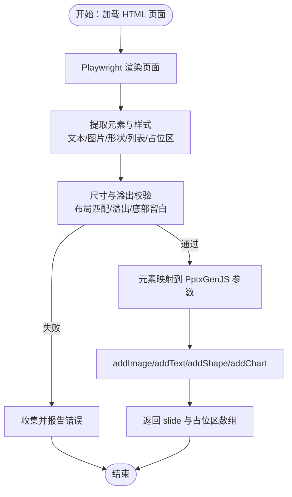
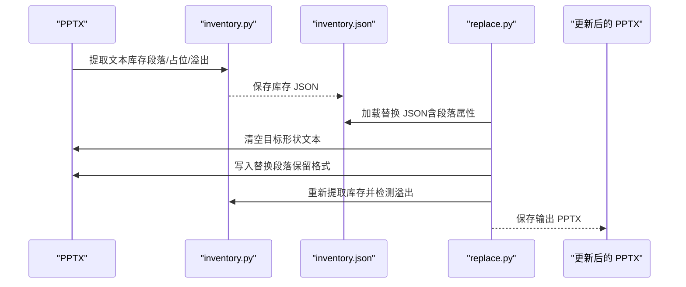
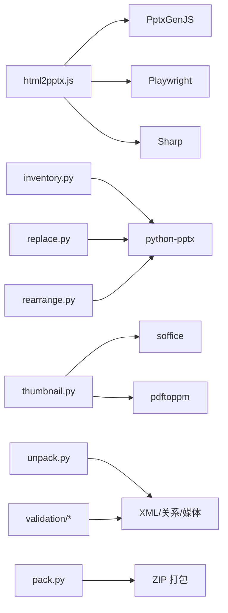

# PPTX处理技能

<cite>
**本文引用的文件**
- [SKILL.md](file://skills/pptx/SKILL.md)
- [html2pptx.md](file://skills/pptx/html2pptx.md)
- [ooxml.md](file://skills/pptx/ooxml.md)
- [html2pptx.js](file://skills/pptx/scripts/html2pptx.js)
- [rearrange.py](file://skills/pptx/scripts/rearrange.py)
- [inventory.py](file://skills/pptx/scripts/inventory.py)
- [replace.py](file://skills/pptx/scripts/replace.py)
- [thumbnail.py](file://skills/pptx/scripts/thumbnail.py)
- [unpack.py](file://skills/pptx/ooxml/scripts/unpack.py)
- [pack.py](file://skills/pptx/ooxml/scripts/pack.py)
- [base.py](file://skills/pptx/ooxml/scripts/validation/base.py)
- [pptx.py](file://skills/pptx/ooxml/scripts/validation/pptx.py)
</cite>

## 目录
1. [简介](#简介)
2. [项目结构](#项目结构)
3. [核心组件](#核心组件)
4. [架构总览](#架构总览)
5. [详细组件分析](#详细组件分析)
6. [依赖关系分析](#依赖关系分析)
7. [性能考量](#性能考量)
8. [故障排查指南](#故障排查指南)
9. [结论](#结论)
10. [附录](#附录)

## 简介
本技术文档聚焦于“PPTX处理技能”，系统阐述如何基于技能声明机制（SKILL.md）驱动幻灯片生成流程，深入解析 html2pptx.js 的实现原理，说明其如何将 HTML/CSS 结构转换为符合 OOXML 标准的 PPTX 幻灯片对象；结合 ooxml.md 解释 PPTX 文件内部结构（演示文稿部件、幻灯片母版与图形标记语言 DrawingML 的应用）；并提供 rearrange.py 在幻灯片顺序调整与内容重组中的使用示例。文档还覆盖图像嵌入、字体兼容性、动画支持等高级特性，并给出常见转换错误（如布局偏移、样式丢失）的调试方法与优化建议。

## 项目结构
该仓库围绕“技能”模块组织，其中 pptx 子模块提供了完整的 PPTX 创建、编辑与分析工具链：
- 技能声明：SKILL.md 定义了 PPTX 的创建、编辑、分析能力边界与工作流。
- 转换与生成：html2pptx.js 将 HTML/CSS 渲染为 PowerPoint 幻灯片；html2pptx.md 提供完整用法与最佳实践。
- 编辑与验证：ooxml.md 描述 OOXML 结构；ooxml/scripts 下的 unpack.py、pack.py、validation/* 提供解包、打包与校验能力。
- 内容替换与排版：inventory.py 提取文本库存；replace.py 基于库存进行精准替换；thumbnail.py 生成缩略图网格辅助审阅。
- 模板重排：rearrange.py 支持按索引序列复制、删除、重排幻灯片，便于模板化复用。

图表来源
- [SKILL.md](file://skills/pptx/SKILL.md#L1-L120)
- [html2pptx.js](file://skills/pptx/scripts/html2pptx.js#L1-L120)
- [ooxml.md](file://skills/pptx/ooxml.md#L1-L120)
- [unpack.py](file://skills/pptx/ooxml/scripts/unpack.py#L1-L30)
- [pack.py](file://skills/pptx/ooxml/scripts/pack.py#L1-L160)
- [base.py](file://skills/pptx/ooxml/scripts/validation/base.py#L1-L120)
- [pptx.py](file://skills/pptx/ooxml/scripts/validation/pptx.py#L1-L120)
- [inventory.py](file://skills/pptx/scripts/inventory.py#L1-L120)
- [replace.py](file://skills/pptx/scripts/replace.py#L1-L120)
- [thumbnail.py](file://skills/pptx/scripts/thumbnail.py#L1-L120)
- [rearrange.py](file://skills/pptx/scripts/rearrange.py#L1-L120)

章节来源
- [SKILL.md](file://skills/pptx/SKILL.md#L1-L120)
- [html2pptx.md](file://skills/pptx/html2pptx.md#L1-L120)

## 核心组件
- html2pptx.js：负责将 HTML 页面渲染为 PowerPoint 幻灯片，自动解析元素位置、尺寸、样式与占位区，输出 PptxGenJS 可用的 slide 对象与占位区列表。
- ooxml.md：定义 PPTX 的内部结构（演示文稿、幻灯片、母版、主题、媒体、关系等），是 OOXML 规范的权威参考。
- inventory.py / replace.py：从现有 PPTX 中抽取文本库存，保留段落格式与占位信息；基于库存进行安全替换，避免误删或格式错乱。
- thumbnail.py：将 PPTX 转 PDF 再转图片，生成缩略图网格，支持可选地标注占位区，便于快速审阅与定位问题。
- rearrange.py：根据给定索引序列复制、删除、重排幻灯片，支持重复使用同一模板页以满足多段内容需求。
- ooxml/scripts：提供解包/打包与严格校验，确保生成的 PPTX 符合 OOXML 规范，避免损坏。

章节来源
- [html2pptx.js](file://skills/pptx/scripts/html2pptx.js#L1-L120)
- [ooxml.md](file://skills/pptx/ooxml.md#L1-L120)
- [inventory.py](file://skills/pptx/scripts/inventory.py#L1-L120)
- [replace.py](file://skills/pptx/scripts/replace.py#L1-L120)
- [thumbnail.py](file://skills/pptx/scripts/thumbnail.py#L1-L120)
- [rearrange.py](file://skills/pptx/scripts/rearrange.py#L1-L120)
- [unpack.py](file://skills/pptx/ooxml/scripts/unpack.py#L1-L30)
- [pack.py](file://skills/pptx/ooxml/scripts/pack.py#L1-L160)
- [base.py](file://skills/pptx/ooxml/scripts/validation/base.py#L1-L120)
- [pptx.py](file://skills/pptx/ooxml/scripts/validation/pptx.py#L1-L120)

## 架构总览
下图展示了从“技能声明”到“最终 PPTX”的端到端流程，以及各组件之间的交互关系。

图表来源
- [SKILL.md](file://skills/pptx/SKILL.md#L1-L200)
- [html2pptx.js](file://skills/pptx/scripts/html2pptx.js#L1-L120)
- [ooxml.md](file://skills/pptx/ooxml.md#L1-L120)
- [unpack.py](file://skills/pptx/ooxml/scripts/unpack.py#L1-L30)
- [pack.py](file://skills/pptx/ooxml/scripts/pack.py#L1-L160)
- [base.py](file://skills/pptx/ooxml/scripts/validation/base.py#L1-L120)
- [pptx.py](file://skills/pptx/ooxml/scripts/validation/pptx.py#L1-L120)
- [inventory.py](file://skills/pptx/scripts/inventory.py#L1-L120)
- [replace.py](file://skills/pptx/scripts/replace.py#L1-L120)
- [thumbnail.py](file://skills/pptx/scripts/thumbnail.py#L1-L120)
- [rearrange.py](file://skills/pptx/scripts/rearrange.py#L1-L120)

## 详细组件分析

### html2pptx.js：HTML→PPTX 转换器
- 设计目标
  - 准确还原 HTML/CSS 布局到 PowerPoint，支持文本、图片、形状、列表、占位区等。
  - 自动校验 HTML 尺寸与 PPTX 布局一致、无溢出、不支持的样式（如文本背景/边框/阴影）。
  - 输出 PptxGenJS 可用的 slide 对象与占位区数组，便于后续动态图表/表格/形状填充。
- 关键实现要点
  - 单位换算：像素→英寸→EMU（PowerPoint内部单位），确保位置与尺寸精确。
  - 元素映射：
    - 文本：p/h1-h6/ul/ol → addText；支持内联标签（b/i/u/span）与文本变换（uppercase/lowercase/capitalize）。
    - 图片：img → addImage；支持透明度与尺寸。
    - 形状：div（有背景/边框/圆角/阴影）→ addShape；边框支持统一/部分边框拆分为线段。
    - 列表：ul/ol → 单一文本块，带缩进与层级；自动去除手动符号。
    - 占位区：class="placeholder" → 记录 x/y/w/h，返回给调用方用于图表/表格放置。
  - 样式继承与兼容：
    - 字体：优先使用 web-safe 字体；单权重字体（如 Impact）跳过粗体以避免伪粗体导致宽度变化。
    - 颜色：RGB/透明度解析为 PptxGenJS 颜色；注意十六进制颜色不要带“#”前缀。
    - 对齐与行距：支持 text-align、line-height、段前/段后间距；单行文本做微调以补偿浏览器低估。
    - 旋转与垂直文本：通过 CSS transform/writing-mode 计算旋转角度，适配 PowerPoint 文本旋转规则。
  - 布局与溢出控制：
    - 校验 HTML body 尺寸与 PPTX 布局匹配；检测水平/垂直溢出并报告具体数值。
    - 文本底部留白校验：超过一定字号时，要求距离底部至少 0.5 英寸。
  - 错误收集：一次性收集所有验证错误，便于批量修复。
- 与 PptxGenJS 的集成
  - 使用 addText/addImage/addShape/addChart 等 API，参数均来自解析结果。
  - 占位区与图表/表格的对接：将占位区的 x/y/w/h 作为 addChart/addTable 的位置参数。

图表来源
- [html2pptx.js](file://skills/pptx/scripts/html2pptx.js#L1-L240)
- [html2pptx.md](file://skills/pptx/html2pptx.md#L1-L200)

章节来源
- [html2pptx.js](file://skills/pptx/scripts/html2pptx.js#L1-L240)
- [html2pptx.md](file://skills/pptx/html2pptx.md#L1-L200)

### ooxml.md：PPTX 内部结构与规范
- 演示文稿与幻灯片
  - presentation.xml：包含幻灯片 ID 列表与关系；slide/slideLayout/slideMaster/theme/media 等目录结构。
  - slideN.xml：每个幻灯片的 spTree（形状树）、txBody（文本体）等。
- 文本与格式
  - 文本框/形状中的文本需遵循 bodyPr/lstStyle/p 元素顺序；run 层级支持加粗、斜体、下划线、字体与颜色。
  - 列表：pPr 中设置级别与符号类型；buChar/buAutoNum 控制项目符号。
- 形状与图片
  - 形状：xfrm（位置/尺寸）、prstGeom（几何）、solidFill（填充）、ln（边框）。
  - 图片：pic/nvPicPr/blipFill/stretch/图元几何。
- 母版与布局
  - slideMasters/slideLayouts：定义占位区类型（标题、正文、图片等）与默认样式。
- 关系与媒体
  - 各 XML 的 _rels 文件维护资源关系；媒体文件放入 media 目录并正确声明 Content Types。
- 动画与主题
  - 动画通常位于 slide XML 或 notes XML 中；主题文件（theme/theme1.xml）定义配色与字体方案。
- 校验与打包
  - 校验：XML 语法、命名空间、唯一 ID、UUID、关系引用、内容类型声明、XSD 校验。
  - 打包：ZIP 压缩，XML 去冗余空白，soffice 校验有效性。

章节来源
- [ooxml.md](file://skills/pptx/ooxml.md#L1-L200)
- [base.py](file://skills/pptx/ooxml/scripts/validation/base.py#L1-L200)
- [pptx.py](file://skills/pptx/ooxml/scripts/validation/pptx.py#L1-L200)

### inventory.py / replace.py：库存提取与精准替换
- inventory.py
  - 递归遍历组形状，计算绝对位置；提取段落属性（对齐、缩进、行距、字体、颜色、主题色）。
  - 检测溢出（帧内溢出/滑出边界）、重叠形状与警告（如手动项目符号）。
  - 过滤页码与数字页脚等非内容占位。
- replace.py
  - 读取 inventory.json，校验替换 JSON 的 slide/shape 是否存在。
  - 清空原形状文本，按段落数据写入；保留 bullet/对齐/间距/字体/颜色等格式。
  - 替换后重新提取库存，对比溢出是否恶化，若出现则报错并提示修复。

图表来源
- [inventory.py](file://skills/pptx/scripts/inventory.py#L1-L200)
- [replace.py](file://skills/pptx/scripts/replace.py#L1-L200)

章节来源
- [inventory.py](file://skills/pptx/scripts/inventory.py#L1-L200)
- [replace.py](file://skills/pptx/scripts/replace.py#L1-L200)

### thumbnail.py：缩略图网格生成
- 工作流
  - 使用 soffice 将 PPTX 转 PDF，再用 pdftoppm 转图片；隐藏幻灯片生成占位图。
  - 计算网格行列，绘制带编号的缩略图；可选在缩略图上叠加占位区轮廓。
- 用途
  - 快速审阅模板/内容；定位布局问题；作为视觉导航。

章节来源
- [thumbnail.py](file://skills/pptx/scripts/thumbnail.py#L1-L200)

### rearrange.py：模板幻灯片重排
- 功能
  - 复制模板幻灯片到目标 PPTX，支持重复使用同一索引（即复制同一模板页多次）。
  - 删除不需要的幻灯片，按目标序列重排；更新关系与 slideIdLst。
- 注意事项
  - 索引从 0 开始；重复索引会先复制再使用。
  - 保持 slide 布局一致性，避免跨布局的占位区错配。

章节来源
- [rearrange.py](file://skills/pptx/scripts/rearrange.py#L1-L200)

## 依赖关系分析
- 组件耦合
  - html2pptx.js 与 PptxGenJS 强耦合，依赖其 addText/addImage/addShape/addChart API。
  - inventory.py/replace.py 依赖 python-pptx 读取/写入 PPTX；与 OOXML 结构紧密相关。
  - thumbnail.py 依赖 soffice 与 pdftoppm；与 PPTX 内容无关但用于审阅。
  - rearrange.py 直接操作 PPTX DOM（slides/_sldIdLst、rels 等），耦合度高但可控。
- 外部依赖
  - Playwright：用于 HTML 渲染与测量。
  - Sharp：预渲染图标/渐变等 CSS 不支持的效果。
  - soffice/pdftoppm：用于 PDF→图片转换与 PPTX 校验。
  - lxml/defusedxml：OOXML 解析与校验。

图表来源
- [html2pptx.js](file://skills/pptx/scripts/html2pptx.js#L1-L120)
- [inventory.py](file://skills/pptx/scripts/inventory.py#L1-L120)
- [replace.py](file://skills/pptx/scripts/replace.py#L1-L120)
- [thumbnail.py](file://skills/pptx/scripts/thumbnail.py#L1-L120)
- [rearrange.py](file://skills/pptx/scripts/rearrange.py#L1-L120)
- [unpack.py](file://skills/pptx/ooxml/scripts/unpack.py#L1-L30)
- [pack.py](file://skills/pptx/ooxml/scripts/pack.py#L1-L160)
- [base.py](file://skills/pptx/ooxml/scripts/validation/base.py#L1-L120)
- [pptx.py](file://skills/pptx/ooxml/scripts/validation/pptx.py#L1-L120)

## 性能考量
- HTML 渲染与测量
  - Playwright 渲染成本较高，建议批量处理或缓存中间产物（如 PNG）。
  - 预渲染复杂视觉效果（渐变/图标）为 PNG，减少运行时计算。
- 图像与媒体
  - 控制图片分辨率与尺寸，避免超大文件；使用合适的压缩质量。
  - 合理复用模板页，减少重复媒体与关系。
- 文本溢出检测
  - inventory.py 使用 PIL 进行近似文本测量，建议在替换前先进行布局优化，减少重跑次数。
- 打包与校验
  - pack.py 压缩与 soffice 校验可能耗时，可在 CI 中异步执行。

[本节为通用指导，无需特定文件引用]

## 故障排查指南
- 常见布局偏移
  - 症状：文本被截断、底部留白不足、列表缩进异常。
  - 排查：检查 html2pptx.js 的溢出与底部留白校验；确认 HTML body 尺寸与 PPTX 布局一致；适当增加 margin 或调整字号。
  - 参考：[html2pptx.js](file://skills/pptx/scripts/html2pptx.js#L1-L120)
- 样式丢失
  - 症状：粗体/斜体/下划线/颜色/对齐丢失。
  - 排查：确认使用的是 web-safe 字体；颜色不要带“#”前缀；内联样式仅支持有限属性；必要时改用 span + CSS。
  - 参考：[html2pptx.md](file://skills/pptx/html2pptx.md#L1-L200)
- 文本背景/边框/阴影不生效
  - 症状：div 文本元素出现背景/边框/阴影。
  - 排查：这些样式仅对 div 生效，文本元素不支持；请将文本放入 p/h/ul 等容器中。
  - 参考：[html2pptx.js](file://skills/pptx/scripts/html2pptx.js#L1-L200)
- 占位区无效
  - 症状：占位区宽/高为 0，或未出现在返回列表。
  - 排查：检查占位区 CSS 是否正确；确保占位区可见且有尺寸。
  - 参考：[html2pptx.js](file://skills/pptx/scripts/html2pptx.js#L1-L200)
- 替换后溢出恶化
  - 症状：替换后某形状文本溢出更严重。
  - 排查：使用 replace.py 的溢出检测；减小字号/行距/段前段后，或调整占位区尺寸。
  - 参考：[replace.py](file://skills/pptx/scripts/replace.py#L1-L200)
- PPTX 无法打开或损坏
  - 症状：PowerPoint 报错或文件损坏。
  - 排查：使用 ooxml/scripts/validation/* 进行 XSD/关系/唯一ID/UUID/内容类型等校验；必要时重新 unpack/pack。
  - 参考：[base.py](file://skills/pptx/ooxml/scripts/validation/base.py#L1-L200)，[pptx.py](file://skills/pptx/ooml/scripts/validation/pptx.py#L1-L200)，[pack.py](file://skills/pptx/ooxml/scripts/pack.py#L1-L160)

章节来源
- [html2pptx.js](file://skills/pptx/scripts/html2pptx.js#L1-L200)
- [html2pptx.md](file://skills/pptx/html2pptx.md#L1-L200)
- [replace.py](file://skills/pptx/scripts/replace.py#L1-L200)
- [base.py](file://skills/pptx/ooxml/scripts/validation/base.py#L1-L200)
- [pptx.py](file://skills/pptx/ooxml/scripts/validation/pptx.py#L1-L200)
- [pack.py](file://skills/pptx/ooxml/scripts/pack.py#L1-L160)

## 结论
通过 SKILL.md 的技能声明与工具链协同，可以高效地从 HTML 生成高质量 PPTX，并在模板化场景中灵活重排与替换内容。html2pptx.js 提供了强大的元素映射与样式兼容策略；inventory/replace 流程保障了格式与内容的一致性；thumbnail 与 rearrange 则提升了审阅与复用效率。配合 ooxml.md 与 validation 工具，可确保生成的 PPTX 符合 OOXML 规范，避免常见错误与损坏。

[本节为总结性内容，无需特定文件引用]

## 附录
- 使用示例（基于技能声明）
  - 从 HTML 创建 PPTX：参见 [SKILL.md](file://skills/pptx/SKILL.md#L150-L200) 与 [html2pptx.md](file://skills/pptx/html2pptx.md#L1-L120)。
  - 编辑现有 PPTX：参见 [SKILL.md](file://skills/pptx/SKILL.md#L171-L181) 与 [ooxml.md](file://skills/pptx/ooxml.md#L1-L120)。
  - 模板重排：参见 [SKILL.md](file://skills/pptx/SKILL.md#L245-L253) 与 [rearrange.py](file://skills/pptx/scripts/rearrange.py#L1-L120)。
  - 文本库存与替换：参见 [SKILL.md](file://skills/pptx/SKILL.md#L254-L395) 与 [inventory.py](file://skills/pptx/scripts/inventory.py#L1-L120)、[replace.py](file://skills/pptx/scripts/replace.py#L1-L120)。
  - 缩略图审阅：参见 [SKILL.md](file://skills/pptx/SKILL.md#L408-L439) 与 [thumbnail.py](file://skills/pptx/scripts/thumbnail.py#L1-L120)。

章节来源
- [SKILL.md](file://skills/pptx/SKILL.md#L150-L395)
- [html2pptx.md](file://skills/pptx/html2pptx.md#L1-L120)
- [rearrange.py](file://skills/pptx/scripts/rearrange.py#L1-L120)
- [inventory.py](file://skills/pptx/scripts/inventory.py#L1-L120)
- [replace.py](file://skills/pptx/scripts/replace.py#L1-L120)
- [thumbnail.py](file://skills/pptx/scripts/thumbnail.py#L1-L120)