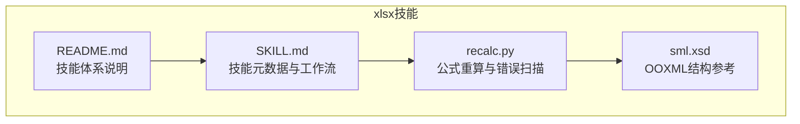
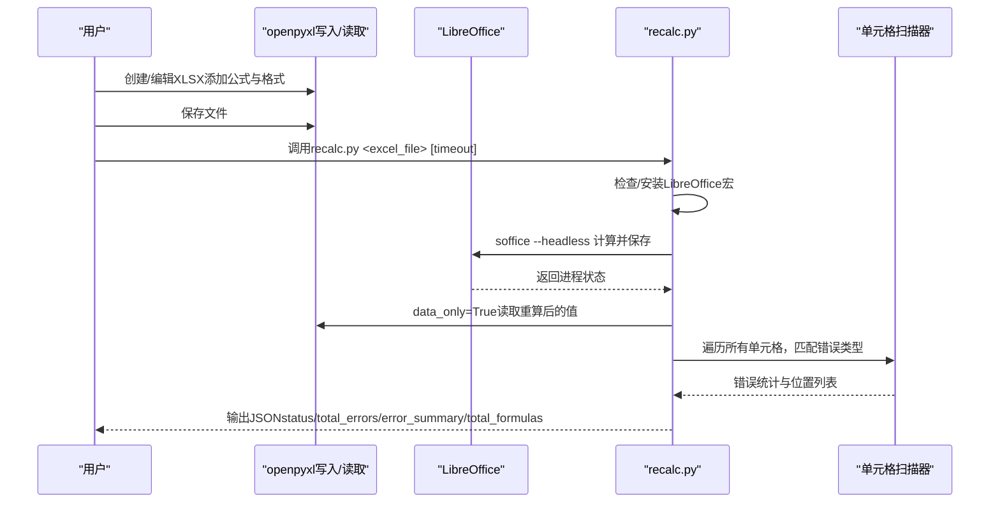
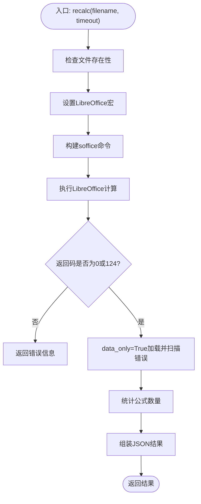
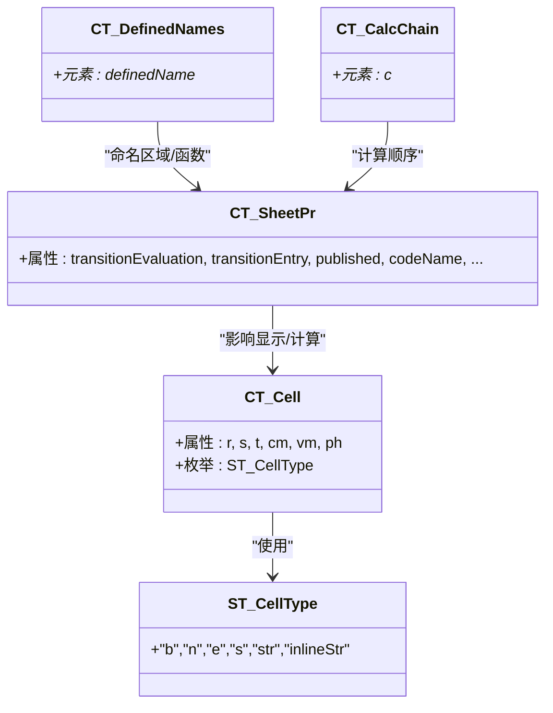
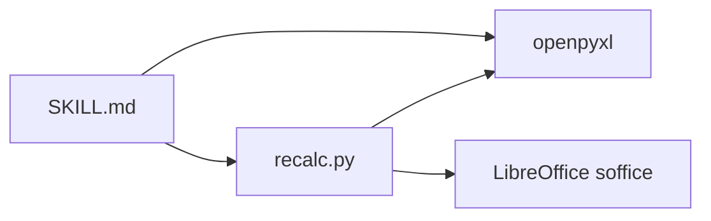

# XLSX处理技能

<cite>
**本文引用的文件**
- [SKILL.md](file://skills/xlsx/SKILL.md)
- [recalc.py](file://skills/xlsx/recalc.py)
- [README.md](file://README.md)
- [sml.xsd](file://skills/pptx/ooxml/schemas/ISO-IEC29500-4_2016/sml.xsd)
</cite>

## 目录
1. [简介](#简介)
2. [项目结构](#项目结构)
3. [核心组件](#核心组件)
4. [架构总览](#架构总览)
5. [详细组件分析](#详细组件分析)
6. [依赖关系分析](#依赖关系分析)
7. [性能考量](#性能考量)
8. [故障排查指南](#故障排查指南)
9. [结论](#结论)
10. [附录](#附录)

## 简介
本技术文档围绕“xlsx处理技能”，系统阐述如何通过技能元数据与工具链实现Excel文件的创建、编辑、分析与公式重算。重点解析recalc.py脚本的实现逻辑，说明其如何加载XLSX文件、触发公式重算引擎（通过LibreOffice宏），并确保跨单元格引用与函数依赖的正确更新；同时结合OOXML规范，解释工作表、共享字符串表与公式存储机制，给出自动化财务报表更新、数据验证与导出集成等实际用例，并提供常见问题排查与性能优化建议。

## 项目结构
xlsx技能位于skills/xlsx目录下，包含技能元数据与重算脚本：
- 技能元数据：SKILL.md，定义Excel处理要求、工作流、格式化标准、公式规则与错误预防清单
- 公式重算脚本：recalc.py，封装LibreOffice宏调用与Excel错误扫描
- 依赖与参考：README.md（技能体系说明）、OOXML Schema（sml.xsd）用于理解XLSX内部结构

图表来源
- [SKILL.md](file://skills/xlsx/SKILL.md#L69-L273)
- [recalc.py](file://skills/xlsx/recalc.py#L1-L178)
- [README.md](file://README.md#L1-L95)
- [sml.xsd](file://skills/pptx/ooxml/schemas/ISO-IEC29500-4_2016/sml.xsd#L2280-L2479)

章节来源
- [README.md](file://README.md#L1-L95)
- [SKILL.md](file://skills/xlsx/SKILL.md#L69-L273)

## 核心组件
- 技能元数据（SKILL.md）
  - 明确Excel文件零公式错误的要求、金融模型颜色编码与数字格式标准、公式构建规则与硬编码注释规范
  - 规定使用openpyxl进行公式与格式化、pandas进行数据分析与导出
  - 强调“先修改、后保存、再重算”的强制流程，缺失重算将导致结果不一致
- 公式重算脚本（recalc.py）
  - 自动配置LibreOffice宏（首次运行），调用calculateAll()触发全表重算
  - 扫描所有单元格，识别#REF!、#DIV/0!、#VALUE!、#NAME?等错误类型
  - 统计公式总数与错误分布，输出JSON报告
- OOXML参考（sml.xsd）
  - 提供工作表、共享字符串、公式类型、计算链、定义名称等结构的Schema定义，支撑对XLSX内部机制的理解

章节来源
- [SKILL.md](file://skills/xlsx/SKILL.md#L1-L289)
- [recalc.py](file://skills/xlsx/recalc.py#L1-L178)
- [sml.xsd](file://skills/pptx/ooxml/schemas/ISO-IEC29500-4_2016/sml.xsd#L2280-L2479)

## 架构总览
下图展示从用户操作到公式重算与错误检测的整体流程：

图表来源
- [recalc.py](file://skills/xlsx/recalc.py#L53-L155)
- [SKILL.md](file://skills/xlsx/SKILL.md#L204-L223)

## 详细组件分析

### 组件A：recalc.py实现逻辑
- 宏配置与初始化
  - 平台适配：macOS与Linux路径差异，首次运行自动创建宏目录并写入RecalculateAndSave宏
  - 命令行：通过soffice以headless模式启动，调用应用级宏模块执行calculateAll()、store()、close()
- 超时控制
  - Linux使用timeout，macOS优先尝试gtimeout；超时返回码124作为正常退出信号
- 错误扫描与统计
  - 使用data_only=True加载，遍历所有工作表与行列，匹配预定义错误字符串集合
  - 统计各类错误数量与前20个位置，同时统计公式总数（以值以“=”开头为依据）
- 输出格式
  - 成功/错误两种状态，包含total_errors、total_formulas与error_summary（按错误类型分组）

图表来源
- [recalc.py](file://skills/xlsx/recalc.py#L53-L155)

章节来源
- [recalc.py](file://skills/xlsx/recalc.py#L1-L178)

### 组件B：OOXML结构与公式存储
- 工作表与单元格类型
  - 单元格类型枚举包含“b/n/e/s/str/inlineStr”，公式类型支持“normal/array/dataTable/shared”
  - 工作表视图、筛选、合并单元格等属性由Schema定义，支撑复杂表格布局与交互
- 共享字符串表
  - 在OOXML中，字符串通常以共享索引形式存储，减少重复文本占用空间
- 公式与计算链
  - 计算链（calcChain）记录计算顺序，定义名称（definedName）支持命名区域与函数别名
  - 计算模式（calcMode）、全精度（fullPrecision）、并发计算（concurrentCalc）等属性影响重算行为
- 外部引用与刷新
  - 外部引用（externalReference）与查询缓存（pivotCache）等元素表明XLSX可与外部数据源联动

图表来源
- [sml.xsd](file://skills/pptx/ooxml/schemas/ISO-IEC29500-4_2016/sml.xsd#L2280-L2479)
- [sml.xsd](file://skills/pptx/ooxml/schemas/ISO-IEC29500-4_2016/sml.xsd#L247-L271)
- [sml.xsd](file://skills/pptx/ooxml/schemas/ISO-IEC29500-4_2016/sml.xsd#L4289-L4315)

章节来源
- [sml.xsd](file://skills/pptx/ooxml/schemas/ISO-IEC29500-4_2016/sml.xsd#L2280-L2479)
- [sml.xsd](file://skills/pptx/ooxml/schemas/ISO-IEC29500-4_2016/sml.xsd#L247-L271)
- [sml.xsd](file://skills/pptx/ooxml/schemas/ISO-IEC29500-4_2016/sml.xsd#L4289-L4315)

### 组件C：技能元数据与工作流
- 工具选择
  - pandas：适合数据分析、批量导出与简单写入
  - openpyxl：适合复杂格式、公式与Excel特性
- 工作流步骤
  - 选择工具 -> 创建/加载 -> 修改（数据/公式/格式）-> 保存 -> 重算（必选）-> 验证与修复
- 质量保障
  - 零公式错误、模板一致性、颜色编码与数字格式标准化、公式错误预防清单与测试策略

章节来源
- [SKILL.md](file://skills/xlsx/SKILL.md#L69-L273)

## 依赖关系分析
- 外部依赖
  - LibreOffice：通过soffice headless模式驱动宏执行，完成全表公式重算
  - openpyxl：用于读取XLSX（data_only=True用于扫描错误值；data_only=False用于统计公式数）
- 内部耦合
  - recalc.py依赖openpyxl进行文件读取与遍历，依赖LibreOffice进程管理与超时控制
  - SKILL.md定义了工具选择与工作流约束，指导recalc.py的使用场景与输出解读

图表来源
- [recalc.py](file://skills/xlsx/recalc.py#L1-L178)
- [SKILL.md](file://skills/xlsx/SKILL.md#L69-L273)

章节来源
- [recalc.py](file://skills/xlsx/recalc.py#L1-L178)
- [SKILL.md](file://skills/xlsx/SKILL.md#L69-L273)

## 性能考量
- 大文件读取
  - 读取阶段使用data_only=True避免重复计算，提高扫描效率
  - 对于仅需统计公式的场景，可先以data_only=False遍历一次，再以data_only=True进行错误扫描
- 超时与并发
  - 合理设置timeout，避免长时间阻塞；macOS优先gtimeout，Linux使用timeout
  - 并发计算（concurrentCalc）与全精度（fullPrecision）等属性由OOXML控制，影响重算耗时
- 分块计算与缓存
  - 将大型模型拆分为多个子工作表或命名区域，按需重算，减少全局重算成本
  - 利用定义名称（definedName）与计算链（calcChain）组织依赖，提升重算顺序可控性
- 导出与验证
  - pandas导出时指定dtype与列选择，减少内存压力；导出后立即重算并校验错误

[本节为通用性能建议，无需特定文件引用]

## 故障排查指南
- 公式未更新
  - 确认已执行recalc.py；检查LibreOffice宏是否成功写入与调用
  - 若返回“宏未正确配置”，重新运行脚本或手动检查~/.config/libreoffice或~/Library/Application Support下的宏目录
- 数值精度丢失
  - 检查数字格式与单位标注；确认未在Python侧提前计算并硬编码
  - 使用pandas读取时显式指定dtype，避免推断误差
- 外部链接断开
  - 检查外部引用（externalReference）与刷新设置；必要时在LibreOffice中手动刷新
- 常见错误定位
  - #REF!：检查跨表/跨列引用是否正确
  - #DIV/0!：检查除数是否可能为零
  - #VALUE!：检查数据类型与函数参数
  - #NAME?：检查函数名或定义名称是否存在
- 输出解读
  - status为success表示无错误；errors_found时根据error_summary定位具体位置，逐项修复后再次重算

章节来源
- [recalc.py](file://skills/xlsx/recalc.py#L53-L155)
- [SKILL.md](file://skills/xlsx/SKILL.md#L224-L261)

## 结论
xlsx技能通过明确的元数据规范与recalc.py脚本，将Excel的公式重算与错误检测流程化、自动化。结合OOXML结构知识，可更深入地理解XLSX内部的公式存储、共享字符串与计算链机制。在实际应用中，遵循“先修改、后保存、再重算”的工作流，配合分块计算与缓存策略，可在保证质量的前提下显著提升大规模数据处理的稳定性与效率。

[本节为总结性内容，无需特定文件引用]

## 附录

### 实际用例
- 自动化财务报表更新
  - 使用openpyxl构建模板，将假设输入置于独立区域，其余计算均以公式表达
  - 通过pandas批量读取原始数据，写入模板后调用recalc.py进行全表重算与错误扫描
- 数据验证与导出集成
  - 在导出前对关键列进行类型与范围校验，确保后续公式依赖稳定
  - 使用pandas导出为Excel，随后重算并生成JSON报告，便于CI/CD流水线集成

[本节为概念性示例，无需特定文件引用]