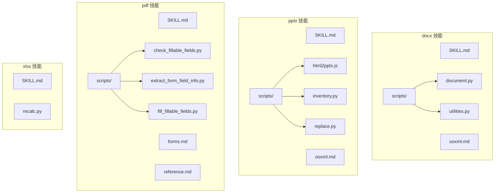
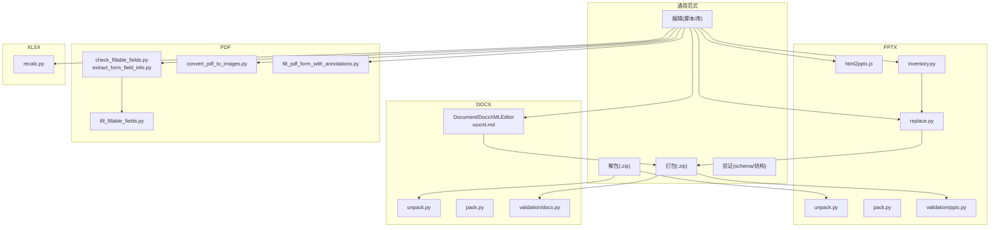
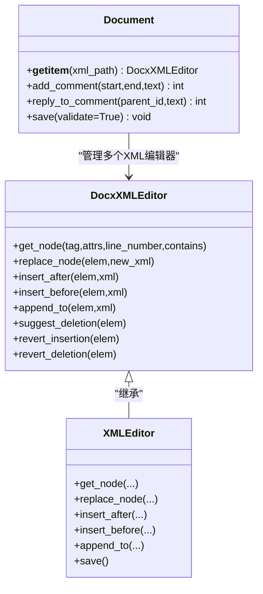
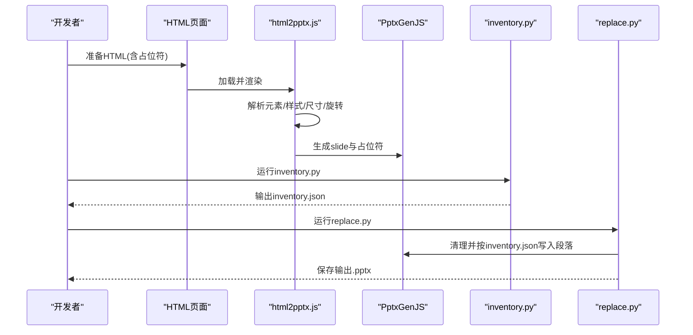
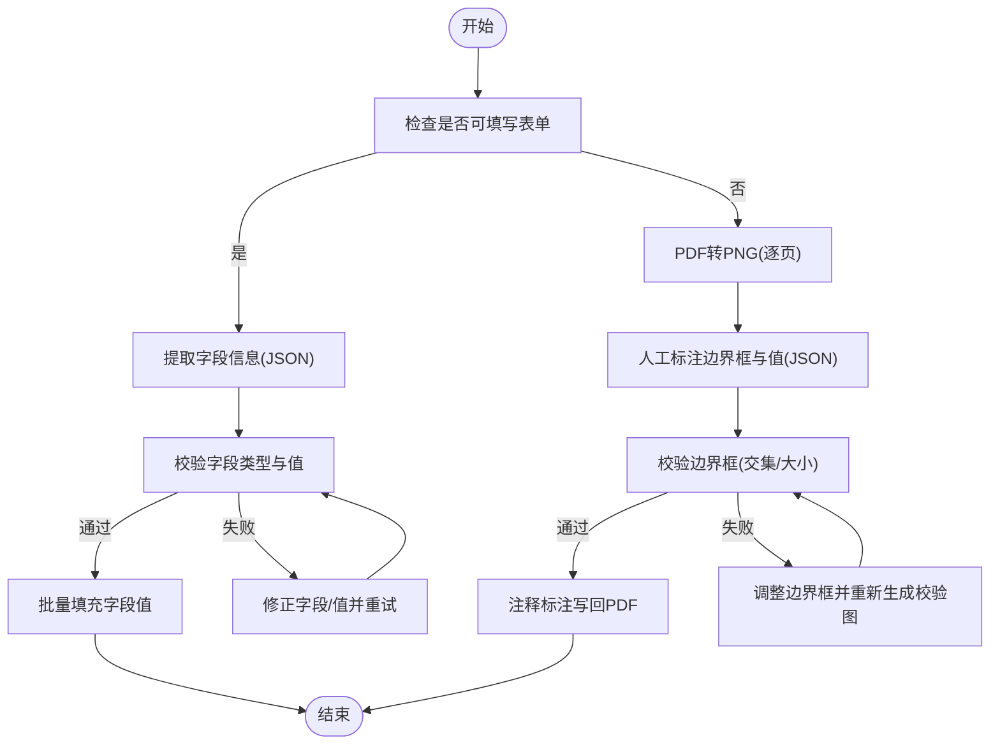
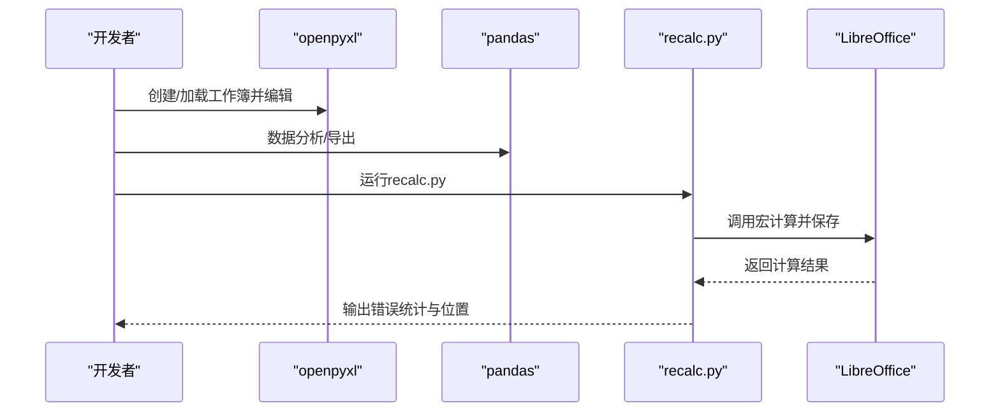
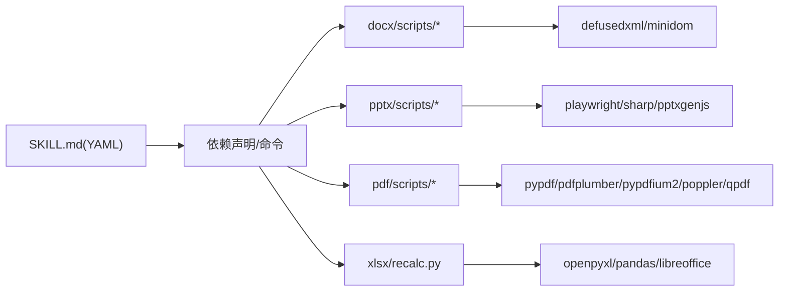

# 文档处理技能

<cite>
**本文引用的文件**
- [skills/docx/SKILL.md](file://skills/docx/SKILL.md)
- [skills/docx/ooxml.md](file://skills/docx/ooxml.md)
- [skills/docx/scripts/document.py](file://skills/docx/scripts/document.py)
- [skills/docx/scripts/utilities.py](file://skills/docx/scripts/utilities.py)
- [skills/pptx/SKILL.md](file://skills/pptx/SKILL.md)
- [skills/pptx/ooxml.md](file://skills/pptx/ooxml.md)
- [skills/pptx/scripts/html2pptx.js](file://skills/pptx/scripts/html2pptx.js)
- [skills/pptx/scripts/inventory.py](file://skills/pptx/scripts/inventory.py)
- [skills/pptx/scripts/replace.py](file://skills/pptx/scripts/replace.py)
- [skills/pdf/SKILL.md](file://skills/pdf/SKILL.md)
- [skills/pdf/forms.md](file://skills/pdf/forms.md)
- [skills/pdf/reference.md](file://skills/pdf/reference.md)
- [skills/pdf/scripts/check_fillable_fields.py](file://skills/pdf/scripts/check_fillable_fields.py)
- [skills/pdf/scripts/extract_form_field_info.py](file://skills/pdf/scripts/extract_form_field_info.py)
- [skills/pdf/scripts/fill_fillable_fields.py](file://skills/pdf/scripts/fill_fillable_fields.py)
- [skills/xlsx/SKILL.md](file://skills/xlsx/SKILL.md)
- [skills/xlsx/recalc.py](file://skills/xlsx/recalc.py)
</cite>

## 目录
1. [引言](#引言)
2. [项目结构](#项目结构)
3. [核心组件](#核心组件)
4. [架构总览](#架构总览)
5. [详细组件分析](#详细组件分析)
6. [依赖关系分析](#依赖关系分析)
7. [性能考虑](#性能考虑)
8. [故障排查指南](#故障排查指南)
9. [结论](#结论)
10. [附录](#附录)

## 引言
本文件系统性梳理“文档处理技能”仓库中针对 DOCX、PPTX、PDF、XLSX 四大核心格式的处理能力，覆盖设计目标、技术实现、使用场景与最佳实践。重点解释：
- YAML 元数据（位于各技能根目录的 SKILL.md）如何驱动工作流与工具选择；
- scripts/ 目录下 Python/JavaScript 脚本如何执行具体任务；
- OOXML 规范在 DOCX 与 PPTX 技能中的基础作用；
- PDF 技能中图像转换与可填写字段处理的技术细节；
- 常见问题排查与性能优化建议（如文件打包失败、字体嵌入异常、表单识别不准、批量处理内存与异步策略等）。

## 项目结构
该仓库采用“按技能划分”的模块化组织方式，每个技能（docx、pptx、pdf、xlsx）均包含：
- 技能说明文档 SKILL.md：定义用途、工作流、依赖与命令；
- 技术参考文档（如 ooxml.md）：OOXML 结构与模式；
- scripts/：具体实现脚本（Python/JavaScript），用于打包、解包、验证、生成、替换、校验等。

图表来源
- [skills/docx/SKILL.md](file://skills/docx/SKILL.md#L1-L197)
- [skills/docx/ooxml.md](file://skills/docx/ooxml.md#L1-L610)
- [skills/docx/scripts/document.py](file://skills/docx/scripts/document.py#L1-L1277)
- [skills/docx/scripts/utilities.py](file://skills/docx/scripts/utilities.py#L1-L375)
- [skills/pptx/SKILL.md](file://skills/pptx/SKILL.md#L1-L484)
- [skills/pptx/ooxml.md](file://skills/pptx/ooxml.md#L1-L427)
- [skills/pptx/scripts/html2pptx.js](file://skills/pptx/scripts/html2pptx.js#L1-L979)
- [skills/pptx/scripts/inventory.py](file://skills/pptx/scripts/inventory.py#L1-L1021)
- [skills/pptx/scripts/replace.py](file://skills/pptx/scripts/replace.py#L1-L386)
- [skills/pdf/SKILL.md](file://skills/pdf/SKILL.md#L1-L295)
- [skills/pdf/forms.md](file://skills/pdf/forms.md#L1-L206)
- [skills/pdf/reference.md](file://skills/pdf/reference.md#L1-L612)
- [skills/pdf/scripts/check_fillable_fields.py](file://skills/pdf/scripts/check_fillable_fields.py#L1-L13)
- [skills/pdf/scripts/extract_form_field_info.py](file://skills/pdf/scripts/extract_form_field_info.py#L1-L153)
- [skills/pdf/scripts/fill_fillable_fields.py](file://skills/pdf/scripts/fill_fillable_fields.py#L1-L115)
- [skills/xlsx/SKILL.md](file://skills/xlsx/SKILL.md#L1-L289)
- [skills/xlsx/recalc.py](file://skills/xlsx/recalc.py#L1-L178)

章节来源
- [skills/docx/SKILL.md](file://skills/docx/SKILL.md#L1-L197)
- [skills/pptx/SKILL.md](file://skills/pptx/SKILL.md#L1-L484)
- [skills/pdf/SKILL.md](file://skills/pdf/SKILL.md#L1-L295)
- [skills/xlsx/SKILL.md](file://skills/xlsx/SKILL.md#L1-L289)

## 核心组件
- DOCX：基于 Office Open XML 的文档创建、编辑与分析，支持审阅标记（跟踪修订）、批注、格式保留与文本抽取；通过 Python 库与 OOXML 模式实现；提供“红线条”工作流以系统化地应用最小化修改。
- PPTX：基于 OOXML 的演示文稿创建、编辑与分析，支持布局、主题、注释、讲稿、占位符与模板复用；提供 HTML 到 PPTX 的转换流程与可视化校验；支持批量替换文本与格式。
- PDF：提供 PDF 基础操作（合并/拆分、旋转、元数据读取、文本/表格抽取）、图像提取与水印添加；对可填写表单提供字段识别、值填充与注释标注流程；支持高级库与命令行工具链。
- XLSX：基于 openpyxl 的电子表格创建与编辑，强调公式优先与格式保持；提供公式重算脚本，确保计算结果正确性与错误定位。

章节来源
- [skills/docx/SKILL.md](file://skills/docx/SKILL.md#L1-L197)
- [skills/pptx/SKILL.md](file://skills/pptx/SKILL.md#L1-L484)
- [skills/pdf/SKILL.md](file://skills/pdf/SKILL.md#L1-L295)
- [skills/xlsx/SKILL.md](file://skills/xlsx/SKILL.md#L1-L289)

## 架构总览
四类技能共享统一的“解包-编辑-打包-验证”范式，辅以专用脚本完成特定任务。

图表来源
- [skills/docx/SKILL.md](file://skills/docx/SKILL.md#L1-L197)
- [skills/pptx/SKILL.md](file://skills/pptx/SKILL.md#L1-L484)
- [skills/pdf/SKILL.md](file://skills/pdf/SKILL.md#L1-L295)
- [skills/xlsx/SKILL.md](file://skills/xlsx/SKILL.md#L1-L289)

## 详细组件分析

### DOCX 技能
- 设计目标
  - 支持专业文档创建、编辑与分析，保留格式与审阅信息，提供文本抽取与图片转换能力。
- 技术实现
  - 基于 Office Open XML（OOXML）规范，通过 Python 库与 DOM 编辑器进行细粒度控制；提供“红线条”工作流，系统化应用最小化修改，避免误改未变更文本。
  - 关键脚本与模块：
    - scripts/document.py：封装 Document/DocxXMLEditor，自动注入 RSID、作者、日期、删除/插入标记与评论基础设施；提供撤销插入/删除、建议段落包装等方法。
    - scripts/utilities.py：XMLEditor 提供按行号、属性、文本内容定位节点的能力，支持插入/替换/追加等 DOM 操作。
    - ooxml.md：提供 OOXML 结构、样式、列表、表格、链接、图像、超链接等模式与合规要求。
- 使用场景
  - 创建新文档（docx-js）与编辑现有文档（Python 库）；
  - 审阅标记与批注（跟踪修订、评论）；
  - 文档转图片（先转 PDF 再转图片）。

图表来源
- [skills/docx/scripts/document.py](file://skills/docx/scripts/document.py#L1-L1277)
- [skills/docx/scripts/utilities.py](file://skills/docx/scripts/utilities.py#L1-L375)

章节来源
- [skills/docx/SKILL.md](file://skills/docx/SKILL.md#L1-L197)
- [skills/docx/ooxml.md](file://skills/docx/ooxml.md#L1-L610)
- [skills/docx/scripts/document.py](file://skills/docx/scripts/document.py#L1-L1277)
- [skills/docx/scripts/utilities.py](file://skills/docx/scripts/utilities.py#L1-L375)

### PPTX 技能
- 设计目标
  - 支持演示文稿创建、编辑与分析，覆盖布局、主题、注释、讲稿、占位符与模板复用；提供 HTML 到 PPTX 的高保真转换与可视化校验。
- 技术实现
  - 基于 OOXML 规范，提供 HTML 渲染与定位（Playwright + Sharp）、元素解析（文本、图片、形状、列表）、尺寸换算与位置映射；支持占位符区域与图表/表格的后续填充。
  - 关键脚本与模块：
    - scripts/html2pptx.js：从 HTML 页面提取元素与样式，转换为 PptxGenJS 幻灯片对象，支持背景、图片、形状、列表与文本框；内置溢出与布局校验。
    - scripts/inventory.py：递归遍历幻灯片与分组形状，提取文本、段落格式、占位符类型、默认字号、溢出与重叠检测，输出结构化 JSON。
    - scripts/replace.py：基于 inventory.py 输出，清理所有文本形状后按 JSON 中的 paragraphs 字段逐段恢复格式与内容，支持对齐、缩进、颜色、主题色等。
    - ooxml.md：提供幻灯片结构、文本框/形状、列表、图片、表格、布局与关系更新等规范与注意事项。
- 使用场景
  - 无模板创建：HTML → PPTX；
  - 模板复用：复制/重排幻灯片、提取库存、批量替换文本与格式；
  - 可视化校验：缩略图网格与溢出检查。

图表来源
- [skills/pptx/scripts/html2pptx.js](file://skills/pptx/scripts/html2pptx.js#L1-L979)
- [skills/pptx/scripts/inventory.py](file://skills/pptx/scripts/inventory.py#L1-L1021)
- [skills/pptx/scripts/replace.py](file://skills/pptx/scripts/replace.py#L1-L386)

章节来源
- [skills/pptx/SKILL.md](file://skills/pptx/SKILL.md#L1-L484)
- [skills/pptx/ooxml.md](file://skills/pptx/ooxml.md#L1-L427)
- [skills/pptx/scripts/html2pptx.js](file://skills/pptx/scripts/html2pptx.js#L1-L979)
- [skills/pptx/scripts/inventory.py](file://skills/pptx/scripts/inventory.py#L1-L1021)
- [skills/pptx/scripts/replace.py](file://skills/pptx/scripts/replace.py#L1-L386)

### PDF 技能
- 设计目标
  - 提供 PDF 基础操作与高级处理能力，包括可填写表单的识别与填充、非可填写表单的注释标注、图像提取与 OCR、文本/表格抽取与报告生成。
- 技术实现
  - 可填写表单：通过 pypdf 读取字段、提取层级与边界框，生成结构化 JSON；按类型（文本、复选框、单选组、选择框）进行值校验与批量填充。
  - 非可填写表单：将 PDF 转为 PNG，人工标注字段边界，生成 fields.json 与校验图；通过注释标注工具将文本写回 PDF。
  - 图像与文本：提供命令行工具与 Python 库（pdfplumber、pypdfium2、reportlab）以满足不同场景需求。
- 使用场景
  - 表单自动化：字段识别 → 值校验 → 批量填充；
  - 可视化标注：图像分析 → 边界框校验 → 注释写回；
  - 大文档处理：分页切分、流式处理、内存优化。

图表来源
- [skills/pdf/forms.md](file://skills/pdf/forms.md#L1-L206)
- [skills/pdf/scripts/check_fillable_fields.py](file://skills/pdf/scripts/check_fillable_fields.py#L1-L13)
- [skills/pdf/scripts/extract_form_field_info.py](file://skills/pdf/scripts/extract_form_field_info.py#L1-L153)
- [skills/pdf/scripts/fill_fillable_fields.py](file://skills/pdf/scripts/fill_fillable_fields.py#L1-L115)

章节来源
- [skills/pdf/SKILL.md](file://skills/pdf/SKILL.md#L1-L295)
- [skills/pdf/forms.md](file://skills/pdf/forms.md#L1-L206)
- [skills/pdf/reference.md](file://skills/pdf/reference.md#L1-L612)
- [skills/pdf/scripts/check_fillable_fields.py](file://skills/pdf/scripts/check_fillable_fields.py#L1-L13)
- [skills/pdf/scripts/extract_form_field_info.py](file://skills/pdf/scripts/extract_form_field_info.py#L1-L153)
- [skills/pdf/scripts/fill_fillable_fields.py](file://skills/pdf/scripts/fill_fillable_fields.py#L1-L115)

### XLSX 技能
- 设计目标
  - 支持公式优先、格式保持与数据分析，强调零公式错误与模板一致性；提供公式重算与错误定位。
- 技术实现
  - openpyxl：创建/加载工作簿，增删改数据与格式；pandas：数据读取与导出；公式重算脚本 recalc.py：通过 LibreOffice 自动宏计算并扫描错误类型与位置。
- 使用场景
  - 新建/编辑电子表格，维护公式与格式；
  - 批量数据处理与报表生成；
  - 公式错误排查与修复。

图表来源
- [skills/xlsx/SKILL.md](file://skills/xlsx/SKILL.md#L1-L289)
- [skills/xlsx/recalc.py](file://skills/xlsx/recalc.py#L1-L178)

章节来源
- [skills/xlsx/SKILL.md](file://skills/xlsx/SKILL.md#L1-L289)
- [skills/xlsx/recalc.py](file://skills/xlsx/recalc.py#L1-L178)

## 依赖关系分析
- YAML 元数据（SKILL.md）
  - 每个技能的 SKILL.md 定义了用途、工作流决策树、依赖与命令；YAML 头部提供名称、描述与许可证信息，作为技能入口与上下文说明。
- 脚本与库
  - DOCX：依赖 defusedxml/minidom、ooxml/scripts 下的 pack/unpack/validation；通过 Document/DocxXMLEditor 实现安全 DOM 操作。
  - PPTX：依赖 Playwright/Sharp、pptxgenjs；html2pptx.js 负责 HTML 渲染与定位；inventory.py/replace.py 依赖 python-pptx。
  - PDF：依赖 pypdf、pdfplumber、pypdfium2、poppler-utils、qpdf 等；forms.md 定义字段识别与注释标注流程。
  - XLSX：依赖 openpyxl、pandas、LibreOffice；recalc.py 通过 soffice/headless 调用宏。

图表来源
- [skills/docx/SKILL.md](file://skills/docx/SKILL.md#L1-L197)
- [skills/pptx/SKILL.md](file://skills/pptx/SKILL.md#L1-L484)
- [skills/pdf/SKILL.md](file://skills/pdf/SKILL.md#L1-L295)
- [skills/xlsx/SKILL.md](file://skills/xlsx/SKILL.md#L1-L289)

章节来源
- [skills/docx/SKILL.md](file://skills/docx/SKILL.md#L1-L197)
- [skills/pptx/SKILL.md](file://skills/pptx/SKILL.md#L1-L484)
- [skills/pdf/SKILL.md](file://skills/pdf/SKILL.md#L1-L295)
- [skills/xlsx/SKILL.md](file://skills/xlsx/SKILL.md#L1-L289)

## 性能考虑
- 批量处理与内存管理
  - PDF：分页切分（qpdf split-pages）、流式读取（pypdfium2）、低分辨率预览、高分辨率最终输出；避免一次性加载整份文档到内存。
  - XLSX：使用 openpyxl 的 write_only/read_only 模式；pandas 指定 dtype 与 usecols 以减少推断与列数；recalc.py 仅扫描错误位置，避免全量读取。
  - PPTX：inventory.py 对形状进行绝对位置计算与溢出检测，避免重复渲染；html2pptx.js 使用 Playwright 渲染一次并缓存尺寸。
- 异步与并发
  - 推荐使用进程池/线程池处理多页/多文件；对 PDF 图像提取与 OCR 使用队列与限速，避免资源争用。
- IO 与中间文件
  - DOCX/PPTX：临时目录保存解包副本，完成后统一打包；避免直接修改原始目录导致校验失败。
- 公式重算
  - recalc.py 在首次运行时配置 LibreOffice 宏，设置超时时间；扫描错误时仅记录前若干位置，避免输出过大。

章节来源
- [skills/pdf/reference.md](file://skills/pdf/reference.md#L528-L612)
- [skills/xlsx/recalc.py](file://skills/xlsx/recalc.py#L1-L178)

## 故障排查指南
- 文件打包失败（DOCX/PPTX）
  - 症状：打包后无法打开或提示损坏。
  - 排查要点：检查 Content_Types.xml、关系文件（rels）与 slide/layout/theme 声明是否完整；确认媒体资源引用存在且路径正确；确保 slideId 顺序与 presentation.xml 一致。
  - 参考：ooxml.md 中的“文件更新”与“验证清单”。

- 字体嵌入异常（PPTX）
  - 症状：字体显示不一致或缺失。
  - 排查要点：确认字体嵌入声明与媒体目录；若未嵌入，确保目标环境具备对应字体；inventory.py/replace.py 中的颜色与主题色映射需与主题一致。

- 表单识别不准（PDF）
  - 症状：字段 ID 不匹配、类型不符或值无效。
  - 排查要点：先运行 check_fillable_fields.py 确认是否存在可填写字段；使用 extract_form_field_info.py 生成字段清单并核对 page/rect；对非可填写表单，使用 convert_pdf_to_images.py 生成 PNG，结合 create_validation_image.py 与 check_bounding_boxes.py 校验边界框。

- 公式重算错误（XLSX）
  - 症状：出现 #REF!/#DIV/0!/#VALUE! 等错误。
  - 排查要点：recalc.py 输出错误汇总与位置；逐项修正单元格引用、除零与类型不匹配；必要时使用 data_only=True 读取计算值进行对比。

章节来源
- [skills/docx/ooxml.md](file://skills/docx/ooxml.md#L315-L427)
- [skills/pptx/ooxml.md](file://skills/pptx/ooxml.md#L315-L427)
- [skills/pdf/forms.md](file://skills/pdf/forms.md#L1-L206)
- [skills/pdf/reference.md](file://skills/pdf/reference.md#L568-L612)
- [skills/xlsx/recalc.py](file://skills/xlsx/recalc.py#L1-L178)

## 结论
本技能体系围绕 OOXML 规范与现代工具链，提供了从创建、编辑、分析到自动化处理的完整闭环。YAML 元数据 SKILL.md 明确了各技能的目标与流程，scripts/ 目录下的 Python/JavaScript 脚本实现了可复用的工作流。通过标准化的解包/编辑/打包/验证范式与完善的故障排查与性能优化建议，能够高效、稳定地支撑各类文档处理任务。

## 附录
- 示例代码路径（不展示具体代码，仅提供定位）
  - DOCX 文档创建与编辑：[skills/docx/scripts/document.py](file://skills/docx/scripts/document.py#L1-L1277)
  - PPTX HTML 转换与校验：[skills/pptx/scripts/html2pptx.js](file://skills/pptx/scripts/html2pptx.js#L1-L979)
  - PDF 表单字段提取与填充：[skills/pdf/scripts/extract_form_field_info.py](file://skills/pdf/scripts/extract_form_field_info.py#L1-L153)、[skills/pdf/scripts/fill_fillable_fields.py](file://skills/pdf/scripts/fill_fillable_fields.py#L1-L115)
  - XLSX 公式重算：[skills/xlsx/recalc.py](file://skills/xlsx/recalc.py#L1-L178)