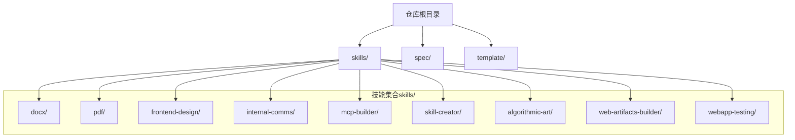
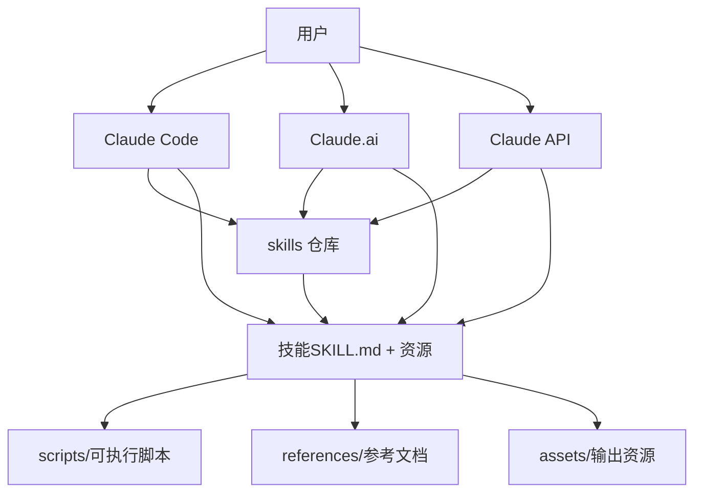
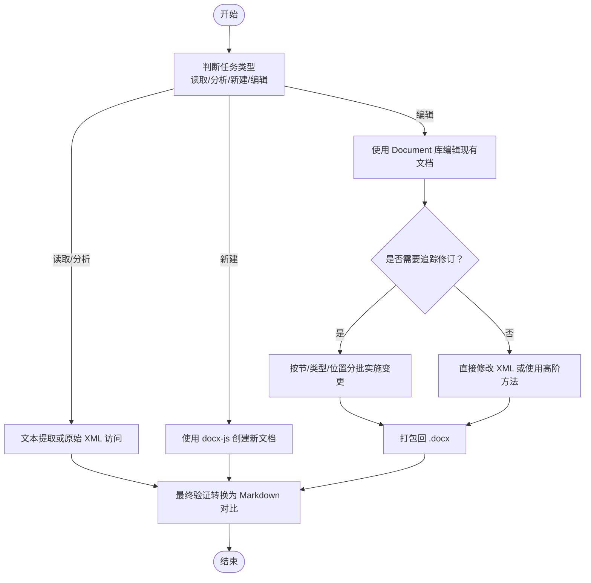
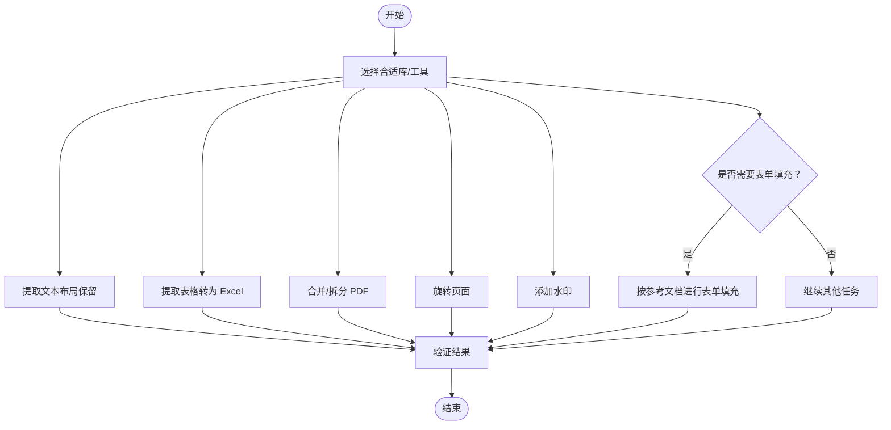
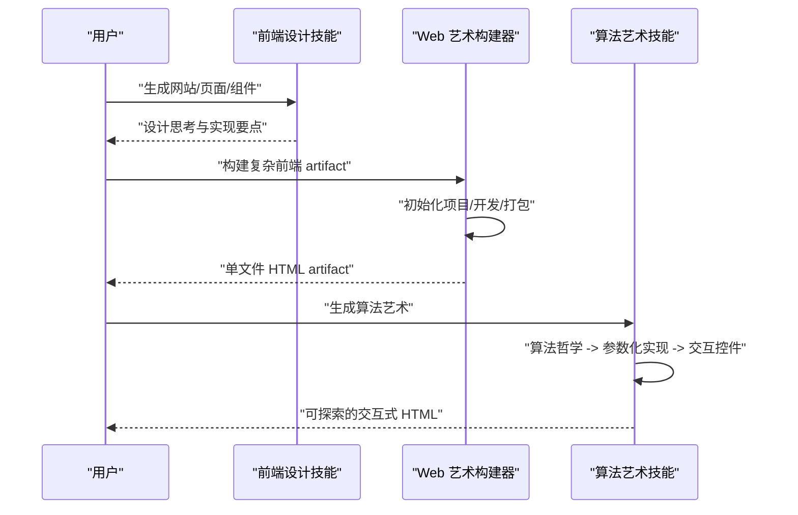
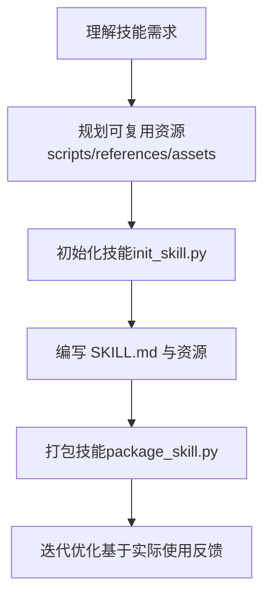
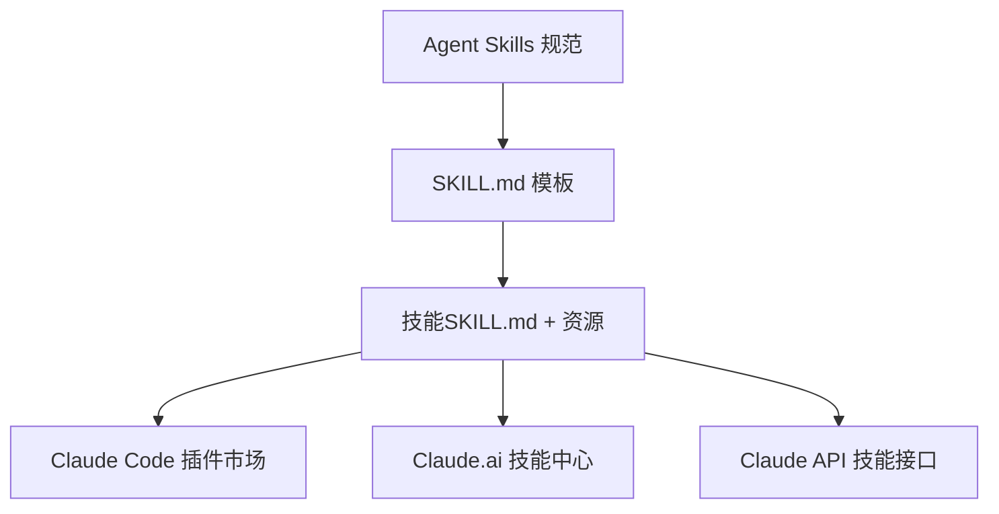

# 项目概述

<cite>
**本文引用的文件**
- [README.md](file://README.md)
- [agent-skills-spec.md](file://spec/agent-skills-spec.md)
- [SKILL.md（模板）](file://template/SKILL.md)
- [SKILL.md（文档处理：docx）](file://skills/docx/SKILL.md)
- [SKILL.md（PDF 处理：pdf）](file://skills/pdf/SKILL.md)
- [SKILL.md（前端设计：frontend-design）](file://skills/frontend-design/SKILL.md)
- [SKILL.md（内部沟通：internal-comms）](file://skills/internal-comms/SKILL.md)
- [SKILL.md（MCP 构建器：mcp-builder）](file://skills/mcp-builder/SKILL.md)
- [SKILL.md（技能创建者：skill-creator）](file://skills/skill-creator/SKILL.md)
- [SKILL.md（算法艺术：algorithmic-art）](file://skills/algorithmic-art/SKILL.md)
- [SKILL.md（Web 艺术构建器：web-artifacts-builder）](file://skills/web-artifacts-builder/SKILL.md)
- [SKILL.md（Web 应用测试：webapp-testing）](file://skills/webapp-testing/SKILL.md)
</cite>

## 目录
1. [引言](#引言)
2. [项目结构](#项目结构)
3. [核心组件](#核心组件)
4. [架构总览](#架构总览)
5. [详细组件分析](#详细组件分析)
6. [依赖关系分析](#依赖关系分析)
7. [性能考量](#性能考量)
8. [故障排查指南](#故障排查指南)
9. [结论](#结论)
10. [附录](#附录)

## 引言
skills 是一个面向 Claude AI 的“技能库”，旨在通过模块化的“技能”扩展 Claude 在特定任务与领域的专业能力。每个技能是一个自包含的包，包含用于触发与执行的说明文档（SKILL.md），以及可选的脚本、参考与资源。仓库提供了从创意设计、文档处理到企业沟通、MCP 服务集成等多类技能示例，帮助用户在 Claude Code、Claude.ai 与 Claude API 中按需启用与使用这些能力。

- 目标受众
  - 初学者：快速理解技能的概念、如何在不同平台使用技能、如何基于模板创建自己的技能。
  - 经验开发者：深入掌握技能的组织结构、渐进式披露原则、脚本与资源的打包与分发、以及在 Claude 生态中的集成方式。

- 核心价值
  - 模块化扩展：以最小上下文开销加载必要的知识与流程，避免污染全局上下文。
  - 渐进式披露：先加载元数据（名称与描述），再按需加载技能正文与资源，从而高效管理上下文窗口。
  - 可复用与可维护：通过脚本与参考文件的分离，使技能在保持简洁的同时具备强大的可扩展性。

- 使用场景
  - 文档处理：docx、pdf、pptx、xlsx 等格式的读取、编辑、转换与自动化。
  - 创意设计：算法艺术生成、交互式可视化、Web 艺术构建与前端界面生成。
  - 企业沟通：内部通讯模板与写作指导。
  - 工具集成：通过 MCP（Model Context Protocol）构建外部服务工具，提升 Claude 与外部系统协作能力。

- 平台支持
  - Claude Code：可通过插件市场安装示例技能或自定义技能。
  - Claude.ai：部分示例技能已内置在付费计划中；也可上传自定义技能。
  - Claude API：支持预置技能与自定义技能的上传与调用。

**章节来源**
- file://README.md#L1-L95

## 项目结构
仓库采用“按领域/用途划分”的目录结构，每个子目录代表一个独立技能，均以 SKILL.md 为核心入口，并可包含 scripts/、references/、assets/ 等可选资源。顶层还包含规范与模板文件，便于理解 Agent Skills 规范与快速初始化新技能。

**图表来源**
- [README.md](file://README.md#L1-L95)
- [SKILL.md（模板）](file://template/SKILL.md#L1-L7)
- [SKILL.md（技能创建者：skill-creator）](file://skills/skill-creator/SKILL.md#L47-L63)

**章节来源**
- file://README.md#L1-L95
- file://template/SKILL.md#L1-L7
- file://skills/skill-creator/SKILL.md#L47-L63

## 核心组件
- 技能（Skill）
  - 定义：每个技能是一个自包含的目录，包含 SKILL.md（必填）与可选的 scripts/、references/、assets/。
  - 元数据：SKILL.md 的 YAML frontmatter 包含 name 与 description，用于触发与识别技能。
  - 正文：Markdown 内容，仅在技能被触发时加载，包含工作流、示例与指南。
  - 资源：脚本用于确定性执行；参考文件用于按需加载；资产用于输出阶段使用。

- 渐进式披露（Progressive Disclosure）
  - 三层加载机制：
    1) 元数据（name + description）：始终在上下文中（约 100 字）。
    2) SKILL.md 正文：技能触发后加载（建议小于 5k 字）。
    3) 资源（scripts/references/assets）：按需加载（脚本可直接执行而无需读入上下文）。

- Agent Skills 规范
  - 规范地址：agentskills.io/specification
  - 本仓库提供规范链接与模板，便于遵循统一的技能结构与触发语义。

**章节来源**
- file://skills/skill-creator/SKILL.md#L114-L121
- file://skills/skill-creator/SKILL.md#L47-L63
- file://spec/agent-skills-spec.md#L1-L4
- file://template/SKILL.md#L1-L7

## 架构总览
skills 的整体架构围绕“模块化技能 + 渐进式披露 + 多平台集成”展开。每个技能以 SKILL.md 为中心，结合脚本与参考文件，形成可复用、可维护的工作单元。Claude 在不同平台上通过插件或 API 加载这些技能，按需触发并执行。

**图表来源**
- [README.md](file://README.md#L29-L60)
- [SKILL.md（技能创建者：skill-creator）](file://skills/skill-creator/SKILL.md#L47-L63)

## 详细组件分析

### 组件一：文档处理技能（docx、pdf、pptx、xlsx）
- 设计目标
  - 提供对常见办公文档格式的读取、编辑、转换与分析能力，覆盖创建、修改、审阅（追踪修订）、注释、表格提取等典型场景。
- 关键特性
  - 工作流决策树：根据任务类型（读取/分析、新建、编辑）选择合适的流程。
  - 追踪修订与审阅：提供系统化批量变更策略，确保最小且精确的改动。
  - 多工具链：Python 库、命令行工具与第三方库组合，兼顾易用性与灵活性。
  - 输出与验证：提供最终验证步骤（如转换为 Markdown 对比确认）。
- 上下文管理
  - 通过参考文件与脚本分离，SKILL.md 保持精简，复杂细节按需加载。

**图表来源**
- [SKILL.md（文档处理：docx）](file://skills/docx/SKILL.md#L13-L154)

**章节来源**
- file://skills/docx/SKILL.md#L1-L197

### 组件二：PDF 处理技能
- 设计目标
  - 提供 PDF 的文本与表格提取、合并/拆分、旋转、加水印、OCR、表单填充等常用操作。
- 关键特性
  - 多库支持：pypdf、pdfplumber、reportlab、pdftotext、qpdf、pdftk 等。
  - 命令行工具：便于在无 Python 环境下完成常见任务。
  - 扫描版 OCR：结合 pdf2image 与 pytesseract 实现文字识别。
- 上下文管理
  - 将高级用法与参考文档放入 references，SKILL.md 保持简洁导航。

**图表来源**
- [SKILL.md（PDF 处理：pdf）](file://skills/pdf/SKILL.md#L1-L295)

**章节来源**
- file://skills/pdf/SKILL.md#L1-L295

### 组件三：前端设计与 Web 艺术构建
- 设计目标
  - 生成高质量、有设计感的前端界面与交互式艺术作品，避免“AI 感”。
- 关键特性
  - 前端设计：强调风格定位、排版、色彩、动效与空间构成，提供具体指导与约束。
  - Web 艺术构建器：使用现代前端栈（React、Tailwind CSS、shadcn/ui）构建复杂 artifact，并一键打包为单文件 HTML。
  - 算法艺术：以“算法哲学”为纲，通过 p5.js 生成可交互的算法艺术，强调参数化与种子控制。
- 上下文管理
  - 通过模板与参考文件，SKILL.md 仅保留导航与要点，细节按需加载。

**图表来源**
- [SKILL.md（前端设计：frontend-design）](file://skills/frontend-design/SKILL.md#L1-L43)
- [SKILL.md（Web 艺术构建器：web-artifacts-builder）](file://skills/web-artifacts-builder/SKILL.md#L1-L74)
- [SKILL.md（算法艺术：algorithmic-art）](file://skills/algorithmic-art/SKILL.md#L1-L120)

**章节来源**
- file://skills/frontend-design/SKILL.md#L1-L43
- file://skills/web-artifacts-builder/SKILL.md#L1-L74
- file://skills/algorithmic-art/SKILL.md#L1-L120

### 组件四：内部沟通技能
- 设计目标
  - 提供企业内部沟通的写作框架与模板，覆盖周报、新闻稿、FAQ、事件报告等。
- 关键特性
  - 明确使用场景与对应模板路径，按类型加载相应指南。
  - 提供关键词与格式指引，确保一致性与可读性。
- 上下文管理
  - 将模板与示例置于 examples/，SKILL.md 仅做导航与触发。

**章节来源**
- file://skills/internal-comms/SKILL.md#L1-L33

### 组件五：MCP 构建器技能
- 设计目标
  - 指导构建高质量的 MCP（Model Context Protocol）服务器，使 Claude 能够通过良好设计的工具与外部服务交互。
- 关键特性
  - 四阶段流程：研究规划、实现、评审测试、评估。
  - 框架与语言：TypeScript/Node 与 Python/FastMCP 的最佳实践与参考文档。
  - 评估：创建真实问题集，验证工具的有效性与稳定性。
- 上下文管理
  - 将参考文档与评估指南放在 reference/，SKILL.md 保持总体流程与导航。

**章节来源**
- file://skills/mcp-builder/SKILL.md#L1-L237

### 组件六：技能创建者（模板与流程）
- 设计目标
  - 提供创建与维护技能的完整指南，包括内容组织、渐进式披露、脚本与参考文件的使用、打包与迭代。
- 关键特性
  - 三种渐进式披露模式：高层导航 + 引用文件、按域组织、条件详情。
  - 技能创建流程：理解需求 -> 规划资源 -> 初始化 -> 编辑 -> 打包 -> 迭代。
  - 质量保障：前后端一致性、错误信息可操作性、命名与发现性、幂等性与只读提示等。
- 上下文管理
  - 严格控制 SKILL.md 长度与引用深度，避免上下文膨胀。

**图表来源**
- [SKILL.md（技能创建者：skill-creator）](file://skills/skill-creator/SKILL.md#L202-L357)

**章节来源**
- file://skills/skill-creator/SKILL.md#L1-L357
- file://template/SKILL.md#L1-L7

### 组件七：Web 应用测试技能
- 设计目标
  - 使用 Playwright 对本地 Web 应用进行自动化测试与调试，支持截图、日志捕获与多服务器管理。
- 关键特性
  - 决策树：静态 HTML 与动态应用的区分；服务器运行状态检查；侦察-行动模式。
  - 辅助脚本：with_server.py 自动管理服务器生命周期，减少上下文污染。
- 上下文管理
  - 将大型脚本作为黑盒工具直接调用，避免将其源码读入上下文。

**章节来源**
- file://skills/webapp-testing/SKILL.md#L1-L96

## 依赖关系分析
- 技能与资源
  - 每个技能以 SKILL.md 为核心，依赖 scripts/（可执行）、references/（按需加载）、assets/（输出使用）。
- 平台集成
  - Claude Code：通过插件市场注册与安装技能。
  - Claude.ai：内置示例技能，支持上传自定义技能。
  - Claude API：支持预置与自定义技能的上传与调用。
- 规范与模板
  - 规范位于 agentskills.io/specification；模板 SKILL.md 提供标准化的 frontmatter 与结构。

**图表来源**
- [agent-skills-spec.md](file://spec/agent-skills-spec.md#L1-L4)
- [README.md](file://README.md#L29-L60)
- [SKILL.md（模板）](file://template/SKILL.md#L1-L7)

**章节来源**
- file://spec/agent-skills-spec.md#L1-L4
- file://README.md#L29-L60
- file://template/SKILL.md#L1-L7

## 性能考量
- 上下文窗口管理
  - 通过渐进式披露，优先加载元数据，再按需加载正文与资源，显著降低上下文占用。
  - SKILL.md 控制在 500 行以内，长文档拆分为 references/ 并在 SKILL.md 中明确引用时机。
- 脚本与资源分离
  - scripts/ 可直接执行，无需读入上下文；references/ 仅在需要时加载；assets/ 仅在输出阶段使用。
- 工具链选择
  - 优先选择轻量级命令行工具与成熟库，减少不必要的依赖与上下文负担。
- 批处理与增量验证
  - 对于复杂任务（如追踪修订），采用分批实施与最终验证，降低一次性上下文压力。

[本节为通用指导，不直接分析具体文件]

## 故障排查指南
- 常见问题
  - 技能未触发：检查 SKILL.md frontmatter 的 name 与 description 是否准确描述使用场景。
  - 上下文过长：将长文档移至 references/，并在 SKILL.md 中明确何时加载。
  - 脚本执行失败：确认环境依赖与权限，必要时在本地先行验证。
  - 文档处理异常：核对工作流决策树与最终验证步骤，确保每一步都按顺序执行。
- 排查步骤
  - 逐步回溯：从触发条件、加载顺序到执行结果，逐段验证。
  - 使用辅助脚本：如 with_server.py 管理服务器生命周期，避免手动操作引入不确定性。
  - 截图与日志：使用 Playwright 截图与日志捕获，定位渲染与交互问题。

**章节来源**
- file://skills/skill-creator/SKILL.md#L114-L121
- file://skills/webapp-testing/SKILL.md#L1-L96
- file://skills/docx/SKILL.md#L130-L154

## 结论
skills 项目通过模块化技能与渐进式披露原则，有效扩展了 Claude 在文档处理、创意设计、企业沟通与工具集成等领域的专业能力。对于初学者，它提供了清晰的模板与示例；对于经验开发者，它提供了可复用的结构、脚本与参考文件，以及在 Claude Code、Claude.ai 与 Claude API 中的集成路径。遵循 Agent Skills 规范与技能创建者的最佳实践，可以持续构建高质量、可维护的技能生态。

[本节为总结性内容，不直接分析具体文件]

## 附录
- 快速开始
  - 在 Claude Code 中注册插件市场并安装示例技能。
  - 在 Claude.ai 中使用内置示例技能或上传自定义技能。
  - 通过 Claude API 上传与调用技能。
- 参考链接
  - Agent Skills 规范：<https://agentskills.io/specification>
  - 示例技能与模板可在仓库中找到。

**章节来源**
- file://README.md#L29-L60
- file://spec/agent-skills-spec.md#L1-L4